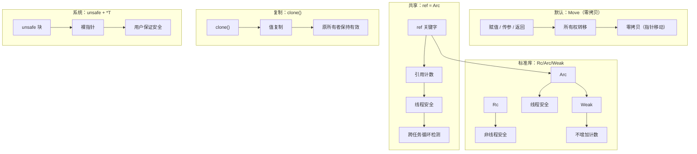

# RFC-009: 所有权模型设计

> **状态**: 已接受
> **作者**: 晨煦
> **创建日期**: 2025-01-08
> **最后更新**: 2025-01-16（v7.1：修复问题 + 完善细节）

## 参考文档

本文档的设计基于以下文档，并作为 language-spec 的详细设计来源：

| 文档 | 关系 | 说明 |
|------|------|------|
| [language-spec](../language-spec.md) | **规范目标** | 本 RFC 的设计将整合到语言规范中 |
| [manifesto](../manifesto.md) | **设计哲学** | 零成本抽象、默认不可变、无 GC |
| [RFC-001 并作模型](./001-concurrent-model-error-handling.md) | **并发安全** | DAG 资源分析 + 结构化并发 |
| [RFC-008 运行时并发模型](./accepted/008-runtime-concurrency-model.md) | **运行时集成** | 运行时内存管理与所有权的集成 |

## 摘要

本文档定义 YaoXiang 编程语言的**所有权模型（Ownership Model）**，包括所有权语义、移动语义、共享机制和循环引用处理。

**核心设计**：
- 默认 **Move（值传递）**，零拷贝
- 显式 **`ref` 关键字** = Arc（线程安全引用计数）
- **`clone()`** = 显式复制
- **`*T` 裸指针** + `unsafe` = 系统级编程
- 标准库提供 **`Rc`** / **`Arc`** / **`Weak`**

**循环引用处理**：
- 任务内循环：允许（泄漏可控，任务结束后释放）
- 跨任务循环：编译器检测并报错
- `unsafe` 逃生舱：绕过检测（用户负责）

**消除复杂性**：
- ❌ 无生命周期 `'a`
- ❌ 无借用检查器
- ❌ 无 GC

> **编程负担**：⭐☆☆☆☆（几乎为零）
> **性能保证**：零运行时开销，无 GC 暂停

## 动机

### 为什么需要所有权模型？

| 语言 | 内存管理 | 问题 |
|------|----------|------|
| C/C++ | 手动管理 | 内存泄漏、野指针、双重释放 |
| Java/Python | GC | 延迟波动、内存开销、无法预测的暂停 |
| Rust | 所有权 + 借用检查 | 复杂度高、学习曲线陡 |
| **YaoXiang** | **所有权 + ref** | **简单安全、无 GC** |

### 设计目标

```yaoxiang
# 1. 默认 Move（零拷贝）
create_and_forget: () -> Point = () => {
    p = Point(1.0, 2.0)
    # p 离开作用域自动释放
}

# 2. 显式 ref = Arc（安全共享，类型自动推断）
shared = ref p   # Arc，类型从 p 推断
spawn(() => print(shared.x))

# 3. 显式 clone() = 复制
p2 = p.clone()

# 4. 系统级 = unsafe + 裸指针
unsafe {
    ptr: *Point = &p
    (*ptr).x = 0.0
}

# 5. 标准库 Rc/Arc/Weak
use std::rc.{Rc, Weak}
use std::sync::Arc

rc: Rc[Node] = Rc::new(node)
arc: Arc[Node] = Arc::new(node)
weak: Weak[Node] = Weak::new(arc)
```

### 与 Rust 的核心区别

| 特性 | Rust | YaoXiang |
|------|------|----------|
| 默认语义 | 借用 `&T` | **Move（值传递）** |
| 共享机制 | `Arc::new()` | **`ref` 关键字** |
| 复制 | `clone()` | `clone()` |
| 裸指针 | `*T` | `*T` |
| unsafe | unsafe | unsafe |
| 生命周期 | `'a` | ❌ 无 |
| 借用检查 | borrow checker | ❌ 无 |
| 循环引用 | Weak 或 unsafe | **同** |

### 为什么消除生命周期？

**核心洞察**：没有 `&T` 引用，就不需要生命周期 `'a`。

```yaoxiang
# Rust 的问题
fn returns_ref() -> &Point {   # 需要 'a
    let p = Point(1.0, 2.0)
    return &p                  # 悬空指针！
}

# YaoXiang 的解决方案
fn returns_value() -> Point {   # 无生命周期
    p = Point(1.0, 2.0)
    return p                    # Move，所有权转移
}
```

---

## 提案

### 1. 所有权核心规则



### 2. 语义详解

#### 2.1 Move（默认）

```yaoxiang
# === 规则：赋值 / 传参 / 返回 = Move ===

p: Point = Point(1.0, 2.0)
p2 = p                        # Move，p 失效

fn process(p: Point) -> Point {
    p.transform()             # p 是参数，Move
}

fn create() -> Point {
    p = Point(1.0, 2.0)
    return p                  # Move，返回值
}
```

**特点**：
- 零拷贝（只移动指针）
- 原所有者失效
- RAII 自动释放

#### 2.2 ref = Arc（显式共享）

```yaoxiang
# === 规则：ref 关键字 = Arc（引用计数） ===

p: Point = Point(1.0, 2.0)

# 创建 Arc，类型自动推断
shared = ref p

# Arc 自动管理生命周期
spawn(() => print(shared.x))   # 安全
spawn(() => print(shared.y))   # 安全

# Arc 计数自动增减
# shared 离开作用域时，计数归零自动释放
```

**特点**：
- 线程安全引用计数
- 自动管理生命周期
- 用户显式控制共享时机
- 编译器检测**跨任务循环引用**

#### 2.3 clone() = 显式复制

```yaoxiang
# === 规则：clone() = 显式值复制 ===

p: Point = Point(1.0, 2.0)

# 复制值
p2 = p.clone()

# p 和 p2 都是独立所有者
p.x = 0.0      # ✅
p2.x = 0.0     # ✅ 互不影响
```

**何时使用**：
- 需要保留原值
- 不适合 Move 的场景

#### 2.4 标准库：Rc / Arc / Weak

```yaoxiang
use std::rc.{Rc, Weak}
use std::sync::Arc

# === Rc：非线程安全引用计数 ===
node: Node = Node::new()
rc: Rc[Node] = Rc::new(node)
rc2 = rc.clone()              # Rc 克隆，非线程安全

# === Arc：线程安全引用计数 ===
node: Node = Node::new()
arc: Arc[Node] = Arc::new(node)
arc2 = arc.clone()            # Arc 克隆，原子操作

# === Weak：不增加计数，防止循环 ===
arc: Arc[Node] = Arc::new(Node::new())
weak: Weak[Node] = Weak::new(arc)

# 使用前检查是否存在
if let Some(node) = weak.upgrade() {
    use(node)
}
```

| 类型 | 线程安全 | 用途 |
|------|----------|------|
| `Rc[T]` | ❌ | 单线程共享 |
| `Arc[T]` | ✅ | 多线程共享 |
| `Weak[T]` | ✅/❌ | 打破循环（不增加计数） |

#### 2.5 unsafe + 裸指针（系统级）

```yaoxiang
# === 规则：unsafe 块中可使用裸指针 ===

p: Point = Point(1.0, 2.0)

# 系统级编程
unsafe {
    # 获取裸指针
    ptr: *Point = &p

    # 解引用（用户保证有效）
    (*ptr).x = 0.0

    # 指针运算
    ptr2 = ptr + 1
}
```

**限制**：
- 只能在 `unsafe` 块中使用
- 用户保证不悬空、不释放后使用
- 用于系统级编程（FFI、内存操作等）
- 可绕过循环引用检测（用户负责）

---

### 3. 循环引用处理

#### 3.1 核心洞察：任务边界 = 泄漏边界

**结构化并发模型**（RFC-001）中，每个任务有明确的生命周期：
- 任务开始 → 创建资源
- 任务结束 → 所有资源一起释放

```yaoxiang
# 任务内循环引用：泄漏可控
fn create_graph() {
    a: Rc[RefCell[Node]] = Rc::new(RefCell::new(Node::new()))
    b: Rc[RefCell[Node]] = Rc::new(RefCell::new(Node::new()))

    a.borrow_mut().child = Some(b.clone())   # a → b
    b.borrow_mut().child = Some(a.clone())   # b → a，循环！

    # 任务结束后，a 和 b 一起释放，泄漏消失
    Graph { a, b }
}
```

**模块化内存管理**：泄漏被限制在单个任务生命周期内，任务结束后一切重来。

#### 3.2 循环引用规则

| 循环类型 | 检测位置 | 规则 | 处理 |
|----------|----------|------|------|
| **单函数内 ref 循环** | OwnershipChecker | 允许 | ✅ 泄漏可控 |
| **spawn 内部 ref 循环** | OwnershipChecker | 允许 | ✅ 泄漏可控 |
| **跨 spawn 参数/返回值 ref 循环** | CycleChecker | 禁止 | ❌ 检测并报错 |
| **unsafe 绕过** | - | 允许 | ❌ 用户负责 |

#### 3.2.1 检测边界说明

```
只追踪 spawn 的参数和返回值边界：

spawn 参数 ────▶ spawn 内部
                │
                └──▶ spawn 返回值

检测：参数和返回值之间的 ref 是否形成环
```

**不检测的情况**：
- 单函数内循环（OwnershipChecker 处理）
- spawn 内部循环（OwnershipChecker 处理）

**检测的情况**：
- 跨 spawn 循环（CycleChecker 处理）

```yaoxiang
# === 跨任务循环：编译器检测 ===
fn parent_task() {
    shared_a = ref a     # 任务内
    shared_b = ref b     # 任务内

    spawn(task_a)              # 子任务 A
    spawn(task_b)              # 子任务 B

    # 假设 task_a 和 task_b 互相 ref：
    # ❌ 编译错误：跨任务循环引用
}

# === unsafe 逃生舱 ===
unsafe {
    a.child = ref b
    b.child = ref a    # 允许，但用户负责
}
```

#### 3.3 编译器检测策略（Task 5.6）

**检测范围**：只追踪 spawn 边界
- spawn 的参数（传入的 ref）
- spawn 的返回值（传出的 ref）
- 检测参数和返回值之间是否形成环

**检测级别**：
- ✅ **跨 spawn 循环**（参数/返回值之间）：编译报错
- ❌ **单函数内循环**：不检测（泄漏可控）
- ❌ **spawn 内部循环**：不检测（泄漏可控）

**检测边界**：
```yaoxiang
# ✅ 可检测：同作用域内的直接 ref
a = ref b
b = ref a    # ❌ 编译错误：同作用域循环

# ⚠️ 可能漏检：if 分支内的 ref
if condition {
    a.child = ref b
} else {
    a.child = ref c   # 编译器可能无法追踪所有分支
}

# ⚠️ 可能漏检：闭包内的 ref
closure = () => {
    a.child = ref b   # 闭包捕获的 ref，编译器难以追踪
}
```

#### 3.4 ref 与 Arc::new() 的选择

| 特性 | `ref` 关键字 | `Arc::new()` |
|------|--------------|--------------|
| 语法 | `shared = ref p` | `arc = Arc::new(p)` |
| 类型推断 | ✅ 自动 | ❌ 需显式泛型 |
| 跨任务循环检测 | ✅ 自动检测 | ❌ 用户保证 |
| 适用场景 | 日常共享 | 完全控制/特殊需求 |

```yaoxiang
# 推荐：日常使用 ref
shared = ref data
spawn(() => use(shared))

# 可选：需要完全控制时用 Arc
arc: Arc[Data] = Arc::new(data)
arc2 = arc.clone()
```

#### 3.5 与 RFC-001 注解的交互

`ref` 的行为与 `@block` / `@eager` / `@auto` 注解无关：

| 注解 | ref 行为 | 说明 |
|------|----------|------|
| `@block` | `ref` 仍为 Arc | 无并发，但共享语义不变 |
| `@eager` | `ref` 仍为 Arc | 同步执行，共享语义不变 |
| `@auto` | `ref` 仍为 Arc | 最大并行，共享语义不变 |

```yaoxiang
# 无论什么注解，ref 都是 Arc
@block
fn blocked() {
    shared = ref data     # 仍是 Arc，只是不会并发执行
    use(shared)
}

@eager
fn eager() {
    shared = ref data     # 仍是 Arc，只是会同步等待
    use(shared)
}
```

**注解控制的是调度策略，不是内存语义。**

---

#### 3.6 任务树示例

```yaoxiang
# 任务树示例
main
├── task_a  ────────────┐
│                       ├── 同辈，可检测
└── task_b  ────────────┘

# 检测：task_a 和 task_b 之间的 ref 边是否形成环
# 报错位置：第二个 ref 语句
```

---

### 4. 并发场景

```yaoxiang
# === 并发共享：使用 ref ===

p: Point = Point(1.0, 2.0)
shared = ref p                      # Arc

spawn(() => print(shared.x))        # ✅ 安全
spawn(() => print(shared.y))        # ✅ 安全

# === 避免共享：使用 clone() ===

p: Point = Point(1.0, 2.0)
p1 = p.clone()
p2 = p.clone()

spawn(() => print(p1.x))            # ✅ 独立副本
spawn(() => print(p2.x))            # ✅ 独立副本

# === 需要完全控制：使用 Rc/Arc/Weak ===
use std::rc.{Rc, Weak}
use std::sync::Arc

# 单线程共享
rc: Rc[Node] = Rc::new(data)
rc2 = rc.clone()

# 多线程共享
arc: Arc[Node] = Arc::new(data)
arc2 = arc.clone()

# 打破循环
weak: Weak[Node] = Weak::new(arc)
```

---

### 5. 类型系统约束

#### Send / Sync

```yaoxiang
# 基本类型自动满足 Send + Sync
# Int, Float, Bool, Point, ...

# ref[T] 自动满足 Send + Sync（Arc 线程安全）
p: Point = Point(1.0, 2.0)
shared = ref p                       # Arc，线程安全

spawn(() => print(shared.x))         # ✅

# 裸指针 *T 不满足 Send + Sync
unsafe {
    ptr: *Point = &p                 # 只能在单线程使用
}
```

#### 类型约束

| 类型 | Send | Sync | 说明 |
|------|------|------|------|
| 值类型 | ✅ | ✅ | Int, Float, struct... |
| `ref T` | ✅ | ✅ | Arc，线程安全 |
| `Rc[T]` | ❌ | ❌ | 非线程安全 |
| `Arc[T]` | ✅ | ✅ | 线程安全 |
| `Weak[T]` | ✅ | ✅ | 线程安全 |
| `*T` | ❌ | ❌ | 裸指针 |

---

## 性能分析

### 性能保证

| 操作 | 成本 | 说明 |
|------|------|------|
| Move | 零 | 指针移动 |
| ref (Arc) | 中 | 原子操作 |
| Rc | 低 | 非原子操作 |
| clone() | 视类型 | 小对象快，大对象慢 |
| unsafe + *T | 零 | 直接内存操作 |

### 对比

| 语言 | 共享机制 | 内存管理 | 循环处理 | 复杂度 |
|------|----------|----------|----------|--------|
| Rust | Arc / Mutex | 编译期检查 | Weak | 高 |
| Go | chan / pointer | GC | GC | 低 |
| C++ | shared_ptr | RAII | weak_ptr | 中 |
| **YaoXiang** | **ref / Arc** | **RAII** | **任务边界** | **低** |

---

## 权衡

### 优点

1. **简单**：无生命周期，无借用检查器
2. **安全**：ref = Arc 自动管理
3. **高性能**：Move 零拷贝
4. **灵活**：支持系统级编程和标准库 Rc/Arc/Weak
5. **模块化泄漏控制**：任务内循环允许，跨任务循环检测
6. **AI 友好**：规则明确

### 缺点

1. **ref 运行时开销**：原子操作（但这是安全的代价）
2. **unsafe 风险**：用户必须保证正确性
3. **任务内循环**：依赖用户自觉（但泄漏可控）

---

## 替代方案

| 方案 | 为什么不选择 |
|------|--------------|
| GC | 有运行时开销，无法预测暂停 |
| Rust 借用检查器 | 用户负担重，学习曲线陡 |
| 纯 Move | 无法处理并发共享 |
| 无裸指针 | 无法系统级编程 |
| 全程序循环检测 | 复杂度高，if/闭包场景无法准确检测 |

---

## 社区讨论

### 设计决策记录

| 决策 | 决定 | 原因 | 日期 |
|------|------|------|------|
| **默认值** | Move（零拷贝） | 高性能，零开销 | 2025-01-15 |
| **共享机制** | `ref` 关键字 = Arc | 简单显式，编译器检测跨任务循环 | 2025-01-15 |
| **复制** | `clone()` | 显式语义 | 2025-01-15 |
| **系统级** | `*T` + `unsafe` | 支持系统编程 | 2025-01-15 |
| **生命周期** | 不实现 | 无引用概念 | 2025-01-15 |
| **借用检查器** | 不实现 | ref + Arc 替代 | 2025-01-15 |
| **小对象优化** | 编译器自动 | 透明优化 | 2025-01-15 |
| **动态类型** | 必须 Arc | 无法编译期判断 | 2025-01-15 |
| **所有权绑定** | 支持 | 流畅 API | 2025-01-15 |
| **RAII** | 自动释放 | 作用域绑定 | 2025-01-08 |
| **循环引用** | 任务内允许，跨任务检测 | 模块化内存管理，泄漏可控 | 2025-01-16 |
| **标准库** | Rc / Arc / Weak | 显式控制，用户负责 | 2025-01-16 |
| **unsafe 逃生舱** | 允许绕过检测 | 灵活，用户负责 | 2025-01-16 |

### 版本历史

| 版本 | 主要变更 | 日期 |
|------|----------|------|
| v1 | 初稿：基于 Rust 所有权模型 | 2025-01-08 |
| v2 | 引入 `ref` 关键字，删除借用检查器 | 2025-01-10 |
| v3 | 增加生命周期自动推断方案 | 2025-01-12 |
| v4 | 删除生命周期，简化设计 | 2025-01-13 |
| v5 | 默认安全 + 编译器自动优化 | 2025-01-15 |
| v6 | 默认 Move + 显式 ref = Arc | 2025-01-15 |
| v7 | 结构化并发 + 循环引用处理 | 2025-01-16 |
| **v7.1** | **修复问题 + 完善细节** | **2025-01-16** |

### 待决议题

| 议题 | 说明 | 状态 |
|------|------|------|
| Drop 语法 | 是否需要显式 `drop()` 函数 | 待讨论 |
| 逃逸分析 | 编译器优化策略 | 待讨论 |
| 跨任务循环检测算法 | 具体实现方案 | 待讨论 |

---

## 参考文献

### YaoXiang 官方文档

- [语言规范](../language-spec.md)
- [设计宣言](../manifesto.md)
- [RFC-001 并作模型](./001-concurrent-model-error-handling.md)
- [YaoXiang 指南](../guides/YaoXiang-book.md)

### 外部参考

- [Rust 所有权模型](https://doc.rust-lang.org/book/ch04-00-understanding-ownership.html)
- [C++ RAII](https://en.wikipedia.org/wiki/Resource_acquisition_is_initialization)
- [Erlang 消息传递](https://www.erlang.org/doc/getting_concurrency/getting_concurrency.html)
- [Go 并发模型](https://golang.org/doc/effective_go#concurrency)
- [MoonBit 结构化并发](https://www.moonbitlang.com/)
- [Vale 世代引用](https://vale.dev/)
- [Pony 参考能力](https://www.ponylang.io/learn/reference-capabilities/)

---

## 生命周期与归宿

| 状态 | 位置 | 说明 |
|------|------|------|
| **草案** | `docs/design/rfc/` | 作者草稿，等待提交审核 |
| **审核中** | `docs/design/rfc/` | 开放社区讨论和反馈 |
| **已接受** | `docs/design/accepted/` | 成为正式设计文档 |
| **已拒绝** | `docs/design/rfc/` | 保留在 RFC 目录 |
