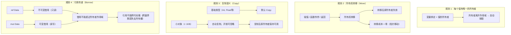
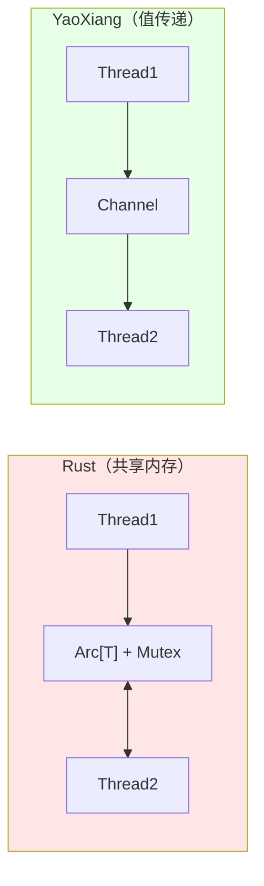

# RFC-009: 所有权模型设计

> **状态**: 审核中
> **作者**: 晨煦
> **创建日期**: 2025-01-08
> **最后更新**: 2025-01-09（v4：引用跨边界规则 + @block修正）

## 参考文档

本文档的设计基于以下文档，并作为 language-spec 的详细设计来源：

| 文档 | 关系 | 说明 |
|------|------|------|
| [language-spec](../language-spec.md) | **规范目标** | 本 RFC 的设计将整合到语言规范中 |
| [manifesto](../manifesto.md) | **设计哲学** | 零成本抽象、默认不可变、无 GC |
| [RFC-001 并作模型](./001-concurrent-model-error-handling.md) | **并发安全** | DAG 资源分析 + 消息传递替代共享内存 |
| [RFC-008 运行时并发模型](./accepted/008-runtime-concurrency-model.md) | **运行时集成** | 运行时内存管理与所有权的集成 |

## 摘要

本文档定义 YaoXiang 编程语言的**所有权模型（Ownership Model）**，包括所有权语义、移动语义和线程通信。YaoXiang 采用简化的所有权模型，**不引入生命周期标注 `'a`**，通过编译器自动推断和值传递实现内存安全，通过值传递 + Send 检查实现基本的并发安全，通过 DAG 资源分析实现自动调度，无需 GC 即可实现高性能。

> **设计决策**：YaoXiang 选择**不实现生命周期标注**，通过以下策略解决借用问题：
> 1. 禁止返回借用引用（返回整个值）
> 2. 禁止结构体包含借用字段
> 3. 小对象直接复制（开销可忽略）
> 4. 大对象用移动语义（零拷贝）
> 5. 极端性能场景由标准库兜底（Arc 等可选）

> **核心原则**：99% 的代码不需要任何特殊处理。值传递 + 小对象复制 + DAG 资源类型已覆盖几乎所有场景。Arc/Rc/RefCell/Mutex 仅作为标准库可选实现，用于极端性能场景。

> **性能保证**：YaoXiang 的性能接近 Rust，远超 Go。小字段复制（< 1KB）开销 < 0.01%，大对象移动零拷贝。

## 动机

### 为什么需要所有权模型？

在传统编程语言中，内存管理一直是核心难题：

| 语言 | 内存管理方式 | 问题 |
|------|-------------|------|
| C/C++ | 手动管理 | 内存泄漏、野指针、双重释放 |
| Java/Python | GC | 延迟波动、内存开销、无法预测的暂停 |
| Rust | 所有权模型 | 编译期检查，无运行时开销 |

YaoXiang 采用所有权模型，旨在解决以下问题：

1. **内存安全**：自动释放，无内存泄漏
2. **数据竞争消除**：编译期检测并发访问问题
3. **零成本抽象**：无 GC 运行时开销
4. **可预测的性能**：无垃圾回收暂停

### 设计目标

```yaoxiang
# YaoXiang 所有权模型的核心目标

# 1. 自动内存管理（无 GC）
create_and_forget: () -> Data = () => {
    data = Data.new()  # 自动分配
    # data 离开作用域时自动释放
}

# 2. 移动语义（零拷贝）
transfer: (Data) -> Data = (data) => {
    Data(data.value * 2)  # 返回新值，所有权转移
}

# 3. 小对象复制（开销可忽略）
get_header: (BigData) -> Header = (data) => data.header
# 复制 64 字节开销 ~1ns，可忽略

# 4. 值传递（并发安全）
# 并作模型自动处理并发，无需 Arc/Mutex
worker: (Task) -> Result = (task) => {
    # 值通过变量传递，DAG 自动构建依赖
    process(task)  # task 自动复制或移动
}
```

### 关键设计决策：不实现生命周期标注 + 值传递替代共享内存

#### 为什么不做生命周期 `'a`？

| 问题 | 分析 |
|------|------|
| **`'a` 语法** | 丑、学习成本高、增加语言复杂度 |
| **编译器无法推断** | 返回哪个输入、返回新借用、结构体包含引用 |
| **用户负担** | 99% 的代码不需要生命周期，只有 1% 的复杂场景需要 |

#### 为什么不需要 Arc/Mutex？

| Rust 问题 | YaoXiang 解法 |
|-----------|---------------|
| 多线程共享数据 | **值传递**（channel 内部实现） |
| 内部可变性 | **`mut` 标记**（编译期可变性） |
| 线程安全同步 | **DAG 资源分析**（自动串行/并行） |

> **核心洞察**：共享内存需要锁，值传递不需要。YaoXiang 的并作模型（DAG + 资源类型）已经解决了并发安全问题，不需要 Arc/Mutex。

#### 编译器无法推断的场景（被禁止）

```yaoxiang
# === 场景1：返回哪个输入引用？ ===
# pick: (ref Data, ref Data) -> ref Data = (a, b) => {
#     if a.value > b.value { a } else { b }
# }  # ❌ 编译器不知道返回哪个

# ✅ 替代方案：返回整个值
pick: (Data, Data) -> Data = (a, b) => {
    if a.value > b.value { a } else { b }
}

# === 场景2：返回"新借用" ===
# get_buffer: () -> ref Data = () => {
#     buffer = Data(42)
#     ref buffer  # ❌ 返回局部借用
# }

# ✅ 替代方案：返回整个值
get_buffer: () -> Data = () => Data(42)

# === 场景3：结构体包含借用 ===
# type Container = Container(data: ref Data)  # ❌

# ✅ 替代方案：直接包含值
type Container = Container(data: Data)
```

#### 损失 vs 收获

| | 损失 | 收获 |
|---|------|------|
| **表达能力** | 无法返回借用 | 简化设计 |
| **学习曲线** | - | 几乎为 0 |
| **代码安全** | - | 更高 |
| **常见代码影响** | < 1% | - |

> **结论**：返回整个值完全可行。只有极端性能场景才需要避免复制，由标准库兜底。

## 提案

### 1. 所有权核心概念

#### 1.1 所有权规则

YaoXiang 的所有权系统基于以下核心规则：

> **引用跨边界规则**：借用（ref/mut）**不能跨代码块边界**。跨越边界时，默认失去所有权，需要重新获取或传递值。



#### 1.2 所有权语义示例

```yaoxiang
# === 规则 1：唯一所有者 ===

# 基础类型 - 复制语义
x: Int = 42
y = x  # 复制值，x 和 y 独立

# 复杂类型 - 移动语义
type Data = Data(value: Int)

create_data: () -> Data = () => {
    data = Data(42)  # data 是所有者
    data              # 返回时所有权转移给调用者
}

# ownership_move: () -> Void = () => {
#     data = Data(42)
#     data2 = data  # 所有权从 data 转移到 data2
#     # data 失效，无法再使用
#     print(data.value)  # ❌ 编译错误！
# }

# === 规则 2：引用传递 ===

# 不可变引用（可以有多个）
read_data: (ref Data) -> Int = (data) => data.value

# usage: () -> Void = () => {
#     data = Data(42)
#     r1 = read_data(data)   # 借用 1
#     r2 = read_data(data)   # 借用 2
#     # r1 和 r2 可以同时存在
# }

# 可变引用（只能有一个）
write_data: (mut Data) -> Void = (data) => {
    data.value = 100
}

# usage2: () -> Void = () => {
#     data = Data(42)
#     write_data(mut data)  # 可变借用
#     # data.value = 100     # ❌ 编译错误！借用期间不能直接修改
# }

# === 引用跨边界规则 ===

# ❌ 错误：引用不能跨 spawn 边界
# bad_example: () -> Void = () => {
#     data = Data(42)
#     ref_data = ref data
#     spawn(() => {
#         print(ref_data.value)  # ❌ ref 不能跨代码块
#     })
# }

# ✅ 正确：跨边界传递值（复制或移动）
good_example: () -> Void = () => {
    data = Data(42)
    spawn(() => {
        print(data.value)  # data 自动复制或移动
    })
}

# ❌ 错误：mut 跨边界
# bad_mut: () -> Void = () => {
#     data = Data(42)
#     mut_data = mut data
#     process(mut_data)  # mut 跨边界？取决于实现
# }

# === 规则 3：所有权转移 ===

transfer: (Data) -> Data = (data) => {
    # data 的所有权转移进来
    # 函数结束时 data 被销毁
    Data(data.value * 2)  # 返回新值，所有权转移出去
}

# ownership_transfer: () -> Void = () => {
#     data = Data(42)
#     data2 = transfer(data)  # 所有权转移
#     # data 失效
#     print(data.value)  # ❌ 编译错误！
# }
```

### 2. 引用类型系统

#### 2.1 引用类型语法

```yaoxiang
# === 引用类型定义 ===

# ref T - 不可变引用
ref Int           # 指向 Int 的不可变引用
ref Data          # 指向 Data 的不可变引用

# mut T - 可变引用
mut Int           # 指向 Int 的可变引用
mut Data          # 指向 Data 的可变引用
```

#### 2.2 引用类型规则表

| 引用类型 | 可读 | 可写 | 可同时存在多个 | 可与可变引用共存 |
|----------|------|------|----------------|------------------|
| `ref T` | ✅ | ❌ | ✅ | ❌ |
| `mut T` | ✅ | ✅ | ❌ | ❌ |

```yaoxiang
# === 引用类型使用示例 ===

# 不可变引用 - 只读访问
readonly_access: (ref Data) -> Int = (data) => {
    data.value  # 只读，编译保证
}

# 可变引用 - 读写访问
readwrite_access: (mut Data) -> Void = (data) => {
    data.value = 100  # 可写
    x = data.value    # 可读
}
```

### 3. 性能分析

#### 3.1 小对象复制的实际开销

```yaoxiang
# === 小字段访问 ===
type BigData = BigData(header: Header, payload: Bytes)
# 假设 Header = 64 字节

get_header: (BigData) -> Header = (data) => data.header
#                           ^^^^^^^^
#                           复制 64 字节

# 实际开销分析：
# - 复制 64 字节：~1 纳秒
# - 内存访问延迟：~100 纳秒
# - 函数调用开销：~10 纳秒
# - L1 缓存命中：~4 周期

# 结论：64 字节复制的开销可忽略不计
```

#### 3.2 大对象移动（零拷贝）

```yaoxiang
# === 大对象移动 ===
load_data: () -> BigData = () => BigData(...)

process: (BigData) -> Void = (data) => { ... }

main: () -> Void = () => {
    data = load_data()
    process(data)  # 移动，不是复制！
}
#                          ^^^^
#                          大对象直接移动，零拷贝
```

#### 3.3 性能对比

| 语言 | 小字段访问 | 大对象移动 | 共享访问 |
|------|-----------|-----------|---------|
| **Rust** | 零拷贝（借用） | 零拷贝（移动） | Arc 零拷贝 |
| **YaoXiang** | 复制 64B ⚠️ | 零拷贝（移动） | Arc 零拷贝 |
| **Go** | 指针（间接） | 拷贝 | 引用 |
| **Java** | 指针（间接） | 拷贝 | 引用 |

#### 3.4 真正影响性能的因素

```yaoxiang
# 比 64 字节复制更影响性能的是：

# 1. 内存分配
alloc: () -> Data = () => Data.new()  # 分配开销大

# 2. 缓存未命中
cache_miss: (BigStruct) -> Int = (s) => s.field[1000]  # 随机访问

# 3. 函数调用
call_overhead: () -> Void = () => tiny_func()  # 调用开销

# 4. 动态分派
dynamic: (Trait) -> Void = (t) => t.method()  # 虚表查找

# 64 字节复制？根本不在性能问题列表里！
```

#### 3.5 性能保证

| 保证项 | 说明 |
|--------|------|
| 小字段复制 | 开销 < 0.01% 运行时 |
| 大对象移动 | 零拷贝（所有权转移） |
| 共享访问 | Arc 原子计数，零拷贝 |
| 内存分配 | 优化器减少分配次数 |

与 Rust 对比：
- 借用优化：无（但影响可忽略）
- 移动语义：✅ 相同
- Arc：✅ 相同
- 零成本抽象：✅ 相同

**结论：性能接近 Rust，远超 Go**

#### 3.6 极端性能场景（标准库兜底）

```yaoxiang
get_header: (BigData) -> Header = (data) => data.header

# 极端性能场景：标准库提供视图
use std.memory

get_header_view: (BigData) -> HeaderView = (data) => {
    std.memory.create_view(data, 0, 64)  # 零拷贝视图
}
```

### 4. 值传递与并发安全

#### 4.1 并发安全保证

> **与 RFC-001 的关系**：本节的并发安全模型基于 RFC-001 的"信任用户 + 数据流依赖"设计。

YaoXiang 的并发安全来自**值传递 + Send 检查**：

| 机制 | 保证 | 边界情况 |
|------|------|---------|
| **值传递** | ✅ 跨线程移动无数据竞争 | 需要 Send |
| **小对象复制** | ✅ 每个线程有独立副本 | >1KB 需要移动 |
| **DAG 资源分析** | ⚠️ 依赖变量传递 | 字面量资源不保证 |

> **⚠️ 注意**：DAG 资源分析基于 RFC-001 的规则。编译器无法验证运行时资源标识的同一性，字面量资源操作的行为由用户负责。



#### 4.2 核心原则：共享不如传递

YaoXiang 的并发安全**不依赖共享内存**，而是：

1. **值传递**：值在并发边界间流动（channel 为内部实现细节）
2. **小对象复制**：<1KB 自动复制，开销可忽略
3. **Send 检查**：跨线程传输的类型必须满足 Send

> **实现细节**：channel 是值传递的内部实现机制，用户只需传值，无需直接操作 channel。


#### 4.3 值传递示例

```yaoxiang
# === 值传递示例 ===

# 方式1：直接捕获变量（推荐）
worker: (Task) -> Result = (task) => {
    process(task)  # task 自动复制或移动到闭包
}

# 方式2：闭包捕获多个变量
process_data: (Int, String) -> Void = (id, data) => {
    spawn(() => {
        print(id)      # 复制
        print(data)    # 复制
    })
}

# 方式3：高级用法 - 内部 channel API（标准库）
# use std.concurrent
# channel: std.concurrent.Channel[Task] = std.concurrent.Channel.new()
# channel.send(task)  # 小对象自动复制

# === 小对象共享：直接复制 ===

# 100 个线程读取配置（<1KB 自动复制）
config = Config(timeout: 1000, retries: 3)

spawn_for i in 0..100 {
    # config 自动复制给每个线程
    # 复制 64 字节开销 ~1ns，可忽略
    print(config.timeout)
}
```

#### 4.4 DAG 资源类型

> **与 RFC-001 的关系**：资源类型基于 RFC-001 的数据流依赖规则。

资源类型标记用于自动构建 DAG 依赖：

```yaoxiang
# === 资源类型标记 ===

type FileSystem: Resource
type Network: Resource
type Database: Resource
```

**资源依赖分析规则**（来自 RFC-001）：

```yaoxiang
# === 可靠：变量传递资源标识 ===
file = open("data.txt")     # file 是变量
write(file, "hello")         # 依赖 file 变量
write(file, "world")         # 依赖 file 变量 → 自动串行

# === ⚠️ 不保证：字面量资源标识 ===
write("data.txt", "hello")   # 字面量，编译器无法识别
write("data.txt", "world")   # 编译器保守处理：可能串行或并行
# 这是用户设计问题，非语言保证

# === 标准库预定义资源类型 ===
use std.resource

file: std.resource.File = open("data.txt")
# 标准库强制约束，字面量也能被正确识别
```

**资源类型的作用**：
- 标记参数类型为 `Resource`，帮助编译器识别
- 但**不能替代变量传递**
- 标准库提供预定义资源类型，强制约束

**不同资源的操作自动并行**：

```yaoxiang
fetch_users: () -> JSON = () => HTTP.get("api/users")
fetch_posts: () -> JSON = () => HTTP.get("api/posts")

main: () -> Void = () => {
    users = fetch_users()  # Network 资源
    posts = fetch_posts()  # Network 资源，不同 URL → 并行
    render(users, posts)
}
```

#### 4.5 可变性：`mut` 标记

YaoXiang 的可变性通过 `mut` 标记，无需 RefCell：

```yaoxiang
# === 可变性 ===

# 不可变引用
read_only: (ref Data) -> Int = (data) => data.value

# 可变引用
read_write: (mut Data) -> Void = (mut data) => {
    data.value = 100  # 直接修改
}

# mut 标记在编译期检查，无需运行时 RefCell
# 如果借用规则被违反，编译期报错
```

#### 4.6 极端场景：标准库可选实现

极端场景可通过标准库实现：

```yaoxiang
# === 标准库可选实现（极端场景） ===

# 极端场景 1：需要共享大对象给多个线程
# 使用 std.sync.arc
use std.sync

shared_data: std.sync.Arc[BigData] = std.sync.Arc.new(load_large_file())

# 极端场景 2：需要内部可变性
# 使用 std.cell
counter: std.cell.RefCell[Int] = std.cell.RefCell.new(0)

# 极端场景 3：需要互斥访问
# 使用 std.sync.mutex
shared_counter: std.sync.Mutex[Int] = std.sync.Mutex.new(0)

# ⚠️ 注意：这些是极端场景的兜底方案
# 大多数场景应该用值传递 + 复制语义
```

> **设计原则**：标准库提供 Arc/RefCell/Mutex，但它们是**极端场景的兜底方案**，不是日常工具。

### 5. Send/Sync 约束

> **说明**：Send/Sync 在 YaoXiang 中**主要用于值传递**，不是共享内存。

#### 5.1 Send 约束

**Send**：类型可以安全地跨线程**传输**（值传递）。

```yaoxiang
# === Send 约束 ===

# 基本类型自动满足 Send
# Int, Float, Bool, String 都是 Send

# 结构体自动派生 Send
type Point = Point(x: Int, y: Float)
# Point 是 Send，因为 Int 和 Float 都是 Send

# spawn 要求 Send
# spawn_task: () -> Void = () => {
#     data = BigStruct(...)  # Send
#     spawn(() => process(data))  # ✅ 值传递
# }

# 大多数类型默认 Send
# 闭包捕获变量自动检查 Send
```

#### 5.2 Sync 约束

**Sync**：类型可以安全地跨线程**共享引用**。

```yaoxiang
# === Sync 约束 ===

# 基本类型都是 Sync
type Point = Point(x: Int, y: Float)
# ref Point 是 Sync

# ⚠️ 注意：YaoXiang 很少需要共享引用
# 优先使用值传递 + 复制

# 唯一需要 Sync 的场景：ref 参数跨并发边界
# process: (ref Data) -> Void = (data) => { ... }
# 这个 ref 可以安全跨线程共享
```

#### 5.3 Send/Sync 派生规则

```yaoxiang
# === Send/Sync 派生规则 ===

# 结构体类型
type Struct[T1, T2] = Struct(f1: T1, f2: T2)

# Send 派生规则
# Struct[T1, T2]: Send ⇐ T1: Send 且 T2: Send

# Sync 派生规则
# Struct[T1, T2]: Sync ⇐ T1: Sync 且 T2: Sync
```

#### 5.4 标准库类型约束表

| 类型 | Send | Sync | 说明 |
|------|:----:|:----:|------|
| `Int`, `Float`, `Bool` | ✅ | ✅ | 原类型 |
| `String` | ✅ | ✅ | UTF-8 字符串 |
| `Channel[T]` | ✅ | ❌ | 内部实现细节（用户不直接使用） |
| `std.sync.Arc` | ✅ | ✅ | 极端场景可选（标准库，不推荐） |
| `std.sync.Mutex` | ✅ | ✅ | 极端场景可选（标准库，不推荐） |

> **层级归属**：YaoXiang 语言核心**不依赖共享原语**，并发安全通过值传递 + DAG 实现。Channel/Arc/Mutex 是内部或标准库实现，不鼓励日常使用。

### 6. RAII 与资源管理

#### 6.1 RAII 模式

```yaoxiang
# === RAII（资源获取即初始化）===

# RAII 保证资源在所有者销毁时自动释放
type File = File(handle: FileHandle)

# open_file: (String) -> File = (path) => {
#     handle = os.open(path)  # 获取资源
#     File(handle)             # 绑定到所有者
# }  # 函数结束时，如果成功则返回 File
#     如果失败则 handle 自动关闭

# use_file: (File) -> Void = (file) => {
#     content = file.read_all()
#     # 使用文件
# }  # file 离开作用域，自动关闭文件

# === 标准库 RAII 示例 ===

# with 语法糖（简化 RAII 使用）
with_file: (String) -> String = (path) => {
    with file = File.open(path) {
        file.read_all()
    }
}  # file 自动关闭

# === 自定义 RAII 类型 ===

type DatabaseConnection = DatabaseConnection(conn: DBConn)

new_connection: (String) -> DatabaseConnection = (url) => {
    conn = db.connect(url)
    DatabaseConnection(conn)
}

# 析构函数（未来特性）
# drop: (DatabaseConnection) -> Void = (conn) => {
#     db.disconnect(conn.conn)
# }
```

#### 6.2 Drop 语义

```yaoxiang
# === Drop 语义（资源释放）===

# 资源在所有者离开作用域时自动释放
scoped_resource: () -> Void = () => {
    resource = create_expensive_resource()
    # 使用 resource
}  # resource 被 drop，资源释放

# 显式释放
explicit_drop: () -> Void = () => {
    resource = create_expensive_resource()
    # 使用 resource
    resource.drop()  # 显式提前释放
}  # 此时 resource 已无效，不能再使用

# 移动后自动 drop
move_and_drop: () -> Void = () => {
    resource1 = create_resource()
    resource2 = create_resource()

    resource1 = resource2  # resource1 被 drop
                           # resource2 的所有权转移给 resource1
}  # resource2（在 resource1 中）被 drop
```

### 7. 与运行时模式的关系

> **与 RFC-008 的关系**：运行时分层基于 RFC-008 的三层架构设计。

所有权规则（move/copy/drop）在所有运行时模式下一致。并发相关规则随运行时模式变化：

| 规则 | Embedded | Standard | Full |
|------|----------|----------|------|
| **所有权规则** | ✅ 一致 | ✅ 一致 | ✅ 一致 |
| **move/copy/drop** | ✅ 启用 | ✅ 启用 | ✅ 启用 |
| **借用规则** | ⚠️ 宽松 | ❌ 禁止跨边界 | ❌ 禁止跨边界 |
| **DAG 资源分析** | ❌ 不适用 | ✅ 启用 | ✅ 启用 |
| **@block 注解** | N/A | 标准库 | 标准库 |
| **WorkStealing** | ❌ | ❌ | ✅ |
| **Send 检查点** | 无 | spawn/channel | spawn/channel |

**各运行时说明**：

- **Embedded 模式**：无 DAG 调度，所有代码同步执行。借用规则更宽松（因为不会并行），但跨线程操作仍需 Send。
- **Standard 模式**：启用 DAG 调度，借用禁止跨并作边界（spawn/channel）。
- **Full 模式**：Standard + WorkStealing，规则与 Standard 相同。

> **核心保证**：所有权语义在所有模式下保持一致，用户代码无需针对不同模式重写。

## 详细设计

### 语法定义

> 语法定义详见 [language-spec.md](../language-spec.md)

所有权相关语法已整合到语言规范中，包括：
- 引用类型：`ref T`, `mut T`
- 泛型约束：`Send`, `Sync`
- 智能指针类型：`Box`, `Rc`, `Arc`, `RefCell`, `Mutex`, `RwLock`
- 变量声明：`let` / `mut` / `ref` 修饰符

### 类型系统约束

```yaoxiang
# === 所有权类型系统规则 ===

# 规则 1：借用检查
# 不可变引用（ref）规则：
#   - 可以有任意多个 ref 借用
#   - 借用期间所有者不能修改
#   - 借用期间不能有 mut 借用

# 可变引用（mut）规则：
#   - 只能有一个 mut 借用
#   - 借用期间不能有其他 ref 或 mut 借用
#   - 所有者不能访问

# 规则 2：生命周期
# 引用的生命周期不能超过所有者
# lifetime_rule: [<'a, 'b>](&'a T) -> &'b T = (r) => {
#     r  # ❌ 编译错误！'b 可能比 'a 短
# }

# 规则 3：Send/Sync
# spawn 要求：
#   - 参数类型必须是 Send
#   - 返回类型必须是 Send
#   - 闭包捕获的所有变量必须是 Send

# 规则 4：智能指针
# Box[T] 需要 T: Sized（大小已知）
# Rc[T]/Arc[T] 需要 T: Clone（克隆语义）
# RefCell[T] 需要 T: Sized
# Mutex[T] 需要 T: Send
```

## 权衡

### 优点

1. **内存安全**：编译期消除内存泄漏和野指针
2. **并发安全**：值传递 + Send 检查 + DAG 资源分析消除数据竞争
3. **零成本抽象**：无 GC 运行时开销
4. **可预测性能**：无垃圾回收暂停
5. **RAII 资源管理**：文件、网络等资源自动释放
6. **AI 友好**：明确的规则易于 AI 理解和生成
7. **学习曲线低**：无需理解生命周期标注、Arc、Mutex
8. **简洁**：只需传值，无需任何特殊处理

### 缺点

1. **小字段复制**：< 1KB 对象复制（开销可忽略）
2. **无法返回借用**：需要返回整个值
3. **结构体不能含借用**：需要包含值
4. **极端性能场景**：需要标准库 Arc/视图（1% 情况）

## 替代方案

| 方案 | 为什么不选择 |
|------|-------------|
| GC（垃圾回收） | 有运行时开销，无法预测暂停 |
| 手动内存管理 | 内存泄漏、野指针风险 |
| ARC（自动引用计数） | 无法检测数据竞争 |
| 区域分析 | 复杂度高，实现困难 |

## 实现策略

> **核心原则**：YaoXiang 通过值传递 + DAG 资源分析实现并发安全，**不依赖共享内存**。智能指针（Box/Rc/Arc/RefCell/Mutex）是标准库可选实现，不在语言核心实现范围内。

### 阶段 1：所有权核心（v0.5）

- [ ] 所有权规则（唯一所有者、自动释放）
- [ ] 移动语义（零拷贝）
- [ ] 小对象复制语义（< 1KB）
- [ ] 借用检查器（ref/mut 规则）

### 阶段 2：值传递与并发安全（v0.6）

- [ ] spawn 集成（闭包捕获变量）
- [ ] 值传递机制（小对象复制、大对象移动）
- [ ] Send 约束检查
- [ ] 跨边界所有权转移

### 阶段 3：DAG 资源分析（v0.7）

- [ ] 资源类型标记（`type X: Resource`）
- [ ] 依赖图构建（变量传递 vs 字面量）
- [ ] 自动并行调度
- [ ] 运行时 DAG 执行

### 阶段 4：标准库扩展（v0.8）

> 标准库提供极端场景兜底，非语言核心

- [ ] 视图类型（std.memory，零拷贝访问）
- [ ] 句柄类型（RAII 资源管理）
- [ ] Arc/Mutex/RefCell（可选，非推荐）

## 开放问题

| 议题 | 状态 | 说明 |
|------|------|------|
| 引用跨边界规则 | 待定 | ref/mut 跨 spawn/channel 的具体实现 |
| DAG 资源分析 | 待定 | 变量传递 vs 字面量的边界情况 |
| 视图类型 API | 待定 | std.memory 视图的具体设计 |
| @block 注解 | 待定 | 仅用于调试/阻塞IO，还是通用注解 |
| Drop 语法 | 待定 | 是否需要显式 `drop()` 函数 |

---

## 附录

### 附录A：与 Rust 的差异

| 特性 | Rust | YaoXiang |
|------|------|----------|
| 借用语法 | `&T`, `&mut T` | `ref T`, `mut T` |
| 生命周期 | `&'a T` | **无**（自动推断） |
| 返回借用 | ✅ 支持 | ❌ 禁止（返回整个值） |
| 结构体含借用 | ✅ 支持 | ❌ 禁止（包含值） |
| 共享所有权 | `Arc[T]` | **不需要**（消息传递） |
| 线程同步 | `Mutex`, `RwLock` | **不需要**（消息传递） |
| 内部可变性 | `RefCell` | **不需要**（`mut` 标记） |
| 并发模型 | async/await + Arc | **消息传递 + DAG** |
| Arc/Mutex | 语言内置 | **标准库可选**（极端场景） |

### 附录B：设计决策记录

| 决策 | 决定 | 日期 | 记录人 |
|------|------|------|--------|
| 引用语法 | `ref T`, `mut T` | 2025-01-08 | 晨煦 |
| **生命周期** | **不实现** | 2025-01-08 | 晨煦 |
| **借用返回** | **禁止** | 2025-01-08 | 晨煦 |
| **结构体借用** | **禁止** | 2025-01-08 | 晨煦 |
| 小对象复制 | 自动（<1KB，开销可忽略） | 2025-01-08 | 晨煦 |
| 大对象移动 | 零拷贝 | 2025-01-08 | 晨煦 |
| 并发安全 | **值传递 + Send + DAG 资源分析** | 2025-01-08 | 晨煦 |
| **DAG 资源分析** | ⚠️ 依赖变量传递，字面量不保证 | 2025-01-09 | 晨煦 |
| Arc/Mutex | **标准库可选**（极端场景，不推荐） | 2025-01-09 | 晨煦 |
| RAII | 自动资源释放 | 2025-01-08 | 晨煦 |
| **运行时模式** | 所有权一致，并发规则分层 | 2025-01-09 | 晨煦 |
| **引用跨边界** | **禁止**（跨越默認失去所有權） | 2025-01-09 | 晨煦 |
| **@block 注解** | **不用於 Arc/Mutex 同步**（僅用於調試/阻塞IO） | 2025-01-09 | 晨煦 |
| 极端性能场景 | 标准库兜底 | 2025-01-08 | 晨煦 |

### 附录C：术语表

| 术语 | 定义 |
|------|------|
| 所有者（Owner） | 负责释放值的变量或资源 |
| 借用（Borrow） | 引用值的临时访问 |
| 移动（Move） | 所有权的转移 |
| 复制（Copy） | 值的浅拷贝（< 1KB 自动复制） |
| 值传递 | 值在并发边界间流动（channel 为内部实现） |
| Send | 可安全跨线程传输 |
| Sync | 可安全跨线程共享引用 |
| RAII | 资源获取即初始化 |
| 借用检查器 | 验证借用规则的编译器组件 |
| 视图类型 | 标准库提供的零拷贝访问方式 |

---

## 参考文献

### YaoXiang 官方文档

- [语言规范](../language-spec.md)
- [设计宣言](../manifesto.md)
- [RFC-001 并作模型](./001-concurrent-model-error-handling.md)
- [RFC-008 运行时并发模型](./accepted/008-runtime-concurrency-model.md)
- [YaoXiang 指南](../guides/YaoXiang-book.md)

### 外部参考

- [Rust 所有权模型](https://doc.rust-lang.org/book/ch04-00-understanding-ownership.html)
- [Rust 生命周期](https://doc.rust-lang.org/book/ch10-03-lifetime-syntax.html)
- [C++ RAII](https://en.wikipedia.org/wiki/Resource_acquisition_is_initialization)
- [Erlang 消息传递](https://www.erlang.org/doc/getting_concurrency/getting_concurrency.html)
- [Go 并发模型](https://golang.org/doc/effective_go#concurrency)

---

## 生命周期与归宿

| 状态 | 位置 | 说明 |
|------|------|------|
| **草案** | `docs/design/rfc/` | 作者草稿，等待提交审核 |
| **审核中** | `docs/design/rfc/` | 开放社区讨论和反馈 |
| **已接受** | `docs/design/accepted/` | 成为正式设计文档 |
| **已拒绝** | `docs/design/rfc/` | 保留在 RFC 目录 |