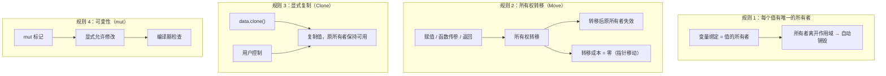
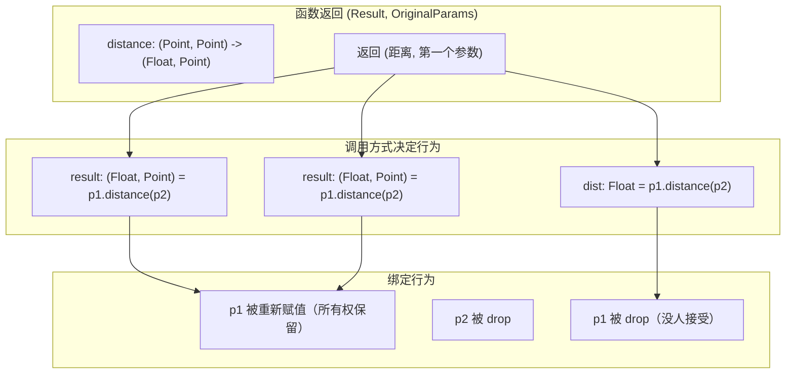
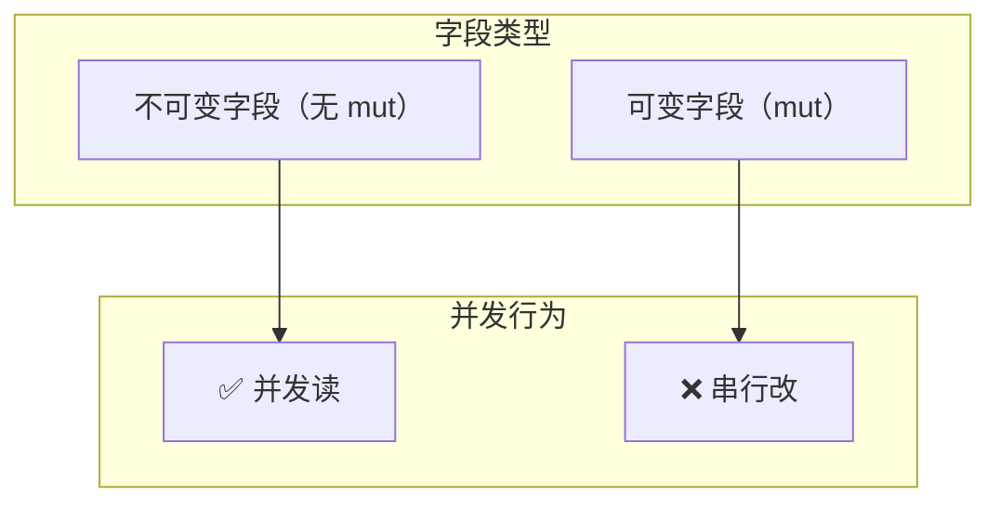
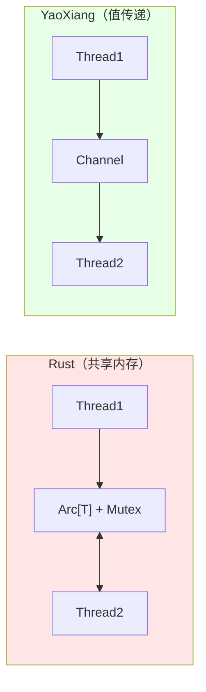

# RFC-009: 所有权模型设计

> **状态**: 审核中
> **作者**: 晨煦
> **创建日期**: 2025-01-08
> **最后更新**: 2025-01-09（v4：引用跨边界规则 + @block修正）

## 参考文档

本文档的设计基于以下文档，并作为 language-spec 的详细设计来源：

| 文档 | 关系 | 说明 |
|------|------|------|
| [language-spec](../language-spec.md) | **规范目标** | 本 RFC 的设计将整合到语言规范中 |
| [manifesto](../manifesto.md) | **设计哲学** | 零成本抽象、默认不可变、无 GC |
| [RFC-001 并作模型](./001-concurrent-model-error-handling.md) | **并发安全** | DAG 资源分析 + 消息传递替代共享内存 |
| [RFC-008 运行时并发模型](./accepted/008-runtime-concurrency-model.md) | **运行时集成** | 运行时内存管理与所有权的集成 |

## 摘要

本文档定义 YaoXiang 编程语言的**所有权模型（Ownership Model）**，包括所有权语义、移动语义和线程通信。YaoXiang 采用简化的所有权模型，**不引入生命周期标注 `'a`** 和**引用语法**，通过值传递实现内存安全，通过 Send 检查实现并发安全，通过 DAG 资源分析实现自动调度，无需 GC 即可实现高性能。

> **设计决策**：YaoXiang 选择**不实现生命周期标注**和**借用引用**，通过以下策略解决内存安全问题：
> 1. 类型透明，编译器直接访问字段（无需 ref T）
> 2. 赋值/传参/返回 = Move（零拷贝）
> 3. 显式 clone() = 复制
> 4. 极端性能场景由标准库兜底（视图类型等可选）

> **核心原则**：99% 的代码不需要任何特殊处理。值传递 + Move 语义 + DAG 资源类型已覆盖几乎所有场景。Arc/Rc/RefCell/Mutex 仅作为标准库可选实现，用于极端性能场景。

> **性能保证**：YaoXiang 的性能接近 Rust，远超 Go。大对象 Move 零拷贝。
>
> **所有权绑定**：99% 的代码不需要任何特殊处理。值传递 + Move 语义 + DAG 资源类型已覆盖几乎所有场景。Arc/Rc/RefCell/Mutex 仅作为标准库可选实现，用于极端性能场景。
>
> **柯里化多位置绑定**：YaoXiang 通过 RFC-004 的柯里化绑定机制，实现流畅 API。方法调用如 `p1.distance(p2)` 实际上是柯里化绑定后的函数调用，返回 `(Float, Point)`，调用者可根据需要选择重新赋值或丢弃。

## 动机

### 为什么需要所有权模型？

在传统编程语言中，内存管理一直是核心难题：

| 语言 | 内存管理方式 | 问题 |
|------|-------------|------|
| C/C++ | 手动管理 | 内存泄漏、野指针、双重释放 |
| Java/Python | GC | 延迟波动、内存开销、无法预测的暂停 |
| Rust | 所有权模型 | 编译期检查，无运行时开销 |

YaoXiang 采用所有权模型，旨在解决以下问题：

1. **内存安全**：自动释放，无内存泄漏
2. **数据竞争消除**：编译期检测并发访问问题
3. **零成本抽象**：无 GC 运行时开销
4. **可预测的性能**：无垃圾回收暂停

### 设计目标

```yaoxiang
# YaoXiang 所有权模型的核心目标

# 1. 自动内存管理（无 GC）
create_and_forget: () -> Data = () => {
    data = Data.new()  # 自动分配
    # data 离开作用域时自动释放
}

# 2. 移动语义（零拷贝）
transfer: (Data) -> Data = (data) => {
    Data(data.value * 2)  # 返回新值，所有权转移
}

# 3. 显式复制（用户控制）
copy_data: (Data) -> Data = (data) => data.clone()

# 4. 值传递（并发安全）
# 并作模型自动处理并发，无需 Arc/Mutex
worker: (Task) -> Result = (task) => {
    # 值通过变量传递，DAG 自动构建依赖
    process(task)  # Move（所有权转移）
}
```

### 关键设计决策：不实现生命周期标注 + 删除引用语法 + 值传递替代共享内存

#### 为什么不做生命周期 `'a`？

| 问题 | 分析 |
|------|------|
| **`'a` 语法** | 丑、学习成本高、增加语言复杂度 |
| **编译器无法推断** | 返回哪个输入、返回新借用、结构体包含引用 |
| **用户负担** | 99% 的代码不需要生命周期，只有 1% 的复杂场景需要 |

#### 为什么不做引用语法？

YaoXiang 没有 `ref` 关键字，因为：

| 问题 | 分析 |
|------|------|
| **类型透明** | 函数式语言中，类型定义对所有人可见 |
| **编译器优化** | 编译器看到类型定义，可以直接优化访问 |
| **用户负担** | 99% 的代码不需要借用，只有 1% 的极端场景需要 |
| **替代方案** | 大对象用移动语义，视图类型兜底 |

```yaoxiang
# 不需要 ref T，因为类型透明
type BigData = BigData(header: Header, payload: Payload)

# get_header 吃掉 data 的所有权，返回 Header
# data 在调用后失效

get_header: (BigData) -> Header = (data) => {
    data.header  # 所有权转移，返回 Header
}

# 如果需要保留原值，函数应该返回新值
get_both: (BigData) -> (Header, BigData) = (data) => {
    (data.header, data)  # 返回 Header 和原 BigData
}
# 调用者自己决定怎么处理返回值
```

#### 为什么不需要 Arc/Mutex？

| Rust 问题 | YaoXiang 解法 |
|-----------|---------------|
| 多线程共享数据 | **值传递**（channel 内部实现） |
| 内部可变性 | **`mut` 标记**（编译期可变性） |
| 线程安全同步 | **DAG 资源分析**（自动串行/并行） |

> **核心洞察**：共享内存需要锁，值传递不需要。YaoXiang 的并作模型（DAG + 资源类型）已经解决了并发安全问题，不需要 Arc/Mutex。

#### 编译器无法推断的场景（被禁止）

```yaoxiang
# === 场景1：返回哪个输入？ ===
pick: (Data, Data) -> Data = (a, b) => {
    if a.value > b.value { a } else { b }
}

# === 场景2：返回"新值" ===
get_buffer: () -> Data = () => Data(42)

# === 场景3：结构体包含值 ===
type Container = Container(data: Data)
```

#### 损失 vs 收获

| | 损失 | 收获 |
|---|------|------|
| **表达能力** | 无法返回借用 | 简化设计 |
| **学习曲线** | - | 几乎为 0 |
| **代码安全** | - | 更高 |
| **常见代码影响** | < 1% | - |

> **结论**：返回整个值完全可行。只有极端性能场景才需要避免复制，由标准库兜底。

## 提案

### 1. 所有权核心概念

#### 1.1 所有权规则

YaoXiang 的所有权系统基于以下核心规则：

> **核心规则**：值传递 + 默认不可变 + 显式 mut 标记



#### 1.2 所有权语义示例

```yaoxiang
# === 规则 1：唯一所有者 ===

# 基础类型 - Move 语义
x: Int = 42
y = x  # Move，x 失效

# 复杂类型 - Move 语义
type Data = Data(value: Int)

create_data: () -> Data = () => {
    data = Data(42)  # data 是所有者
    data              # 返回时所有权转移给调用者
}

# ownership_move: () -> Void = () => {
#     data = Data(42)
#     data2 = data  # 所有权从 data 转移到 data2
#     # data 失效，无法再使用
#     print(data.value)  # ❌ 编译错误！
# }

# === 规则 2：透明访问（不需要 ref T）===

# 编译器看到类型定义，直接访问字段
get_value: (Data) -> Int = (data) => data.value

# === 规则 3：可变性（mut 标记）===

# 默认不可变
data: Data = Data(42)
# data.value = 100  # ❌ 编译错误！

# mut 标记允许修改
mut counter: Int = 0
counter = counter + 1  # ✅ 允许

# mut 数据结构
mut data_mut: Data = Data(42)
data_mut.value = 100   # ✅ mut 标记允许修改

# === 规则 4：跨边界传递（值传递）===

# ✅ 正确：跨边界传递值（Move 或 Clone）
good_example: () -> Void = () => {
    data = Data(42)
    spawn(() => {
        print(data.value)  # data Move 或 Clone
    })
}

# === 规则 5：所有权转移 ===

transfer: (Data) -> Data = (data) => {
    # data 的所有权转移进来
    # 函数结束时 data 被销毁
    Data(data.value * 2)  # 返回新值，所有权转移出去
}

# ownership_transfer: () -> Void = () => {
#     data = Data(42)
#     data2 = transfer(data)  # 所有权转移
#     # data 失效
#     print(data.value)  # ❌ 编译错误！
# }
```

#### 1.3 所有权绑定（Ownership Binding）

> **与 RFC-004 的关系**：所有权绑定依赖于柯里化多位置绑定（RFC-004）的语法机制。

YaoXiang 提供**所有权绑定**机制，让函数可以返回`(结果, 原参数)`，调用者根据返回值类型决定是否重新赋值原变量。这使得 API 更加流畅，同时保持所有权的明确性。

##### 1.3.1 所有权绑定规则



**核心规则**：
1. 函数返回 `(结果, 原参数)` 元组
2. 调用者根据返回值类型决定行为：
   - 完全匹配 → 自动重新赋值原变量
   - 部分匹配 → 丢弃未接受的部分
3. 未被接受的所有权被 drop

##### 1.3.2 所有权绑定示例

```yaoxiang
# === 所有权绑定基础 ===

type Point = Point(x: Float, y: Float)

# 基础函数：返回 (距离, 第一个 Point)
distance: (Point, Point) -> (Float, Point) = (a, b) => {
    dx = b.x - a.x
    dy = b.y - a.y
    d = (dx * dx + dy * dy).sqrt()
    (d, a)  # 返回距离和第一个参数
}

# 通过柯里化绑定到类型（RFC-004）
Point.distance = distance[1]

# === 调用场景 ===

p1: Point = Point(0.0, 0.0)
p2: Point = Point(3.0, 4.0)

# 场景1：完全接受返回值 → p1 被重新赋值
# p2 被 drop（没人接受它的所有权）
result: (Float, Point) = p1.distance(p2)
# result = (5.0, Point(0.0, 0.0))
# p1 保持不变（没人要求重新赋值）

# 场景2：只接受距离 → p1 被 drop
dist: Float = p1.distance(p2)
# dist = 5.0
# p1 和 p2 都被 drop

# 场景3：丢弃所有返回值 → p1 被 drop
_ = p1.distance(p2)  # 只关心副作用
# p1 和 p2 都被 drop
```

##### 1.3.3 更复杂的例子

```yaoxiang
# === 所有权绑定：返回原参数 ===

type Point = Point(x: Float, y: Float)
type Line = Line(start: Point, end: Point)

# 计算线段长度，返回 (长度, 原 Line)
line_length: (Line) -> (Float, Line) = (line) => {
    d = line.start.distance(line.end)
    (d, line)
}

# 绑定到类型
Line.length = line_length[0]

# 使用示例
line: Line = Line(
    start: Point(0.0, 0.0),
    end: Point(3.0, 4.0)
)

# 接受返回值（Line 不失效）
result: (Float, Line) = line.length
# result = (5.0, line)
# line 仍然有效

# 不接受返回值（Line 被 drop）
_ = line.length
# line 被 drop
```

##### 1.3.4 所有权绑定与异步/并发的关系

> **核心洞察**：所有权绑定让异步操作更加清晰。返回值类型决定原参数是否被 drop。

```yaoxiang
# === 异步任务的所有权绑定 ===

type Task = Task(id: Int, data: String)

# 异步任务：处理数据并返回 (结果, 原 Task)
process_task: (Task) -> (Result, Task) = (task) => {
    result = do_async_work(task.data)
    (result, task)
}

Task.process = process_task[0]

# 使用示例
task: Task = Task(id: 1, data: "hello")

# 接受返回值（保留 Task）
result: (Result, Task) = task.process()
# result = (ok_result, task)
# task 仍然有效

# 不接受返回值（Task 被 drop）
result: Result = task.process()
# task 被 drop
```

**异步/并发的所有权绑定规则**：
1. 异步任务参数的所有权进入任务
2. 任务完成时返回 `(结果, 原参数)` 或仅 `结果`
3. 调用者根据需要选择是否保留参数
4. 未保留的参数被自动 drop

### 2. 可变性与 mut 标记

#### 2.1 mut 标记语法

> **核心规则**：mut 是**字段级**属性，不是变量级属性。变量绑定不可重新赋值。

```yaoxiang
# === 变量绑定不可重新赋值 ===

p: Point = Point(10, 20)
# p = Point(30, 40)  # ❌ 编译错误！变量不能重新赋值

# === mut 是字段级 ===

# mut 标记单个字段，只有该字段可变
type Point = Point(x: Int, mut y: Int)

p: Point = Point(10, 20)
p.x = 100        # ❌ x 没有 mut，编译错误！
p.y = 200        # ✅ y 有 mut 标记，可以修改

# === 字段 mut 的使用场景 ===

# 只允许修改某些字段，暴露更多不可变字段给 API 用户
type Config = Config(
    api_key: String,        # 不可变
    timeout: mut Int,       # 可变
    retries: mut Int        # 可变
)

# API 用户可以修改 timeout/retries，但不能修改 api_key
```

#### 2.2 mut 规则

| 特性 | 规则 |
|------|------|
| **变量绑定** | 不可重新赋值，只能 Move |
| **字段 mut** | mut 标记的字段可以修改 |
| **不可变字段** | 编译期检查 |

```yaoxiang
# === 变量不可重新赋值 ===

data: Data = Data(42)
# data = Data(100)  # ❌ 编译错误！

# === 需要新值？创建新值 ===

data2: Data = Data(data.value * 2)  # ✅ 创建新值

# === mut 字段修改 ===

type Point = Point(x: Int, mut y: Int)

p: Point = Point(10, 20)
p.y = 200        # ✅ y 有 mut，可以修改
```

#### 2.3 并发规则

> **核心洞察**：不可变字段天然可并发读，mut 字段编译器自动串行。



```yaoxiang
# === 不可变字段 - 并发读 ===

type Point = Point(x: Float, y: Float)

p: Point = Point(0.0, 0.0)
target1: Point = Point(1.0, 0.0)
target2: Point = Point(2.0, 0.0)

# 两个距离计算并发执行（只读 x）
d1 = p.x.distance(target1)  # 读 x
d2 = p.x.distance(target2)  # 读 x，并发！

# === mut 字段 - 串行改 ===

type Config = Config(name: String, mut timeout: Int)

cfg: Config = Config(name: "app", timeout: 1000)
cfg.timeout = 2000  # 串行修改
cfg.timeout = 3000  # 串行修改
```

### 3. 性能分析

#### 3.1 所有权转移（零拷贝）

```yaoxiang
# === Move 语义 ===
load_data: () -> BigData = () => BigData(...)

process: (BigData) -> Void = (data) => { ... }

main: () -> Void = () => {
    data = load_data()
    process(data)  # 移动，不是复制！
}
#                          ^^^^
#                          大对象直接移动，零拷贝
```

#### 3.2 性能对比

| 语言 | 所有权语义 | 并发安全 |
|------|-----------|---------|
| **Rust** | Move + 借用检查 | Arc + Mutex |
| **YaoXiang** | Move + Clone | 值传递 + DAG |
| **Go** | 指针传递 | Channel |
| **Java** | 引用传递 | synchronized |

#### 3.3 性能保证

| 保证项 | 说明 |
|--------|------|
| Move 语义 | 零拷贝（所有权转移） |
| Clone | 用户显式控制，编译器优化 |
| 并发安全 | 无数据竞争（值传递） |

> **核心**：YaoXiang 通过值传递实现内存安全，性能接近 Rust。

```yaoxiang
get_header: (BigData) -> Header = (data) => data.header

# 极端性能场景：标准库提供视图
use std.memory

get_header_view: (BigData) -> HeaderView = (data) => {
    std.memory.create_view(data, 0, 64)  # 零拷贝视图
}
```

### 4. 值传递与并发安全

#### 4.1 并发安全保证

> **与 RFC-001 的关系**：本节的并发安全模型基于 RFC-001 的"信任用户 + 数据流依赖"设计。

YaoXiang 的并发安全来自**值传递 + Send 检查**：

| 机制 | 保证 |
|------|------|
| **值传递** | ✅ 跨线程移动无数据竞争 |
| **Send 检查** | ✅ 跨线程传输的类型必须满足 Send |
| **DAG 资源分析** | ⚠️ 依赖变量传递 |

> **⚠️ 注意**：DAG 资源分析基于 RFC-001 的规则。编译器无法验证运行时资源标识的同一性，字面量资源操作的行为由用户负责。



#### 4.2 核心原则：共享不如传递

YaoXiang 的并发安全**不依赖共享内存**，而是：

1. **值传递**：值在并发边界间流动（channel 为内部实现细节）
2. **Send 检查**：跨线程传输的类型必须满足 Send
3. **DAG 资源分析**：自动并行调度

> **实现细节**：channel 是值传递的内部实现机制，用户只需传值，无需直接操作 channel。


#### 4.3 值传递示例

```yaoxiang
# === 值传递示例 ===

# 方式1：直接捕获变量（Move）
worker: (Task) -> Result = (task) => {
    process(task)  # task Move 到闭包
}

# 方式2：闭包捕获多个变量
process_data: (Int, String) -> Void = (id, data) => {
    spawn(() => {
        print(id)      # Move
        print(data)    # Move
    })
}

# 方式3：显式 Clone 后传递
worker_clone: (Task) -> Result = (task) => {
    spawn(() => process(task.clone()))  # Clone 后 Move
}

# === 100 个线程读取配置 ===
config = Config(timeout: 1000, retries: 3)

spawn_for i in 0..100 {
    # config Move 到每个线程
    # 原 config 失效
    print(config.timeout)
}

# === 保留原值：显式 Clone ===
config = Config(timeout: 1000, retries: 3)

spawn_for i in 0..100 {
    print(config.clone().timeout)  # Clone 后 Move，原 config 保留
}
```

#### 4.4 DAG 资源类型

> **与 RFC-001 的关系**：资源类型基于 RFC-001 的数据流依赖规则。

资源类型标记用于自动构建 DAG 依赖：

```yaoxiang
# === 资源类型标记 ===

type FileSystem: Resource
type Network: Resource
type Database: Resource
```

**资源依赖分析规则**（来自 RFC-001）：

```yaoxiang
# === 可靠：变量传递资源标识 ===
file = open("data.txt")     # file 是变量
write(file, "hello")         # 依赖 file 变量
write(file, "world")         # 依赖 file 变量 → 自动串行

# === ⚠️ 不保证：字面量资源标识 ===
write("data.txt", "hello")   # 字面量，编译器无法识别
write("data.txt", "world")   # 编译器保守处理：可能串行或并行
# 这是用户设计问题，非语言保证

# === 标准库预定义资源类型 ===
use std.resource

file: std.resource.File = open("data.txt")
# 标准库强制约束，字面量也能被正确识别
```

**资源类型的作用**：
- 标记参数类型为 `Resource`，帮助编译器识别
- 但**不能替代变量传递**
- 标准库提供预定义资源类型，强制约束

**不同资源的操作自动并行**：

```yaoxiang
fetch_users: () -> JSON = () => HTTP.get("api/users")
fetch_posts: () -> JSON = () => HTTP.get("api/posts")

main: () -> Void = () => {
    users = fetch_users()  # Network 资源
    posts = fetch_posts()  # Network 资源，不同 URL → 并行
    render(users, posts)
}
```

#### 4.5 可变性：`mut` 标记

YaoXiang 的可变性通过 `mut` 标记，无需 RefCell：

```yaoxiang
# === 可变性 ===

# 默认不可变
data: Data = Data(42)
# data.value = 100  # ❌ 编译错误！

# mut 标记允许修改
mut data: Data = Data(42)
data.value = 100     # ✅ 允许修改

# mut 标记在编译期检查，无需运行时 RefCell
# 如果未标记 mut 的变量被修改，编译期报错
```

#### 4.6 极端场景：标准库可选实现

极端场景可通过标准库实现：

```yaoxiang
# === 标准库可选实现（极端场景） ===

# 极端场景 1：需要共享大对象给多个线程
# 使用 std.sync.arc
use std.sync

shared_data: std.sync.Arc[BigData] = std.sync.Arc.new(load_large_file())

# 极端场景 2：需要内部可变性
# 使用 std.cell
counter: std.cell.RefCell[Int] = std.cell.RefCell.new(0)

# 极端场景 3：需要互斥访问
# 使用 std.sync.mutex
shared_counter: std.sync.Mutex[Int] = std.sync.Mutex.new(0)

# ⚠️ 注意：这些是极端场景的兜底方案
# 大多数场景应该用值传递 + 复制语义
```

> **设计原则**：标准库提供 Arc/RefCell/Mutex，但它们是**极端场景的兜底方案**，不是日常工具。

### 5. Send/Sync 约束

> **说明**：Send/Sync 在 YaoXiang 中**主要用于值传递**，不是共享内存。

#### 5.1 Send 约束

**Send**：类型可以安全地跨线程**传输**（值传递）。

```yaoxiang
# === Send 约束 ===

# 基本类型自动满足 Send
# Int, Float, Bool, String 都是 Send

# 结构体自动派生 Send
type Point = Point(x: Int, y: Float)
# Point 是 Send，因为 Int 和 Float 都是 Send

# spawn 要求 Send
# spawn_task: () -> Void = () => {
#     data = BigStruct(...)  # Send
#     spawn(() => process(data))  # ✅ 值传递
# }

# 大多数类型默认 Send
# 闭包捕获变量自动检查 Send
```

#### 5.2 Sync 约束（预留）

**Sync**：类型可以安全地跨线程**共享引用**。

> **注意**：YaoXiang 默认使用值传递，不需要共享引用。Sync 仅作为预留特性，未来可能用于标准库类型（如 Arc）的约束。

```yaoxiang
# === Sync 约束 ===

# Sync 在 YaoXiang 中几乎没有实际用途
# 因为 YaoXiang 不需要共享引用，所有数据传递都是值传递

# 如果未来需要跨线程共享值，需要显式使用 Arc 等标准库类型
type Point = Point(x: Int, y: Float)

# Arc[Point] 是 Sync（标准库实现）
```

#### 5.3 Send 派生规则

```yaoxiang
# === Send 派生规则 ===

# 结构体类型
type Struct[T1, T2] = Struct(f1: T1, f2: T2)

# Send 派生规则
# Struct[T1, T2]: Send ⇐ T1: Send 且 T2: Send
```

> **Sync 预留**：Sync 派生规则暂不实现，仅用于未来标准库类型约束。

#### 5.4 标准库类型约束表

| 类型 | Send | 说明 |
|------|:----:|------|
| `Int`, `Float`, `Bool` | ✅ | 原类型 |
| `String` | ✅ | UTF-8 字符串 |
| `Channel[T]` | ✅ | 内部实现细节（用户不直接使用） |
| `std.sync.Arc` | ✅ | 极端场景可选（标准库，不推荐） |
| `std.sync.Mutex` | ✅ | 极端场景可选（标准库，不推荐） |

> **层级归属**：YaoXiang 语言核心**不依赖共享原语**，并发安全通过值传递 + DAG 实现。Channel/Arc/Mutex 是内部或标准库实现，不鼓励日常使用。

### 6. RAII 与资源管理

#### 6.1 RAII 模式

```yaoxiang
# === RAII（资源获取即初始化）===

# RAII 保证资源在所有者销毁时自动释放
type File = File(handle: FileHandle)

# open_file: (String) -> File = (path) => {
#     handle = os.open(path)  # 获取资源
#     File(handle)             # 绑定到所有者
# }  # 函数结束时，如果成功则返回 File
#     如果失败则 handle 自动关闭

# use_file: (File) -> Void = (file) => {
#     content = file.read_all()
#     # 使用文件
# }  # file 离开作用域，自动关闭文件

# === 标准库 RAII 示例 ===

# with 语法糖（简化 RAII 使用）
with_file: (String) -> String = (path) => {
    with file = File.open(path) {
        file.read_all()
    }
}  # file 自动关闭

# === 自定义 RAII 类型 ===

type DatabaseConnection = DatabaseConnection(conn: DBConn)

new_connection: (String) -> DatabaseConnection = (url) => {
    conn = db.connect(url)
    DatabaseConnection(conn)
}

# 析构函数（未来特性）
# drop: (DatabaseConnection) -> Void = (conn) => {
#     db.disconnect(conn.conn)
# }
```

#### 6.2 Drop 语义

```yaoxiang
# === Drop 语义（资源释放）===

# 资源在所有者离开作用域时自动释放
scoped_resource: () -> Void = () => {
    resource = create_expensive_resource()
    # 使用 resource
}  # resource 被 drop，资源释放

# 显式释放
explicit_drop: () -> Void = () => {
    resource = create_expensive_resource()
    # 使用 resource
    resource.drop()  # 显式提前释放
}  # 此时 resource 已无效，不能再使用

# 移动后自动 drop
move_and_drop: () -> Void = () => {
    resource1 = create_resource()
    resource2 = create_resource()

    resource1 = resource2  # resource1 被 drop
                           # resource2 的所有权转移给 resource1
}  # resource2（在 resource1 中）被 drop
```

### 7. 与运行时模式的关系

> **与 RFC-008 的关系**：运行时分层基于 RFC-008 的三层架构设计。

所有权规则在所有运行时模式下一致：

| 规则 | Embedded | Standard | Full |
|------|----------|----------|------|
| **所有权规则（Move/Clone/Drop）** | ✅ 一致 | ✅ 一致 | ✅ 一致 |
| **mut 可变性检查** | ✅ 一致 | ✅ 一致 | ✅ 一致 |
| **Send 检查** | ✅ 一致 | ✅ 一致 | ✅ 一致 |
| **DAG 资源分析** | ❌ 不适用 | ✅ 启用 | ✅ 启用 |
| **WorkStealing** | ❌ | ❌ | ✅ |

**各运行时说明**：

- **Embedded 模式**：无 DAG 调度，所有代码同步执行。跨线程操作仍需 Send 检查。
- **Standard 模式**：启用 DAG 调度，资源操作自动并行化。
- **Full 模式**：Standard + WorkStealing，规则与 Standard 相同。

> **核心保证**：所有权语义在所有模式下保持一致，用户代码无需针对不同模式重写。

## 详细设计

### 语法定义

> 语法定义详见 [language-spec.md](../language-spec.md)

所有权相关语法已整合到语言规范中，包括：
- 可变标记：`mut`
- 泛型约束：`Send`, `Sync`
- 智能指针类型：`Box`, `Rc`, `Arc`, `RefCell`, `Mutex`, `RwLock`（标准库可选）
- 变量声明：`let` / `mut` 修饰符

### 类型系统约束

```yaoxiang
# === 所有权类型系统规则 ===

# 规则 1：可变性检查
# 默认不可变：
#   - 所有绑定默认不可变
#   - 未标记 mut 的变量不能修改

# mut 标记规则：
#   - 标记 mut 后可以修改
#   - 编译期检查

# 规则 2：Send/Sync
# spawn 要求：
#   - 参数类型必须是 Send
#   - 返回类型必须是 Send
#   - 闭包捕获的所有变量必须是 Send

# 规则 3：智能指针（标准库可选）
# Box[T] 需要 T: Sized（大小已知）
# Rc[T]/Arc[T] 需要 T: Clone（克隆语义）
# RefCell[T] 需要 T: Sized
# Mutex[T] 需要 T: Send
```

## 权衡

### 优点

1. **内存安全**：编译期消除内存泄漏和野指针
2. **并发安全**：值传递 + Send 检查 + DAG 资源分析消除数据竞争
3. **零成本抽象**：无 GC 运行时开销
4. **可预测性能**：无垃圾回收暂停
5. **RAII 资源管理**：文件、网络等资源自动释放
6. **AI 友好**：明确的规则易于 AI 理解和生成
7. **学习曲线低**：无需理解生命周期标注、Arc、Mutex
8. **简洁**：只需传值，无需任何特殊处理

### 缺点

1. **需要显式 Clone**：想保留原值时需要调用 clone()
2. **无法返回借用**：需要返回整个值
3. **结构体不能含借用**：需要包含值
4. **极端性能场景**：需要标准库 Arc/视图（1% 情况）

## 替代方案

| 方案 | 为什么不选择 |
|------|-------------|
| GC（垃圾回收） | 有运行时开销，无法预测暂停 |
| 手动内存管理 | 内存泄漏、野指针风险 |
| ARC（自动引用计数） | 无法检测数据竞争 |
| 区域分析 | 复杂度高，实现困难 |


## 开放问题

| 议题 | 状态 | 说明 |
|------|------|------|
| 引用跨边界规则 | 待定 | ref/mut 跨 spawn/channel 的具体实现 |
| DAG 资源分析 | 待定 | 变量传递 vs 字面量的边界情况 |
| 视图类型 API | 待定 | std.memory 视图的具体设计 |
| @block 注解 | 待定 | 仅用于调试/阻塞IO，还是通用注解 |
| Drop 语法 | 待定 | 是否需要显式 `drop()` 函数 |

---

## 附录

### 附录A：与 Rust 的差异

| 特性 | Rust | YaoXiang |
|------|------|----------|
| 借用语法 | `&T`, `&mut T` | **无**（类型透明，直接访问） |
| 可变标记 | `&mut T` | `mut` |
| 生命周期 | `&'a T` | **无**（自动推断） |
| 返回借用 | ✅ 支持 | ❌ 禁止（返回整个值） |
| 结构体含借用 | ✅ 支持 | ❌ 禁止（包含值） |
| 共享所有权 | `Arc[T]` | **不需要**（消息传递） |
| 线程同步 | `Mutex`, `RwLock` | **不需要**（消息传递） |
| 内部可变性 | `RefCell` | **不需要**（`mut` 标记） |
| 并发模型 | async/await + Arc | **消息传递 + DAG** |
| Arc/Mutex | 语言内置 | **标准库可选**（极端场景） |

### 附录B：设计决策记录

| 决策 | 决定 | 日期 | 记录人 |
|------|------|------|--------|
| **引用语法 ref T** | **删除**（类型透明） | 2025-01-10 | 晨煦 |
| **mut 语义** | **字段级**（非变量级） | 2025-01-10 | 晨煦 |
| **变量绑定** | **不可重新赋值**（只能 Move） | 2025-01-10 | 晨煦 |
| **生命周期** | **不实现** | 2025-01-08 | 晨煦 |
| **借用检查器** | **删除** | 2025-01-10 | 晨煦 |
| **借用返回** | **禁止** | 2025-01-08 | 晨煦 |
| **所有权绑定** | **支持**（返回 (结果, 原参数)） | 2025-01-10 | 晨煦 |
| **并发规则** | 不可变字段并发读，mut 字段串行 | 2025-01-10 | 晨煦 |
| **显式复制** | clone() | 用户控制何时复制 | 2025-01-10 | 晨煦 |
| 大对象移动 | 零拷贝 | 2025-01-08 | 晨煦 |
| 并发安全 | **值传递 + Send + DAG 资源分析** | 2025-01-08 | 晨煦 |
| **DAG 资源分析** | ⚠️ 依赖变量传递，字面量不保证 | 2025-01-09 | 晨煦 |
| Arc/Mutex | **标准库可选**（极端场景，不推荐） | 2025-01-09 | 晨煦 |
| RAII | 自动资源释放 | 2025-01-08 | 晨煦 |
| **运行时模式** | 所有权一致，并发规则分层 | 2025-01-09 | 晨煦 |
| **@block 注解** | **仅用于调试/阻塞IO** | 2025-01-09 | 晨煦 |
| 极端性能场景 | 标准库兜底 | 2025-01-08 | 晨煦 |

### 附录C：术语表

| 术语 | 定义 |
|------|------|
| 所有者（Owner） | 负责释放值的变量或资源 |
| 移动（Move） | 所有权的转移 |
| 复制（Clone） | 值的显式复制（调用 clone()） |
| 所有权绑定 | 函数返回 (结果, 原参数)，调用者根据类型决定是否重新赋值 |
| 值传递 | 值在并发边界间流动（channel 为内部实现） |
| Send | 可安全跨线程传输 |
| Sync | 可安全跨线程共享引用 |
| RAII | 资源获取即初始化 |
| mut 标记 | 显式可变性声明 |
| 视图类型 | 标准库提供的零拷贝访问方式 |

---

## 社区讨论

### 设计决策记录

| 决策 | 决定 | 原因 | 日期 |
|------|------|------|------|
| **引用语法 ref T** | 删除 | 类型透明，编译器直接访问字段 | 2025-01-10 |
| **mut 语义** | 字段级 | mut 是字段属性，不是变量属性 | 2025-01-10 |
| **变量绑定** | 不可重新赋值 | 只能 Move，不能覆盖 | 2025-01-10 |
| **生命周期** | 不实现 | 编译器自动推断，无需用户标注 | 2025-01-08 |
| **借用检查器** | 删除 | 不需要借用检查 | 2025-01-10 |
| **借用返回** | 禁止 | 返回整个值替代借用 | 2025-01-08 |
| **所有权语义** | 默认 Move | 赋值/传参/返回 = Move（零拷贝） | 2025-01-10 |
| **所有权绑定** | 支持 | 返回 (结果, 原参数) 实现流畅 API | 2025-01-10 |
| **并发规则** | 不可变并发读，mut 串行 | 编译器自动处理 | 2025-01-10 |
| **显式复制** | clone() | 用户控制何时复制 | 2025-01-10 |
| **自动复制** | 删除 | 不引入隐性概念 | 2025-01-10 |
| **并发安全** | 值传递 + Send + DAG | 消息传递替代共享内存 | 2025-01-08 |
| **DAG 资源分析** | 依赖变量传递 | 字面量资源由用户负责 | 2025-01-09 |
| **Arc/Mutex** | 标准库可选 | 极端场景兜底 | 2025-01-09 |
| **RAII** | 自动资源释放 | 作用域绑定资源生命周期 | 2025-01-08 |
| **运行时模式** | 所有权一致 | 并发规则分层 | 2025-01-09 |
| **@block 注解** | 仅用于调试/阻塞IO | 非通用注解 | 2025-01-09 |

### 待决议题

| 议题 | 说明 | 状态 |
|------|------|------|
| 视图类型 API | std.memory 视图的具体设计 | 待讨论 |
| Drop 语法 | 是否需要显式 `drop()` 函数 | 待讨论 |

---

## 参考文献

### YaoXiang 官方文档

- [语言规范](../language-spec.md)
- [设计宣言](../manifesto.md)
- [RFC-001 并作模型](./001-concurrent-model-error-handling.md)
- [RFC-008 运行时并发模型](./accepted/008-runtime-concurrency-model.md)
- [YaoXiang 指南](../guides/YaoXiang-book.md)

### 外部参考

- [Rust 所有权模型](https://doc.rust-lang.org/book/ch04-00-understanding-ownership.html)
- [Rust 生命周期](https://doc.rust-lang.org/book/ch10-03-lifetime-syntax.html)
- [C++ RAII](https://en.wikipedia.org/wiki/Resource_acquisition_is_initialization)
- [Erlang 消息传递](https://www.erlang.org/doc/getting_concurrency/getting_concurrency.html)
- [Go 并发模型](https://golang.org/doc/effective_go#concurrency)

---

## 生命周期与归宿

| 状态 | 位置 | 说明 |
|------|------|------|
| **草案** | `docs/design/rfc/` | 作者草稿，等待提交审核 |
| **审核中** | `docs/design/rfc/` | 开放社区讨论和反馈 |
| **已接受** | `docs/design/accepted/` | 成为正式设计文档 |
| **已拒绝** | `docs/design/rfc/` | 保留在 RFC 目录 |