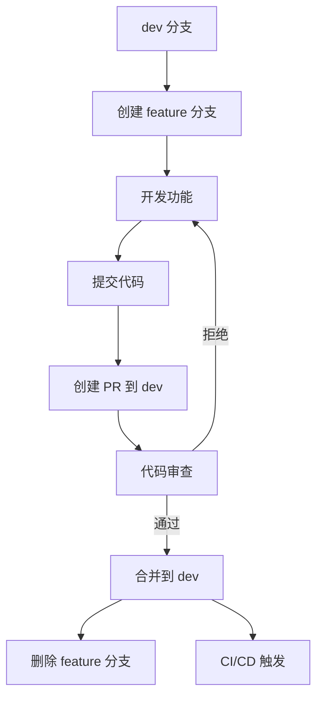
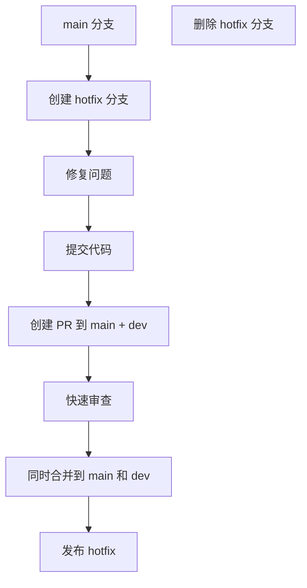
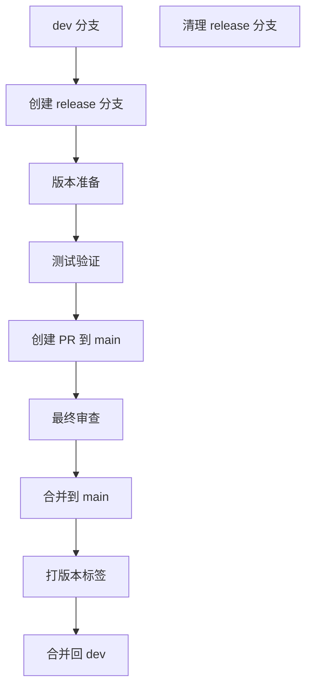

# Git 分支维护手册

> 本手册定义了 YaoXiang 项目的 Git 分支管理策略，旨在确保代码库的有序开发和高效协作。

---

## 📋 目录

- [分支类型规范](#分支类型规范)
- [命名规则](#命名规则)
- [分支生命周期](#分支生命周期)
- [工作流程](#工作流程)
- [分支保护策略](#分支保护策略)
- [最佳实践](#最佳实践)
- [常见问题](#常见问题)

---

## 🏷️ 分支类型规范

### 核心分支（Core Branches）

| 分支名 | 用途 | 生命周期 | 保护级别 |
|--------|------|----------|----------|
| `main` | 生产环境代码 | 永久 | 严格保护 |
| `dev` | 主开发分支 | 永久 | 中等保护 |
| `master` | 主干分支（兼容） | 永久 | 严格保护 |

### 功能分支（Feature Branches）

| 前缀 | 用途 | 命名示例 | 合并目标 |
|------|------|----------|----------|
| `feature/` | 新功能开发 | `feature/type-inference`<br>`feature/ownership-model` | `dev` |
| `bugfix/` | 修复已知缺陷 | `bugfix/memory-leak`<br>`bugfix/parser-error` | `dev` |
| `hotfix/` | 紧急线上问题修复 | `hotfix/security-patch`<br>`hotfix/crash-bug` | `main` + `dev` |
| `release/` | 发布准备分支 | `release/v0.8.0`<br>`release/v1.0.0` | `main` |

### 辅助分支（Auxiliary Branches）

| 前缀 | 用途 | 命名示例 | 合并目标 |
|------|------|----------|----------|
| `docs/` | 文档更新 | `docs/api-reference`<br>`docs/tutorial-update` | `dev` |
| `ci/` | CI/CD 配置变更 | `ci/add-deploy-script`<br>`ci/optimize-build` | `dev` |
| `refactor/` | 代码重构 | `refactor/lexer-optimization`<br>`refactor/memory-manager` | `dev` |
| `test/` | 测试相关修改 | `test/add-integration`<br>`test/performance-bench` | `dev` |

---

## 📝 命名规则

### 基本命名格式

```bash
# 功能分支
<type>/<short-description>

# 示例
feature/add-type-inference
bugfix/fix-parser-crash
hotfix/security-vulnerability
```

### 命名规范

1. **使用小写字母**：所有分支名使用小写
2. **使用连字符分隔**：使用 `-` 分隔单词，不使用下划线
3. **描述性命名**：分支名应清晰表达其用途
4. **避免特殊字符**：不使用空格、点号或其他特殊字符
5. **长度限制**：分支名不超过 50 个字符

### 详细示例

```bash
# ✅ 好的命名
feature/user-authentication-system
bugfix/fix-compilation-error-on-windows
hotfix/memory-leak-in-vm
docs/update-api-documentation
refactor/optimize-lexer-performance
test/add-e2e-test-cases

# ❌ 不好的命名
Feature/NewFeature  # 使用大写
bug_fix            # 使用下划线
hotfix/fix        # 描述不清晰
feature/ADD_NEW_FEATURE_WITH_LOTS_OF_DETAILS_THAT_IS_TOO_LONG  # 过长
```

---

## 🔄 分支生命周期

### 分支创建

```bash
# 1. 从最新 dev 分支创建
git checkout dev
git pull origin dev
git checkout -b feature/your-feature-name

# 2. 推送远程分支
git push -u origin feature/your-feature-name
```

### 分支开发

```bash
# 定期同步最新代码
git checkout dev
git pull origin dev
git checkout feature/your-feature-name
git rebase dev  # 或 git merge dev

# 提交代码
git add .
git commit -m ":sparkles: feat(frontend): 添加类型推断功能"
git push origin feature/your-feature-name
```

### 分支合并

```bash
# 1. 创建 Pull Request
# 2. 代码审查通过后
git checkout dev
git pull origin dev
git merge --no-ff feature/your-feature-name
git push origin dev

# 3. 清理分支
git branch -d feature/your-feature-name  # 本地删除
git push origin --delete feature/your-feature-name  # 远程删除
```

### 分支删除

```bash
# 删除已合并的功能分支
git branch -d feature/completed-feature
git push origin --delete feature/completed-feature

# 批量清理已合并分支
git branch --merged dev | grep feature | xargs -n 1 git branch -d
```

---

## 🚀 工作流程

### 功能开发流程



### 紧急修复流程



### 发布流程



---

## 🛡️ 分支保护策略

### 主要分支保护

**main 分支**
- 禁止直接推送
- 必须通过 PR 合并
- 禁止强制推送
- 要求代码审查
- 状态检查必须通过

**dev 分支**
- 禁止直接推送（开发成员）
- 要求 PR 合并
- 状态检查必须通过
- 允许管理员直接推送

### 分支权限设置

| 分支类型 | 开发者 | 维护者 | 管理员 |
|----------|--------|--------|--------|
| `main` | 仅 PR | 仅 PR | 审批 PR |
| `dev` | PR 合并 | PR 合并 | 直接推送 |
| `feature/*` | 完整权限 | 完整权限 | 完整权限 |
| `hotfix/*` | 完整权限 | 完整权限 | 完整权限 |

---

## ✅ 最佳实践

### 1. 分支管理

- **频繁同步**：定期从 `dev` 分支获取最新代码
- **原子提交**：每个提交只包含相关变更
- **及时清理**：合并后及时删除已完成的功能分支
- **描述清晰**：分支名和提交信息要清晰表达意图

### 2. 提交规范

遵循 [提交规范](./commit-convention.md)：

```bash
# 格式
:emoji: type(scope): 主题（中文）

# 示例
:sparkles: feat(frontend): 添加类型推断功能
:bug: fix(parser): 修复解析器崩溃问题
:recycle: refactor(vm): 重构虚拟机内存管理
```

### 3. Pull Request

- **描述清晰**：详细说明变更内容和原因
- **关联问题**：使用 `Closes #123` 关联相关 Issue
- **及时响应**：审查意见要及时回复
- **测试充分**：确保所有测试通过

### 4. 代码审查

- **功能正确性**：验证代码功能是否正确
- **代码质量**：检查代码是否符合规范
- **测试覆盖**：确保有适当的测试
- **文档更新**：检查文档是否需要更新

---

## ❓ 常见问题

### Q1: 如何选择分支类型？

**答：**
- 新功能 → `feature/`
- 已知缺陷修复 → `bugfix/`
- 紧急线上修复 → `hotfix/`
- 文档更新 → `docs/`
- 代码重构 → `refactor/`
- 测试相关 → `test/`

### Q2: feature 分支应该从哪个分支创建？

**答：**
始终从 `dev` 分支创建，确保功能基于最新的开发代码：

```bash
git checkout dev
git pull origin dev
git checkout -b feature/new-feature
```

### Q3: 什么时候创建 release 分支？

**答：**
- 准备发布新版本时
- 需要冻结新功能添加时
- 需要专门测试稳定版本时

### Q4: 如何处理分支冲突？

**答：**
1. 更新目标分支：`git checkout dev && git pull origin dev`
2. 切换到功能分支：`git checkout feature/your-branch`
3. 合并并解决冲突：`git rebase dev` 或 `git merge dev`
4. 解决冲突后继续开发

### Q5: hotfix 分支如何处理？

**答：**
1. 从 `main` 分支创建：`git checkout main && git checkout -b hotfix/urgent-fix`
2. 修复问题并测试
3. 同时创建 PR 到 `main` 和 `dev`
4. 合并后立即部署

### Q6: 分支命名长度有限制吗？

**答：**
建议不超过 50 个字符，保持简洁明了。Git 本身支持更长的名称，但过长的名称会影响可读性。

---

## 📚 相关文档

- [提交规范](./commit-convention.md)
- [代码审查指南](./code-review.md)
- [发布流程](./release-guide.md)
- [CI/CD 配置](../../.github/workflows/)

---

## 🔧 工具和脚本

### 批量清理已合并分支

```bash
# 删除本地已合并到 dev 的分支
git checkout dev
git pull origin dev
git branch --merged dev | grep -E "^(feature|bugfix|docs|refactor|test)/" | xargs -n 1 git branch -d

# 删除远程已合并的分支
git remote prune origin
```

### 创建分支模板

```bash
#!/bin/bash
# 创建功能分支的辅助脚本

BRANCH_TYPE=$1
BRANCH_NAME=$2

if [ -z "$BRANCH_TYPE" ] || [ -z "$BRANCH_NAME" ]; then
    echo "用法: $0 <类型> <分支名>"
    echo "类型: feature, bugfix, hotfix, docs, refactor, test"
    exit 1
fi

git checkout dev
git pull origin dev
git checkout -b "$BRANCH_TYPE/$BRANCH_NAME"
git push -u origin "$BRANCH_TYPE/$BRANCH_NAME"

echo "已创建并推送分支: $BRANCH_TYPE/$BRANCH_NAME"
```

---

> 💡 **提示**：保持分支的原子性和专注性，每个分支只做一件事，这样可以让代码管理更加清晰高效！

> 📞 **支持**：如有问题，请在 GitHub Discussions 中讨论。