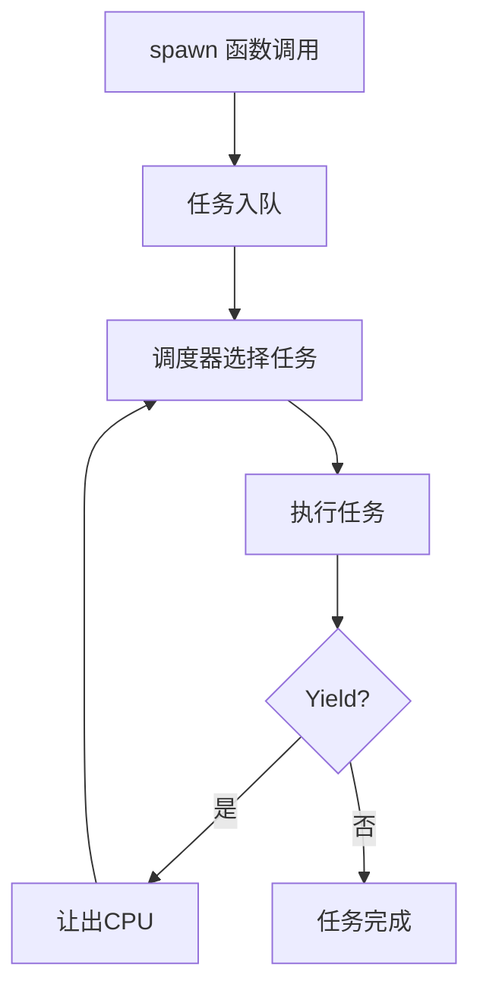
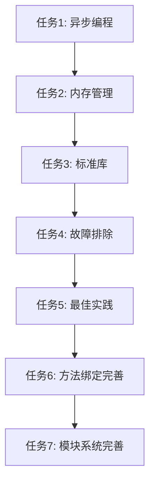

# YaoXiang-book.md 改进计划

> 创建日期：2024-12-31
> 更新日期：2025-01-02
> 状态：待实施
> 目标：完善 YaoXiang 官方指南文档

---

## 设计决策确认（2025-01-02）

### 异步编程核心设计

| 特性 | 设计决策 |
|------|----------|
| 自动等待 | 编译器自动插入 await 指令 |
| 线程安全 | 自动提供数据结构 + 编译时检查 |
| 调度策略 | 协作式调度（Yield） |
| spawn 行为 | 阻塞直到调度 |

---

## 一、改进目标

### 1.1 当前状态分析

| 维度 | 当前状态 | 目标状态 |
|------|----------|----------|
| 文档状态 | 草稿 v1.0.0 | 正式版 v1.0.0 |
| 章节覆盖 | 9章（基础内容） | 12章（完整体系） |
| 示例代码 | 片段式代码 | 完整可运行示例 |
| 标准库 | 零提及 | 完整文档 |

### 1.2 改进原则

- **完整性**：覆盖语言所有核心特性
- **准确性**：与实际实现保持一致
- **可运行性**：每个示例都能直接运行
- **渐进性**：从入门到精通，由浅入深

---

## 二、改进任务清单

### 2.1 高优先级任务

#### 任务1：补充异步编程章节（第五章）

**设计决策**：
- 自动等待：编译器自动插入 await 指令
- 线程安全：自动提供数据结构 + 编译时检查
- 调度策略：协作式调度（Yield）
- spawn 行为：阻塞直到调度

**需要添加的内容**：

```markdown
## 五、异步编程

> **核心特性**：YaoXiang 采用创新的**无感异步**机制，通过 `spawn` 标记函数，编译器自动管理异步执行。

### 5.1 spawn 标记函数

#### 5.1.1 spawn 的行为特性

`spawn` 标记的函数具有以下核心特性：

| 特性 | 说明 |
|------|------|
| **阻塞调用** | 调用 spawn 函数时，调用者会阻塞，直到任务被调度执行 |
| **自动等待** | 编译器自动在需要结果的地方插入 await 指令 |
| **任务队列** | VM 调度器将任务放入队列，在适当时机执行 |

#### 5.1.2 spawn 与非 spawn 函数的区别

```yaoxiang
# === 同步函数 ===
# 调用者立即执行，不进行任务调度
add(Int, Int) -> Int = (a, b) => a + b

# === 异步函数 ===
# 调用 spawn 函数会阻塞当前执行，直到任务被调度
fetch(String) -> JSON spawn = (url) => {
    HTTP.get(url).json()
}

main() -> Void = () => {
    # 同步调用 - 立即执行
    result = add(1, 2)    # result = 3

    # 异步调用 - 阻塞直到调度
    data = fetch("/api")  # 阻塞 -> 调度 -> 执行 -> 返回结果
    # data = JSON
}
```

#### 5.1.3 编译时自动插入 await

```yaoxiang
# 源代码
main() -> Void = () => {
    data = fetch(url)
    print(data.name)
}

# 编译后的执行流程
# 1. Spawn fetch(url) -> 任务入队
# 2. Await data       -> 编译器自动插入
# 3. print(data.name)
```

### 5.2 协作式调度

#### 5.2.1 调度器工作原理



#### 5.2.2 显式让出控制权

```yaoxiang
# 显式让出 CPU，允许调度其他任务
yield() -> Void = () => {
    # VM 指令：Yield，让出控制权给调度器
}

# 长计算中使用 yield 避免阻塞
process_large_data(List[Int]) -> Int spawn = (data) => {
    result = 0
    for item in data {
        result = result + item
        if result % 1000 == 0 {
            yield()  # 每处理1000个元素让出一次
        }
    }
    result
}
```

### 5.3 线程安全与数据竞争检查

#### 5.3.1 自动线程安全的数据结构

YaoXiang 提供自动线程安全的数据结构：

| 数据结构 | 线程安全版本 | 用途 |
|----------|--------------|------|
| `List[T]` | `ThreadSafeList[T]` | 并发访问的列表 |
| `Dict[K,V]` | `ThreadSafeDict[K,V]` | 并发访问的字典 |
| `String` | `ThreadSafeString` | 并发访问的字符串 |

#### 5.3.2 数据竞争检测

编译器会在编译时检测潜在的数据竞争：

```yaoxiang
# 错误示例 - 数据竞争
shared_counter: Int = 0

increment() -> Void = () => {
    shared_counter = shared_counter + 1  # 编译错误：数据竞争
}

# 正确示例 - 使用线程安全类型
safe_counter: ThreadSafeInt = ThreadSafeInt.new(0)

increment_safe() -> Void = () => {
    safe_counter.add(1)  # 原子操作，安全
}
```

#### 5.3.3 Mutex 互斥锁

对于复杂数据结构，可以使用 Mutex：

```yaoxiang
type Counter = Counter(value: Int)

create_counter(Int) -> Arc[Mutex[Counter]] = (initial) => {
    mutex_new(Counter(initial))
}

increment(Arc[Mutex[Counter]]) -> Void = (counter_mutex) => {
    guard = mutex_lock(counter_mutex)
    guard.value = guard.value + 1
    # guard 自动释放锁（RAII）
}

main() -> Void = () => {
    counter = create_counter(0)
    
    # 并发修改
    spawn increment(counter)
    spawn increment(counter)
    
    print("Final count: " + counter.lock().value.to_string())
}
```

### 5.4 并发控制 API

#### 5.4.1 spawn_thread - 创建新线程

```yaoxiang
# 在新线程中执行
spawn_thread(fn() -> Void) -> ThreadHandle = (f) => {
    concurrent.spawn(f)
}
```

#### 5.4.2 sleep - 线程休眠

```yaoxiang
# 休眠指定毫秒
sleep(Int) -> Void = (millis) => {
    concurrent.sleep(millis)
}
```

#### 5.4.3 parallel - 并行执行

```yaoxiang
# 并行执行任务列表
parallel(List[fn() -> T]) -> List[T] = (tasks) => {
    results = []
    for task in tasks {
        results = results + [spawn task()]
    }
    results
}
```

### 5.5 完整异步示例

```yaoxiang
# async-example.yx
use std.io
use std.concurrent

type User = User(id: Int, name: String)
type Post = Post(id: Int, title: String)

# 获取用户列表 - spawn 标记的异步函数
get_users(String) -> List[User] spawn = (api_url) => {
    response = HTTP.get(api_url + "/users")
    JSON.parse(response.body)
}

# 获取文章列表 - spawn 标记的异步函数
get_posts(String) -> List[Post] spawn = (api_url) => {
    response = HTTP.get(api_url + "/posts")
    JSON.parse(response.body)
}

main() -> Void = () => {
    api_url = "https://api.example.com"
    
    # 方式1：分别调用，自动等待
    users = get_users(api_url)
    posts = get_posts(api_url)
    print("Users: " + users.length.to_string())
    print("Posts: " + posts.length.to_string())
    
    # 方式2：使用 spawn_thread
    handle = spawn_thread(|| => {
        print("Background task running...")
        concurrent.sleep(1000)
        print("Background task done")
    })
    
    # 等待后台任务完成
    handle.join()
}
```

#### 任务验收标准：
- [x] 解释 spawn 函数的阻塞行为
- [x] 说明编译器自动插入 await 的机制
- [x] 文档化协作式调度原理
- [x] 说明线程安全数据结构和竞争检测
- [x] 文档化并发控制 API
- [x] 提供完整可运行的异步示例
```

---

#### 任务2：完善内存管理章节（第四章）

**需要添加的内容**：

```markdown
## 四、内存管理

### 4.1 所有权原则（扩展）

#### 4.1.1 所有权规则
1. 每个值有一个所有者
2. 当所有者离开作用域，值被销毁
3. 同一时间只有一个所有者
4. 所有权可以转移（move）

#### 4.1.2 所有权转移示例
```yaoxiang
# 转移所有权
transfer_ownership(Data) -> Data = (data) => {
    # data 的所有权转移进来
    # 函数结束后 data 被销毁
    data
}

main() -> Void = () => {
    original = Data(42)

    # ownership 获得所有权，original 不再可用
    ownership = transfer_ownership(original)
    # original 在这里已经无效
}
```

#### 4.1.3 借用规则
- 不可变引用（ref）可以同时存在多个
- 可变引用（mut）在同一作用域只能有一个
- 不可变引用和可变引用不能同时存在

### 4.2 生命周期标注（扩展）

#### 4.2.1 为什么需要生命周期
当函数返回引用时，需要标注引用的生命周期

#### 4.2.2 生命周期语法
```yaoxiang
# 'a 是生命周期参数
longest<'a>(&'a str, &'a str) -> &'a str = (s1, s2) => {
    if s1.length > s2.length { s1 } else { s2 }
}
```

#### 4.2.3 结构体中的生命周期
```yaoxiang
type Book = Book(
    title: String,
    author: &'a str  # 借用引用
)
```

### 4.3 智能指针（扩展）

#### 4.3.1 Box - 堆分配
```yaoxiang
# Box 将数据分配在堆上
heap_data: Box[List[Int]] = Box.new([1, 2, 3])

# 访问 Box 中的数据
first_item = heap_data[0]
```

#### 4.3.2 Rc - 引用计数
```yaoxiang
# Rc 实现共享所有权
shared: Rc[Data] = Rc.new(data)

# 克隆 Rc（增加引用计数）
other_ref = Rc.clone(shared)
```

#### 4.3.3 Arc - 原子引用计数
```yaoxiang
# Arc 是线程安全的 Rc
thread_safe: Arc[Data] = Arc.new(data)

# 可以在多线程间共享
```

### 4.4 RAII 模式

```yaoxiang
# 文件处理 - 自动关闭
with_file(String) -> String = (path) => {
    file = File.open(path)
    content = file.read_all()
    # file 自动关闭
    content
}

# 自定义 RAII 类型
type MutexGuard[T] = MutexGuard(mutex: Mutex[T])

# 锁自动释放
with_lock[T](Mutex[T], fn(T) -> R) -> R = (mutex, f) => {
    guard = mutex.lock()
    result = f(guard.data)
    # guard 自动释放，锁被解开
    result
}
```

#### 任务验收标准：
- [ ] 完整说明所有权规则
- [ ] 提供所有权的完整示例
- [ ] 解释生命周期标注的必要性
- [ ] 文档化智能指针 API
- [ ] 说明 RAII 模式的应用场景
```

---

#### 任务3：补充标准库文档

**需要添加的内容**：

```markdown
## 十、标准库

### 10.1 std - 标准库模块

YaoXiang 提供以下标准库模块：

| 模块 | 用途 |
|------|------|
| `std.io` | 输入输出操作 |
| `std.math` | 数学函数和常量 |
| `std.list` | 列表操作 |
| `std.dict` | 字典操作 |
| `std.string` | 字符串操作 |
| `std.concurrent` | 并发原语 |
| `std.net` | 网络操作 |

### 10.2 std.math - 数学库

```yaoxiang
use std.math

main() -> Void = () => {
    # 常用函数
    abs_val = math.abs(-42)
    max_val = math.max(10, 20)
    min_val = math.min(10, 20)
    sqrt_val = math.sqrt(16.0)

    # 三角函数
    sin_val = math.sin(math.PI / 2.0)
    cos_val = math.cos(0.0)

    # 常量
    print(math.PI)  # 3.14159...
    print(math.E)   # 2.71828...
}
```

### 10.3 std.list - 列表库

```yaoxiang
use std.list

main() -> Void = () => {
    # 创建列表
    empty = list.list_new[Int]()
    with_cap = list.list_with_capacity(10)

    # 基本操作
    nums = [1, 2, 3, 4, 5]
    len = list.list_len(nums)

    # 访问元素
    first = list.list_get(nums, 0)

    # 修改列表
    mut_list = [1, 2, 3]
    list.list_push(mut_list, 4)
    popped = list.list_pop(mut_list)

    # 插入和删除
    list.list_insert(mut_list, 1, 10)
    removed = list.list_remove(mut_list, 0)
}
```

### 10.4 std.dict - 字典库

```yaoxiang
use std.dict

main() -> Void = () => {
    # 创建字典
    scores = dict.dict_new[String, Int]()

    # 添加键值对
    dict.dict_insert(scores, "Alice", 100)
    dict.dict_insert(scores, "Bob", 90)

    # 获取值
    alice_score = dict.dict_get(scores, "Alice")

    # 检查键存在
    has_charlie = dict.dict_contains(scores, "Charlie")

    # 获取键值列表
    all_keys = dict.dict_keys(scores)
    all_values = dict.dict_values(scores)
}
```

### 10.5 std.concurrent - 并发库

```yaoxiang
use std.concurrent

main() -> Void = () => {
    # 创建互斥锁
    counter = mutex_new(0)
    
    # 锁定并操作
    guard = mutex_lock(counter)
    guard.value = guard.value + 1
    
    # 原子类型
    atomic = concurrent.AtomicUsize.new(0)
    atomic.store(42)
    value = atomic.load()
    
    # 线程休眠
    concurrent.sleep(100)  # 100ms
}
```

### 10.6 std.io - 输入输出

```yaoxiang
use std.io

main() -> Void = () => {
    # 读取文件
    content = io.read_file("data.txt")

    # 写入文件
    io.write_file("output.txt", "Hello, YaoXiang!")

    # 格式化输出
    println("Hello, World!")
    print("Value: ")
    println(42)
}
```

#### 任务验收标准：
- [ ] 文档化所有标准库模块
- [ ] 提供每个模块的使用示例
- [ ] 说明函数的参数和返回值类型
- [ ] 提供完整的代码示例
```

---

### 2.2 中优先级任务

#### 任务4：添加故障排除章节

```markdown
## 十一、故障排除

### 11.1 常见编译错误

#### 错误：类型不匹配
```yaoxiang
# 错误示例
x: Int = "hello"  # 类型不匹配

# 解决方法
x: String = "hello"
# 或者
x = 42  # 推断为 Int
```

#### 错误：未知变量
```yaoxiang
# 错误示例
print(unknown_var)  # 未定义的变量

# 解决方法
known_var = "defined"
print(known_var)
```

#### 错误：借用冲突
```yaoxiang
# 错误示例
mut_data = [1, 2, 3]
ref1 = ref mut_data[0]
mut_data = [4, 5, 6]  # 错误：ref1 借用中

# 解决方法
{
    mut_data = [1, 2, 3]
    ref1 = ref mut_data[0]
    # 在这里使用 ref1
}
# ref1 离开作用域，可以修改 mut_data
```

### 11.2 性能优化技巧

- 避免不必要的复制，使用引用
- 使用 Box 避免大对象栈溢出
- 使用 Rc/Arc 共享数据而不是复制
```

#### 任务验收标准：
- [ ] 列出最常见的编译错误
- [ ] 提供错误的修复方法
- [ ] 添加性能优化建议

---

#### 任务5：添加最佳实践章节

```markdown
## 十二、最佳实践

### 12.1 命名规范

| 类型 | 规则 | 示例 |
|------|------|------|
| 变量 | snake_case | `user_name` |
| 函数 | snake_case | `calculate_total` |
| 类型 | PascalCase | `Point`, `Result` |
| 模块 | snake_case | `std.io` |

### 12.2 代码组织

```yaoxiang
# === Point.yx ===
# 模块级别的类型定义
type Point = Point(x: Float, y: Float)

# 相关函数放在同一模块
distance(Point, Point) -> Float = (a, b) => { ... }
manhattan(Point, Point) -> Float = (a, b) => { ... }
```

### 12.3 错误处理模式

```yaoxiang
# 使用 Result 类型进行错误处理
type Result[T] = ok(T) | err(String)

div(Int, Int) -> Result[Int] = (a, b) => {
    if b == 0 {
        err("division by zero")
    } else {
        ok(a / b)
    }
}

# 使用 match 处理结果
main() -> Void = () => {
    result = div(10, 0)
    match result {
        ok(value) => print("Result: " + value.to_string())
        err(msg) => print("Error: " + msg)
    }
}
```
```

#### 任务验收标准：
- [ ] 定义命名规范
- [ ] 提供代码组织建议
- [ ] 说明错误处理模式

---

### 2.3 低优先级任务

#### 任务6：补充方法绑定章节（第七章）

**需要添加的内容**：
- 详细解释 `Type.method(_)` 语法
- 提供更多实际应用场景
- 说明与普通函数调用的等价性

#### 任务7：完善模块系统章节（第六章）

**需要添加的内容**：
- 公共项导出规则
- 模块嵌套和路径语法
- 相对路径导入

---

## 三、实施计划

### 3.1 执行顺序



### 3.2 每次提交内容

| 提交 | 内容 | 涉及章节 |
|------|------|----------|
| 1 | 异步编程补充 | 第五章 |
| 2 | 内存管理补充 | 第四章 |
| 3 | 标准库文档 | 第十章 |
| 4 | 故障排除章节 | 第十一章 |
| 5 | 最佳实践章节 | 第十二章 |
| 6 | 方法绑定完善 | 第七章 |
| 7 | 模块系统完善 | 第六章 |

---

## 四、验收标准

### 4.1 文档质量

- [ ] 所有代码示例都能编译运行
- [ ] 文档语法与实际语言特性一致
- [ ] 章节结构清晰，层次分明

### 4.2 完整性

- [ ] 覆盖语言所有核心特性
- [ ] 标准库 API 完整文档化
- [ ] 常见问题有解决方案

### 4.3 可用性

- [ ] 新手能通过文档快速上手
- [ ] 有经验的开发者能找到需要的参考信息
```
