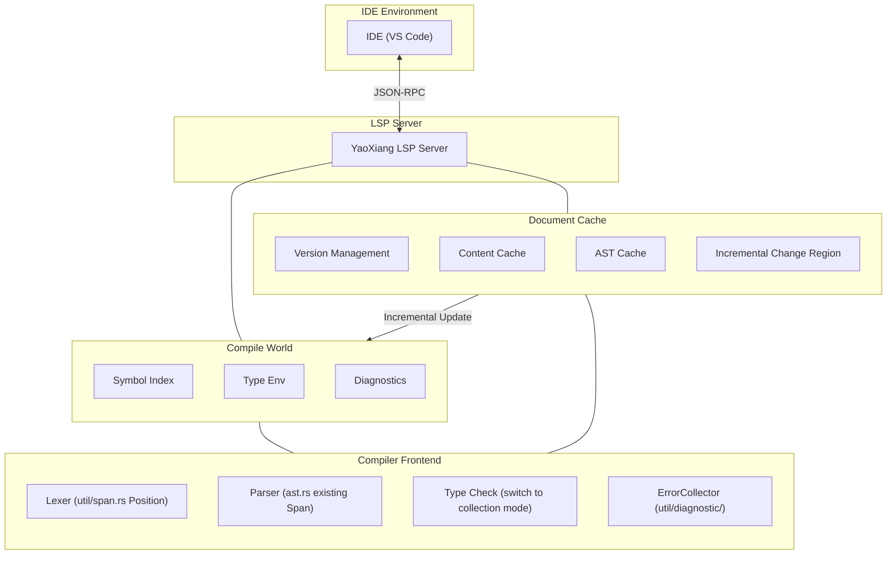

# RFC-017: Language Server Protocol (LSP) Support Design

>

>

>

> **Reference**: See the [complete example](EXAMPLE_full_feature_proposal.md) for guidance on how to write an RFC.

## ⚠️ Implementation Prerequisites (Important)

Before implementing LSP, the following two core issues must be resolved:

### Issue 1: Diagnostic Error Collection

**Current State**: The current type checker returns immediately upon encountering the first error (using the `?` operator), unable to collect all errors.

**LSP Requirement**: The IDE needs to display **all** errors, not just the first one.

**Solution**:

#### 1.1 Error Collection Mode
- Modify the `src/frontend/typecheck/inference/` module to return `Result<Type, Vec<Error>>`
- Instead of returning immediately on error, continue checking
- After checking completes, return all errors uniformly

#### 1.2 Error Severity
Distinguish errors by severity:

```rust
enum ErrorKind {
    Error,      // Serious error, may cause cascading errors
    Warning,    // Warning, continue checking but do not block
    Note,       // Additional information
}
```

- If there are `Error`s: `publishDiagnostics` displays the errors
- If only `Warning`s: continue compilation, display warnings

#### 1.3 Parser Error Recovery
- When parsing fails, insert **placeholder nodes** (e.g., `MissingExpression`) instead of giving up
- Avoid panics in the type checker due to incomplete AST
- Example: `let x = ;` → `let x = MissingExpression`

#### 1.4 Delayed Emission
- Some errors may be "cascading" (caused by previous errors)
- These can be collected first and filtered out after the AST is fully parsed
- Or handled simply: report all, let the user fix them one by one

### Issue 2: File-Level Parsing Cache

**Current State**: Each LSP request re-parses the entire file, with no caching mechanism.

**LSP Requirement**: Every edit should be responded to quickly, without re-parsing unchanged files.

**Solution**:

#### 2.1 Document Cache Structure
```rust
struct DocumentCache {
    version: u32,           // LSP document version number
    content: String,        // Current content
    content_hash: u64,      // Content hash (for quick comparison)
    ast: Option<Ast>,       // Cached AST (optional)
}
```

#### 2.2 Detecting Changes
- Receive new content on every `textDocument/didChange`
- Compute the hash of the new content and compare with the cached `content_hash`
- **If changed: re-parse the entire file**
- **If unchanged: return the cached result directly**

#### 2.3 Re-parse Strategy
- **File-level**: only re-parse the current file, not the entire project
- This is a simplified design—no function-level incremental parsing
- Modern computers only take a few milliseconds to parse a single file of a few thousand lines

#### 2.4 Difference from `cargo check`
| | cargo check | YaoXiang LSP |
|---|---|---|
| Scope | Entire project | Single file |
| Frequency | Manually triggered | Every edit |
| Goal | Full compilation check | Fast incremental response |

### Integration with Existing Modules

| Existing Module | LSP Integration |
|----------|-------------|
| `util/span.rs` | ✅ Already has `Position`/`Span`, maps directly to LSP `Position` |
| `util/diagnostic/collect.rs` | ⚠️ Needs to be modified to "collection mode" with continuous error accumulation |
| `frontend/core/lexer/symbols.rs` | ⚠️ Needs extension to add `uri` + `span` location information |
| `frontend/typecheck/mod.rs` | ⚠️ Needs `TypeResult` modified to return all errors |
| `frontend/core/parser/ast.rs` | ✅ Every node already has `Span`, no changes needed |

---

## Summary

Add Language Server Protocol (LSP) support to YaoXiang, implementing a complete language server so that mainstream IDEs (VS Code, Neovim, Emacs, etc.) can provide development tooling features such as code completion, go-to-definition, diagnostics, and reference search.

## Motivation

### Why is this feature needed?

Currently, the YaoXiang language lacks official IDE integration support. Developers can only use basic text editors to write code, lacking:

1. **Code Completion** - No smart completion of identifiers, keywords, or types based on context
2. **Go to Definition** - No quick navigation to the definition of functions, types, or variables
3. **Real-time Diagnostics** - No immediate display of syntax and type errors during editing
4. **Reference Search** - No way to find all references of a symbol
5. **Hover Information** - No type information or documentation comments on hover

LSP is standard equipment for modern programming languages—mainstream languages (Rust, Python, TypeScript, Go, etc.) all provide mature LSP implementations. Implementing LSP support will significantly improve the development experience of YaoXiang.

### Current Problems

1. **Low Development Efficiency** - Lack of code completion and smart hints
2. **Difficult Debugging** - Cannot quickly locate symbol definitions
3. **Steep Learning Curve** - Lacks IDE assistance features
4. **Incomplete Ecosystem** - Cannot attract developers accustomed to modern IDEs

## Proposal

### Core Design

Implement an independent LSP server process that communicates with the IDE via JSON-RPC:



### LSP Server Architecture

```
src/lsp/
├── main.rs              # LSP server entry point
├── server.rs           # Server core logic
├── session.rs          # Session management
├── capabilities.rs     # Server capability declarations
├── handlers/
│   ├── mod.rs
│   ├── initialize.rs   # Initialization handling
│   ├── text_document.rs # Document operation handling
│   ├── completion.rs   # Completion handling
│   ├── definition.rs   # Go-to-definition handling
│   ├── references.rs   # Reference search handling
│   ├── hover.rs        # Hover information handling
│   └── diagnostics.rs  # Diagnostic handling
├── world.rs            # Compile world (symbol table, AST cache)
├── scroller.rs         # Symbol index construction
├── protocol.rs         # LSP protocol type definitions
└── cache/              # Incremental cache module (new)
    ├── mod.rs
    ├── document.rs     # Document cache (version, AST, symbol table)
    └── incremental.rs  # Incremental parsing strategy
```

### Compile World (World) Design

Manage global compilation state:
- Document cache (version, AST, symbol table)
- Global symbol index
- Error collector
- Type environment cache

Core methods:
- `on_document_change`: handle incremental changes
- `incremental_reparse`: incremental re-parse
- `collect_diagnostics`: collect all errors (non-blocking)

### Core LSP Method Support

| Category | Method | Description |
|------|------|------|
| **Lifecycle** | `initialize` / `initialized` / `shutdown` / `exit` | Server lifecycle |
| **Document Sync** | `didOpen` / `didChange` / `didClose` | Document management |
| **Diagnostics** | `publishDiagnostics` | Publish diagnostics |
| **Completion** | `completion` | Code completion |
| **Navigation** | `definition` | Go to definition |
| **References** | `references` | Find references |
| **Hover** | `hover` | Hover information |
| **Symbols** | `workspace/symbol` | Workspace symbol search |

### Text Document Sync Mechanism

Use an incremental sync strategy:
- Track document version numbers
- Apply incremental changes (range + text)
- Fall back to full replacement for large changes

### Symbol Index Construction

Use the existing symbol table system to build a reverse index:
- Extend `SymbolEntry` with a `location` field
- Indices: name → location list, file → symbol list

### Code Completion Implementation

Completion sources: keywords, variables, functions, types, struct fields, modules

### Go to Definition Implementation

AST-based symbol resolution: find the definition location corresponding to an identifier/function call

## Detailed Design

### Type System Impact

1. **Symbol Information Extension** - Add location information (file, line, column) to the symbol table
2. **Type Information Exposure** - Provide type query interfaces for the LSP
3. **Documentation Comment Integration** - Support generating doc strings from comments

### Runtime Behavior

- The LSP server runs as an independent process
- Uses stdin/stdout for JSON-RPC communication
- Supports concurrent multi-session processing

### Compiler Changes

| Component | Changes |
|------|------|
| `frontend/events` | Extend the event system to support LSP notifications |
| `frontend/core/lexer/symbols` | Enhance the symbol table with location information |
| New `src/lsp/` | LSP server implementation |

### Backward Compatibility

- ✅ Fully backward compatible
- The LSP server is an independent component that does not affect the existing compilation flow
- Existing CLI tools are not affected

### Integration with Existing Systems

1. **Event System** - Leverage the event subscription mechanism in `frontend/events/`
2. **Diagnostic System** - Reuse the diagnostic output from `util/diagnostic/`
   - Reuse `ErrorCollector<E>` to collect all errors
   - Convert `Diagnostic` to LSP `Diagnostic` format
3. **Symbol Table** - Extend the symbol location capabilities of `symbols.rs`
   - Extend `SymbolEntry` with a `location: Location` field
   - Build a `SymbolIndex` reverse index (name → location list)
4. **Compiler Frontend** - Directly call Lexer, Parser, and type checker
   - **Key change**: the type checker must switch to "collection mode" and not block execution

#### Diagnostic Format Conversion

```rust
/// Convert YaoXiang Diagnostic to LSP Diagnostic
fn to_lsp_diagnostic(diag: &Diagnostic) -> lsp_types::Diagnostic {
    let severity = match diag.severity() {
        Severity::Error => lsp_types::DiagnosticSeverity::ERROR,
        Severity::Warning => lsp_types::DiagnosticSeverity::WARNING,
        Severity::Info => lsp_types::DiagnosticSeverity::INFORMATION,
    };

    lsp_types::Diagnostic {
        range: to_lsp_range(diag.span()),
        severity: Some(severity),
        message: diag.message().to_string(),
        code: diag.code().map(|c| lsp_types::NumberOrString::String(c.as_string())),
        ..Default::default()
    }
}

/// Convert YaoXiang Span to LSP Range
fn to_lsp_range(span: &Span) -> lsp_types::Range {
    lsp_types::Range {
        start: lsp_types::Position {
            line: span.start.line.saturating_sub(1), // LSP uses 0-indexed
            character: span.start.column.saturating_sub(1),
        },
        end: lsp_types::Position {
            line: span.end.line.saturating_sub(1),
            character: span.end.column.saturating_sub(1),
        },
    }
}
```

## YaoXiang-Specific Advanced Features

Leverage YaoXiang's powerful compile-time evaluation and ownership system to provide a unique development experience unavailable in other languages:

### 1. Inlay Hints

- **Constant Value Hints**: Display constants computed at compile-time (e.g., next to `const MAX = 100 + 200` show `300`)
- **Mutability Hints**: Show whether a variable is mutable (e.g., `mut x`, or `x` with an obvious underline)
- **Ownership Consumption Hints**: Show whether a function parameter is consumed (e.g., `consumed` / `borrowed`)
- **Void Ownership Semantics Hints**: Hint that a variable can be reassigned after being moved by dimming its color.
- **Type Inference Hints**: Display the inferred concrete type (e.g., next to `x = vec![]` show `Vec<i32>`)

### 2. Ownership Semantics Visualization

- Display the move path of a variable (from the definition location to all usage locations)
- Borrow lifetime visualization

### 3. Compile-Time Evaluation Preview

- Hover to display the compile-time computation result of constant expressions

### Implementation Priority

| Feature | Priority |
|------|--------|
| Constant value inlay hints | P0 |
| Mutability hints | P0 |
| Ownership consumption hints | P1 |
| Ownership visualization | P2 |

---

## Communication and Remote Support

### Communication Modes

Three modes are supported:

| Mode | Use |
|------|------|
| stdio | Local development (default) |
| TCP Socket | Remote development/debugging |
| Unix Domain Socket | High-performance local communication |

### Remote Debugging

Implemented based on DAP (Debug Adapter Protocol):
- Supports line breakpoints, function breakpoints, conditional breakpoints
- YaoXiang-specific breakpoints: trigger when a variable is moved

### Startup Parameters

```bash
# Local mode
yaoxiang-lsp

# TCP server
yaoxiang-lsp --tcp --port 8765

# Also enable debugging
yaoxiang-lsp --tcp --port 8765 --enable-debug
```

---

## Concurrency Model

**Design Decision: Single-threaded + asynchronous event loop**

Rationale:
- The compiler is not thread-safe; the refactoring cost is high
- LSP requests are inherently serial and do not require concurrency
- A single thread is simpler and easier to debug
- async I/O on a single thread provides sufficient performance

Background tasks use `spawn_blocking` to take advantage of multiple cores.

---

## LSP Built-in Test Tool (Optional)

> This feature is not required for MVP and can be added in a later version.

Provides a JSON test case format:

```bash
# Run tests
yaoxiang-lsp --test
```

---

## Trade-offs

### Pros

1. **Improved Development Experience** - IDE support on par with mainstream languages
2. **Ecosystem Improvement** - Attract more developers to use YaoXiang
3. **Better Code Quality** - Real-time diagnostics reduce runtime errors
4. **Community Contribution** - Developers can participate in LSP toolchain development

### Cons

1. **High Implementation Complexity** - Need to handle many LSP edge cases
2. **Maintenance Cost** - Need to follow LSP protocol version updates
3. **Performance Considerations** - Indexing and query performance for large projects
4. **Testing Difficulty** - Need to simulate IDE behavior for testing

## Alternatives

| Alternative | Why Not Chosen |
|------|--------------|
| Syntax highlighting only | Cannot meet modern development needs |
| Using Tree-sitter | Additional learning cost, and limited functionality |

## Implementation Strategy

### Phase Division

1. **Phase 0 (Prerequisites)**: Compiler Adaptation ⚠️ **Critical**
   - Modify the type checker to "collection mode", returning `Result<Type, Vec<Error>>`
   - Implement error severity levels (Error / Warning / Note)
   - Parser error recovery: insert placeholder nodes
   - Extend symbol table `SymbolEntry` with a `location` field
   - Implement the `DocumentCache` system (version + content + hash)
   - **This phase is a prerequisite for LSP implementation and must be completed first**

2. **Phase 1 (v0.7)**: Basic Framework
   - LSP server skeleton
   - Lifecycle methods (initialize/shutdown/exit)
   - Basic logging and error handling

3. **Phase 2 (v0.7)**: Diagnostics Support
   - Text document sync
   - Compilation diagnostic integration
   - `textDocument/publishDiagnostics`

4. **Phase 3 (v0.8)**: Completion Support
   - Symbol index construction
   - Keyword completion
   - Identifier completion

5. **Phase 4 (v0.8)**: Navigation Support
   - Go to definition
   - Find references
   - Hover information

6. **Phase 5 (v0.9)**: Advanced Features
   - Workspace symbol search
   - Code formatting
   - Refactoring support (optional)

### Dependencies

- No external LSP library dependencies (use the `lsp-types` crate)
- Depends on existing compiler frontend modules
- Depends on `serde_json` for JSON-RPC serialization

### Risks

1. **Performance Issues** - Parsing large files may cause stuttering
   - Solution: incremental parsing, background thread processing
2. **Memory Usage** - Symbol index consumes memory
   - Solution: lazy loading, LRU cache
3. **Protocol Compatibility** - LSP version differences
   - Solution: declare the supported protocol version

## Open Questions

- [x] Error collection mechanism (see "Implementation Prerequisites" section)
- [x] Incremental cache system (see "Implementation Prerequisites" section)
- [x] LSP protocol version: use 3.18 (supports new features like Inlay Hints, Inline Values)
- [x] Remote communication support (via TCP, serving both LSP and debugging)
- [x] Remote debugging support (based on the DAP protocol)
- [x] Concurrency model: single-threaded + async event loop
- [x] LSP built-in test tool (optional): use JSON test cases

---

## Appendix (Optional)

### Appendix A: Design Discussion Record

> Used to record detailed discussions during the design decision process.

### Appendix B: Design Decision Record

| Decision | Decision | Date | Recorder |
|------|------|------|--------|
| LSP server architecture | Independent process, communicating via stdio | 2026-02-15 | 晨煦 (Chenxu) |
| Protocol version | Support LSP 3.18 (needs new features like Inlay Hints) | 2026-02-22 | 晨煦 (Chenxu) |
| Error collection mode | Return `Result<Type, Vec<Error>>`, support error severity and error recovery | 2026-02-22 | 晨煦 (Chenxu) |
| Cache strategy | File-level cache: version + content + hash, re-parse the entire file | 2026-02-22 | 晨煦 (Chenxu) |
| Communication modes | Support stdio + TCP + UnixSocket | 2026-02-22 | 晨煦 (Chenxu) |
| Remote debugging | Based on the DAP protocol, sharing the transport layer with LSP | 2026-02-22 | 晨煦 (Chenxu) |
| Concurrency model | Single-threaded + async event loop | 2026-02-22 | 晨煦 (Chenxu) |
| Test tool (optional) | JSON test cases + built-in test runner | 2026-02-22 | 晨煦 (Chenxu) |

### Appendix C: Glossary

| Term | Definition |
|------|------|
| LSP | Language Server Protocol |
| JSON-RCP | JSON-Remote Procedure Call |
| DAP | Debug Adapter Protocol |
| Symbol Index | Symbol-to-location mapping built at compile time |
| Compile World | Context containing all compilation information |
| Inlay Hints | Inline hint information displayed on a line |
| Ownership Trace | Visualization of variable ownership flow |

---

## References

- [Language Server Protocol Specification](https://microsoft.github.io/language-server-protocol/)
- [LSP Specification 3.18](https://github.com/microsoft/language-server-protocol/blob/main/specifications/specification-3-18.md)
- [Debug Adapter Protocol Specification](https://microsoft.github.io/debug-adapter-protocol/)
- [Rust Analyzer](https://rust-analyzer.github.io/) - Reference implementation
- [lsp-types crate](https://crates.io/crates/lsp-types) - LSP type definitions
- [JSON-RPC 2.0 Specification](https://www.jsonrpc.org/specification)

---

## Lifecycle and Disposition

RFCs have the following status transitions:

```
┌─────────────┐
│   Draft     │  ← Author creates
└──────┬──────┘
       │
       ▼
┌─────────────┐
│  Review     │  ← Community discussion
└──────┬──────┘
       │
       ├──────────────────┐
       ▼                  ▼
┌─────────────┐    ┌─────────────┐
│  Accepted   │    │  Rejected   │
└──────┬──────┘    └──────┬──────┘
       │                  │
       ▼                  ▼
┌─────────────┐    ┌─────────────┐
│   accepted/ │    │  rejected/  │
│ (Official)  │    │ (Rejected)  │
└─────────────┘    └─────────────┘
```

### Status Description

| Status | Location | Description |
|------|------|------|
| **Draft** | `docs/design/rfc/draft/` | Author's draft, awaiting review submission |
| **Review** | `docs/design/rfc/review/` | Open for community discussion and feedback |
| **Accepted** | `docs/design/accepted/` | Becomes an official design document, enters implementation phase |
| **Rejected** | `docs/design/rfc/` | Retained in the RFC directory, status updated |

### Actions After Acceptance

1. Move the RFC to the `docs/design/accepted/` directory
2. Update the filename to a descriptive name (e.g., `lsp-support.md`)
3. Update the status to "Official"
4. Update the status to "Accepted" and add the acceptance date

### Actions After Rejection

1. Retain in the `docs/design/rfc/draft/` directory
2. Add the reason for rejection and the date at the top of the file
3. Update the status to "Rejected"

### Actions After Discussion Resolves an Open Question

When consensus is reached on an open question:

1. **Update Appendix A**: Fill in the "Resolution" under the discussion topic
2. **Update the Body**: Sync the decision into the document body
3. **Record the Decision**: Add to "Appendix B: Design Decision Record"
4. **Mark the Question**: Check the corresponding `[x]` in the "Open Questions" list

---

> **Note**: The RFC number is only used during the discussion phase. Remove the number after acceptance and use a descriptive filename.