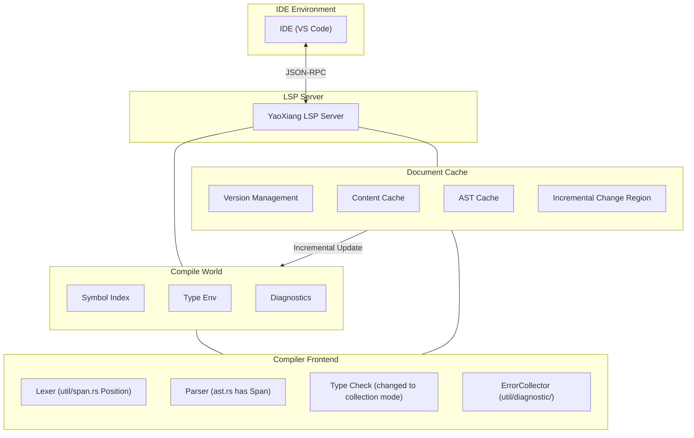

# RFC-017: Language Server Protocol (LSP) Support Design

> **Status**: Under Review
>
> **Author**: Chen Xu
>
> **Created**: 2026-02-15
>
> **Last Updated**: 2026-02-22

> **Reference**: See [full example](EXAMPLE_full_feature_proposal.md) for how to write an RFC.

## ⚠️ Implementation Prerequisites (Important)

Before implementing LSP, the following two core issues need to be resolved first:

### Issue 1: Diagnostic Error Collection

**Current State**: The current type checker returns immediately on the first error (using the `?` operator), unable to collect all errors.

**LSP Requirement**: IDEs need to display **all** errors, not just the first one.

**Solution**:

#### 1.1 Error Collection Pattern
- Modify the `src/frontend/typecheck/inference/` module to return `Result<Type, Vec<Error>>`
- Instead of returning immediately on error, continue checking
- Return all errors after checking is complete

#### 1.2 Error Severity Levels
Distinguish errors of different severity:

```rust
enum ErrorKind {
    Error,      // Severe error, may cause cascade errors
    Warning,    // Warning, continue checking but don't block
    Note,       // Additional information
}
```

- If there is an `Error`: `publishDiagnostics` shows the error
- If only `Warning`: Continue compiling, show warnings

#### 1.3 Parser Error Recovery
- On parse errors, insert **placeholder nodes** (such as `MissingExpression`) instead of giving up
- Avoid type checking panics due to incomplete AST
- Example: `let x = ;` → `let x = MissingExpression`

#### 1.4 Delayed Emission
- Some errors may be "cascading" (caused by previous errors)
- Can collect first, then filter out obvious cascade errors after parsing the AST
- Or simple approach: report all of them, let the user fix them one by one

### Issue 2: File-Level Parse Cache

**Current State**: Each LSP request re-parses the entire file, with no caching mechanism.

**LSP Requirement**: Each edit should respond quickly, without re-parsing unchanged files.

**Solution**:

#### 2.1 File Cache Structure
```rust
struct DocumentCache {
    version: u32,           // LSP document version number
    content: String,        // Current content
    content_hash: u64,      // Content hash (fast comparison)
    ast: Option<Ast>,       // Cached AST (optional)
}
```

#### 2.2 Change Detection
- On each `textDocument/didChange` receiving new content
- Compute hash of new content, compare with cached `content_hash`
- **If changed: Re-parse the entire file**
- **If unchanged: Return cached result directly**

#### 2.3 Re-parse Strategy
- **File-level**: Only re-parse the current file, not the entire project
- This is simplified design, no function-level incremental parsing
- Modern computers can parse a single thousand-line file in milliseconds

#### 2.4 Difference from cargo check
| | cargo check | YaoXiang LSP |
|---|---|---|
| Scope | Entire project | Single file |
| Frequency | Manually triggered | On every edit |
| Goal | Complete compilation check | Fast incremental response |

### Integration with Existing Modules

| Existing Module | LSP Integration Method |
|----------|-------------|
| `util/span.rs` | ✅ Already has `Position`/`Span`, directly map to LSP `Position` |
| `util/diagnostic/collect.rs` | ⚠️ Needs modification to "collection mode", continuously accumulating errors |
| `frontend/core/lexer/symbols.rs` | ⚠️ Needs extension, add `uri` + `span` location information |
| `frontend/typecheck/mod.rs` | ⚠️ Needs modification to `TypeResult`, return all errors |
| `frontend/core/parser/ast.rs` | ✅ Each node already has `Span`, no changes needed |

---

## Summary

Add Language Server Protocol (LSP) support to YaoXiang, implementing a complete language server that enables mainstream IDEs (VS Code, Neovim, Emacs, etc.) to provide development tooling features such as code completion, go-to-definition, diagnostics, and reference search.

## Motivation

### Why is this feature needed?

Currently, YaoXiang lacks official IDE integration support, and developers can only write code with basic text editors, lacking:

1. **Code Completion** - Unable to intelligently complete identifiers, keywords, and types based on context
2. **Go to Definition** - Unable to quickly jump to definition locations of functions, types, and variables
3. **Real-time Diagnostics** - Unable to immediately display syntax errors and type errors during editing
4. **Reference Search** - Unable to find all reference locations of symbols
5. **Hover Tooltips** - Unable to display type information and documentation comments on mouse hover

LSP is a standard feature for modern programming languages, with mainstream languages (Rust, Python, TypeScript, Go, etc.) providing mature LSP implementations. Implementing LSP support will significantly improve the YaoXiang development experience.

### Current Problems

1. **Low Development Efficiency** - Lack of code completion and intelligent hints
2. **Difficult Debugging** - Unable to quickly locate symbol definitions
3. **Steep Learning Curve** - Lack of IDE-assisted features
4. **Incomplete Ecosystem** - Unable to attract developers accustomed to modern IDEs

## Proposal

### Core Design

Implement an independent LSP server process that communicates with the IDE via JSON-RPC:



### LSP Server Architecture

```
src/lsp/
├── main.rs              # LSP server entry point
├── server.rs           # Server core logic
├── session.rs          # Session management
├── capabilities.rs     # Server capability declaration
├── handlers/
│   ├── mod.rs
│   ├── initialize.rs   # Initialize handling
│   ├── text_document.rs # Document operation handling
│   ├── completion.rs   # Completion handling
│   ├── definition.rs   # Go-to-definition handling
│   ├── references.rs   # Reference search handling
│   ├── hover.rs        # Hover tooltip handling
│   └── diagnostics.rs  # Diagnostics handling
├── world.rs            # Compile world (symbol table, AST cache)
├── scroller.rs         # Symbol index construction
├── protocol.rs         # LSP protocol type definitions
└── cache/              # Incremental cache module (new)
    ├── mod.rs
    ├── document.rs     # Document cache (version, AST, symbol table)
    └── incremental.rs  # Incremental parse strategy
```

### Compile World (World) Design

Manages global compilation state:
- Document cache (version, AST, symbol table)
- Global symbol index
- Error collector
- Type environment cache

Core methods:
- `on_document_change`: Handle incremental changes
- `incremental_reparse`: Incremental re-parsing
- `collect_diagnostics`: Collect all errors (non-blocking)

### Core LSP Method Support

| Category | Method | Description |
|------|------|------|
| **Lifecycle** | `initialize` / `initialized` / `shutdown` / `exit` | Server lifecycle |
| **Document Sync** | `didOpen` / `didChange` / `didClose` | Document management |
| **Diagnostics** | `publishDiagnostics` | Publish diagnostics |
| **Completion** | `completion` | Code completion |
| **Go-to** | `definition` | Go to definition |
| **References** | `references` | Find references |
| **Hover** | `hover` | Hover tooltip |
| **Symbols** | `workspace/symbol` | Workspace symbol search |

### Text Document Synchronization Mechanism

Uses incremental synchronization strategy:
- Keep document version number
- Apply incremental changes (range + text)
- Degrade to full replacement on large changes

### Symbol Index Construction

Uses the existing symbol table system to build a reverse index:
- Need to extend `SymbolEntry`, add `location` field
- Index: name → position list, file → symbol list

### Code Completion Implementation

Completion sources: keywords, variables, functions, types, struct fields, modules

### Go-to Definition Implementation

AST-based symbol resolution: find the definition location corresponding to an identifier/function call

## Detailed Design

### Type System Impact

1. **Symbol Information Extension** - Add location information (file, line number, column number) to symbol table
2. **Type Information Exposure** - Provide type query interface for LSP
3. **Documentation Comment Integration** - Support generating documentation strings from comments

### Runtime Behavior

- LSP server runs as an independent process
- Uses stdin/stdout for JSON-RPC communication
- Supports multi-session concurrent processing

### Compiler Changes

| Component | Change |
|------|------|
| `frontend/events` | Extend event system, support LSP notifications |
| `frontend/core/lexer/symbols` | Enhance symbol table, add location information |
| New `src/lsp/` | LSP server implementation |

### Backward Compatibility

- ✅ Fully backward compatible
- LSP server is an independent component, does not affect existing compilation flow
- Existing CLI tools are unaffected

### Integration with Existing Systems

1. **Event System** - Leverage event subscription mechanism of `frontend/events/`
2. **Diagnostics System** - Reuse diagnostic output from `util/diagnostic/`
   - Reuse `ErrorCollector<E>` to collect all errors
   - Convert `Diagnostic` to LSP's `Diagnostic` format
3. **Symbol Table** - Extend symbol positioning capability of `symbols.rs`
   - Extend `SymbolEntry`, add `location: Location` field
   - Build `SymbolIndex` reverse index (name -> position list)
4. **Compiler Frontend** - Directly call Lexer, Parser, type check
   - **Key change**: Type checker needs to be changed to "collection mode", non-blocking execution

#### Diagnostic Format Conversion

```rust
/// Convert YaoXiang Diagnostic to LSP Diagnostic
fn to_lsp_diagnostic(diag: &Diagnostic) -> lsp_types::Diagnostic {
    let severity = match diag.severity() {
        Severity::Error => lsp_types::DiagnosticSeverity::ERROR,
        Severity::Warning => lsp_types::DiagnosticSeverity::WARNING,
        Severity::Info => lsp_types::DiagnosticSeverity::INFORMATION,
    };

    lsp_types::Diagnostic {
        range: to_lsp_range(diag.span()),
        severity: Some(severity),
        message: diag.message().to_string(),
        code: diag.code().map(|c| lsp_types::NumberOrString::String(c.as_string())),
        ..Default::default()
    }
}

/// Convert YaoXiang Span to LSP Range
fn to_lsp_range(span: &Span) -> lsp_types::Range {
    lsp_types::Range {
        start: lsp_types::Position {
            line: span.start.line.saturating_sub(1), // LSP uses 0-indexed
            character: span.start.column.saturating_sub(1),
        },
        end: lsp_types::Position {
            line: span.end.line.saturating_sub(1),
            character: span.end.column.saturating_sub(1),
        },
    }
}
```

## YaoXiang-Specific Advanced Features

Utilize YaoXiang's powerful compile-time evaluation and ownership system to provide a unique development experience that other languages cannot implement:

### 1. Inlay Hints

- **Constant Value Hints**: Display compile-time computed constants (e.g., show `300` next to `const MAX = 100 + 200`)
- **Mutability Hints**: Display whether a variable is mutable (e.g., `mut x`, `x` has visible underline)
- **Ownership Consumption Hints**: Display whether function parameters are consumed (e.g., `consumed` / `borrowed`)
- **Empty Ownership Semantic Hints**: Display hints by fading variable colors to show variables can be reassigned after move.
- **Type Inference Hints**: Display inferred concrete types (e.g., show `Vec<i32>` next to `x = vec![]`)

### 2. Ownership Semantics Visualization

- Display move path of variables (from definition location to all usage locations)
- Borrow lifetime visualization

### 3. Compile-time Evaluation Preview

- Hover to display compile-time calculation results of constant expressions

### Implementation Priority

| Feature | Priority |
|------|--------|
| Constant value inlay hints | P0 |
| Mutability hints | P0 |
| Ownership consumption hints | P1 |
| Ownership visualization | P2 |

---

## Communication and Remote Support

### Communication Modes

Support three modes:

| Mode | Use Case |
|------|------|
| stdio | Local development (default) |
| TCP Socket | Remote development/debugging |
| Unix Domain Socket | High-performance local communication |

### Remote Debugging

Based on DAP (Debug Adapter Protocol) implementation:
- Support line breakpoints, function breakpoints, conditional breakpoints
- YaoXiang-specific breakpoint: trigger when variable is moved

### Startup Arguments

```bash
# Local mode
yaoxiang-lsp

# TCP server
yaoxiang-lsp --tcp --port 8765

# Enable debugging simultaneously
yaoxiang-lsp --tcp --port 8765 --enable-debug
```

---

## Concurrency Model

**Design Decision: Single-threaded + Async Event Loop**

Rationale:
- Compiler is not thread-safe, high refactoring cost
- LSP requests are naturally serial, no concurrency needed
- Single-threaded is simpler and easier to debug
- Async I/O single-threaded performance is sufficient

Background tasks use `spawn_blocking` to utilize multi-core.

---

## LSP Built-in Testing Tools (Optional)

> This feature is not required for MVP and can be added in a later version.

Provides JSON test case format:

```bash
# Run tests
yaoxiang-lsp --test
```

---

## Trade-offs

### Advantages

1. **Improved Development Experience** - Near-mainstream language IDE support
2. **Ecosystem Improvement** - Attract more developers to use YaoXiang
3. **Code Quality Improvement** - Real-time diagnostics reduce runtime errors
4. **Community Contribution** - Developers can participate in LSP toolchain development

### Disadvantages

1. **High Implementation Complexity** - Need to handle many LSP edge cases
2. **Maintenance Cost** - Need to follow LSP protocol version updates
3. **Performance Considerations** - Index and query performance for large projects
4. **Testing Difficulty** - Need to simulate IDE behavior for testing

## Alternative Solutions

| Solution | Why Not Chosen |
|------|--------------|
| Syntax highlighting only | Unable to meet modern development needs |
| Using Tree-sitter | Requires additional learning cost, limited functionality |

## Implementation Strategy

### Phase Division

1. **Phase 0 (Prerequisite)**: Compiler Adaptation ⚠️ **Critical**
   - Modify type checker to "collection mode", return `Result<Type, Vec<Error>>`
   - Implement error levels (Error / Warning / Note)
   - Parser error recovery: insert placeholder nodes
   - Extend symbol table `SymbolEntry`, add `location` field
   - Implement DocumentCache cache system (version + content + hash)
   - **This phase is the prerequisite for LSP implementation and must be completed first**

2. **Phase 1 (v0.7)**: Basic Framework
   - LSP server skeleton
   - Lifecycle methods (initialize/shutdown/exit)
   - Basic logging and error handling

3. **Phase 2 (v0.7)**: Diagnostics Support
   - Text document synchronization
   - Compilation diagnostics integration
   - `textDocument/publishDiagnostics`

4. **Phase 3 (v0.8)**: Completion Support
   - Symbol index construction
   - Keyword completion
   - Identifier completion

5. **Phase 4 (v0.8)**: Go-to Support
   - Go to definition
   - Find references
   - Hover tooltip

6. **Phase 5 (v0.9)**: Advanced Features
   - Workspace symbol search
   - Code formatting
   - Refactoring support (optional)

### Dependencies

- No external LSP library dependencies (use `lsp-types` crate)
- Depend on existing compiler frontend modules
- Depend on `serde_json` for JSON-RPC serialization

### Risks

1. **Performance Issues** - Large file parsing may cause stuttering
   - Solution: Incremental parsing, background thread processing
2. **Memory Usage** - Symbol index occupies memory
   - Solution: Lazy loading, LRU cache
3. **Protocol Compatibility** - LSP version differences
   - Solution: Declare supported protocol version

## Open Issues

- [x] Error collection mechanism (see "Implementation Prerequisites" section)
- [x] Incremental cache system (see "Implementation Prerequisites" section)
- [x] LSP protocol version: Use 3.18 (supports new features like Inlay Hints, Inline Values)
- [x] Remote communication support (via TCP, covering both LSP + debugging)
- [x] Remote debugging support (based on DAP protocol)
- [x] Concurrency model: Single-threaded + async event loop
- [x] LSP built-in testing tools (optional): Use JSON test cases

---

## Appendices (Optional)

### Appendix A: Design Discussion Records

> Used to record detailed discussions during the design decision process.

### Appendix B: Design Decision Records

| Decision | Decision | Date | Recorder |
|------|------|------|--------|
| LSP server architecture | Independent process, communication via stdio | 2026-02-15 | Chen Xu |
| Protocol version | Support LSP 3.18 (requires Inlay Hints and other new features) | 2026-02-22 | Chen Xu |
| Error collection mode | Return `Result<Type, Vec<Error>>`, support error levels and error recovery | 2026-02-22 | Chen Xu |
| Cache strategy | File-level cache: version + content + hash, re-parse entire file | 2026-02-22 | Chen Xu |
| Communication mode | Support stdio + TCP + UnixSocket | 2026-02-22 | Chen Xu |
| Remote debugging | Based on DAP protocol, sharing transport layer with LSP | 2026-02-22 | Chen Xu |
| Concurrency model | Single-threaded + async event loop | 2026-02-22 | Chen Xu |
| Testing tools (optional)| JSON test cases + built-in test runner | 2026-02-22 | Chen Xu |

### Appendix C: Glossary

| Term | Definition |
|------|------|
| LSP | Language Server Protocol |
| JSON-RCP | JSON-Remote Procedure Call |
| DAP | Debug Adapter Protocol |
| Symbol Index | Symbol location mapping table built at compile time |
| Compile World | Context containing all compilation information |
| Inlay Hints | Hints displayed inline |
| Ownership Trace | Visualization of variable ownership flow |

---

## References

- [Language Server Protocol Specification](https://microsoft.github.io/language-server-protocol/)
- [LSP Specification 3.18](https://github.com/microsoft/language-server-protocol/blob/main/specifications/specification-3-18.md)
- [Debug Adapter Protocol Specification](https://microsoft.github.io/debug-adapter-protocol/)
- [Rust Analyzer](https://rust-analyzer.github.io/) - Reference implementation
- [lsp-types crate](https://crates.io/crates/lsp-types) - LSP type definitions
- [JSON-RPC 2.0 Specification](https://www.jsonrpc.org/specification)

---

## Lifecycle and Disposition

RFC has the following status transitions:

```
┌─────────────┐
│   Draft     │  ← Author creates
└──────┬──────┘
       │
       ▼
┌─────────────┐
│  Under Review│  ← Community discussion
└──────┬──────┘
       │
       ├──────────────────┐
       ▼                  ▼
┌─────────────┐    ┌─────────────┐
│  Accepted   │    │   Rejected   │
└──────┬──────┘    └──────┬──────┘
       │                  │
       ▼                  ▼
┌─────────────┐    ┌─────────────┐
│   accepted/ │    │  rejected/  │
│ (official)  │     │ (rejected) │
└─────────────┘    └─────────────┘
```

### Status Descriptions

| Status | Location | Description |
|------|------|------|
| **Draft** | `docs/design/rfc/draft/` | Author draft, awaiting submission for review |
| **Under Review** | `docs/design/rfc/review/` | Open for community discussion and feedback |
| **Accepted** | `docs/design/accepted/` | Becomes official design document, enters implementation phase |
| **Rejected** | `docs/design/rfc/` | Retained in RFC directory, status updated |

### Post-Acceptance Actions

1. Move RFC to `docs/design/accepted/` directory
2. Update filename to descriptive name (such as `lsp-support.md`)
3. Update status to "official"
4. Update status to "accepted", add acceptance date

### Post-Rejection Actions

1. Retain in `docs/design/rfc/draft/` directory
2. Add rejection reason and date at top of file
3. Update status to "rejected"

### Actions After Discussion Resolution

When a consensus is reached on an open issue:

1. **Update Appendix A**: Fill in "Resolution" under the discussion topic
2. **Update Main Text**: Sync decision to the document body
3. **Record Decision**: Add to "Appendix B: Design Decision Records"
4. **Mark Issue**: Check off in the "Open Issues" list `[x]`

---

> **Note**: RFC numbers are only used during the discussion phase. After acceptance, remove the number and use a descriptive filename.