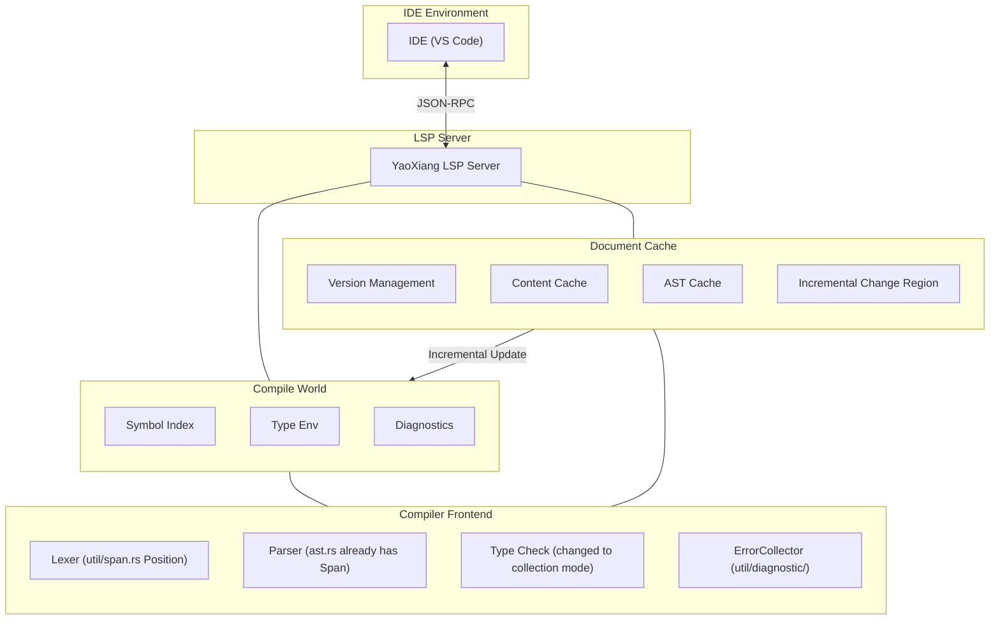

# RFC-017: Language Server Protocol (LSP) Support Design

>

>

>

> **Reference**: See [Full Example](EXAMPLE_full_feature_proposal.md) to learn how to write an RFC.

## ⚠️ Implementation Prerequisites (Important)

Before implementing LSP, the following two core issues need to be resolved first:

### Issue 1: Diagnostic Error Collection

**Current State**: The type checker currently returns immediately on the first error (using the `?`
operator), unable to collect all errors.

**LSP Requirement**: IDEs need to display **all** errors, not just the first one.

**Solution**:

#### 1.1 Error Collection Pattern

- Modify the `src/frontend/typecheck/inference/` module to return `Result<Type, Vec<Error>>`
- Instead of returning immediately on error, continue checking
- After checking completes, return all errors together

#### 1.2 Error Severity Levels

Distinguish errors of different severity levels:

```rust
enum ErrorKind {
    Error,      // Severe error that may cause cascading errors
    Warning,    // Warning, continue checking but don't block
    Note,       // Additional information
}
```

- If there are `Error`s: `publishDiagnostics` shows errors
- If only `Warning`s: Continue compilation, show warnings

#### 1.3 Parser Error Recovery

- When parsing fails, insert **placeholder nodes** (such as `MissingExpression`) instead of giving
  up
- Avoid type checker panics due to incomplete AST
- Example: `let x = ;` → `let x = MissingExpression`

#### 1.4 Delayed Emission

- Some errors may be "cascading" (caused by previous errors)
- Can collect first, then filter out obvious cascading errors after AST parsing
- Or handle simply: report all of them, let users fix one by one

### Issue 2: File-Level Parsing Cache

**Current State**: Every LSP request re-parses the entire file, with no caching mechanism.

**LSP Requirement**: Every edit should respond quickly without re-parsing unchanged files.

**Solution**:

#### 2.1 File Cache Structure

```rust
struct DocumentCache {
    version: u32,           // LSP document version number
    content: String,        // Current content
    content_hash: u64,      // Content hash (fast comparison)
    ast: Option<Ast>,       // Cached AST (optional)
}
```

#### 2.2 Change Detection

- Every time `textDocument/didChange` receives new content
- Calculate hash of new content, compare with cached `content_hash`
- **If changed: Re-parse the entire file**
- **If unchanged: Return cached result directly**

#### 2.3 Re-parsing Strategy

- **File-level**: Only re-parse the current file, not the entire project
- This is simplified design, no function-level incremental parsing
- Modern computers can parse a single file with thousands of lines in a few milliseconds

#### 2.4 Difference from cargo check

|           | cargo check            | YaoXiang LSP              |
| --------- | ---------------------- | ------------------------- |
| Scope     | Entire project         | Single file               |
| Frequency | Manual trigger         | Every edit                |
| Goal      | Complete compile check | Fast incremental response |

### Integration with Existing Modules

| Existing Module                  | LSP Integration Method                                                     |
| -------------------------------- | -------------------------------------------------------------------------- |
| `util/span.rs`                   | ✅ Already has `Position`/`Span`, directly map to LSP `Position`           |
| `util/diagnostic/collect.rs`     | ⚠️ Needs modification to "collection mode", continuously accumulate errors |
| `frontend/core/lexer/symbols.rs` | ⚠️ Needs extension, add `uri` + `span` position information                |
| `frontend/typecheck/mod.rs`      | ⚠️ Needs modification `TypeResult`, return all errors                      |
| `frontend/core/parser/ast.rs`    | ✅ Each node already has `Span`, no changes needed                         |

---

## Summary

Add Language Server Protocol (LSP) support to YaoXiang, implementing a complete language server that
enables mainstream IDEs (VS Code, Neovim, Emacs, etc.) to provide development tooling features such
as code completion, go-to-definition, diagnostics, and find references.

## Motivation

### Why is this feature needed?

Currently, YaoXiang lacks official IDE integration support. Developers can only write code with
basic text editors, lacking:

1. **Code Completion** - Unable to intelligently complete identifiers, keywords, and types based on
   context
2. **Go to Definition** - Unable to quickly jump to definition locations of functions, types, and
   variables
3. **Real-time Diagnostics** - Unable to display syntax errors and type errors instantly while
   editing
4. **Find References** - Unable to find all reference locations of symbols
5. **Hover Information** - Unable to display type information and documentation comments on mouse
   hover

LSP is a standard feature for modern programming languages. Mainstream languages (Rust, Python,
TypeScript, Go, etc.) all provide mature LSP implementations. Implementing LSP support will
significantly improve the YaoXiang development experience.

### Current Problems

1. **Low development efficiency** - Lack of code completion and intelligent hints
2. **Difficult debugging** - Unable to quickly locate symbol definitions
3. **Steep learning curve** - Lack of IDE assistance features
4. **Incomplete ecosystem** - Unable to attract developers accustomed to modern IDEs

## Proposal

### Core Design

Implement an independent LSP server process that communicates with IDE via JSON-RPC:


```mermaid
flowchart TD
    subgraph IDE_Environment [IDE Environment]
        IDE["IDE (VS Code)"]
    end

    subgraph LSP_Server [LSP Server]
        LSP["YaoXiang LSP Server"]
    end

    subgraph World_Compile [Compile World]
        direction TB
        W_Symbol["Symbol Index"]
        W_Type["Type Env"]
        W_Diag["Diagnostics"]
    end

    subgraph Cache [Document Cache]
        direction TB
        C_Version["Version Management"]
        C_Content["Content Cache"]
        C_AST["AST Cache"]
        C_Delta["Incremental Change Region"]
    end

    subgraph Frontend [Compiler Frontend]
        direction TB
        F_Lexer["Lexer (util/span.rs Position)"]
        F_Parser["Parser (ast.rs already has Span)"]
        F_TypeCheck["Type Check (changed to collection mode)"]
        F_ErrorCollector["ErrorCollector (util/diagnostic/)"]
    end

    IDE <-->|JSON-RPC| LSP

    LSP --- World_Compile
    LSP --- Cache

    Cache -- "Incremental Update" --> World_Compile

    World_Compile --- Frontend
    Cache --- Frontend
```

### LSP Server Architecture

```
src/lsp/
├── main.rs              # LSP server entry point
├── server.rs           # Server core logic
├── session.rs          # Session management
├── capabilities.rs     # Server capability declaration
├── handlers/
│   ├── mod.rs
│   ├── initialize.rs   # Initialization handler
│   ├── text_document.rs # Document operation handler
│   ├── completion.rs   # Completion handler
│   ├── definition.rs   # Go-to-definition handler
│   ├── references.rs   # Find references handler
│   ├── hover.rs        # Hover info handler
│   └── diagnostics.rs  # Diagnostics handler
├── world.rs            # Compile world (symbol table, AST cache)
├── scroller.rs         # Symbol index construction
├── protocol.rs         # LSP protocol type definitions
└── cache/              # Incremental cache module (new)
    ├── mod.rs
    ├── document.rs     # Document cache (version, AST, symbol table)
    └── incremental.rs  # Incremental parsing strategy
```

### Compile World (World) Design

Manages global compile state:

- Document cache (version, AST, symbol table)
- Global symbol index
- Error collector
- Type environment cache

Core methods:

- `on_document_change`: Handle incremental changes
- `incremental_reparse`: Incremental re-parsing
- `collect_diagnostics`: Collect all errors (non-blocking)

### Core LSP Method Support

| Category        | Method                                             | Description             |
| --------------- | -------------------------------------------------- | ----------------------- |
| **Lifecycle**   | `initialize` / `initialized` / `shutdown` / `exit` | Server lifecycle        |
| **Doc Sync**    | `didOpen` / `didChange` / `didClose`               | Document management     |
| **Diagnostics** | `publishDiagnostics`                               | Publish diagnostics     |
| **Completion**  | `completion`                                       | Code completion         |
| **Go-to**       | `definition`                                       | Go to definition        |
| **References**  | `references`                                       | Find references         |
| **Hover**       | `hover`                                            | Hover info              |
| **Symbols**     | `workspace/symbol`                                 | Workspace symbol search |

### Text Document Synchronization

Uses incremental synchronization strategy:

- Preserve document version number
- Apply incremental changes (range + text)
- Degrade to full replacement on large changes

### Symbol Index Construction

Build reverse index using the existing symbol table system:

- Need to extend `SymbolEntry`, add `location` field
- Index: name → list of locations, file → list of symbols

### Code Completion Implementation

Completion sources: keywords, variables, functions, types, struct fields, modules

### Go-to Definition Implementation

AST-based symbol resolution: Find the definition location corresponding to an identifier/function
call

## Detailed Design

### Type System Impact

1. **Symbol Information Extension** - Add position information (file, line, column) to symbol table
2. **Type Information Exposure** - Provide type query interface for LSP
3. **Documentation Comment Integration** - Support generating documentation strings from comments

### Runtime Behavior

- LSP server runs as an independent process
- Uses stdin/stdout for JSON-RPC communication
- Supports multi-session concurrent processing

### Compiler Changes

| Component                     | Changes                                        |
| ----------------------------- | ---------------------------------------------- |
| `frontend/events`             | Extend event system, support LSP notifications |
| `frontend/core/lexer/symbols` | Enhance symbol table, add position information |
| New `src/lsp/`                | LSP server implementation                      |

### Backward Compatibility

- ✅ Fully backward compatible
- LSP server is an independent component, does not affect existing compilation flow
- Existing CLI tools are unaffected

### Integration with Existing Systems

1. **Event System** - Utilize the event subscription mechanism in `frontend/events/`
2. **Diagnostic System** - Reuse diagnostic output from `util/diagnostic/`
   - Reuse `ErrorCollector<E>` to collect all errors
   - Convert `Diagnostic` to LSP's `Diagnostic` format
3. **Symbol Table** - Extend symbol location capability in `symbols.rs`
   - Extend `SymbolEntry`, add `location: Location` field
   - Build `SymbolIndex` reverse index (name -> list of locations)
4. **Compiler Frontend** - Directly invoke Lexer, Parser, type checker
   - **Key Change**: Type checker needs to change to "collection mode", non-blocking execution

#### Diagnostic Format Conversion

```rust
/// Convert YaoXiang Diagnostic to LSP Diagnostic
fn to_lsp_diagnostic(diag: &Diagnostic) -> lsp_types::Diagnostic {
    let severity = match diag.severity() {
        Severity::Error => lsp_types::DiagnosticSeverity::ERROR,
        Severity::Warning => lsp_types::DiagnosticSeverity::WARNING,
        Severity::Info => lsp_types::DiagnosticSeverity::INFORMATION,
    };

    lsp_types::Diagnostic {
        range: to_lsp_range(diag.span()),
        severity: Some(severity),
        message: diag.message().to_string(),
        code: diag.code().map(|c| lsp_types::NumberOrString::String(c.as_string())),
        ..Default::default()
    }
}

/// Convert YaoXiang Span to LSP Range
fn to_lsp_range(span: &Span) -> lsp_types::Range {
    lsp_types::Range {
        start: lsp_types::Position {
            line: span.start.line.saturating_sub(1), // LSP uses 0-indexed
            character: span.start.column.saturating_sub(1),
        },
        end: lsp_types::Position {
            line: span.end.line.saturating_sub(1),
            character: span.end.column.saturating_sub(1),
        },
    }
}
```

## YaoXiang-Specific Advanced Features

Leverage YaoXiang's powerful compile-time evaluation and ownership system to provide a unique
development experience that other languages cannot achieve:

### 1. Inlay Hints

- **Constant Value Hints**: Show compile-time computed constants (e.g., show `300` next to
  `const MAX = 100 + 200`)
- **Mutability Hints**: Show whether variables are mutable (e.g., `mut x`, `x` has obvious
  underline)
- **Ownership Consumption Hints**: Show whether function parameters are consumed (e.g., `consumed` /
  `borrowed`)
- **Empty Ownership Semantic Hints**: Show hints by dimming variable color when variable can be
  reassigned after being moved
- **Type Inference Hints**: Show inferred specific types (e.g., show `Vec<i32>` next to
  `x = vec![]`)

### 2. Ownership Semantics Visualization

- Show variable move paths (from definition location to all usage locations)
- Borrow lifetime visualization

### 3. Compile-Time Evaluation Preview

- Hover to show compile-time computation results of constant expressions

### Implementation Priority

| Feature                     | Priority |
| --------------------------- | -------- |
| Constant Value Inlay Hints  | P0       |
| Mutability Hints            | P0       |
| Ownership Consumption Hints | P1       |
| Ownership Visualization     | P2       |

---

## Communication & Remote Support

### Communication Modes

Support three modes:

| Mode               | Usage                                |
| ------------------ | ------------------------------------ |
| stdio              | Local development (default)          |
| TCP Socket         | Remote development/debugging         |
| Unix Domain Socket | High-performance local communication |

### Remote Debugging

Based on DAP (Debug Adapter Protocol):

- Support line breakpoints, function breakpoints, conditional breakpoints
- YaoXiang-specific breakpoint: triggers when variable is moved

### Startup Arguments

```bash
# Local mode
yaoxiang-lsp

# TCP server
yaoxiang-lsp --tcp --port 8765

# Enable debugging simultaneously
yaoxiang-lsp --tcp --port 8765 --enable-debug
```

---

## Concurrency Model

**Design Decision: Single-threaded + Async Event Loop**

Rationale:

- Compiler is not thread-safe, high refactoring cost
- LSP requests are naturally serialized, no concurrency needed
- Single-threaded is simpler and easier to debug
- Async I/O single-threaded performance is sufficient

Background tasks use `spawn_blocking` to utilize multi-core.

---

## LSP Built-in Test Tool (Optional)

> This feature is not required for MVP, can be added in subsequent versions.

Provides JSON test case format:

```bash
# Run tests
yaoxiang-lsp --test
```

---

## Trade-offs

### Advantages

1. **Improved development experience** - Near-mainstream language IDE support
2. **Complete ecosystem** - Attract more developers to use YaoXiang
3. **Improved code quality** - Real-time diagnostics reduce runtime errors
4. **Community contributions** - Developers can participate in LSP toolchain development

### Disadvantages

1. **High implementation complexity** - Need to handle many LSP edge cases
2. **Maintenance cost** - Need to follow LSP protocol version updates
3. **Performance considerations** - Indexing and query performance for large projects
4. **Testing difficulty** - Need to simulate IDE behavior for testing

## Alternative Approaches

| Approach                 | Why Not Chosen                                           |
| ------------------------ | -------------------------------------------------------- |
| Syntax highlighting only | Cannot meet modern development needs                     |
| Use Tree-sitter          | Requires additional learning cost, limited functionality |

## Implementation Strategy

### Phase Breakdown

1. **Phase 0 (Prerequisite)**: Compiler Adaptation ⚠️ **Critical**
   - Modify type checker to "collection mode", return `Result<Type, Vec<Error>>`
   - Implement error levels (Error / Warning / Note)
   - Parser error recovery: insert placeholder nodes
   - Extend symbol table `SymbolEntry`, add `location` field
   - Implement DocumentCache cache system (version + content + hash)
   - **This phase is a prerequisite for LSP implementation, must be completed first**

2. **Phase 1 (v0.7)**: Basic Framework
   - LSP server skeleton
   - Lifecycle methods (initialize/shutdown/exit)
   - Basic logging and error handling

3. **Phase 2 (v0.7)**: Diagnostics Support
   - Text document synchronization
   - Compile diagnostics integration
   - `textDocument/publishDiagnostics`

4. **Phase 3 (v0.8)**: Completion Support
   - Symbol index construction
   - Keyword completion
   - Identifier completion

5. **Phase 4 (v0.8)**: Navigation Support
   - Go to definition
   - Find references
   - Hover info

6. **Phase 5 (v0.9)**: Advanced Features
   - Workspace symbol search
   - Code formatting
   - Refactoring support (optional)

### Dependencies

- No external LSP library dependencies (use `lsp-types` crate)
- Depends on existing compiler frontend modules
- Depends on `serde_json` for JSON-RPC serialization

### Risks

1. **Performance issues** - Large file parsing may cause stuttering
   - Solution: Incremental parsing, background thread processing
2. **Memory usage** - Symbol index consumes memory
   - Solution: Lazy loading, LRU cache
3. **Protocol compatibility** - LSP version differences
   - Solution: Declare supported protocol versions

## Open Issues

- [x] Error collection mechanism (see "Implementation Prerequisites" section)
- [x] Incremental cache system (see "Implementation Prerequisites" section)
- [x] LSP protocol version: Use 3.18 (supports Inlay Hints, Inline Values, etc. new features)
- [x] Remote communication support (via TCP, covering both LSP + debugging)
- [x] Remote debugging support (based on DAP protocol)
- [x] Concurrency model: Single-threaded + async event loop
- [x] LSP built-in test tool (optional): Use JSON test cases

---

## Appendix (Optional)

### Appendix A: Design Discussion Records

> Used to record detailed discussions during the design decision process.

### Appendix B: Design Decision Records

| Decision                | Decision                                                                   | Date       | Recorder |
| ----------------------- | -------------------------------------------------------------------------- | ---------- | -------- |
| LSP Server Architecture | Independent process, communicate via stdio                                 | 2026-02-15 | Chen Xu  |
| Protocol Version        | Support LSP 3.18 (needs Inlay Hints and other new features)                | 2026-02-22 | Chen Xu  |
| Error Collection Mode   | Return `Result<Type, Vec<Error>>`, support error levels and error recovery | 2026-02-22 | Chen Xu  |
| Caching Strategy        | File-level cache: version + content + hash, full file re-parse             | 2026-02-22 | Chen Xu  |
| Communication Mode      | Support stdio + TCP + UnixSocket                                           | 2026-02-22 | Chen Xu  |
| Remote Debugging        | Based on DAP protocol, share transport layer with LSP                      | 2026-02-22 | Chen Xu  |
| Concurrency Model       | Single-threaded + async event loop                                         | 2026-02-22 | Chen Xu  |
| Test Tool (Optional)    | JSON test cases + built-in test runner                                     | 2026-02-22 | Chen Xu  |

### Appendix C: Glossary

| Term            | Definition                                          |
| --------------- | --------------------------------------------------- |
| LSP             | Language Server Protocol                            |
| JSON-RPC        | JSON-Remote Procedure Call                          |
| DAP             | Debug Adapter Protocol                              |
| Symbol Index    | Symbol location mapping table built at compile time |
| Compile World   | Context containing all compilation information      |
| Inlay Hints     | Inline hint information displayed in the editor     |
| Ownership Trace | Visualization of variable ownership flow            |

---

## References

- [Language Server Protocol Specification](https://microsoft.github.io/language-server-protocol/)
- [LSP Specification 3.18](https://github.com/microsoft/language-server-protocol/blob/main/specifications/specification-3-18.md)
- [Debug Adapter Protocol Specification](https://microsoft.github.io/debug-adapter-protocol/)
- [Rust Analyzer](https://rust-analyzer.github.io/) - Reference implementation
- [lsp-types crate](https://crates.io/crates/lsp-types) - LSP type definitions
- [JSON-RPC 2.0 Specification](https://www.jsonrpc.org/specification)

---

## Lifecycle & Disposition

RFC has the following status transitions:

```
┌─────────────┐
│   Draft     │  ← Author creates
└──────┬──────┘
       │
       ▼
┌─────────────┐
│ Under Review│  ← Community discussion
└──────┬──────┘
       │
       ├──────────────────┐
       ▼                  ▼
┌─────────────┐    ┌─────────────┐
│  Accepted   │    │  Rejected   │
└──────┬──────┘    └──────┬──────┘
       │                  │
       ▼                  ▼
┌─────────────┐    ┌─────────────┐
│   accepted/ │    │  rejected/  │
│ (official)  │    │  (rejected) │
└─────────────┘    └─────────────┘
```

### Status Descriptions

| Status           | Location                  | Description                                                   |
| ---------------- | ------------------------- | ------------------------------------------------------------- |
| **Draft**        | `docs/design/rfc/draft/`  | Author draft, awaiting review                                 |
| **Under Review** | `docs/design/rfc/review/` | Open for community discussion and feedback                    |
| **Accepted**     | `docs/design/accepted/`   | Becomes official design document, enters implementation phase |
| **Rejected**     | `docs/design/rfc/`        | Preserved in RFC directory, status updated                    |

### Actions After Acceptance

1. Move RFC to `docs/design/accepted/` directory
2. Update filename to descriptive name (e.g., `lsp-support.md`)
3. Update status to "Official"
4. Update status to "Accepted", add acceptance date

### Actions After Rejection

1. Preserve in `docs/design/rfc/draft/` directory
2. Add rejection reason and date at the top of the file
3. Update status to "Rejected"

### Actions After Discussion Resolution

When consensus is reached on an open issue:

1. **Update Appendix A**: Fill in "Resolution" under the discussion topic
2. **Update Main Body**: Sync decision to the main document body
3. **Record Decision**: Add to "Appendix B: Design Decision Records"
4. **Mark Issue**: Check off in the "Open Issues" list `[x]`

---

> **Note**: RFC numbers are only used during the discussion phase. After acceptance, remove the
> number and use a descriptive filename.
