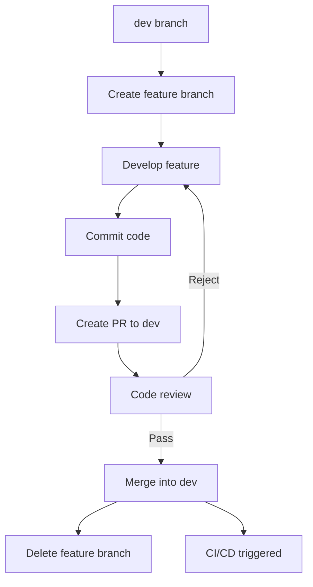
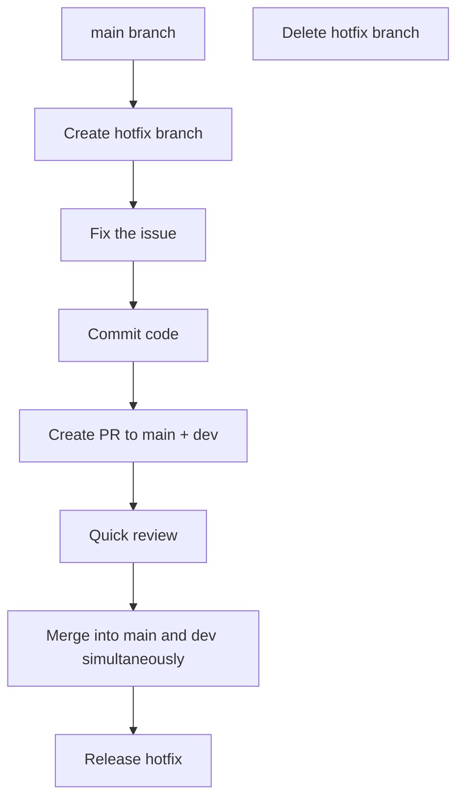
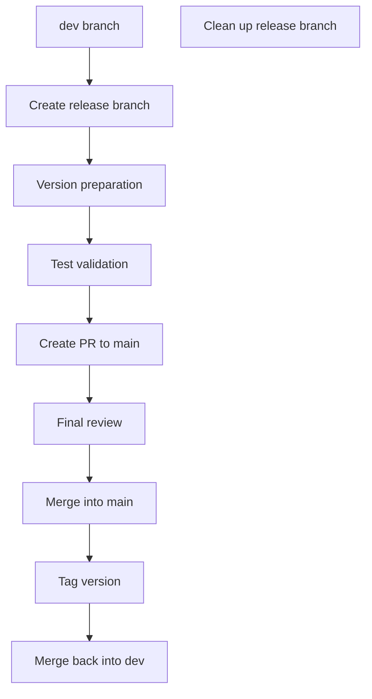

# Git Branch Maintenance Guide

> This guide defines the Git branch management strategy for the YaoXiang project, aiming to ensure
> orderly development and efficient collaboration of the codebase.

---

## 📋 Table of Contents

- [Branch Type Specifications](#branch-type-specifications)
- [Naming Rules](#naming-rules)
- [Branch Lifecycle](#branch-lifecycle)
- [Workflow](#workflow)
- [Worktree Parallel Workbench](#worktree-parallel-workbench)
- [Branch Protection Policy](#branch-protection-policy)
- [Best Practices](#best-practices)
- [FAQ](#faq)

---

## 🏷️ Branch Type Specifications

### Core Branches

| Branch Name | Purpose                     | Lifecycle | Protection Level    |
| ----------- | --------------------------- | --------- | ------------------- |
| `main`      | Production environment code | Permanent | Strict protection   |
| `dev`       | Main development branch     | Permanent | Moderate protection |

### Feature Branches

| Prefix     | Purpose                     | Naming Examples                                       | Merge Target   |
| ---------- | --------------------------- | ----------------------------------------------------- | -------------- |
| `feature/` | New feature development     | `feature/type-inference`<br>`feature/ownership-model` | `dev`          |
| `bugfix/`  | Fix known defects           | `bugfix/memory-leak`<br>`bugfix/parser-error`         | `dev`          |
| `hotfix/`  | Urgent production bug fixes | `hotfix/security-patch`<br>`hotfix/crash-bug`         | `main` + `dev` |
| `release/` | Release preparation branch  | `release/v0.8.0`<br>`release/v1.0.0`                  | `main`         |

### Auxiliary Branches

| Prefix      | Purpose               | Naming Examples                                            | Merge Target |
| ----------- | --------------------- | ---------------------------------------------------------- | ------------ |
| `docs/`     | Documentation updates | `docs/api-reference`<br>`docs/tutorial-update`             | `dev`        |
| `ci/`       | CI/CD config changes  | `ci/add-deploy-script`<br>`ci/optimize-build`              | `dev`        |
| `refactor/` | Code refactoring      | `refactor/lexer-optimization`<br>`refactor/memory-manager` | `dev`        |
| `test/`     | Test-related changes  | `test/add-integration`<br>`test/performance-bench`         | `dev`        |

---

## 📝 Naming Rules

### Basic Naming Format

```bash
# Feature branch
<type>/<short-description>

# Examples
feature/add-type-inference
bugfix/fix-parser-crash
hotfix/security-vulnerability
```

### Naming Conventions

1. **Use lowercase letters**: All branch names use lowercase
2. **Use hyphens as separators**: Use `-` to separate words, not underscores
3. **Descriptive naming**: Branch names should clearly express their purpose
4. **Avoid special characters**: No spaces, dots, or other special characters
5. **Length limit**: Branch names should not exceed 50 characters

### Detailed Examples

```bash
# ✅ Good naming
feature/user-authentication-system
bugfix/fix-compilation-error-on-windows
hotfix/memory-leak-in-vm
docs/update-api-documentation
refactor/optimize-lexer-performance
test/add-e2e-test-cases

# ❌ Bad naming
Feature/NewFeature  # uses uppercase
bug_fix             # uses underscore
hotfix/fix          # description is unclear
feature/ADD_NEW_FEATURE_WITH_LOTS_OF_DETAILS_THAT_IS_TOO_LONG  # too long
```

---

## 🔄 Branch Lifecycle

### Branch Creation

```bash
# 1. Create from the latest dev branch
git checkout dev
git pull origin dev
git checkout -b feature/your-feature-name

# 2. Push to remote branch
git push -u origin feature/your-feature-name
```

### Branch Development

```bash
# Regularly sync with the latest code
git checkout dev
git pull origin dev
git checkout feature/your-feature-name
git rebase dev  # or git merge dev

# Commit code
git add .
git commit -m ":sparkles: feat(frontend): add type inference feature"
git push origin feature/your-feature-name
```

### Branch Merging

```bash
# 1. Create Pull Request
# 2. After code review is approved
git checkout dev
git pull origin dev
git merge --no-ff feature/your-feature-name
git push origin dev

# 3. Clean up branch
git branch -d feature/your-feature-name  # delete locally
git push origin --delete feature/your-feature-name  # delete remotely
```

### Branch Deletion

```bash
# Delete merged feature branches
git branch -d feature/completed-feature
git push origin --delete feature/completed-feature

# Batch clean up merged branches
git branch --merged dev | grep feature | xargs -n 1 git branch -d
```

---

## 🚀 Workflow

### Feature Development Flow


```mermaid
graph TD
    A[dev branch] --> B[Create feature branch]
    B --> C[Develop feature]
    C --> D[Commit code]
    D --> E[Create PR to dev]
    E --> F[Code review]
    F -->|Pass| G[Merge into dev]
    F -->|Reject| C
    G --> H[Delete feature branch]
    G --> I[CI/CD triggered]
```

### Urgent Fix Flow


```mermaid
graph TD
    A[main branch] --> B[Create hotfix branch]
    B --> C[Fix the issue]
    C --> D[Commit code]
    D --> E[Create PR to main + dev]
    E --> F[Quick review]
    F --> G[Merge into main and dev simultaneously]
    G --> H[Release hotfix]
    I[Delete hotfix branch]
```

### Release Flow


```mermaid
graph TD
    A[dev branch] --> B[Create release branch]
    B --> C[Version preparation]
    C --> D[Test validation]
    D --> E[Create PR to main]
    E --> F[Final review]
    F --> G[Merge into main]
    G --> H[Tag version]
    H --> I[Merge back into dev]
    J[Clean up release branch]
```

---

## 🗂️ Worktree Parallel Workbench

> Use case: a single developer needs to handle multiple "must-branch" tasks in parallel while
> keeping the `dev` working directory stable. Convention is to designate a **long-lived worktree**
> as a personal parallel workbench — the worktree is kept permanently, task branches are switched
> in/out as needed and deleted when done.

### Conventions

| Item            | Value                     | Description                                                           |
| --------------- | ------------------------- | --------------------------------------------------------------------- |
| Workbench path  | `E:/git/YaoXiang-wt`      | Fixed path without task suffix; use `git worktree move` to rename     |
| Resident branch | `scratch`                 | "Parking spot" between tasks, local only, never pushed                |
| Task branches   | Follow naming rules above | Each task switches to a new branch in the worktree, deleted when done |

### Complete Loop for One Task

```bash
# 0. First-time creation (one-time only)
git worktree add E:/git/YaoXiang-wt -b scratch dev

# 1. Pick up a task: in the worktree, switch to a task branch from the latest dev
cd E:/git/YaoXiang-wt
git switch -c <task-branch> dev

# 2. Develop and commit (the hook chain runs as usual in the worktree)

# 3. Merge: do this in the [main repository], not in the worktree
cd E:/git/YaoXiang
git merge <task-branch>   # For small fixes, fast-forward directly to keep dev's first-parent history linear

# 4. Wrap-up: in the worktree, switch back to scratch, then delete the merged task branch
cd E:/git/YaoXiang-wt
git switch scratch
cd E:/git/YaoXiang
git branch -d <task-branch>
```

This loop is intended for individual quick fixes; larger changes still go through the PR process
described above.

### Hard Constraints and Pitfalls

1. **The same branch cannot be checked out in two worktrees at the same time**. Since `dev` is
   resident in the main repository, `git switch dev` inside the worktree will be rejected; you can
   only branch off from `dev` as a base — which is exactly why a `scratch` parking spot is needed.
2. **All merges must be done in the main repository**. The main repository holds `dev` and is the
   only merge point; the worktree is only responsible for development and commits on the task
   branch.
3. **`target/` build artifacts are not shared**. Each worktree compiles independently (this repo is
   roughly 160k lines of Rust, and a full rebuild takes several minutes); conversely, the resident
   worktree's build cache stays effective, which is the main benefit of keeping it.
4. **Hooks are shared and run normally**. The worktree and the main repository share the same hook
   configuration, and the full hook chain runs as usual on commit (the historical `GIT_DIR` leak
   issue in worktrees has been fixed); do not run `pre-commit install` / `autoupdate` in the
   worktree.
5. **Always use absolute paths**; relative paths are error-prone on Windows.
6. Common management commands: `git worktree list` / `git worktree move <old-path> <new-path>` /
   `git worktree remove <path>`.

---

## 🛡️ Branch Protection Policy

### Main Branch Protection

**main branch**

- Direct push is forbidden
- Must be merged via PR
- Force push is forbidden
- Code review is required
- Status checks must pass

**dev branch**

- Direct push is forbidden (for developers)
- PR merge is required
- Status checks must pass
- Admins are allowed to push directly

### Branch Permission Settings

| Branch Type | Developer   | Maintainer  | Admin       |
| ----------- | ----------- | ----------- | ----------- |
| `main`      | PR only     | PR only     | Approve PR  |
| `dev`       | PR merge    | PR merge    | Direct push |
| `feature/*` | Full access | Full access | Full access |
| `hotfix/*`  | Full access | Full access | Full access |

---

## ✅ Best Practices

### 1. Branch Management

- **Sync frequently**: Regularly pull the latest code from the `dev` branch
- **Atomic commits**: Each commit should only contain related changes
- **Clean up promptly**: Delete completed feature branches after merging
- **Clear descriptions**: Branch names and commit messages should clearly express intent

### 2. Commit Conventions

Follow the [Commit Conventions](commit-convention.md):

```bash
# Format
:emoji: type(scope): subject

# Examples
:sparkles: feat(frontend): add type inference feature
:bug: fix(parser): fix parser crash issue
:recycle: refactor(vm): refactor virtual machine memory management
```

### 3. Pull Request

- **Clear description**: Detail the changes and reasons
- **Link issues**: Use `Closes #123` to link related Issues
- **Respond promptly**: Reply to review comments in a timely manner
- **Adequate testing**: Ensure all tests pass

### 4. Code Review

- **Functional correctness**: Verify whether the code functions correctly
- **Code quality**: Check whether the code complies with conventions
- **Test coverage**: Ensure appropriate tests exist
- **Documentation updates**: Check whether documentation needs to be updated

---

## ❓ FAQ

### Q1: How do I choose a branch type?

**A:**

- New feature → `feature/`
- Known bug fix → `bugfix/`
- Urgent production fix → `hotfix/`
- Documentation update → `docs/`
- Code refactoring → `refactor/`
- Test-related → `test/`

### Q2: Which branch should a feature branch be created from?

**A:** Always create from the `dev` branch to ensure the feature is based on the latest development
code:

```bash
git checkout dev
git pull origin dev
git checkout -b feature/new-feature
```

### Q3: When should I create a release branch?

**A:**

- When preparing to release a new version
- When you need to freeze the addition of new features
- When you need dedicated testing of a stable version

### Q4: How do I handle branch conflicts?

**A:**

1. Update the target branch: `git checkout dev && git pull origin dev`
2. Switch to the feature branch: `git checkout feature/your-branch`
3. Merge and resolve conflicts: `git rebase dev` or `git merge dev`
4. Continue development after resolving conflicts

### Q5: How do I handle a hotfix branch?

**A:**

1. Create from the `main` branch: `git checkout main && git checkout -b hotfix/urgent-fix`
2. Fix the issue and test
3. Simultaneously create PRs to `main` and `dev`
4. Deploy immediately after merging

### Q6: Is there a length limit for branch names?

**A:** It is recommended to not exceed 50 characters, keeping them concise and clear. Git itself
supports longer names, but overly long names affect readability.

---

## 📚 Related Documentation

- [Commit Conventions](commit-convention.md)
- [Test Specifications](test-specification.md)

---

## 🔧 Tools and Scripts

### Batch Cleanup of Merged Branches

```bash
# Delete local branches already merged into dev
git checkout dev
git pull origin dev
git branch --merged dev | grep -E "^(feature|bugfix|docs|refactor|test)/" | xargs -n 1 git branch -d

# Prune remote merged branches
git remote prune origin
```

### Branch Creation Template

```bash
#!/bin/bash
# Helper script for creating feature branches

BRANCH_TYPE=$1
BRANCH_NAME=$2

if [ -z "$BRANCH_TYPE" ] || [ -z "$BRANCH_NAME" ]; then
    echo "Usage: $0 <type> <branch-name>"
    echo "Types: feature, bugfix, hotfix, docs, refactor, test"
    exit 1
fi

git checkout dev
git pull origin dev
git checkout -b "$BRANCH_TYPE/$BRANCH_NAME"
git push -u origin "$BRANCH_TYPE/$BRANCH_NAME"

echo "Created and pushed branch: $BRANCH_TYPE/$BRANCH_NAME"
```

---

> 💡 **Tip**: Keep branches atomic and focused — each branch should do one thing, which makes code
> management clearer and more efficient!

> 📞 **Support**: If you have any questions, please discuss them in GitHub Discussions.
