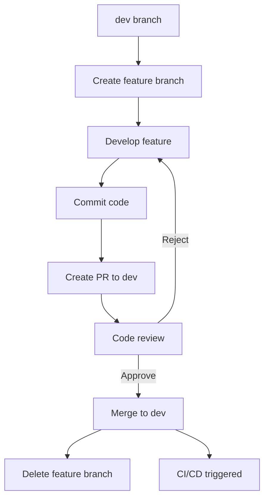
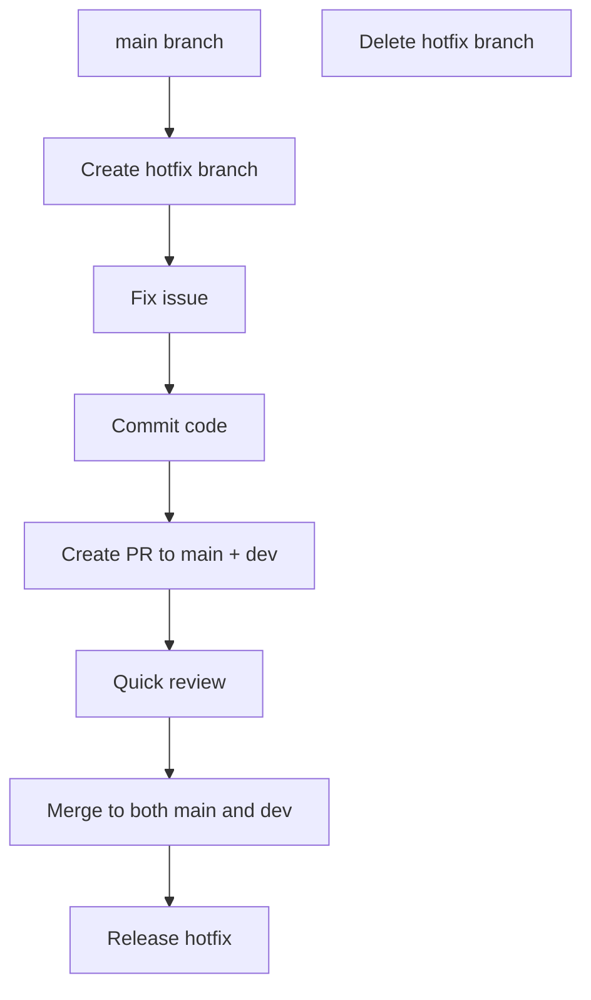
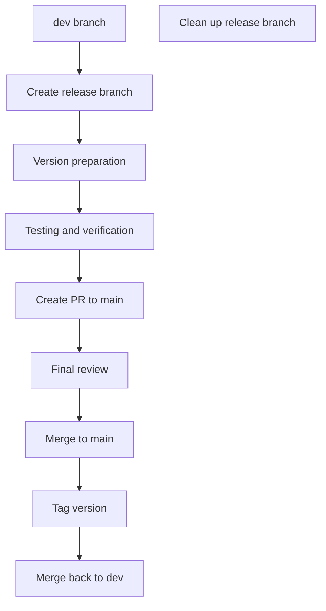

# Git Branch Maintenance Guide

> This guide defines Git branch management strategies for the YaoXiang project, ensuring orderly development and efficient collaboration of the codebase.

---

## Table of Contents

- [Branch Type Specifications](#branch-type-specifications)
- [Naming Rules](#naming-rules)
- [Branch Lifecycle](#branch-lifecycle)
- [Workflow](#workflow)
- [Branch Protection Strategy](#branch-protection-strategy)
- [Best Practices](#best-practices)
- [FAQ](#faq)

---

## Branch Type Specifications

### Core Branches

| Branch Name | Purpose | Lifecycle | Protection Level |
|-------------|---------|-----------|------------------|
| `main` | Production code | Permanent | Strict protection |
| `dev` | Main development branch | Permanent | Medium protection |
| `master` | Main branch (compatible) | Permanent | Strict protection |

### Feature Branches

| Prefix | Purpose | Naming Example | Merge Target |
|--------|---------|----------------|--------------|
| `feature/` | New feature development | `feature/type-inference`<br>`feature/ownership-model` | `dev` |
| `bugfix/` | Fix known defects | `bugfix/memory-leak`<br>`bugfix/parser-error` | `dev` |
| `hotfix/` | Urgent production fixes | `hotfix/security-patch`<br>`hotfix/crash-bug` | `main` + `dev` |
| `release/` | Release preparation branches | `release/v0.8.0`<br>`release/v1.0.0` | `main` |

### Auxiliary Branches

| Prefix | Purpose | Naming Example | Merge Target |
|--------|---------|----------------|--------------|
| `docs/` | Documentation updates | `docs/api-reference`<br>`docs/tutorial-update` | `dev` |
| `ci/` | CI/CD configuration changes | `ci/add-deploy-script`<br>`ci/optimize-build` | `dev` |
| `refactor/` | Code refactoring | `refactor/lexer-optimization`<br>`refactor/memory-manager` | `dev` |
| `test/` | Test-related changes | `test/add-integration`<br>`test/performance-bench` | `dev` |

---

## Naming Rules

### Basic Naming Format

```bash
# Feature branches
<type>/<short-description>

# Examples
feature/add-type-inference
bugfix/fix-parser-crash
hotfix/security-vulnerability
```

### Naming Conventions

1. **Use lowercase**: All branch names use lowercase
2. **Use hyphens**: Use `-` to separate words, not underscores
3. **Descriptive naming**: Branch names should clearly express their purpose
4. **Avoid special characters**: No spaces, dots, or other special characters
5. **Length limit**: Branch names should not exceed 50 characters

### Detailed Examples

```bash
# ✅ Good naming
feature/user-authentication-system
bugfix/fix-compilation-error-on-windows
hotfix/memory-leak-in-vm
docs/update-api-documentation
refactor/optimize-lexer-performance
test/add-e2e-test-cases

# ❌ Bad naming
Feature/NewFeature  # Uses uppercase
bug_fix            # Uses underscore
hotfix/fix        # Unclear description
feature/ADD_NEW_FEATURE_WITH_LOTS_OF_DETAILS_THAT_IS_TOO_LONG  # Too long
```

---

## Branch Lifecycle

### Branch Creation

```bash
# 1. Create from latest dev branch
git checkout dev
git pull origin dev
git checkout -b feature/your-feature-name

# 2. Push remote branch
git push -u origin feature/your-feature-name
```

### Branch Development

```bash
# Regularly sync latest code
git checkout dev
git pull origin dev
git checkout feature/your-feature-name
git rebase dev  # or git merge dev

# Commit code
git add .
git commit -m ":sparkles: feat(frontend): Add type inference feature"
git push origin feature/your-feature-name
```

### Branch Merging

```bash
# 1. Create Pull Request
# 2. After code review passes
git checkout dev
git pull origin dev
git merge --no-ff feature/your-feature-name
git push origin dev

# 3. Clean up branch
git branch -d feature/your-feature-name  # Local delete
git push origin --delete feature/your-feature-name  # Remote delete
```

### Branch Deletion

```bash
# Delete merged feature branches
git branch -d feature/completed-feature
git push origin --delete feature/completed-feature

# Batch cleanup merged branches
git branch --merged dev | grep feature | xargs -n 1 git branch -d
```

---

## Workflow

### Feature Development Workflow



### Hotfix Workflow



### Release Workflow



---

## Branch Protection Strategy

### Main Branch Protection

**main branch**
- Direct push forbidden
- Must merge via PR
- Forced push forbidden
- Code review required
- Status checks must pass

**dev branch**
- Direct push forbidden (developers)
- PR merge required
- Status checks must pass
- Admins can push directly

### Branch Permission Settings

| Branch Type | Developers | Maintainers | Admins |
|-------------|------------|-------------|--------|
| `main` | PR only | PR only | Approve PR |
| `dev` | PR merge | PR merge | Direct push |
| `feature/*` | Full access | Full access | Full access |
| `hotfix/*` | Full access | Full access | Full access |

---

## Best Practices

### 1. Branch Management

- **Frequent sync**: Regularly fetch latest code from `dev`
- **Atomic commits**: Each commit contains only related changes
- **Timely cleanup**: Delete completed feature branches after merge
- **Clear descriptions**: Branch names and commit messages should clearly express intent

### 2. Commit Standards

Follow [commit conventions](./commit-convention.md):

```bash
# Format
:emoji: type(scope): subject (in English)

# Examples
:sparkles: feat(frontend): Add type inference feature
:bug: fix(parser): Fix parser crash issue
:recycle: refactor(vm): Refactor VM memory management
```

### 3. Pull Request

- **Clear description**: Detailed explanation of changes and reasons
- **Link issues**: Use `Closes #123` to link related Issues
- **Timely response**: Respond to review comments promptly
- **Sufficient testing**: Ensure all tests pass

### 4. Code Review

- **Functional correctness**: Verify code functionality
- **Code quality**: Check code compliance with standards
- **Test coverage**: Ensure appropriate tests
- **Documentation updates**: Check if documentation needs updates

---

## FAQ

### Q1: How to choose branch type?

**Answer:**
- New feature → `feature/`
- Known defect fix → `bugfix/`
- Urgent production fix → `hotfix/`
- Documentation update → `docs/`
- Code refactoring → `refactor/`
- Test-related → `test/`

### Q2: From which branch should I create a feature branch?

**Answer:**
Always create from `dev` branch to ensure features are based on latest development code:

```bash
git checkout dev
git pull origin dev
git checkout -b feature/new-feature
```

### Q3: When should I create a release branch?

**Answer:**
- When preparing a new release
- When needing to freeze new feature additions
- When needing to test a specific stable version

### Q4: How to handle branch conflicts?

**Answer:**
1. Update target branch: `git checkout dev && git pull origin dev`
2. Switch to feature branch: `git checkout feature/your-branch`
3. Merge and resolve conflicts: `git rebase dev` or `git merge dev`
4. Continue development after resolving conflicts

### Q5: How to handle hotfix branches?

**Answer:**
1. Create from `main`: `git checkout main && git checkout -b hotfix/urgent-fix`
2. Fix issue and test
3. Create PR to both `main` and `dev`
4. Deploy immediately after merge

### Q6: Is there a limit on branch name length?

**Answer:**
Recommend not exceeding 50 characters, keep it concise. Git itself supports longer names, but overly long names affect readability.

---

## Related Documentation

- [Commit Conventions](./commit-convention.md)
- [Code Review Guide](./code-review.md)
- [Release Process](./release-guide.md)
- [CI/CD Configuration](../../.github/workflows/)

---

## Tools and Scripts

### Batch Cleanup Merged Branches

```bash
# Delete local branches merged to dev
git checkout dev
git pull origin dev
git branch --merged dev | grep -E "^(feature|bugfix|docs|refactor|test)/" | xargs -n 1 git branch -d

# Delete remote merged branches
git remote prune origin
```

### Branch Creation Template

```bash
#!/bin/bash
# Helper script for creating feature branches

BRANCH_TYPE=$1
BRANCH_NAME=$2

if [ -z "$BRANCH_TYPE" ] || [ -z "$BRANCH_NAME" ]; then
    echo "Usage: $0 <type> <branch-name>"
    echo "Types: feature, bugfix, hotfix, docs, refactor, test"
    exit 1
fi

git checkout dev
git pull origin dev
git checkout -b "$BRANCH_TYPE/$BRANCH_NAME"
git push -u origin "$BRANCH_TYPE/$BRANCH_NAME"

echo "Branch created and pushed: $BRANCH_TYPE/$BRANCH_NAME"
```

---

> 💡 **Tip**: Keep branches atomic and focused, each branch does only one thing, making code management clearer and more efficient!

> 📞 **Support**: If you have questions, please discuss in GitHub Discussions.
