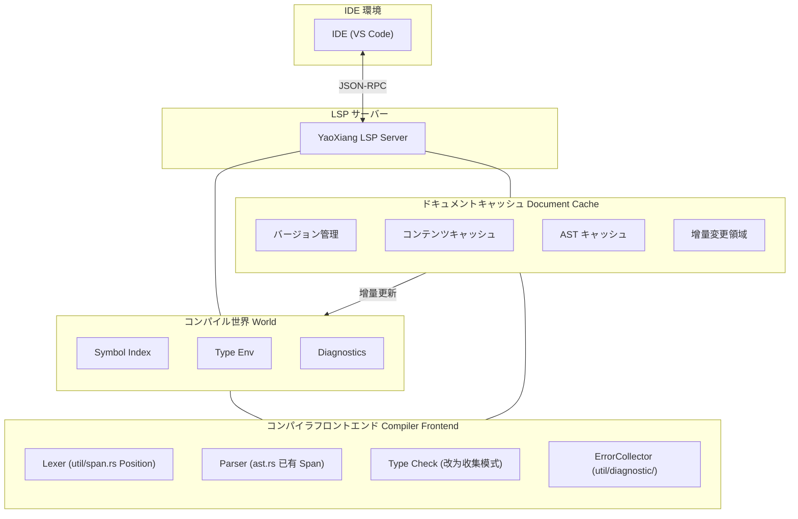

# RFC-017: 言語サーバープロトコル（LSP）サポート設計

>

>

>

> **参考**: 完全な例は [EXAMPLE_full_feature_proposal.md](EXAMPLE_full_feature_proposal.md) をご覧ください。

## ⚠️ 実装前置条件（重要）

LSP を実装する前に、以下の2つのコア問題を解決する必要があります：

### 問題 1：診断エラーの収集

**現状**：現在の型チェッカーは最初のエラーに遭遇した時点で（`?` 演算子を使用して）直接返されるため、すべてのエラーを収集できません。

**LSP 要件**：IDE は**すべての**エラーを表示する必要があります。最初のエラーだけではありません。

**解決策**：

#### 1.1 エラー収集パターン
- `src/frontend/typecheck/inference/` モジュールを修正し、`Result<Type, Vec<Error>>` を返す
- エラーに遭遇した時点で即座に返さず、检查を続行する
- 検査完了後にすべてのエラーを统一して返す

#### 1.2 エラーレベル
 различных степеней серьёзности ошибок:

```rust
enum ErrorKind {
    Error,      // 重大なエラー、カスケードエラーが発生する可能性
    Warning,    // 警告、检查は続行するがブロックしない
    Note,       // 追加情報
}
```

- `Error` がある場合：`publishDiagnostics` でエラーを表示
- `Warning` だけの場合：コンパイルを続行し、警告を表示

#### 1.3 Parser エラー回復
- 解析エラー発生時、放棄のではなく **placeholder ノード**（例：`MissingExpression`）を挿入する
- AST が不完全なことによる型チェックのパニックを避ける
- 例：`let x = ;` → `let x = MissingExpression`

#### 1.4 遅延レポート (Delayed Emission)
- 一部のエラーは「級聯」の可能性があります（前のエラーによって引き起こされた）
- まず収集し、AST の解析後に明らかな級聯エラーをフィルタリングできます
- またはシンプルに処理：すべて報告し、ユーザーが1つずつ修正させる

### 問題 2：ファイルレベルの解析キャッシュ

**現状**：各 LSP リクエストでファイル全体を再解析し、キャッシュメカニズムがありません。

**LSP 要件**：各編集に即座に反応し、変化のないファイルは再解析不要。

**解決策**：

#### 2.1 ファイルキャッシュ構造
```rust
struct DocumentCache {
    version: u32,           // LSP ドキュメントバージョン
    content: String,        // 現在のコンテンツ
    content_hash: u64,      // コンテンツハッシュ（高速比較）
    ast: Option<Ast>,       // キャッシュされた AST（オプション）
}
```

#### 2.2 変化の検出
- 毎回 `textDocument/didChange` で新しいコンテンツを受信
- 新しいコンテンツのハッシュを計算し、キャッシュの `content_hash` と比較
- **変化がある場合：ファイル全体を再解析**
- **変化がない場合：キャッシュ結果を直接返す**

#### 2.3 再解析戦略
- **ファイルレベル**：現在のリクエストされたファイルのみ再解析。全プロジェクトではない
- これは簡略化された設計で、関数レベルの增量解析は行わない
-  сучасні комп'ютериは単一の数千行ファイルを数ミリ秒で解析可能

#### 2.4 cargo check との違い
| | cargo check | YaoXiang LSP |
|---|---|---|
| 範囲 | プロジェクト全体 | 単一ファイル |
| 頻度 | 手動トリガー | 毎編集 |
| 目標 | 完全コンパイルチェック | 高速增量応答 |

### 既存モジュールとの統合

| 既存モジュール | LSP 統合方式 |
|----------|-------------|
| `util/span.rs` | ✅ 既に `Position`/`Span` あり、LSP `Position` に直接マップ可能 |
| `util/diagnostic/collect.rs` | ⚠️ 「収集モード」に修正必要、エラーを継続的に蓄積 |
| `frontend/core/lexer/symbols.rs` | ⚠️ 拡張必要、`uri` + `span` 位置情報を追加 |
| `frontend/typecheck/mod.rs` | ⚠️ `TypeResult` を修正し、すべてのエラーを返す |
| `frontend/core/parser/ast.rs` | ✅ 各ノードには既に `Span` があり、変更不要 |

---

## 摘要

为 YaoXiang 添加 Language Server Protocol（LSP）支持，实现完整的语言服务器，使主流 IDE（VS Code、Neovim、Emacs 等）能够提供代码补全、跳转定义、诊断、引用搜索等开发工具功能。

## 動機

### なぜこの機能が必要ですか？

現在の YaoXiang 言語には公式の IDE 統合サポートがなく、開発者は基本的なテキストエディタでしかコードを書くことができず、以下の機能がありません：

1. **コード補完** - コンテキストに基づいて識別子、キーワード、タイプをインテリジェントに補完できない
2. **定義へのジャンプ** - 関数、タイプ、変数の定義位置に快速にジャンプできない
3. **リアルタイム診断** - 編集時に構文エラー、型エラーを即座に表示できない
4. **参照検索** - シンボルのすべての参照位置を検索できない
5. **ホバー提示** - マウスホバー時に型情報、ドキュメントコメントを表示できない

LSP は сучасніプログラミング言語の標準装備であり、主流言語（Rust、Python、TypeScript、Go など）はすべて成熟した LSP 実装を提供しています。LSP サポ一下实现将显著提升 YaoXiang の開発体験。

### 現在の問題

1. **開発効率の低さ** - コード補完とインテリジェントプロンプトがない
2. **デバッグの困難** - シンボル定義を快速に特定できない
3. **険しい学習曲線** - IDE の辅助機能がない
4. **生態系の不備** - 現代 IDE に慣れた開発者を惹きつけられない

## 提案

### コア設計

IDE との JSON-RPC 通信を通じて、独立した LSP サーバーゲームを実装します：



### LSP サーバーアーキテクチャ

```
src/lsp/
├── main.rs              # LSP サーバーエントリ
├── server.rs           # サーバーコアロジック
├── session.rs          # セッション管理
├── capabilities.rs     # サーバー機能宣言
├── handlers/
│   ├── mod.rs
│   ├── initialize.rs   # 初期化処理
│   ├── text_document.rs # ドキュメント操作処理
│   ├── completion.rs   # 補完処理
│   ├── definition.rs   # 定義ジャンプ処理
│   ├── references.rs   # 参照検索処理
│   ├── hover.rs        # ホバー提示処理
│   └── diagnostics.rs  # 診断処理
├── world.rs            # コンパイル世界（シンボルテーブル、AST キャッシュ）
├── scroller.rs         # シンボルインデックス構築
├── protocol.rs         # LSP プロトコルタイプ定義
└── cache/              # 增量キャッシュモジュール（新規）
    ├── mod.rs
    ├── document.rs     # ドキュメントキャッシュ（バージョン、AST、シンボルテーブル）
    └── incremental.rs  # 增量解析ストラテジ
```

### コンパイル世界（World）設計

グローバルコンパイル状態を管理：
- ドキュメントキャッシュ（バージョン、AST、シンボルテーブル）
- グローバルシンボルインデックス
- エラーコレクター
- 型環境キャッシュ

コアメソッド：
- `on_document_change`：增量変更の処理
- `incremental_reparse`：增量再解析
- `collect_diagnostics`：すべてのエラーの収集（遮断なし）

### コア LSP メソッドサポート

| カテゴリ | メソッド | 説明 |
|------|------|------|
| **ライフサイクル** | `initialize` / `initialized` / `shutdown` / `exit` | サーバーゲーム lifecycle |
| **ドキュメント同期** | `didOpen` / `didChange` / `didClose` | ドキュメント管理 |
| **診断** | `publishDiagnostics` | 診断の発信 |
| **補完** | `completion` | コード補完 |
| **ジャンプ** | `definition` | 定義へのジャンプ |
| **参照** | `references` | 参照の検索 |
| **ホバー** | `hover` | ホバー提示 |
| **シンボル** | `workspace/symbol` | ワークスペースシンボル検索 |

### 文本文ード同期メカニズム

增量同期策略を使用：
- ドキュメントバージョン番号を保持
- 增量変更を適用（range + text）
- 大規模変更時は完全置换に降格

### シンボルインデックス構築

既存のシンボルテーブルシステムを利用し、逆引きインデックスを構築：
- `SymbolEntry` を拡張し、`location` フィールドを追加する必要がある
- インデックス：名前 → 位置リスト、ファイル → シンボルリスト

### コード補完実装

補完ソース：キーワード、変数、関数、タイプ、構造体フィールド、モジュール

### 定義ジャンプ実装

AST ベースのシンボル解析：識別子/関数呼び出しに対応する定義位置を検索

## 詳細設計

### 型システムへの影響

1. **シンボル情報拡張** - シンボルテーブルに位置情報（ファイル、行番号、列番号）を追加
2. **型情報露出** - LSP に型クエリインターフェースを提供
3. **ドキュメントコメント統合** - コメントからドキュメント文字列を生成するサポート

### 実行時動作

- LSP サーバーは独立したプロセスとして実行
- stdin/stdout を使用して JSON-RPC 通信
- マルチセッション同時処理をサポート

### コンパイラ変更

| コンポーネント | 変更 |
|------|------|
| `frontend/events` | LSP 通知をサポートするイベントシステムを拡張 |
| `frontend/core/lexer/symbols` | シンボルテーブルを強化し、位置情報を追加 |
| 新規 `src/lsp/` | LSP サーバー実装 |

### 後方互換性

- ✅ 完全な後方互換性
- LSP サーバーは独立コンポーネントであり、既存のコンパイルプロセスに影響しない
- 既存の CLI ツールに影響なし

### 既存システムとの統合

1. **イベントシステム** - `frontend/events/` のイベントサブスクリプション機構を活用
2. **診断システム** - `util/diagnostic/` の診断出力を再利用
   - すべてのエラーを収集するために `ErrorCollector<E>` を再利用
   - `Diagnostic` を LSP の `Diagnostic` フォーマットに変換
3. **シンボルテーブル** - `symbols.rs` のシンボル位置決め能力を拡張
   - `SymbolEntry` を拡張し、`location: Location` フィールドを追加
   - `SymbolIndex` 逆引きインデックスを構築（名前 -> 位置リスト）
4. **コンパイラフロントエンド** - Lexer、Parser、型チェックを直接呼び出し
   - **重要変更**：型チェッカーを「収集モード」に変更し、実行を遮断しない

#### 診断フォーマット変換

```rust
/// YaoXiang Diagnostic を LSP Diagnostic に変換
fn to_lsp_diagnostic(diag: &Diagnostic) -> lsp_types::Diagnostic {
    let severity = match diag.severity() {
        Severity::Error => lsp_types::DiagnosticSeverity::ERROR,
        Severity::Warning => lsp_types::DiagnosticSeverity::WARNING,
        Severity::Info => lsp_types::DiagnosticSeverity::INFORMATION,
    };

    lsp_types::Diagnostic {
        range: to_lsp_range(diag.span()),
        severity: Some(severity),
        message: diag.message().to_string(),
        code: diag.code().map(|c| lsp_types::NumberOrString::String(c.as_string())),
        ..Default::default()
    }
}

/// YaoXiang Span を LSP Range に変換
fn to_lsp_range(span: &Span) -> lsp_types::Range {
    lsp_types::Range {
        start: lsp_types::Position {
            line: span.start.line.saturating_sub(1), // LSP は 0-indexed を使用
            character: span.start.column.saturating_sub(1),
        },
        end: lsp_types::Position {
            line: span.end.line.saturating_sub(1),
            character: span.end.column.saturating_sub(1),
        },
    }
}
```

## YaoXiang 固有の高機能機能

YaoXiang の強力なコンパイル時評価と所有権システムを活用し、他の言語では実装できないユニークな開発体験を提供：

### 1. 幽灵提示（Inlay Hints）

- **定数値提示**：コンパイル時にすでに計算済みの定数を表示（例：`const MAX = 100 + 200` の横に `300` を表示）
- **可変性提示**：変数が可变かどうかを表示（例：`mut x`、`x` に明显なアンダーライン）
- **所有権消費提示**：関数パラメータが消費されたかどうかを表示（例：`consumed` / `borrowed`）
- **空所有権セマンティクス提示**：変数の色を薄めて、変数が move された後に再代入できる事を表示。
- **型推論提示**：推論された具体的な型を表示（例：`x = vec![]` の横に `Vec<i32>` を表示）

### 2. 所有権セマンティクスの可視化

- 変数の move パスを表示（定義位置からすべての使用位置まで）
- 借用 lifecycle の可視化

### 3. コンパイル時評価プレビュー

- ホバーで定数式の結果を表示

## 実装優先度

| 機能 | 優先度 |
|------|--------|
| 定数値幽灵提示 | P0 |
| 可変性提示 | P0 |
| 所有権消費提示 | P1 |
| 所有権可視化 | P2 |

---

## 通信とリモートサポート

### 通信モード

3つのモードをサポート：

| モード | 用途 |
|------|------|
| stdio | ローカル開発（デフォルト）|
| TCP Socket | リモート開発/デバッグ |
| Unix Domain Socket | 高性能ローカル通信 |

### リモートデバッグ

DAP（Debug Adapter Protocol）に基づいて実装：
- 行ブレークポイント、関数ブレークポイント、条件ブレークポイントをサポート
- YaoXiang 固有ブレークポイント：変数が move された時にトリガー

### 起動パラメータ

```bash
# ローカルモード
yaoxiang-lsp

# TCP サーバー
yaoxiang-lsp --tcp --port 8765

# デバッグも有効化
yaoxiang-lsp --tcp --port 8765 --enable-debug
```

---

## 並行モデル

**設計判断：シングルスレッド + 非同期イベントループ**

理由：
- コンパイラはスレッドセーフではなく、改造成本が高い
- LSP リクエストは本質的にシリアルであり、並行処理は不要
- シングルスレッドの方がシンプルでデバッグしやすい
- async I/O のシングルスレッド性能は十分

バックグラウンドタスクは `spawn_blocking` を使用してマルチコアを活用。

---

## LSP 内蔵テストツール（オプション）

> この機能は MVP 必须ではなく、後続バージョンで追加可能。

JSON テストケースフォーマットを提供：

```bash
# テスト実行
yaoxiang-lsp --test
```

---

## 权衡

### 优点

1. **開発体験の向上** - 主流言語に近い IDE サポート
2. **エコシステムの充実** - より多くの開発者に YaoXiang を使用してもらえる
3. **コード品質の向上** - リアルタイム診断で実行時エラーを削減
4. **コミュニティの貢献** - 開発者が LSP ツールチェーンの開発に参加可能

### 缺点

1. **実装复杂度が高い** - 多くの LSP edge case を処理する必要がある
2. **メンテナンスコスト** - LSP プロトコルバージョンの更新に追従する必要がある
3. **パフォーマンスの考慮** - 大規模プロジェクトのインデックスとクエリ性能
4. **テスト难度** - IDE 動作のシミュレーションが必要

## 代替方案

| 方案 | なぜ選択しないか |
|------|--------------|
| 構文ハイライトのみ提供 | 現代の開発ニーズを満たせない |
| Tree-sitter を使用 | 追加の学習コストがかかり、機能に限界がある |

## 実装策略

### 段階的区分

1. **段階 0 (前置)**: コンパイラ适配 ⚠️ **重要**
   - 型チェッカーを「収集モード」に修正し、`Result<Type, Vec<Error>>` を返す
   - エラーレベル（Error / Warning / Note）を実装
   - Parser エラー回復：placeholder ノードを挿入
   - シンボルテーブル `SymbolEntry` を拡張し、`location` フィールドを追加
   - DocumentCache キャッシュシステムを実装（バージョン + コンテンツ + ハッシュ）
   - **この段階は LSP 実装の前提であり、先に完了する必要がある**

2. **段階 1 (v0.7)**: 基礎フレームワーク
   - LSP サーバー骨格
   - lifecycle メソッド（initialize/shutdown/exit）
   - 基本的なログとエラー処理

3. **段階 2 (v0.7)**: 診断サポート
   - 文ドキュメント同期
   - コンパイル診断統合
   - `textDocument/publishDiagnostics`

4. **段階 3 (v0.8)**: 補完サポート
   - シンボルインデックス構築
   - キーワード補完
   - 識別子補完

5. **段階 4 (v0.8)**: ジャンプサポート
   - 定義へのジャンプ
   - 参照の検索
   - ホバー提示

6. **段階 5 (v0.9)**: 高機能機能
   - ワークスペースシンボル検索
   - コードフォーマット
   - リファクタリングサポート（オプション）

### 依存関係

- 外部 LSP ライブラリ依存なし（`lsp-types` crate を使用）
- 既存のコンパイラフロントエンドモジュールに依存
- JSON-RPC シリアライズに `serde_json` に依存

### リスク

1. **パフォーマンス問題** - 大規模ファイル解析がフリーズを引き起こす可能性
   - 解決：增量解析、バックグラウンドスレッド処理
2. **メモリ使用量** - シンボルインデックスがメモリを占有
   - 解決：遅延ロード、LRU キャッシュ
3. **プロトコル互換性** - LSP バージョン差異
   - 解決：サポートするプロトコルバージョンを宣言

## 開放問題

- [x] エラー収集メカニズム（「実装前置条件」章を参照）
- [x] 增量キャッシュシステム（「実装前置条件」章を参照）
- [x] LSP プロトコルバージョン：3.18 を使用（Inlay Hints、Inline Values などの新機能をサポート）
- [x] リモート通信サポート（TCP 経由、LSP + デバッグを兼顾）
- [x] リモートデバッグサポート（DAP プロトコルに基づく）
- [x] 並行モデル：シングルスレッド + async イベントループ
- [x] LSP 内蔵テストツール（オプション）：JSON テストケースを使用

---

## 付録（オプション）

### 付録A：設計議論記録

> 設計判断プロセスの詳細な議論を記録するために使用。

### 付録B：設計判断記録

| 判断 | 決定 | 日付 | 記録者 |
|------|------|------|--------|
| LSP サーバーアーキテクチャ | 独立プロセス、stdio 経由で通信 | 2026-02-15 | 晨煦 |
| プロトコルバージョン | LSP 3.18 をサポート（Inlay Hints などの新機能が必要） | 2026-02-22 | 晨煦 |
| エラー収集モード | `Result<Type, Vec<Error>>` を返し、エラーレベルとエラー回復をサポート | 2026-02-22 | 晨煦 |
| キャッシュ策略 | ファイルレベルキャッシュ：バージョン + コンテンツ + ハッシュ、全体ファイルを再解析 | 2026-02-22 | 晨煦 |
| 通信モード | stdio + TCP + UnixSocket をサポート | 2026-02-22 | 晨煦 |
| リモートデバッグ | DAP プロトコルに基づく、LSP とトランスポート層を共有 | 2026-02-22 | 晨煦 |
| 並行モデル | シングルスレッド + async イベントループ | 2026-02-22 | 晨煦 |
| テストツール（オプション）| JSON テストケース + 内蔵テストランナー | 2026-02-22 | 晨煦 |

### 付録C：用語集

| 用語 | 定義 |
|------|------|
| LSP | Language Server Protocol、言語サーバープロトコル |
| JSON-RCP | JSON-Remote Procedure Call、JSON リモートプロシージャコール |
| DAP | Debug Adapter Protocol、デバッグアダプタープロトコル |
| シンボルインデックス | コンパイル時に構築されるシンボル位置マッピングテーブル |
| コンパイル世界 | すべてのコンパイル情報を含むコンテキスト |
| 幽灵提示 | Inlay Hints、行内に表示される提示情報 |
| 所有権追踪 | Ownership Trace、変数所有権の流れの可視化 |

---

## 参考文献

- [Language Server Protocol 仕様](https://microsoft.github.io/language-server-protocol/)
- [LSP 仕様 3.18](https://github.com/microsoft/language-server-protocol/blob/main/specifications/specification-3-18.md)
- [Debug Adapter Protocol 仕様](https://microsoft.github.io/debug-adapter-protocol/)
- [Rust Analyzer](https://rust-analyzer.github.io/) - 参考実装
- [lsp-types crate](https://crates.io/crates/lsp-types) - LSP 型定義
- [JSON-RPC 2.0 仕様](https://www.jsonrpc.org/specification)

---

## lifecycle と归宿

RFC には以下の状態フローがあります：

```
┌─────────────┐
│   草案      │  ← 著者作成
└──────┬──────┘
       │
       ▼
┌─────────────┐
│  審査中     │  ← コミュニティ議論
└──────┬──────┘
       │
       ├──────────────────┐
       ▼                  ▼
┌─────────────┐    ┌─────────────┐
│  承認済み   │    │   却下済み   │
└──────┬──────┘    └──────┬──────┘
       │                  │
       ▼                  ▼
┌─────────────┐    ┌─────────────┐
│   accepted/ │    │  rejected/  │
│ (正式設計)  │     │ (却下)     │
└─────────────┘    └─────────────┘
```

### ステータス説明

| ステータス | 場所 | 説明 |
|------|------|------|
| **草案** | `docs/design/rfc/draft/` | 著者草稿、審査提出待ち |
| **審査中** | `docs/design/rfc/review/` | コミュニティ議論とフィードバック公開 |
| **承認済み** | `docs/design/accepted/` | 正式設計ドキュメントとなり、実装段階に入る |
| **却下済み** | `docs/design/rfc/` | RFC ディレクトリに保持、ステータスを更新 |

### 承認後の操作

1. RFC を `docs/design/accepted/` ディレクトリに移動
2. ファイル名を記述的名前に更新（例：`lsp-support.md`）
3. ステータスを「正式」に更新
4. ステータスを「承認済み」に更新し、承認日を記載

### 却下後の操作

1. `docs/design/rfc/draft/` ディレクトリに保持
2. ファイル上部に却下理由と日付を追加
3. ステータスを「却下済み」に更新

### 議論確定後の操作

ある開放問題がコンセンサスに達した場合：

1. **付録A を更新**: 議論テーマ下に「決議」を記入
2. **本文を更新**: 決定をドキュメント本文に同期
3. **判断を記録**: 「付録B：設計判断記録」に追加
4. **問題をマーク**: 「開放問題」リストで `[x]` をチェック

---

> **注**: RFC 番号は議論段階でのみ使用。承認後は番号を削除し、記述的文件名を使用。