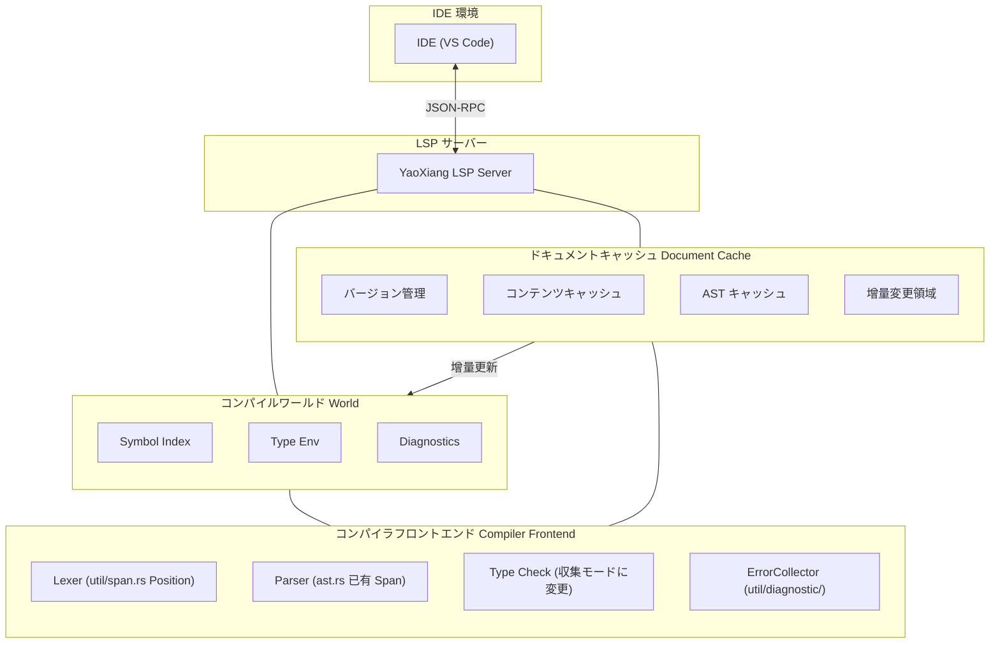

```markdown
---
title: "RFC-017: 言語サーバープロトコル（LSP）サポート設計"
---

# RFC-017: 言語サーバープロトコル（LSP）サポート設計

> **状態**: 審査中
>
> **著者**: 晨煦
>
> **作成日**: 2026-02-15
>
> **最終更新**: 2026-02-22

> **参考**: 完全な例の書き方は [完全サンプル](EXAMPLE_full_feature_proposal.md) を参照。

## ⚠️ 実装前置条件（重要）

LSP を実装する前に、以下の2つの核心的な問題を解決する必要があります：

### 問題 1: 診断エラーの収集

**現状**: 現在の型チェッカーは最初のエラーに遭遇するとすぐに `?` 演算子で早期返回している。

**LSP 要件**: IDE は**すべての**エラーを表示する必要がある。最初のエラーだけ表示では不十分である。

**解決策**:

#### 1.1 エラー収集パターン
- `src/frontend/typecheck/inference/` モジュールを修正し、`Result<Type, Vec<Error>>` を返す
- エラーに遭遇しても即座に返回せず、检查を継続する
- 检查完了後にすべてのエラーをまとめて返す

#### 1.2 エラーレベル
深刻度別にエラーを区別する：

```rust
enum ErrorKind {
    Error,      // 重大なエラー、カスケードエラーを引き起こす可能性
    Warning,    // 警告、检查を継続するが阻断しない
    Note,       // 付随情報
}
```

- `Error` がある場合：`publishDiagnostics` でエラーを表示
- `Warning` のみの場合：コンパイルを継続し、警告を表示

#### 1.3 Parser のエラー回復
- 解析エラー時、処理を諦めるのではなく **プレースホルダーノード**（例：`MissingExpression`）を挿入する
- AST が不完全而导致型チェックで panic が発生するのを防ぐ
- 例：`let x = ;` → `let x = MissingExpression`

#### 1.4 遅延レポート (Delayed Emission)
- 一部のエラーは「级联」的である可能性がある（前のエラー导致）
- 先に収集し、AST の解析完了後に明らかな级联エラーをフィルタリングできる
- または単純に処理：すべてレポートし、ユーザーが1つずつ修正していく

### 問題 2: ファイルレベルの解析キャッシュ

**現状**: 各 LSP リクエストでファイル全体を再解析しており、キャッシュメカニズムがない。

**LSP 要件**: 編集ごとに быстро 応答する必要がある。変更のないファイルを再解析する必要はない。

**解決策**:

#### 2.1 ファイルキャッシュ構造
```rust
struct DocumentCache {
    version: u32,           // LSP ドキュメントバージョン番号
    content: String,        // 現在のコンテンツ
    content_hash: u64,      // コンテンツハッシュ（高速比較用）
    ast: Option<Ast>,       // キャッシュされた AST（オプション）
}
```

#### 2.2 変更の検出
- `textDocument/didChange` で新コンテンツを受信するたびに
- 新規コンテンツのハッシュを計算し、キャッシュの `content_hash` と比較する
- **変更あり：ファイル全体を再解析**
- **変更なし：キャッシュ結果を直接返す**

#### 2.3 再解析戦略
- **ファイルレベル**: 現在のファイルのみを再解析し、プロジェクト全体ではない
- これは簡略化された設計であり、関数レベルの增量解析は実装しない
- 現代のコンピュータでは数千行のファイルを数ミリ秒で解析できる

#### 2.4 cargo check との違い
| | cargo check | YaoXiang LSP |
|---|---|---|
| 範囲 | プロジェクト全体 | 单一ファイル |
| 頻度 | 手動トリガー | 編集ごと |
| 目的 | 完全なコンパイルチェック | 高速增量応答 |

### 既存モジュールとの統合

| 既存モジュール | LSP 統合方法 |
|----------|-------------|
| `util/span.rs` | ✅ `Position`/`Span` が既にあり、LSP `Position` に直接マッピング可能 |
| `util/diagnostic/collect.rs` | ⚠️ 「収集モード」に修正し、エラーを継続的に蓄積 |
| `frontend/core/lexer/symbols.rs` | ⚠️ 拡張が必要で、`uri` + `span` 位置情報を追加 |
| `frontend/typecheck/mod.rs` | ⚠️ `TypeResult` を修正し、すべてのエラーを返す |
| `frontend/core/parser/ast.rs` | ✅ 各ノードに `Span` が既にあり、変更不要 |

---

## 摘要

YaoXiang に Language Server Protocol（LSP）サポートを追加し、完全な言語サーバーを実装することで、主流 IDE（VS Code、Neovim、Emacs など）がコード補完、定義へのジャンプ、診断、参照検索などの開発ツール機能を提供できるようにする。

## 動機

### この機能が必要な理由

現在 YaoXiang 言語には公式の IDE 統合サポートがなく、開発者は基本的なテキストエディタでしかコードを書くことができず、以下が不足している：

1. **コード補完** - コンテキストに基づいて識別子、キーワード、型をインテリジェントに補完できない
2. **定義へのジャンプ** - 関数、型、変数の定義位置に快速にジャンプできない
3. **リアルタイム診断** - 編集時に構文エラー、型エラーを即时表示できない
4. **参照検索** - シンボルのすべての参照位置を検索できない
5. **ホバーtip** - マウスをホバーしたときに型情報、ドキュメントコメントを表示できない

LSP は сучасних プログラミング言語の標準装備であり、主流言語（Rust、Python、TypeScript、Go など）はすべて成熟した LSP 実装を提供している。LSP サポートを実装することで、YaoXiang の開発体験は显著に向上する。

### 現在の問題

1. **開発効率が低い** - コード補完とインテリジェントなヒントがない
2. **デバッグが困難** - シンボル定義を快速に定位できない
3. **学習曲線が険しい** - IDE の補助機能がない
4. **エコシステムが未完成** - 现代的な IDE に慣れた開発者を引き付けられない

## 提案

### コア設計

独立した LSP サーバー経由で JSON-RPC により IDE と通信する：



### LSP サーバーアーキテクチャ

```
src/lsp/
├── main.rs              # LSP サーバーエントリポイント
├── server.rs           # サーバーコアロジック
├── session.rs          # セッション管理
├── capabilities.rs     # サーバー機能宣言
├── handlers/
│   ├── mod.rs
│   ├── initialize.rs   # 初期化処理
│   ├── text_document.rs # ドキュメント操作処理
│   ├── completion.rs   # 補完処理
│   ├── definition.rs   # 定義ジャンプ処理
│   ├── references.rs   # 参照検索処理
│   ├── hover.rs        # ホバーtip処理
│   └── diagnostics.rs  # 診断処理
├── world.rs            # コンパイルワールド（シンボルテーブル、AST キャッシュ）
├── scroller.rs         # シンボルインデックス構築
├── protocol.rs         # LSP プロトコル型定義
└── cache/              # 增量キャッシュモジュール（新規）
    ├── mod.rs
    ├── document.rs     # ドキュメントキャッシュ（バージョン、AST、シンボルテーブル）
    └── incremental.rs  # 增量解析戦略
```

### コンパイルワールド（World）設計

グローバルなコンパイル状態を管理する：
- ドキュメントキャッシュ（バージョン、AST、シンボルテーブル）
- グローバルシンボルインデックス
- エラーコレクター
- 型環境キャッシュ

コアメソッド：
- `on_document_change`：增量変更を処理
- `incremental_reparse`：增量再解析
- `collect_diagnostics`：すべてのエラーを収集（阻断しない）

### コア LSP メソッドサポート

| カテゴリ | メソッド | 説明 |
|------|------|------|
| **ライフサイクル** | `initialize` / `initialized` / `shutdown` / `exit` | サーバー lifecycle |
| **ドキュメント同期** | `didOpen` / `didChange` / `didClose` | ドキュメント管理 |
| **診断** | `publishDiagnostics` | 診断の公開 |
| **補完** | `completion` | コード補完 |
| **ジャンプ** | `definition` | 定義へのジャンプ |
| **参照** | `references` | 参照の検索 |
| **ホバー** | `hover` | ホバーtip |
| **シンボル** | `workspace/symbol` | ワークスペースシンボル検索 |

### 文書同期メカニズム

增量同期戦略を使用する：
- ドキュメントバージョン番号を保持
- 增量変更を適用（range + text）
- 大規模な変更時は完全置换に降格

### シンボルインデックス構築

既存のシンボルテーブル 시스템을活用し、逆引きインデックスを構築する：
- `SymbolEntry` を拡張し、`location` フィールドを追加する必要がある
- インデックス：名前 → 位置リスト、ファイル → シンボルリスト

### コード補完実装

補完ソース：キーワード、変数、関数、型、構造体フィールド、モジュール

### 定義ジャンプ実装

AST ベースのシンボル解析：識別子/関数呼び出しに対応する定義位置を検索

## 詳細設計

### 型システムへの影響

1. **シンボル情報の拡張** - シンボルテーブルに位置情報（ファイル、行番号、列番号）を追加
2. **型情報の露出** - LSP に型クエリインターフェースを提供
3. **ドキュメントコメント統合** - コメントからドキュメント文字列を生成するサポート

### 実行時動作

- LSP サーバーは獨立したプロセスとして実行
- stdin/stdout を使用して JSON-RPC 通信を行う
- マルチセッションの并发処理をサポート

### コンパイラ変更

| コンポーネント | 変更内容 |
|------|------|
| `frontend/events` | LSP 通知をサポートするイベントシステムを拡張 |
| `frontend/core/lexer/symbols` | 位置情報を追加してシンボルテーブルを強化 |
| 新規 `src/lsp/` | LSP サーバー実装 |

### 後方互換性

- ✅ 完全な後方互換性
- LSP サーバーは独立コンポーネントであり、既存のコンパイルプロセスに影響しない
- 既存の CLI ツールには影響しない

### 既存システムとの統合

1. **イベントシステム** - `frontend/events/` のイベント購読者メカニズムを活用
2. **診断システム** - `util/diagnostic/` の診断出力を再利用
   - `ErrorCollector<E>` を再利用し、すべてのエラーを収集
   - `Diagnostic` を LSP の `Diagnostic` 形式に変換
3. **シンボルテーブル** - `symbols.rs` のシンボル位置特定能力を拡張
   - `SymbolEntry` を拡張し、`location: Location` フィールドを追加
   - `SymbolIndex` 逆引きインデックスを構築（名前 -> 位置リスト）
4. **コンパイラフロントエンド** - Lexer、Parser、型チェックを直接呼び出す
   - **关键変更**：型チェッカーは「収集モード」に変更し、実行を阻断しない

#### 診断形式変換

```rust
/// YaoXiang Diagnostic を LSP Diagnostic に変換
fn to_lsp_diagnostic(diag: &Diagnostic) -> lsp_types::Diagnostic {
    let severity = match diag.severity() {
        Severity::Error => lsp_types::DiagnosticSeverity::ERROR,
        Severity::Warning => lsp_types::DiagnosticSeverity::WARNING,
        Severity::Info => lsp_types::DiagnosticSeverity::INFORMATION,
    };

    lsp_types::Diagnostic {
        range: to_lsp_range(diag.span()),
        severity: Some(severity),
        message: diag.message().to_string(),
        code: diag.code().map(|c| lsp_types::NumberOrString::String(c.as_string())),
        ..Default::default()
    }
}

/// YaoXiang Span を LSP Range に変換
fn to_lsp_range(span: &Span) -> lsp_types::Range {
    lsp_types::Range {
        start: lsp_types::Position {
            line: span.start.line.saturating_sub(1), // LSP は 0-indexed を使用
            character: span.start.column.saturating_sub(1),
        },
        end: lsp_types::Position {
            line: span.end.line.saturating_sub(1),
            character: span.end.column.saturating_sub(1),
        },
    }
}
```

## YaoXiang 特有の高度な機能

YaoXiang の強力なコンパイル時評価と所有権システムを活用し、他の言語では實現できないユニークな開発体験を提供する：

### 1. インレイヒント（Inlay Hints）

- **定数値ヒント**：コンパイル時に計算済みの定数を表示（例：`const MAX = 100 + 200` の横に `300` と表示）
- **可変性ヒント**：変数が変更可能かどうかを表示（例：`mut x`, `x` に明显な下線が引かれる）
- **所有権消費ヒント**：関数引数が消費されたかどうかを表示（例：`consumed` / `borrowed`）
- **空所有権semanticヒント**：変数を move 後に再代入できることを薄い色の変数表示でヒント
- **型推論ヒント**：推論された具体的な型を表示（例：`x = vec![]` の横に `Vec<i32>` と表示）

### 2. 所有権semantic可視化

- 変数の move パスを表示（定義位置からすべての使用位置まで）
- 借用ライフタイムの可視化

### 3. コンパイル時評価プレビュー

- ホバーで定数式のコンパイル時計算結果を表示

### 実装優先度

| 機能 | 優先度 |
|------|--------|
| 定数値インレイヒント | P0 |
| 可変性ヒント | P0 |
| 所有権消費ヒント | P1 |
| 所有権可視化 | P2 |

---

## 通信とリモートサポート

### 通信モード

3つのモードをサポート：

| モード | 用途 |
|------|------|
| stdio | ローカル開発（デフォルト）|
| TCP Socket | リモート開発/デバッグ |
| Unix Domain Socket | 高性能ローカル通信 |

### リモートデバッグ

DAP（Debug Adapter Protocol）に基づく実装：
- 行ブレークポイント、関数ブレークポイント、条件ブレークポイントをサポート
- YaoXiang 固有ブレークポイント：変数が move されたときにトリガー

### 起動パラメータ

```bash
# ローカルモード
yaoxiang-lsp

# TCP サーバー
yaoxiang-lsp --tcp --port 8765

# デバッグも有効にする
yaoxiang-lsp --tcp --port 8765 --enable-debug
```

---

## 並発モデル

**設計方針：单一スレッド + 非同期イベントループ**

理由：
- コンパイラの スレッド 安全でない преобразование が大変
- LSP リクエストは本質的にシリアルであり、並髪が不要
- 单一スレッドの方がシンプルでデバッグしやすい
- async I/O 单一スレッドでも性能十分

バックグラウンドタスクは `spawn_blocking` を使用してマルチコアを活用する。

---

## LSP 内蔵テストツール（オプション）

> この機能は MVP 必須ではなく、後続バージョンで追加可能。

JSON テストケース形式を提供する：

```bash
# テスト実行
yaoxiang-lsp --test
```

---

## トレードオフ

### メリット

1. **開発体験の向上** - 主流言語に近い IDE サポート
2. **エコシステムの整備** - より多くの開発者に YaoXiang を使用してもらえる
3. **コード品質の向上** - リアルタイム診断により実行時エラーが减少
4. **コミュニティ貢献** - 開発者が LSP ツールチェーンの開発に参加できる

### デメリット

1. **実装复杂度が高い** - 大量の LSP edge case を処理する必要がある
2. **メンテナンスコスト** - LSP プロトコルバージョンの更新に追随する必要がある
3. **性能 considerations** - 大規模プロジェクトのインデックスとクエリ性能
4. **テスト难度** - IDE の动作をシミュレートしてテストする必要がある

## 代替案

| 方案 | 为什么不選択 |
|------|--------------|
| 構文ハイライトのみ提供 | 现代的な開発ニーズを満たせない |
| Tree-sitter を使用 | 追加学習コストがかかり、機能に限界がある |

## 実装戦略

### フェーズわけ

1. **フェーズ 0 (前置)**: コンパイラ适配 ⚠️ **重要**
   - 型チェッカーを「収集モード」に修正し、`Result<Type, Vec<Error>>` を返す
   - エラーレベル（Error / Warning / Note）を実装
   - Parser エラー回復：プレースホルダーノードを挿入
   - シンボルテーブル `SymbolEntry` を拡張し、`location` フィールドを追加
   - DocumentCache キャッシュシステムを実装（バージョン + コンテンツ + ハッシュ）
   - **このフェーズは LSP 実装の前提であり、まず完了する必要がある**

2. **フェーズ 1 (v0.7)**: 基本フレームワーク
   - LSP サーバースkeleton
   - lifecycle メソッド（initialize/shutdown/exit）
   - 基本的なログとエラー処理

3. **フェーズ 2 (v0.7)**: 診断サポート
   - 文書同期
   - コンパイル診断統合
   - `textDocument/publishDiagnostics`

4. **フェーズ 3 (v0.8)**: 補完サポート
   - シンボルインデックス構築
   - キーワード補完
   - 識別子補完

5. **フェーズ 4 (v0.8)**: ジャンプサポート
   - 定義へのジャンプ
   - 参照の検索
   - ホバーtip

6. **フェーズ 5 (v0.9)**: 高度な機能
   - ワークスペースシンボル検索
   - コードフォーマット
   - リファクタリングサポート（オプション）

### 依存関係

- 外部 LSP ライブラリへの依存なし（`lsp-types` crate を使用）
- 既存のコンパイラフロントエンドモジュールに依存
- JSON-RPC シリアル化に `serde_json` に依存

### リスク

1. **性能問題** - 大ファイルの解析 导致 遅延の可能性がある
   - 解決：增量解析、バックグラウンドスレッド処理
2. **メモリ使用量** - シンボルインデックスがメモリを占有
   - 解決：延迟加载、LRU キャッシュ
3. **プロトコル互換性** - LSP バージョンの差異
   - 解決：サポートするプロトコルバージョンを宣言

## 开放问题

- [x] エラー収集メカニズム（「実装前置条件」章を参照）
- [x] 增量キャッシュシステム（「実装前置条件」章を参照）
- [x] LSP プロトコルバージョン：3.18 を使用（Inlay Hints、Inline Values などの新機能をサポート）
- [x] リモート通信サポート（TCP を通じて、LSP + デバッグを兼顾）
- [x] リモートデバッグサポート（DAP プロトコルに基づく）
- [x] 並発モデル：单一スレッド + async イベントループ
- [x] LSP 内蔵テストツール（オプション）：JSON テストケースを使用

---

## 付録（オプション）

### 付録A：設計議論記録

> 設計意思決定プロセスの詳細な議論を記録するために使用。

### 付録B：設計意思決定記録

| 意思決定 | 決定 | 日付 | 記録者 |
|------|------|------|--------|
| LSP サーバーアーキテクチャ | 独立プロセス、stdio で通信 | 2026-02-15 | 晨煦 |
| プロトコルバージョン | LSP 3.18 をサポート（Inlay Hints などの新機能が必要） | 2026-02-22 | 晨煦 |
| エラー収集モード | `Result<Type, Vec<Error>>` を返し、エラーレベルとエラー回復をサポート | 2026-02-22 | 晨煦 |
| キャッシュ戦略 | ファイルレベルキャッシュ：バージョン + コンテンツ + ハッシュ、ファイル全体を再解析 | 2026-02-22 | 晨煦 |
| 通信モード | stdio + TCP + UnixSocket をサポート | 2026-02-22 | 晨煦 |
| リモートデバッグ | DAP プロトコルに基づく、LSP と传输層を共有 | 2026-02-22 | 晨煦 |
| 並発モデル | 单一スレッド + async イベントループ | 2026-02-22 | 晨煦 |
| テストツール（オプション）| JSON テストケース + 内蔵テストランナー | 2026-02-22 | 晨煦 |

### 付録C：用語集

| 用語 | 定義 |
|------|------|
| LSP | Language Server Protocol、言語サーバープロトコル |
| JSON-RCP | JSON-Remote Procedure Call、JSON 远程過程呼び出し |
| DAP | Debug Adapter Protocol、デバッグアダプタープロトコル |
| シンボルインデックス | コンパイル時に構築されるシンボル位置マッピングテーブル |
| コンパイルワールド | すべてのコンパイル情報を含むコンテキスト |
| インレイヒント | Inlay Hints、行内に表示されるヒント情報 |
| 所有権追踪 | Ownership Trace、変数所有権の流れの可視化 |

---

## 参考文献

- [Language Server Protocol 仕様](https://microsoft.github.io/language-server-protocol/)
- [LSP 仕様 3.18](https://github.com/microsoft/language-server-protocol/blob/main/specifications/specification-3-18.md)
- [Debug Adapter Protocol 仕様](https://microsoft.github.io/debug-adapter-protocol/)
- [Rust Analyzer](https://rust-analyzer.github.io/) - 参考実装
- [lsp-types crate](https://crates.io/crates/lsp-types) - LSP 型定義
- [JSON-RPC 2.0 仕様](https://www.jsonrpc.org/specification)

---

## ライフサイクルと归宿

RFC には以下の状态フローがある：

```
┌─────────────┐
│   草案      │  ←  著者が作成
└──────┬──────┘
       │
       ▼
┌─────────────┐
│  審査中     │  ←  コミュニティ議論
└──────┬──────┘
       │
       ├──────────────────┐
       ▼                  ▼
┌─────────────┐    ┌─────────────┐
│  已受诺     │    │   已拒否     │
└──────┬──────┘    └──────┬──────┘
       │                  │
       ▼                  ▼
┌─────────────┐    ┌─────────────┐
│   accepted/ │    │  rejected/  │
│ (正式設計)  │     │ (拒否)     │
└─────────────┘    └─────────────┘
```

### 状態説明

| 状態 | 位置 | 説明 |
|------|------|------|
| **草案** | `docs/design/rfc/draft/` | 著者草案、审查への提出を待つ |
| **審査中** | `docs/design/rfc/review/` | コミュニティ議論とフィードバックを募る |
| **已受诺** | `docs/design/accepted/` | 正式設計ドキュメントとなり、実装フェーズに入る |
| **已拒否** | `docs/design/rfc/` | RFC ディレクトリに保留、状態を更新 |

### 接受後の操作

1. RFC を `docs/design/accepted/` ディレクトリに移動
2. ファイル名を説明的な名前に更新（例：`lsp-support.md`）
3. 状態を「正式」に更新
4. 状態を「已受诺」に更新し、接受日付を追加

### 拒否後の操作

1. `docs/design/rfc/draft/` ディレクトリに保留
2. ファイル冒頭に拒否理由と日付を追加
3. 状態を「已拒否」に更新

### 議論確定後の操作

ある开放問題について合意に達したとき：

1. **付録A を更新**: 議論テーマの基に「決議」を記入
2. **本文を更新**: 決定をドキュメント本文に同期
3. **意思決定を記録**: 「付録B：設計意思決定記録」に追加
4. **問題をマーク**: 「开放問題」リストで `[x]` を付ける

---

> **注**: RFC 番号は議論段階でのみ使用する。接受後は番号を移除し、説明的なファイル名を使用する。
```