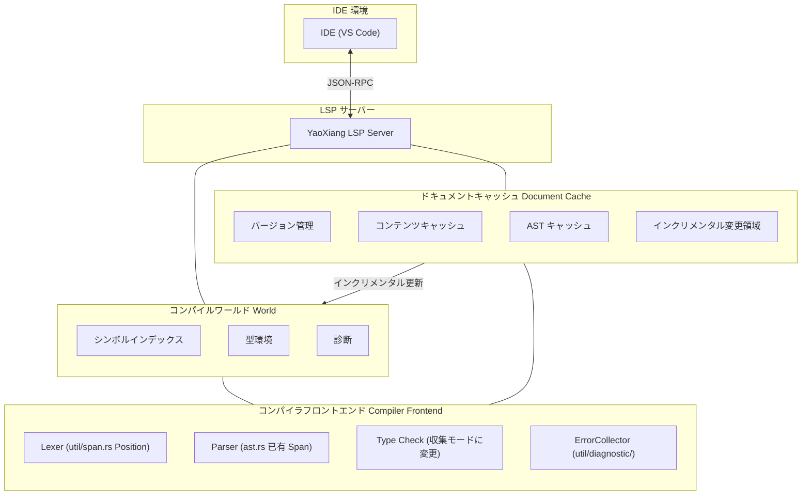

```markdown
---
title: "RFC-017: 言語サーバープロトコル（LSP）サポート設計"
status: "実装済み"
author: "晨煦"
created: "2026-02-15"
updated: "2026-07-05"

issue: "#11"
---

# RFC-017: 言語サーバープロトコル（LSP）サポート設計

>

>

>

> **参考**: RFC の書き方については [完全な例](EXAMPLE_full_feature_proposal.md) を参照してください。

## ⚠️ 実装の前提条件（重要）

LSP を実装する前に、以下の 2 つのコア問題を解決する必要があります：

### 問題 1：診断エラーの収集

**現状**：現在の型検査器は、最初にエラーに遭遇した時点で `?` 演算子を使用して即座に return するため、すべてのエラーを収集できません。

**LSP の要件**：IDE は最初の一つのエラーだけでなく、**すべての**エラーを表示する必要があります。

**解決策**：

#### 1.1 エラー収集モード
- `src/frontend/typecheck/inference/` モジュールを修正し、`Result<Type, Vec<Error>>` を返すようにする
- エラー発生時に即座に return せず、検査を続行する
- 検査完了後にすべてのエラーをまとめて返す

#### 1.2 エラーレベル
異なる重大度を区別します：

```rust
enum ErrorKind {
    Error,      // 重大なエラー、連鎖エラーを引き起こす可能性あり
    Warning,    // 警告、検査を続行するが中断しない
    Note,       // 追加情報
}
```

- `Error` がある場合：`publishDiagnostics` でエラーを表示
- `Warning` のみの場合：コンパイルを続行し、警告を表示

#### 1.3 Parser のエラー復旧
- 解析エラー時、**プレースホルダーノード**（例：`MissingExpression`）を挿入し、諦めない
- AST が不完全なために型検査が panic するのを防ぐ
- 例：`let x = ;` → `let x = MissingExpression`

#### 1.4 遅延報告 (Delayed Emission)
- 一部のエラーは「連鎖的」（前のエラーが原因）である可能性がある
- まず収集し、AST の解析完了後に明らかな連鎖エラーを除外する
- または簡単に処理：すべて報告し、ユーザーに一つずつ修正させる

### 問題 2：ファイルレベルの解析キャッシュ

**現状**：LSP リクエストごとに毎回ファイル全体を再解析しており、キャッシュ機構がありません。

**LSP の要件**：編集のたびに迅速にレスポンスする必要があり、変更されていないファイルを再解析すべきではありません。

**解決策**：

#### 2.1 ファイルキャッシュ構造
```rust
struct DocumentCache {
    version: u32,           // LSP ドキュメントバージョン番号
    content: String,        // 現在のコンテンツ
    content_hash: u64,      // コンテンツハッシュ（高速比較用）
    ast: Option<Ast>,       // キャッシュされた AST（オプション）
}
```

#### 2.2 変更の検出
- `textDocument/didChange` で新しいコンテンツを受信するたび
- 新しいコンテンツのハッシュを計算し、キャッシュの `content_hash` と比較
- **変更ありの場合：ファイル全体を再解析**
- **変更なしの場合：キャッシュ結果を直接返す**

#### 2.3 再解析戦略
- **ファイルレベル**：プロジェクト全体ではなく、現在のファイルのみを再解析
- これは簡略化された設計であり、関数レベルのインクリメンタル解析は行わない
- 現代のコンピュータでは、数千行のファイル解析は数ミリ秒で完了する

#### 2.4 cargo check との違い
| | cargo check | YaoXiang LSP |
|---|---|---|
| 範囲 | プロジェクト全体 | 単一ファイル |
| 頻度 | 手動トリガー | 編集のたび |
| 目標 | 完全なコンパイル検査 | 高速なインクリメンタル応答 |

### 既存モジュールとの統合

| 既存モジュール | LSP 統合方法 |
|----------|-------------|
| `util/span.rs` | ✅ すでに `Position`/`Span` があり、LSP `Position` に直接マッピング可能 |
| `util/diagnostic/collect.rs` | ⚠️ 「収集モード」に変更し、エラーを継続的に蓄積する必要がある |
| `frontend/core/lexer/symbols.rs` | ⚠️ 拡張が必要、`uri` + `span` 位置情報の追加 |
| `frontend/typecheck/mod.rs` | ⚠️ `TypeResult` を変更し、すべてのエラーを返す |
| `frontend/core/parser/ast.rs` | ✅ 各ノードにすでに `Span` があり、変更不要 |

---

## 概要

YaoXiang に Language Server Protocol（LSP）サポートを追加し、完全な言語サーバーを実装します。これにより、主要な IDE（VS Code、Neovim、Emacs など）がコード補完、定義へのジャンプ、診断、参照検索などの開発ツール機能を提供できるようになります。

## 動機

### なぜこの機能が必要なのか？

現在の YaoXiang 言語には公式の IDE 統合サポートがなく、開発者は基本的なテキストエディタでしかコードを書くことができず、以下が欠けています：

1. **コード補完** - コンテキストに基づいて識別子、キーワード、型をスマートに補完できない
2. **定義へのジャンプ** - 関数、型、変数の定義位置に素早くジャンプできない
3. **リアルタイム診断** - 編集中に構文エラー、型エラーを即座に表示できない
4. **参照検索** - シンボルのすべての参照位置を検索できない
5. **ホバー表示** - マウスホバー時に型情報やドキュメントコメントを表示できない

LSP は現代的なプログラミング言語の必須機能であり、主要言語（Rust、Python、TypeScript、Go など）はすべて成熟した LSP 実装を提供しています。LSP サポートを実装することで、YaoXiang の開発体験が大幅に向上します。

### 現在の問題点

1. **開発効率が低い** - コード補完とスマートヒントがない
2. **デバッグが困難** - シンボル定義の素早い特定ができない
3. **学習曲線が急峻** - IDE の補助機能がない
4. **エコシステムが未整備** - 現代の IDE に慣れた開発者を惹きつけることができない

## 提案

### コア設計

独立した LSP サーバープロセスを実装し、JSON-RPC で IDE と通信します：



### LSP サーバーアーキテクチャ

```
src/lsp/
├── main.rs              # LSP サーバーエントリ
├── server.rs           # サーバーコアロジック
├── session.rs          # セッション管理
├── capabilities.rs     # サーバー能力宣言
├── handlers/
│   ├── mod.rs
│   ├── initialize.rs   # 初期化処理
│   ├── text_document.rs # ドキュメント操作処理
│   ├── completion.rs   # 補完処理
│   ├── definition.rs   # 定義ジャンプ処理
│   ├── references.rs   # 参照検索処理
│   ├── hover.rs        # ホバー表示処理
│   └── diagnostics.rs  # 診断処理
├── world.rs            # コンパイルワールド（シンボルテーブル、AST キャッシュ）
├── scroller.rs         # シンボルインデックス構築
├── protocol.rs         # LSP プロトコル型定義
└── cache/              # インクリメンタルキャッシュモジュール（新規）
    ├── mod.rs
    ├── document.rs     # ドキュメントキャッシュ（バージョン、AST、シンボルテーブル）
    └── incremental.rs  # インクリメンタル解析戦略
```

### コンパイルワールド（World）設計

グローバルなコンパイル状態を管理します：
- ドキュメントキャッシュ（バージョン、AST、シンボルテーブル）
- グローバルシンボルインデックス
- エラーコレクター
- 型環境キャッシュ

コアメソッド：
- `on_document_change`：インクリメンタル変更を処理
- `incremental_reparse`：インクリメンタル再解析
- `collect_diagnostics`：すべてのエラーを収集（中断しない）

### コア LSP メソッドサポート

| カテゴリ | メソッド | 説明 |
|------|------|------|
| **ライフサイクル** | `initialize` / `initialized` / `shutdown` / `exit` | サーバーライフサイクル |
| **ドキュメント同期** | `didOpen` / `didChange` / `didClose` | ドキュメント管理 |
| **診断** | `publishDiagnostics` | 診断の公開 |
| **補完** | `completion` | コード補完 |
| **ジャンプ** | `definition` | 定義へのジャンプ |
| **参照** | `references` | 参照検索 |
| **ホバー** | `hover` | ホバー表示 |
| **シンボル** | `workspace/symbol` | ワークスペースシンボル検索 |

### テキストドキュメント同期メカニズム

インクリメンタル同期戦略を使用：
- ドキュメントバージョン番号を保持
- インクリメンタル変更（range + text）を適用
- 大きな変更の場合は全量置換にフォールバック

### シンボルインデックス構築

既存のシンボルテーブルシステムを利用して、逆インデックスを構築：
- `SymbolEntry` を拡張し、`location` フィールドを追加
- インデックス：名前 → 位置リスト、ファイル → シンボルリスト

### コード補完の実装

補完ソース：キーワード、変数、関数、型、構造体フィールド、モジュール

### 定義ジャンプの実装

AST ベースのシンボル解決：識別子/関数呼び出しに対応する定義位置を検索

## 詳細設計

### 型システムへの影響

1. **シンボル情報の拡張** - シンボルテーブルに位置情報（ファイル、行番号、列番号）を追加
2. **型情報の公開** - LSP 用の型クエリインターフェースを提供
3. **ドキュメントコメントの統合** - コメントからドキュメント文字列を生成するサポート

### ランタイム動作

- LSP サーバーは独立したプロセスとして実行される
- stdin/stdout を使用して JSON-RPC 通信を行う
- マルチセッションの並行処理をサポート

### コンパイラー変更

| コンポーネント | 変更内容 |
|------|------|
| `frontend/events` | イベントシステムを拡張し、LSP 通知をサポート |
| `frontend/core/lexer/symbols` | シンボルテーブルを強化し、位置情報を追加 |
| 新規 `src/lsp/` | LSP サーバー実装 |

### 後方互換性

- ✅ 完全な後方互換性
- LSP サーバーは独立したコンポーネントであり、既存のコンパイルフローに影響しない
- 既存の CLI ツールは影響を受けない

### 既存システムとの統合

1. **イベントシステム** - `frontend/events/` のイベント購読メカニズムを利用
2. **診断システム** - `util/diagnostic/` の診断出力を再利用
   - `ErrorCollector<E>` を再利用してすべてのエラーを収集
   - `Diagnostic` を LSP の `Diagnostic` 形式に変換
3. **シンボルテーブル** - `symbols.rs` のシンボル位置特定能力を拡張
   - `SymbolEntry` を拡張し、`location: Location` フィールドを追加
   - `SymbolIndex` 逆インデックスを構築（名前 -> 位置リスト）
4. **コンパイラフロントエンド** - Lexer、Parser、型検査を直接呼び出す
   - **重要な変更**：型検査器を「収集モード」に変更し、実行を中断しないようにする

#### 診断形式の変換

```rust
/// YaoXiang Diagnostic を LSP Diagnostic に変換
fn to_lsp_diagnostic(diag: &Diagnostic) -> lsp_types::Diagnostic {
    let severity = match diag.severity() {
        Severity::Error => lsp_types::DiagnosticSeverity::ERROR,
        Severity::Warning => lsp_types::DiagnosticSeverity::WARNING,
        Severity::Info => lsp_types::DiagnosticSeverity::INFORMATION,
    };

    lsp_types::Diagnostic {
        range: to_lsp_range(diag.span()),
        severity: Some(severity),
        message: diag.message().to_string(),
        code: diag.code().map(|c| lsp_types::NumberOrString::String(c.as_string())),
        ..Default::default()
    }
}

/// YaoXiang Span を LSP Range に変換
fn to_lsp_range(span: &Span) -> lsp_types::Range {
    lsp_types::Range {
        start: lsp_types::Position {
            line: span.start.line.saturating_sub(1), // LSP は 0 インデックス
            character: span.start.column.saturating_sub(1),
        },
        end: lsp_types::Position {
            line: span.end.line.saturating_sub(1),
            character: span.end.column.saturating_sub(1),
        },
    }
}
```

## YaoXiang 特有の高級機能

YaoXiang の強力なコンパイル時評価と所有権システムを利用して、他の言語では実現できない独自の開発体験を提供します：

### 1. インレイヒント（Inlay Hints）

- **定数値ヒント**：コンパイル時に計算済みの定数を表示（例：`const MAX = 100 + 200` の横に `300` を表示）
- **可変性ヒント**：変数が可変かどうかを表示（例：`mut x`、`x` に明確な下線）
- **所有権消費ヒント**：関数のパラメータが消費されるかを表示（例：`consumed` / `borrowed`）
- **空の所有権セマンティクスのヒント**：move された変数の色淡化で再代入可能であることを表示
- **型推論ヒント**：推論された具体的な型を表示（例：`x = vec![]` の横に `Vec<i32>` を表示）

### 2. 所有権セマンティクスの可視化

- 変数の move パス（定義位置からすべての使用位置まで）を表示
- 借用ライフタイムの可視化

### 3. コンパイル時評価プレビュー

- ホバー時に定数式のコンパイル時計算結果を表示

### 実装優先度

| 機能 | 優先度 |
|------|--------|
| 定数値インレイヒント | P0 |
| 可変性ヒント | P0 |
| 所有権消費ヒント | P1 |
| 所有権可視化 | P2 |

---

## 通信とリモートサポート

### 通信モード

3 つのモードをサポート：

| モード | 用途 |
|------|------|
| stdio | ローカル開発（デフォルト）|
| TCP ソケット | リモート開発/デバッグ |
| Unix ドメインソケット | 高性能ローカル通信 |

### リモートデバッグ

DAP（Debug Adapter Protocol）に基づいて実装：
- 行ブレークポイント、関数ブレークポイント、条件ブレークポイントをサポート
- YaoXiang 特有のブレークポイント：変数が move されたときにトリガー

### 起動パラメータ

```bash
# ローカルモード
yaoxiang-lsp

# TCP サーバー
yaoxiang-lsp --tcp --port 8765

# デバッグも同時に有効化
yaoxiang-lsp --tcp --port 8765 --enable-debug
```

---

## 並行処理モデル

**設計上の決定：シングルスレッド + 非同期イベントループ**

理由：
- コンパイラはスレッドセーフではないため、変更コストが高い
- LSP リクエストは本質的にシリアルであり、同時実行は不要
- シングルスレッドの方がシンプルでデバッグしやすい
- async I/O のシングルスレッドパフォーマンスで十分

バックグラウンドタスクは `spawn_blocking` を使用してマルチコアを活用。

---

## LSP 内蔵テストツール（オプション）

> この機能は MVP 必須ではなく、後続のバージョンで追加可能。

JSON テストケース形式を提供：

```bash
# テスト実行
yaoxiang-lsp --test
```

---

## トレードオフ

### メリット

1. **開発体験の向上** - 主要言語に近い IDE サポート
2. **エコシステムの完成** - より多くの YaoXiang 開発者を惹きつける
3. **コード品質の向上** - リアルタイム診断でランタイムエラーを削減
4. **コミュニティ貢献** - 開発者が LSP ツールチェーン開発に参加可能

### デメリット

1. **実装の複雑性が高い** - 多数の LSP エッジケースを処理する必要がある
2. **メンテナンスコスト** - LSP プロトコルバージョンの更新に追随する必要がある
3. **パフォーマンスの考慮** - 大規模プロジェクトのインデックスとクエリのパフォーマンス
4. **テストの難しさ** - IDE の動作をシミュレートしてテストする必要がある

## 代替案

| 案 | 選択しない理由 |
|------|--------------|
| シンタックスハイライトのみ提供 | 現代の開発ニーズを満たせない |
| Tree-sitter の使用 | 追加の学習コストがかかり、機能が限定的 |

## 実装戦略

### フェーズ分け

1. **フェーズ 0 (前提)**: コンパイラー適応 ⚠️ **重要**
   - 型検査器を「収集モード」に変更し、`Result<Type, Vec<Error>>` を返す
   - エラーレベル（Error / Warning / Note）の実装
   - Parser のエラー復旧：プレースホルダーノードの挿入
   - シンボルテーブル `SymbolEntry` を拡張し、`location` フィールドを追加
   - DocumentCache キャッシュシステム（バージョン + コンテンツ + ハッシュ）の実装
   - **このフェーズは LSP 実装の前提であり、必ず先に完了させる必要がある**

2. **フェーズ 1 (v0.7)**: 基本フレームワーク
   - LSP サーバースケルトン
   - ライフサイクルメソッド（initialize/shutdown/exit）
   - 基本ログとエラー処理

3. **フェーズ 2 (v0.7)**: 診断サポート
   - テキストドキュメント同期
   - コンパイル診断の統合
   - `textDocument/publishDiagnostics`

4. **フェーズ 3 (v0.8)**: 補完サポート
   - シンボルインデックス構築
   - キーワード補完
   - 識別子補完

5. **フェーズ 4 (v0.8)**: ジャンプサポート
   - 定義へのジャンプ
   - 参照検索
   - ホバー表示

6. **フェーズ 5 (v0.9)**: 高級機能
   - ワークスペースシンボル検索
   - コードフォーマット
   - リファクタリングサポート（オプション）

### 依存関係

- 外部 LSP ライブラリ依存なし（`lsp-types` crate を使用）
- 既存のコンパイラフロントエンドモジュールに依存
- `serde_json` に依存して JSON-RPC シリアライズ

### リスク

1. **パフォーマンス問題** - 大容量ファイルの解析で遅延の可能性
   - 解決策：インクリメンタル解析、バックグラウンドスレッド処理
2. **メモリ使用量** - シンボルインデックスがメモリを占有
   - 解決策：遅延読み込み、LRU キャッシュ
3. **プロトコル互換性** - LSP バージョンの差異
   - 解決策：サポートプロトコルバージョンの宣言

## オープンクエスチョン

- [x] エラー収集メカニズム（「実装の前提条件」セクション参照）
- [x] インクリメンタルキャッシュシステム（「実装の前提条件」セクション参照）
- [x] LSP プロトコルバージョン：3.18 を使用（Inlay Hints、Inline Values などの新機能をサポート）
- [x] リモート通信サポート（TCP 経由、LSP + デバッグの両方に対応）
- [x] リモートデバッグサポート（DAP プロトコルベース）
- [x] 並行処理モデル：シングルスレッド + async イベントループ
- [x] LSP 内蔵テストツール（オプション）：JSON テストケースを使用

---

## 付録（オプション）

### 付録A：設計議論の記録

> 設計決定プロセスの詳細な議論を記録するために使用。

### 付録B：設計決定記録

| 決定 | 内容 | 日付 | 記録者 |
|------|------|------|--------|
| LSP サーバーアーキテクチャ | 独立プロセス、stdio 経由で通信 | 2026-02-15 | 晨煦 |
| プロトコルバージョン | LSP 3.18 をサポート（Inlay Hints などの新機能が必要） | 2026-02-22 | 晨煦 |
| エラー収集モード | `Result<Type, Vec<Error>>` を返し、エラーレベルとエラー復旧をサポート | 2026-02-22 | 晨煦 |
| キャッシュ戦略 | ファイルレベルキャッシュ：バージョン + コンテンツ + ハッシュ、ファイル全体の再解析 | 2026-02-22 | 晨煦 |
| 通信モード | stdio + TCP + UnixSocket をサポート | 2026-02-22 | 晨煦 |
| リモートデバッグ | DAP プロトコルベース、LSP とトランスポート層を共有 | 2026-02-22 | 晨煦 |
| 並行処理モデル | シングルスレッド + async イベントループ | 2026-02-22 | 晨煦 |
| テストツール（オプション）| JSON テストケース + 内蔵テストランナー | 2026-02-22 | 晨煦 |

### 付録C：用語集

| 用語 | 定義 |
|------|------|
| LSP | Language Server Protocol、言語サーバープロトコル |
| JSON-RCP | JSON-Remote Procedure Call、JSON リモートプロシージャコール |
| DAP | Debug Adapter Protocol、デバッグアダプタプロトコル |
| シンボルインデックス | コンパイル時に構築されるシンボル位置マッピングテーブル |
| コンパイルワールド | すべてのコンパイル情報を含むコンテキスト |
| インレイヒント | Inlay Hints、行内に表示されるヒント情報 |
| 所有権追跡 | Ownership Trace、変数の所有権フローの可視化 |

---

## 参考文献

- [Language Server Protocol 仕様](https://microsoft.github.io/language-server-protocol/)
- [LSP 仕様 3.18](https://github.com/microsoft/language-server-protocol/blob/main/specifications/specification-3-18.md)
- [Debug Adapter Protocol 仕様](https://microsoft.github.io/debug-adapter-protocol/)
- [Rust Analyzer](https://rust-analyzer.github.io/) - 参考実装
- [lsp-types crate](https://crates.io/crates/lsp-types) - LSP 型定義
- [JSON-RPC 2.0 仕様](https://www.jsonrpc.org/specification)

---

## ライフサイクルと帰趣

RFC には以下の状態遷移があります：

```
┌─────────────┐
│   草案      │  ← 作者が作成
└──────┬──────┘
       │
       ▼
┌─────────────┐
│  レビュー中 │  ← コミュニティ議論
└──────┬──────┘
       │
       ├──────────────────┐
       ▼                  ▼
┌─────────────┐    ┌─────────────┐
│   承認済み   │    │   拒否済み   │
└──────┬──────┘    └──────┬──────┘
       │                  │
       ▼                  ▼
┌─────────────┐    ┌─────────────┐
│  accepted/  │    │  rejected/  │
│ (正式設計)  │     │  (拒否)     │
└─────────────┘    └──────┬──────┘
                          │
                          ▼
                  ┌─────────────┐
                  │  RFC ディレクトリ│
                  │ (状態更新)  │
                  └─────────────┘
```

### 状態の説明

| 状態 | 場所 | 説明 |
|------|------|------|
| **草案** | `docs/design/rfc/draft/` | 作者の草稿、レビューの提出待ち |
| **レビュー中** | `docs/design/rfc/review/` | コミュニティの議論とフィードバックを公開 |
| **承認済み** | `docs/design/accepted/` | 正式な設計ドキュメントとなり、実装フェーズに移行 |
| **拒否済み** | `docs/design/rfc/` | RFC ディレクトリに保存、状態を更新 |

### 承認後の操作

1. RFC を `docs/design/accepted/` ディレクトリに移動
2. ファイル名を説明的な名前に更新（例：`lsp-support.md`）
3. 状態を「正式」に更新
4. 状態を「承認済み」に更新し、承認日を追加

### 拒否後の操作

1. `docs/design/rfc/draft/` ディレクトリに保持
2. ファイルの上部に拒否理由と日付を追加
3. 状態を「拒否済み」に更新

### 議論確定後の操作

あるオープン問題がコンセンサスに達したとき：

1. **付録Aを更新**: 議論トピックの下に「決議」を記入
2. **本文を更新**: 決定をドキュメント本文に同期
3. **決定を記録**: 「付録B：設計決定記録」に追加
4. **問題をマーク**: 「オープン問題」リストで `[x]` をチェック

---

> **注**: RFC 番号は議論段階でのみ使用されます。承認後は番号を削除し、説明的なファイル名を使用します。
```