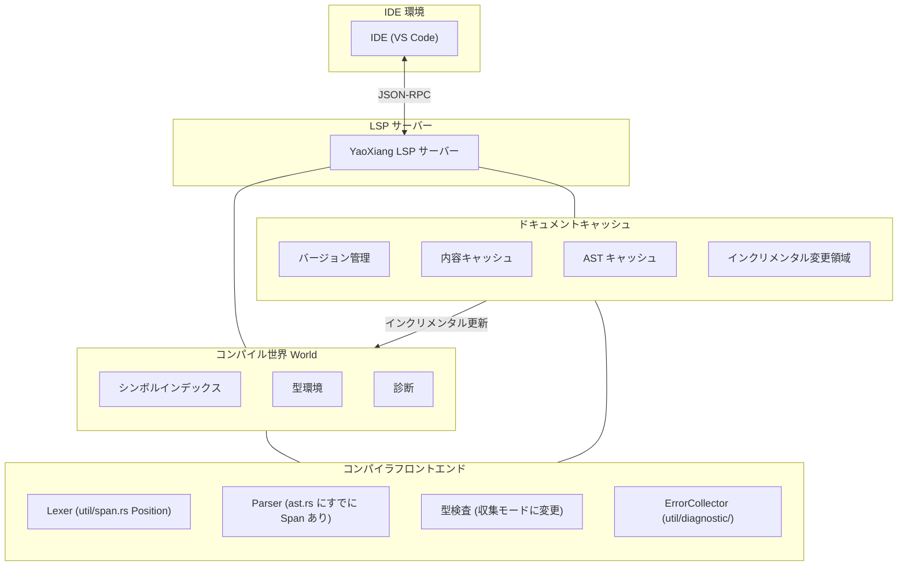

# RFC-017: 言語サーバープロトコル（LSP）サポート設計

>

>

>

> **参考**: RFC の書き方については [完全な例](../EXAMPLE_full_feature_proposal.md)
> を参照してください。

## ⚠️ 実装の前提条件（重要）

LSP を実装する前に、以下の 2 つの核心的な問題を解決する必要があります。

### 問題 1: 診断エラーの収集

**現状**: 現在の型検査器は、最初のエラーに遭遇した時点で `?`
演算子を使用して即座に return するため、すべてのエラーを収集できません。

**LSP の要件**: IDE は最初のエラーだけでなく、**すべての**エラーを表示する必要があります。

**解決方法**:

#### 1.1 エラー収集モード

- `src/frontend/typecheck/inference/` モジュールを修正し、`Result&lt;Type, Vec&lt;Error>>`
  を返すようにする
- エラー発生時に即座に return せず、検査を継続する
- 検査完了後にすべてのエラーをまとめて返す

#### 1.2 エラーレベル

重大度の異なるエラーを区別します。

```rust
enum ErrorKind {
    Error,      // 重大なエラー、連鎖エラーの原因となる可能性あり
    Warning,    // 警告、検査は続行するが中断はしない
    Note,       // 追加情報
}
```

- `Error` がある場合: `publishDiagnostics` でエラーを表示
- `Warning` のみの場合: コンパイルを続行し、警告を表示

#### 1.3 Parser のエラー復旧

- 解析エラー時、**プレースホルダーノード**（例: `MissingExpression`）を挿入し、処理を放棄しない
- AST が不完全なために型検査が panic するのを防ぐ
- 例: `let x = ;` → `let x = MissingExpression`

#### 1.4 遅延報告 (Delayed Emission)

- 一部のエラーは「連鎖的」である可能性がある（前のエラーが原因）
- まず収集し、AST の解析完了後に明らかな連鎖エラーをフィルタリングできる
- あるいは簡単に処理: すべて報告し、ユーザーに一つずつ修正させる

### 問題 2: ファイルレベルの解析キャッシュ

**現状**: すべての LSP リクエストで毎回ファイル全体を再解析しており、キャッシュ機構がありません。

**LSP の要件**: 編集のたびに、変更されていないファイルを再解析せずに迅速に応答する必要があります。

**解決方法**:

#### 2.1 ファイルキャッシュの構造

```rust
struct DocumentCache {
    version: u32,           // LSP ドキュメントバージョン番号
    content: String,        // 現在の内容
    content_hash: u64,      // 内容のハッシュ（高速比較用）
    ast: Option<Ast>,       // キャッシュされた AST（オプション）
}
```

#### 2.2 変更検出

- `textDocument/didChange` で新しい内容を受信するたび
- 新しい内容のハッシュを計算し、キャッシュの `content_hash` と比較
- **変更あり: ファイル全体を再解析**
- **変更なし: キャッシュ結果を直接返す**

#### 2.3 再解析戦略

- **ファイルレベル**: プロジェクト全体ではなく、現在のファイルのみを再解析
- これは簡略化設計であり、関数レベルのインクリメンタル解析は行わない
- 現代のコンピュータでは、数千行の単一ファイルの解析は数ミリ秒で完了する

#### 2.4 cargo check との違い

|      | cargo check          | YaoXiang LSP               |
| ---- | -------------------- | -------------------------- |
| 範囲 | プロジェクト全体     | 単一ファイル               |
| 頻度 | 手動トリガー         | 編集のたび                 |
| 目標 | 完全なコンパイル検査 | 高速なインクリメンタル応答 |

### 既存モジュールとの統合

| 既存モジュール                   | LSP 統合方法                                                            |
| -------------------------------- | ----------------------------------------------------------------------- |
| `util/span.rs`                   | ✅ すでに `Position`/`Span` を持ち、LSP `Position` に直接マッピング可能 |
| `util/diagnostic/collect.rs`     | ⚠️ 「収集モード」に修正し、エラーを継続的に蓄積する必要がある           |
| `frontend/core/lexer/symbols.rs` | ⚠️ 拡張が必要、`uri` + `span` の位置情報を追加                          |
| `frontend/typecheck/mod.rs`      | ⚠️ `TypeResult` を修正し、すべてのエラーを返す必要がある                |
| `frontend/core/parser/ast.rs`    | ✅ 各ノードにすでに `Span` があり、変更不要                             |

---

## 概要

YaoXiang に Language Server
Protocol（LSP）サポートを追加し、完全な言語サーバーを実装することで、主要な IDE（VS
Code、Neovim、Emacs など）がコード補完、定義へのジャンプ、診断、参照検索などの開発ツール機能を提供できるようにします。

## 動機

### なぜこの機能が必要なのか？

現在の YaoXiang 言語には公式の IDE 統合サポートがなく、開発者は基本的なテキストエディタを使ってコードを書くしかなく、以下が不足しています。

1. **コード補完** - コンテキストに基づいて識別子、キーワード、型をスマートに補完できない
2. **定義へジャンプ** - 関数、型、変数の定義位置に素早くジャンプできない
3. **リアルタイム診断** - 編集中に即座に構文エラーや型エラーを表示できない
4. **参照検索** - シンボルのすべての参照位置を検索できない
5. **ホバー表示** - マウスホバー時に型情報やドキュメントコメントを表示できない

LSP は現代的なプログラミング言語の標準装備であり、主要言語（Rust、Python、TypeScript、Go など）はすべて成熟した LSP 実装を提供しています。LSP サポートを実装することで、YaoXiang の開発体験が大幅に向上します。

### 現在の問題

1. **開発効率が低い** - コード補完とスマートヒントがない
2. **デバッグが困難** - シンボル定義を素早く特定できない
3. **学習曲線が急峻** - IDE の補助機能がない
4. **エコシステムが未成熟** - 現代の IDE に慣れた開発者を惹きつけられない

## 提案

### コア設計

JSON-RPC を介して IDE と通信する独立した LSP サーバープロセスを実装します。


```mermaid
flowchart TD
    subgraph IDE_Environment [IDE 環境]
        IDE["IDE (VS Code)"]
    end

    subgraph LSP_Server [LSP サーバー]
        LSP["YaoXiang LSP サーバー"]
    end

    subgraph World_Compile [コンパイル世界 World]
        direction TB
        W_Symbol["シンボルインデックス"]
        W_Type["型環境"]
        W_Diag["診断"]
    end

    subgraph Cache [ドキュメントキャッシュ]
        direction TB
        C_Version["バージョン管理"]
        C_Content["内容キャッシュ"]
        C_AST["AST キャッシュ"]
        C_Delta["インクリメンタル変更領域"]
    end

    subgraph Frontend [コンパイラフロントエンド]
        direction TB
        F_Lexer["Lexer (util/span.rs Position)"]
        F_Parser["Parser (ast.rs にすでに Span あり)"]
        F_TypeCheck["型検査 (収集モードに変更)"]
        F_ErrorCollector["ErrorCollector (util/diagnostic/)"]
    end

    IDE <-->|JSON-RPC| LSP

    LSP --- World_Compile
    LSP --- Cache

    Cache -- "インクリメンタル更新" --> World_Compile

    World_Compile --- Frontend
    Cache --- Frontend
```

### LSP サーバーアーキテクチャ

```
src/lsp/
├── main.rs              # LSP サーバーエントリポイント
├── server.rs           # サーバーのコアロジック
├── session.rs          # セッション管理
├── capabilities.rs     # サーバー能力宣言
├── handlers/
│   ├── mod.rs
│   ├── initialize.rs   # 初期化処理
│   ├── text_document.rs # ドキュメント操作処理
│   ├── completion.rs   # 補完処理
│   ├── definition.rs   # 定義ジャンプ処理
│   ├── references.rs   # 参照検索処理
│   ├── hover.rs        # ホバー表示処理
│   └── diagnostics.rs  # 診断処理
├── world.rs            # コンパイル世界（シンボルテーブル、AST キャッシュ）
├── scroller.rs         # シンボルインデックス構築
├── protocol.rs         # LSP プロトコル型定義
└── cache/              # インクリメンタルキャッシュモジュール（新規）
    ├── mod.rs
    ├── document.rs     # ドキュメントキャッシュ（バージョン、AST、シンボルテーブル）
    └── incremental.rs  # インクリメンタル解析戦略
```

### コンパイル世界（World）設計

グローバルなコンパイル状態を管理します。

- ドキュメントキャッシュ（バージョン、AST、シンボルテーブル）
- グローバルシンボルインデックス
- エラーコレクター
- 型環境キャッシュ

コアメソッド:

- `on_document_change`: インクリメンタル変更を処理
- `incremental_reparse`: インクリメンタル再解析
- `collect_diagnostics`: すべてのエラーを収集（中断しない）

### コア LSP メソッドサポート

| カテゴリ             | メソッド                                           | 説明                       |
| -------------------- | -------------------------------------------------- | -------------------------- |
| **ライフサイクル**   | `initialize` / `initialized` / `shutdown` / `exit` | サーバーのライフサイクル   |
| **ドキュメント同期** | `didOpen` / `didChange` / `didClose`               | ドキュメント管理           |
| **診断**             | `publishDiagnostics`                               | 診断の公開                 |
| **補完**             | `completion`                                       | コード補完                 |
| **ジャンプ**         | `definition`                                       | 定義へジャンプ             |
| **参照**             | `references`                                       | 参照検索                   |
| **ホバー**           | `hover`                                            | ホバー表示                 |
| **シンボル**         | `workspace/symbol`                                 | ワークスペースシンボル検索 |

### テキストドキュメント同期メカニズム

インクリメンタル同期戦略を使用します。

- ドキュメントバージョン番号を保持
- インクリメンタル変更（range + text）を適用
- 大規模変更時は全体置換にフォールバック

### シンボルインデックスの構築

既存のシンボルテーブルシステムを利用して、逆インデックスを構築します。

- `SymbolEntry` を拡張し、`location` フィールドを追加
- インデックス: 名前 → 位置リスト、ファイル → シンボルリスト

### コード補完の実装

補完ソース: キーワード、変数、関数、型、構造体フィールド、モジュール

### 定義ジャンプの実装

AST ベースのシンボル解決: 識別子 / 関数呼び出しに対応する定義位置を検索

## 詳細設計

### 型システムへの影響

1. **シンボル情報の拡張** - シンボルテーブルに位置情報（ファイル、行番号、列番号）を追加
2. **型情報の公開** - LSP ための型クエリインターフェースを提供
3. **ドキュメントコメントの統合** - コメントからドキュメント文字列を生成することをサポート

### ランタイムの動作

- LSP サーバーは独立したプロセスとして実行
- stdin/stdout を使用して JSON-RPC 通信
- マルチセッションの並行処理をサポート

### コンパイラーへの変更

| コンポーネント                | 変更                                         |
| ----------------------------- | -------------------------------------------- |
| `frontend/events`             | イベントシステムを拡張し、LSP 通知をサポート |
| `frontend/core/lexer/symbols` | シンボルテーブルを強化し、位置情報を追加     |
| 新規 `src/lsp/`               | LSP サーバーの実装                           |

### 後方互換性

- ✅ 完全な後方互換性
- LSP サーバーは独立したコンポーネントであり、既存のコンパイルフローに影響しない
- 既存の CLI ツールに影響なし

### 既存システムとの統合

1. **イベントシステム** - `frontend/events/` のイベント購読メカニズムを利用
2. **診断システム** - `util/diagnostic/` の診断出力を再利用
   - `ErrorCollector&lt;E>` を再利用し、すべてのエラーを収集
   - `Diagnostic` を LSP の `Diagnostic` 形式に変換
3. **シンボルテーブル** - `symbols.rs` のシンボル位置特定能力を拡張
   - `SymbolEntry` を拡張し、`location: Location` フィールドを追加
   - `SymbolIndex` 逆インデックスを構築（名前 -> 位置リスト）
4. **コンパイラフロントエンド** - Lexer、Parser、型検査を直接呼び出し
   - **重要な変更**: 型検査器を「収集モード」に変更し、実行を中断しない

#### 診断形式の変換

```rust
/// YaoXiang Diagnostic を LSP Diagnostic に変換
fn to_lsp_diagnostic(diag: &Diagnostic) -> lsp_types::Diagnostic {
    let severity = match diag.severity() {
        Severity::Error => lsp_types::DiagnosticSeverity::ERROR,
        Severity::Warning => lsp_types::DiagnosticSeverity::WARNING,
        Severity::Info => lsp_types::DiagnosticSeverity::INFORMATION,
    };

    lsp_types::Diagnostic {
        range: to_lsp_range(diag.span()),
        severity: Some(severity),
        message: diag.message().to_string(),
        code: diag.code().map(|c| lsp_types::NumberOrString::String(c.as_string())),
        ..Default::default()
    }
}

/// YaoXiang Span を LSP Range に変換
fn to_lsp_range(span: &Span) -> lsp_types::Range {
    lsp_types::Range {
        start: lsp_types::Position {
            line: span.start.line.saturating_sub(1), // LSP は 0-indexed
            character: span.start.column.saturating_sub(1),
        },
        end: lsp_types::Position {
            line: span.end.line.saturating_sub(1),
            character: span.end.column.saturating_sub(1),
        },
    }
}
```

## YaoXiang 特有の高級機能

YaoXiang の強力なコンパイル時評価と所有権システムを利用して、他の言語では実現できない独自の開発体験を提供します。

### 1. インレイヒント（Inlay Hints）

- **定数値ヒント**: コンパイル時に計算済みの定数を表示（例: `const MAX = 100 + 200` の横に `300`
  と表示）
- **可変性ヒント**: 変数が可変かどうかを表示（例: `mut x`、`x` に下線を引く）
- **所有権消費ヒント**: 関数の引数が消費されたかどうかを表示（例: `consumed` / `borrowed`）
- **空所有権セマンティクスのヒント**: 変数の色を薄くして move 後に再代入可能であることを表示
- **型推論ヒント**: 推論された具体的な型を表示（例: `x = vec![]` の横に `Vec<i32>`）

### 2. 所有権セマンティクスの可視化

- 変数の move パスを表示（定義位置からすべての使用位置まで）
- 借用ライフタイムの可視化

### 3. コンパイル時評価のプレビュー

- ホバー時に定数式のコンパイル時計算結果を表示

### 実装優先度

| 機能                 | 優先度 |
| -------------------- | ------ |
| 定数値インレイヒント | P0     |
| 可変性ヒント         | P0     |
| 所有権消費ヒント     | P1     |
| 所有権可視化         | P2     |

---

## 通信とリモートサポート

### 通信モード

3 つのモードをサポート:

| モード                | 用途                       |
| --------------------- | -------------------------- |
| stdio                 | ローカル開発（デフォルト） |
| TCP ソケット          | リモート開発 / デバッグ    |
| Unix ドメインソケット | 高性能ローカル通信         |

### リモートデバッグ

DAP（Debug Adapter Protocol）に基づいて実装:

- 行ブレークポイント、関数ブレークポイント、条件ブレークポイントのサポート
- YaoXiang 特有のブレークポイント: 変数が move されたときにトリガー

### 起動パラメータ

```bash
# ローカルモード
yaoxiang-lsp

# TCP サーバー
yaoxiang-lsp --tcp --port 8765

# デバッグも同時に有効化
yaoxiang-lsp --tcp --port 8765 --enable-debug
```

---

## 並行モデル

**設計上の決定: シングルスレッド + 非同期イベントループ**

理由:

- コンパイラはスレッドセーフではなく、改造コストが高い
- LSP リクエストは本質的に逐次的であり、並行処理は不要
- シングルスレッドの方がシンプルで、デバッグしやすい
- async I/O シングルスレッドで性能は十分

バックグラウンドタスクは `spawn_blocking` を使用してマルチコアを活用。

---

## LSP 内蔵テストツール (オプション)

> この機能は MVP には必須ではなく、後続のバージョンで追加できます。

JSON テストケース形式を提供:

```bash
# テストの実行
yaoxiang-lsp --test
```

---

## トレードオフ

### 利点

1. **開発体験の向上** - 主要言語に近い IDE サポート
2. **エコシステムの充実** - より多くの開発者が YaoXiang を使いたくなる
3. **コード品質の向上** - リアルタイム診断でランタイムエラーを削減
4. **コミュニティ貢献** - 開発者が LSP ツールチェーンの開発に参加できる

### 欠点

1. **実装の複雑さが高い** - 多くの LSP のエッジケースを処理する必要がある
2. **メンテナンスコスト** - LSP プロトコルのバージョンアップに追従する必要がある
3. **パフォーマンスの考慮** - 大規模プロジェクトのインデックスとクエリのパフォーマンス
4. **テストの難しさ** - IDE の動作をシミュレートしてテストする必要がある

## 代替案

| 案                             | 選択しない理由                         |
| ------------------------------ | -------------------------------------- |
| シンタックスハイライトのみ提供 | 現代的な開発ニーズを満たせない         |
| Tree-sitter を使用             | 追加の学習コストがかかり、機能も限定的 |

## 実装戦略

### 段階分け

1. **段階 0 (前提)**: コンパイラーへの適合 ⚠️ **重要**
   - 型検査器を「収集モード」に変更し、`Result&lt;Type, Vec&lt;Error>>` を返す
   - エラーレベル（Error / Warning / Note）の実装
   - Parser のエラー復旧: プレースホルダーノードの挿入
   - シンボルテーブル `SymbolEntry` を拡張し、`location` フィールドを追加
   - DocumentCache キャッシュシステム（バージョン + 内容 + ハッシュ）の実装
   - **この段階は LSP 実装の前提であり、必ず先に完了する必要がある**

2. **段階 1 (v0.7)**: 基本フレームワーク
   - LSP サーバーのスケルトン
   - ライフサイクルメソッド（initialize/shutdown/exit）
   - 基本的なロギングとエラー処理

3. **段階 2 (v0.7)**: 診断サポート
   - テキストドキュメント同期
   - コンパイル診断の統合
   - `textDocument/publishDiagnostics`

4. **段階 3 (v0.8)**: 補完サポート
   - シンボルインデックスの構築
   - キーワード補完
   - 識別子補完

5. **段階 4 (v0.8)**: ジャンプサポート
   - 定義へジャンプ
   - 参照検索
   - ホバー表示

6. **段階 5 (v0.9)**: 高度な機能
   - ワークスペースシンボル検索
   - コードフォーマット
   - リファクタリングサポート（オプション）

### 依存関係

- 外部 LSP ライブラリへの依存なし（`lsp-types` クレートを使用）
- 既存のコンパイラフロントエンドモジュールに依存
- JSON-RPC シリアライズに `serde_json` に依存

### リスク

1. **パフォーマンスの問題** - 大規模ファイルの解析で遅延が発生する可能性がある
   - 解決策: インクリメンタル解析、バックグラウンドスレッドでの処理
2. **メモリ使用量** - シンボルインデックスがメモリを占有する
   - 解決策: 遅延読み込み、LRU キャッシュ
3. **プロトコル互換性** - LSP バージョンの差異
   - 解決策: サポートするプロトコルバージョンを宣言

## オープンな問題

- [x] エラー収集メカニズム（「実装の前提条件」セクションを参照）
- [x] インクリメンタルキャッシュシステム（「実装の前提条件」セクションを参照）
- [x] LSP プロトコルバージョン: 3.18 を使用（Inlay Hints、Inline Values などの新機能をサポート）
- [x] リモート通信サポート（TCP 経由、LSP + デバッグを兼ねる）
- [x] リモートデバッグサポート（DAP プロトコルに基づく）
- [x] 並行モデル: シングルスレッド + async イベントループ
- [x] LSP 内蔵テストツール（オプション）: JSON テストケースを使用

---

## 付録（オプション）

### 付録A: 設計議論の記録

> 設計決定プロセスの詳細な議論を記録するために使用。

### 付録B: 設計決定の記録

| 決定                       | 結論                                                                         | 日付       | 記録者 |
| -------------------------- | ---------------------------------------------------------------------------- | ---------- | ------ |
| LSP サーバーアーキテクチャ | 独立したプロセス、stdio 通信                                                 | 2026-02-15 | 晨煦   |
| プロトコルバージョン       | LSP 3.18 をサポート（Inlay Hints などの新機能が必要）                        | 2026-02-22 | 晨煦   |
| エラー収集モード           | `Result&lt;Type, Vec&lt;Error>>` を返し、エラーレベルとエラー復旧をサポート  | 2026-02-22 | 晨煦   |
| キャッシュ戦略             | ファイルレベルキャッシュ: バージョン + 内容 + ハッシュ、ファイル全体を再解析 | 2026-02-22 | 晨煦   |
| 通信モード                 | stdio + TCP + UnixSocket をサポート                                          | 2026-02-22 | 晨煦   |
| リモートデバッグ           | DAP プロトコルに基づき、LSP とトランスポート層を共有                         | 2026-02-22 | 晨煦   |
| 並行モデル                 | シングルスレッド + async イベントループ                                      | 2026-02-22 | 晨煦   |
| テストツール（オプション） | JSON テストケース + 内蔵テストランナー                                       | 2026-02-22 | 晨煦   |

### 付録C: 用語集

| 用語                 | 定義                                                          |
| -------------------- | ------------------------------------------------------------- |
| LSP                  | Language Server Protocol、言語サーバープロトコル              |
| JSON-RCP             | JSON-Remote Procedure Call、JSON リモートプロシージャ呼び出し |
| DAP                  | Debug Adapter Protocol、デバッグアダプタプロトコル            |
| シンボルインデックス | コンパイル時に構築されるシンボル位置マッピング表              |
| コンパイル世界       | すべてのコンパイル情報を含むコンテキスト                      |
| インレイヒント       | Inlay Hints、行内に表示されるヒント情報                       |
| 所有権追跡           | Ownership Trace、変数の所有権フローの可視化                   |

---

## 参考文献

- [Language Server Protocol 仕様](https://microsoft.github.io/language-server-protocol/)
- [LSP 仕様 3.18](https://github.com/microsoft/language-server-protocol/blob/main/specifications/specification-3-18.md)
- [Debug Adapter Protocol 仕様](https://microsoft.github.io/debug-adapter-protocol/)
- [Rust Analyzer](https://rust-analyzer.github.io/) - 参考実装
- [lsp-types クレート](https://crates.io/crates/lsp-types) - LSP 型定義
- [JSON-RPC 2.0 仕様](https://www.jsonrpc.org/specification)

---

## ライフサイクルと帰結

RFC には以下のステータス遷移があります。

```
┌─────────────┐
│   草案      │  ← 著者による作成
└──────┬──────┘
       │
       ▼
┌─────────────┐
│  レビュー中     │  ← コミュニティでの議論
└──────┬──────┘
       │
       ├──────────────────┐
       ▼                  ▼
┌─────────────┐    ┌─────────────┐
│  承認済み     │    │   拒否済み     │
└──────┬──────┘    └──────┬──────┘
       │                  │
       ▼                  ▼
┌─────────────┐    ┌─────────────┐
│   accepted/ │    │  rejected/  │
│ (正式設計)  │     │ (拒否)     │
└──────┬──────┘    └──────┬──────┘
       │                  │
       ▼                  ▼
┌─────────────┐    ┌─────────────┐
│   実装済み   │    │   却下済み   │
└─────────────┘    └─────────────┘
```

### ステータスの説明

| ステータス     | 位置                        | 説明                                         |
| -------------- | --------------------------- | -------------------------------------------- |
| **草案**       | `docs/design/rfc/draft/`    | 著者のドラフト、レビュー待ち                 |
| **レビュー中** | `docs/design/rfc/review/`   | オープンなコミュニティ議論とフィードバック   |
| **承認済み**   | `docs/design/accepted/`     | 正式な設計ドキュメントになり、実装段階に入る |
| **拒否済み**   | `docs/design/rfc/`          | RFC ディレクトリに残し、ステータスを更新     |
| **実装済み**   | `docs/design/rfc/accepted/` | 実装が完了し、公式機能として採用             |

### 承認後の操作

1. RFC を `docs/design/accepted/` ディレクトリに移動
2. ファイル名を説明的な名前に更新（例: `lsp-support.md`）
3. ステータスを「正式」に更新
4. ステータスを「承認済み」に更新し、承認日を追加

### 拒否後の操作

1. `docs/design/rfc/draft/` ディレクトリに保持
2. ファイルの先頭に拒否理由と日付を追加
3. ステータスを「拒否済み」に更新

### 議論確定後の操作

オープンな問題について合意に達した場合:

1. **付録Aを更新**: 議論テーマの下に「決議」を記入
2. **本文を更新**: 決定をドキュメント本文に同期
3. **決定を記録**: 「付録B: 設計決定の記録」に追加
4. **問題マーク**: 「オープンな問題」リストで `[x]` をチェック

---

> **注**:
> RFC 番号は議論段階でのみ使用されます。承認後は番号を削除し、説明的なファイル名を使用します。
