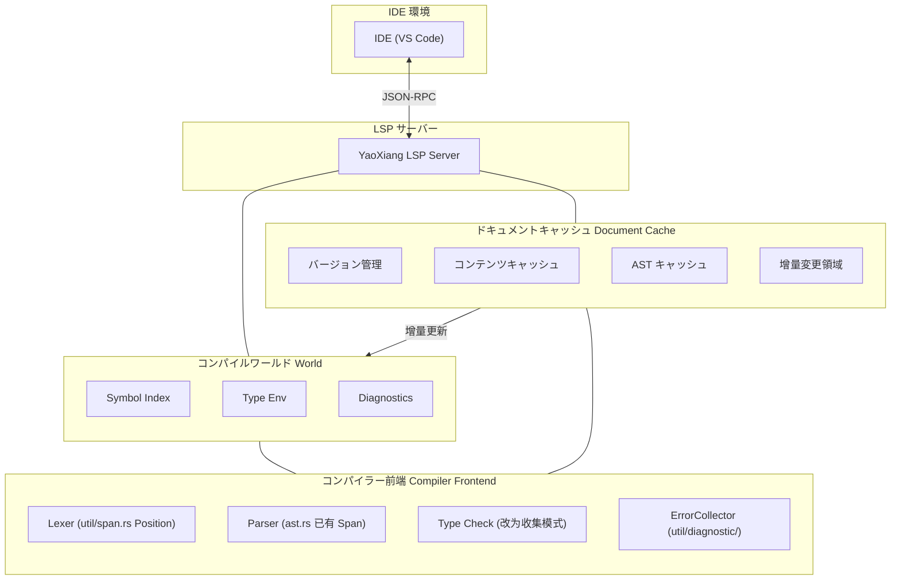

# RFC-017: 言語サーバープロトコル（LSP）サポート設計

>

>

>

> **参考**: 完全な例は [完全機能提案](EXAMPLE_full_feature_proposal.md) をご覧ください。

## ⚠️ 実装前提条件（重要）

LSP を実装する前に、以下の2つの核心的な問題を解決する必要があります：

### 問題 1：診断エラーの収集

**現状**: 現在の型チェッカーは最初のエラーに遭遇するとすぐに `?`
演算子で返回するため、すべてのエラーを収集できません。

**LSP 要件**: IDE は最初の一つではなく、**すべての**エラーを表示する必要があります。

**解決策**:

#### 1.1 エラー収集パターン

- `src/frontend/typecheck/inference/` モジュールを変更し、`Result<Type, Vec<Error>>` を返す
- エラーに遭遇しても即座に返回せず、检查，继续执行
- 检查完成后统一返回所有错误

#### 1.2 エラーレベル

深刻度が異なるエラーを区別する：

```rust
enum ErrorKind {
    Error,      // 重大エラー、カスケードエラーの原因となる可能性
    Warning,    // 警告、检查は続行するがブロックしない
    Note,       // 追加情報
}
```

- `Error` がある場合：`publishDiagnostics` でエラーを表示
- `Warning` のみの場合：コンパイルを続行し、警告を表示

#### 1.3 Parser エラー回復

- 解析エラー時、処理を中断するのではなく **プレースホルダーノード**（例：`MissingExpression`）を挿入
- AST が不完全なことによる型チェックのパニックを回避
- 例：`let x = ;` → `let x = MissingExpression`

#### 1.4 遅延レポート (Delayed Emission)

- 一部のエラーは「級連」的である場合があります（前述のエラーが原因）
- まず収集し、AST の解析後に明らかな級連エラーをフィルタリングできます
- またはシンプルな処理：すべてレポートし、ユーザーに逐一修正させる

### 問題 2：ファイルレベル解析キャッシュ

**現状**: 各 LSP 要求でファイル全体を再解析し、キャッシュメカニズムがありません。

**LSP 要件**: 各編集に迅速に反応し、変化のないファイルの再解析は不要。

**解決策**:

#### 2.1 ファイルキャッシュ構造

```rust
struct DocumentCache {
    version: u32,           // LSP ドキュメントバージョン番号
    content: String,        // 現在のコンテンツ
    content_hash: u64,      // コンテンツハッシュ（高速比較用）
    ast: Option<Ast>,       // キャッシュされた AST（オプション）
}
```

#### 2.2 変化の検出

- 各 `textDocument/didChange` で新しいコンテンツを受信
- 新しいコンテンツのハッシュを計算し、キャッシュされた `content_hash` と比較
- **変化がある場合：ファイル全体を再解析**
- **変化がない場合：キャッシュ結果を直接返す**

#### 2.3 再解析ストラテジー

- **ファイルレベル**：現在のファイルのみを再解析プロジェクト全体ではない
- これはシンプルな設計で、関数レベルの增量解析は行わない
- 現代のコンピュータでは数千行のファイルを数ミリ秒で解析可能

#### 2.4 cargo check との違い

|      | cargo check            | YaoXiang LSP |
| ---- | ---------------------- | ------------ |
| 範囲 | プロジェクト全体       | 単一ファイル |
| 頻度 | 手動トリガー           | 各編集時     |
| 目標 | 完全コンパイルチェック | 高速增量応答 |

### 既存モジュールとの統合

| 既存モジュール                   | LSP 統合方式                                                         |
| -------------------------------- | -------------------------------------------------------------------- |
| `util/span.rs`                   | ✅ `Position`/`Span` は既にあり、LSP `Position` に直接マッピング可能 |
| `util/diagnostic/collect.rs`     | ⚠️ 「収集モード」に変更し、継続的にエラーを蓄積する必要がある        |
| `frontend/core/lexer/symbols.rs` | ⚠️ 拡張が必要、`uri` + `span` 位置情報を追加                         |
| `frontend/typecheck/mod.rs`      | ⚠️ `TypeResult` を変更、すべてのエラーを返す必要がある               |
| `frontend/core/parser/ast.rs`    | ✅ 各ノードには既に `Span` があり、変更不要                          |

---

## 摘要

为 YaoXiang 添加 Language Server Protocol（LSP）支持，实现完整的语言服务器，使主流 IDE（VS
Code、Neovim、Emacs 等）能够提供代码补全、跳转定义、诊断、引用搜索等开发工具功能。

YaoXiang に Language Server
Protocol（LSP）サポートを追加し、完全な言語サーバーを実装することで、主流 IDE（VS
Code、Neovim、Emacs など）がコード補完、定義へのジャンプ、診断、参照検索などの開発ツール機能を提供できるようにします。

## 動機

### なぜこの機能が必要なのか？

現在 YaoXiang 言語には公式の IDE 統合サポートがなく、開発者は基礎的なテキストエディターでしかコードを書くことができず、以下が不足しています：

1. **コード補完** - コンテキストに基づいてインテリジェントに識別子、キーワード、型を補完できない
2. **定義へのジャンプ** - 関数、型、変数の定義位置に素早くジャンプできない
3. **リアルタイム診断** - 編集時に構文エラーや型エラーを即座に表示できない
4. **参照検索** - シンボルのすべての参照位置を検索できない
5. **ホバリングヒント** - マウスをホバーしたときに型情報やドキュメントコメントを表示できない

LSP は現代のプログラミング言語の標準装備であり、主流言語（Rust、Python、TypeScript、Go など）はすべて成熟した LSP 実装を提供していません。LSP サポートを実装することで、YaoXiang の開発体験が大幅に向上します。

### 現在の問題

1. **開発効率が低い** - コード補完とインテリジェントなヒントがない
2. **デバッグが困難** - シンボル定義を素早く特定できない
3. **学習曲線が急** - IDE の補助機能がない
4. **エコシステムが未完成** - 現代の IDE に慣れた開発者を惹きつけられない

## 提案

### コアデザイン

JSON-RPC を通じて IDE と通信する独立した LSP サーバープロセスを実装します：


```mermaid
flowchart TD
    subgraph IDE_Environment [IDE 環境]
        IDE["IDE (VS Code)"]
    end

    subgraph LSP_Server [LSP サーバー]
        LSP["YaoXiang LSP Server"]
    end

    subgraph World_Compile [コンパイルワールド World]
        direction TB
        W_Symbol["Symbol Index"]
        W_Type["Type Env"]
        W_Diag["Diagnostics"]
    end

    subgraph Cache [ドキュメントキャッシュ Document Cache]
        direction TB
        C_Version["バージョン管理"]
        C_Content["コンテンツキャッシュ"]
        C_AST["AST キャッシュ"]
        C_Delta["增量変更領域"]
    end

    subgraph Frontend [コンパイラー前端 Compiler Frontend]
        direction TB
        F_Lexer["Lexer (util/span.rs Position)"]
        F_Parser["Parser (ast.rs 已有 Span)"]
        F_TypeCheck["Type Check (改为收集模式)"]
        F_ErrorCollector["ErrorCollector (util/diagnostic/)"]
    end

    IDE <-->|JSON-RPC| LSP

    LSP --- World_Compile
    LSP --- Cache

    Cache -- "增量更新" --> World_Compile

    World_Compile --- Frontend
    Cache --- Frontend
```

### LSP サーバーアーキテクチャ

```
src/lsp/
├── main.rs              # LSP サーバーエントリーポイント
├── server.rs           # サーバーコアロジック
├── session.rs          # セッション管理
├── capabilities.rs     # サーバー機能宣言
├── handlers/
│   ├── mod.rs
│   ├── initialize.rs   # 初期化処理
│   ├── text_document.rs # ドキュメント操作処理
│   ├── completion.rs   # 補完処理
│   ├── definition.rs   # 定義へのジャンプ処理
│   ├── references.rs   # 参照検索処理
│   ├── hover.rs        # ホバーhint処理
│   └── diagnostics.rs  # 診断処理
├── world.rs            # コンパイルワールド（シンボルテーブル、AST キャッシュ）
├── scroller.rs         # シンボルインデックス構築
├── protocol.rs         # LSP プロトコル型定義
└── cache/              # 增量キャッシュモジュール（新規）
    ├── mod.rs
    ├── document.rs     # ドキュメントキャッシュ（バージョン、AST、シンボルテーブル）
    └── incremental.rs  # 增量解析ストラテジー
```

### コンパイルワールド（World）デザイン

グローバルコンパイル状態を管理します：

- ドキュメントキャッシュ（バージョン、AST、シンボルテーブル）
- グローバルシンボルインデックス
- エラーコレクター
- 型環境キャッシュ

コアメソッド：

- `on_document_change`：增量変更を処理
- `incremental_reparse`：增量再解析
- `collect_diagnostics`：すべてのエラーを収集（ブロックしない）

### コア LSP メソッドサポート

| カテゴリ             | メソッド                                           | 説明                       |
| -------------------- | -------------------------------------------------- | -------------------------- |
| **ライフサイクル**   | `initialize` / `initialized` / `shutdown` / `exit` | サーバーLifecycle          |
| **ドキュメント同期** | `didOpen` / `didChange` / `didClose`               | ドキュメント管理           |
| **診断**             | `publishDiagnostics`                               | 診断Publish                |
| **補完**             | `completion`                                       | コード補完                 |
| **ジャンプ**         | `definition`                                       | 定義にジャンプ             |
| **参照**             | `references`                                       | 参照を検索                 |
| **ホバー**           | `hover`                                            | ホバーhint                 |
| **シンボル**         | `workspace/symbol`                                 | ワークスペースシンボル検索 |

### テキストドキュメント同期メカニズム

增量同期ストラテジーを使用：

- ドキュメントバージョン番号を保持
- 增量変更を適用（range + text）
- 大規模な変更時は完全置換に降格

### シンボルインデックス構築

既存のシンボルテーブルシステムを活用し、逆インデックスを構築：

- `SymbolEntry` を拡張し、`location` フィールドを追加する必要がある
- インデックス：名前 → 位置リスト、ファイル → シンボルリスト

### コード補完実装

補完ソース：キーワード、変数、関数、型、構造体フィールド、モジュール

### 定義へのジャンプ実装

AST ベースのシンボル解析：識別子/関数呼び出しに対応する定義位置を検索

## 詳細デザイン

### 型システムへの影響

1. **シンボル情報拡張** - シンボルテーブルに位置情報（ファイル、行番号、列番号）を追加
2. **型情報露出** - LSP に型クエリインターフェースを提供
3. **ドキュメントコメント統合** - コメントからドキュメント文字列を生成するサポート

### ランタイム動作

- LSP サーバーは独立プロセスとして実行
- stdin/stdout を使用して JSON-RPC 通信
- マルチセッション同時処理をサポート

### コンパイラーの変更

| コンポーネント                | 変更                                             |
| ----------------------------- | ------------------------------------------------ |
| `frontend/events`             | LSP 通知をサポートするようイベントシステムを拡張 |
| `frontend/core/lexer/symbols` | シンボルテーブルを強化し、位置情報を追加         |
| 新規 `src/lsp/`               | LSP サーバー実装                                 |

### 後方互換性

- ✅ 完全な後方互換性
- LSP サーバーは独立コンポーネントであり、既存のコンパイルフローに影響を与えない
- 既存の CLI ツールは影響を受けない

### 既存システムとの統合

1. **イベントシステム** - `frontend/events/` のイベントサブスクリプション機構を活用
2. **診断システム** - `util/diagnostic/` の診断出力を再利用
   - `ErrorCollector<E>` を再利用し、すべてのエラーを収集
   - `Diagnostic` を LSP の `Diagnostic` フォーマットに変換
3. **シンボルテーブル** - `symbols.rs` のシンボル位置決め能力を拡張
   - `SymbolEntry` を拡張し、`location: Location` フィールドを追加
   - `SymbolIndex` 逆インデックスを構築（名前 -> 位置リスト）
4. **コンパイラー前端** - Lexer、Parser、型チェックを直接呼び出し
   - **重要な変更**：型チェッカーを「収集モード」に変更し、実行をブロックしない

#### 診断フォーマット変換

```rust
/// YaoXiang Diagnostic を LSP Diagnostic に変換
fn to_lsp_diagnostic(diag: &Diagnostic) -> lsp_types::Diagnostic {
    let severity = match diag.severity() {
        Severity::Error => lsp_types::DiagnosticSeverity::ERROR,
        Severity::Warning => lsp_types::DiagnosticSeverity::WARNING,
        Severity::Info => lsp_types::DiagnosticSeverity::INFORMATION,
    };

    lsp_types::Diagnostic {
        range: to_lsp_range(diag.span()),
        severity: Some(severity),
        message: diag.message().to_string(),
        code: diag.code().map(|c| lsp_types::NumberOrString::String(c.as_string())),
        ..Default::default()
    }
}

/// YaoXiang Span を LSP Range に変換
fn to_lsp_range(span: &Span) -> lsp_types::Range {
    lsp_types::Range {
        start: lsp_types::Position {
            line: span.start.line.saturating_sub(1), // LSP は 0-indexed を使用
            character: span.start.column.saturating_sub(1),
        },
        end: lsp_types::Position {
            line: span.end.line.saturating_sub(1),
            character: span.end.column.saturating_sub(1),
        },
    }
}
```

## YaoXiang 固有の高度な機能

YaoXiang の強力なコンパイル時評価と所有権システムを活用し、他の言語では実現できない独自の開発体験を提供します：

### 1. 幽灵ヒント（Inlay Hints）

- **定数值ヒント**：コンパイル時に計算済みの定数を表示（例：`const MAX = 100 + 200` の横に `300`
  を表示）
- **可変性ヒント**：変数が可変かどうかを表示（例：`mut x` の `x` には明確なアンダーライン）
- **所有権消費ヒント**：関数パラメータが消費されたかどうかを表示（例：`consumed` / `borrowed`）
- **空所有権semanticsヒント**：変数の色を減らすことで、変数が move された後に再代入できることのヒントを表示
- **型推論ヒント**：推論された具体的な型を表示（例：`x = vec![]` の横に `Vec<i32>` を表示）

### 2. 所有権semantics可視化

- 変数の move パスを表示（定義位置からすべての使用位置まで）
- 借用ライフタイムの可視化

### 3. コンパイル時評価プレビュー

- ホバーで定数式のコンパイル時計算結果を表示

### 実装優先度

| 機能                 | 優先度 |
| -------------------- | ------ |
| 定数值インレイヒント | P0     |
| 可変性ヒント         | P0     |
| 所有権消費ヒント     | P1     |
| 所有権可視化         | P2     |

---

## 通信とリモートサポート

### 通信モード

3つのモードをサポート：

| モード             | 用途                       |
| ------------------ | -------------------------- |
| stdio              | ローカル開発（デフォルト） |
| TCP Socket         | リモート開発/デバッグ      |
| Unix Domain Socket | 高性能ローカル通信         |

### リモートデバッグ

DAP（Debug Adapter Protocol）に基づく実装：

- 行ブレークポイント、関数ブレークポイント、条件ブレークポイントをサポート
- YaoXiang 固有ブレークポイント：変数が move されたときにトリガー

### 起動パラメータ

```bash
# ローカルモード
yaoxiang-lsp

# TCP サーバー
yaoxiang-lsp --tcp --port 8765

# デバッグを有効にして起動
yaoxiang-lsp --tcp --port 8765 --enable-debug
```

---

## 並行モデル

**設計決定：シングルスレッド + 非同期イベントループ**

理由：

- コンパイラーはスレッドセーフではなく、改造成本が高い
- LSP 要求は本質的にシリアライズされており、並行処理は不要
- シングルスレッドの方がシンプルでデバッグしやすい
- async I/O シングルスレッドで性能は十分

バックグラウンドタスクは `spawn_blocking` を使用してマルチコアを活用します。

---

## LSP 内蔵テストツール (オプション)

> この機能は MVP 必須ではなく、後続バージョンで追加できます。

JSON テストケースフォーマットを提供：

```bash
# テスト実行
yaoxiang-lsp --test
```

---

## トレードオフ

### メリット

1. **開発体験向上** - 主流言語に近い IDE サポート
2. **エコシステム整備** - より多くの開発者に YaoXiang を使用してもらえる
3. **コード品質向上** - リアルタイム診断でランタイムエラーを削減
4. **コミュニティ貢献** - 開発者が LSP ツールチェーン開発に参加できる

### デメリット

1. **実装複雑度が高い** - 大量のエッジケースを処理する必要がある
2. **メンテナンスコスト** - LSP プロトコルバージョンの更新に追従する必要がある
3. **性能考慮** - 大規模プロジェクトのインデックスとクエリ性能
4. **テスト難易度** - IDE 動作をシミュレートしてテストする必要がある

## 代替案

| 案                     | なぜ選択しないか                           |
| ---------------------- | ------------------------------------------ |
| 構文ハイライトのみ提供 | 現代の 개발 ニーズを満たせない             |
| Tree-sitter を使用     | 追加学習コストがかかり、功能も限定的である |

## 実装ストラテジー

### フェーズ分け

1. **フェーズ 0 (前置)**: コンパイラー適応 ⚠️ **重要**
   - 型チェッカーを「収集モード」に変更し、`Result<Type, Vec<Error>>` を返す
   - エラーレベル（Error / Warning / Note）を実装
   - Parser エラー回復：プレースホルダーノードを挿入
   - シンボルテーブル `SymbolEntry` を拡張し、`location` フィールドを追加
   - DocumentCache キャッシュシステムを実装（バージョン + コンテンツ + ハッシュ）
   - **このフェーズは LSP 実装の前提であり、まず完了する必要がある**

2. **フェーズ 1 (v0.7)**: 基礎フレームワーク
   - LSP サーバースキルトン
   - ライフサイクルメソッド（initialize/shutdown/exit）
   - 基本的なログとエラー処理

3. **フェーズ 2 (v0.7)**: 診断サポート
   - テキストドキュメント同期
   - コンパイル診断統合
   - `textDocument/publishDiagnostics`

4. **フェーズ 3 (v0.8)**: 補完サポート
   - シンボルインデックス構築
   - キーワード補完
   - 識別子補完

5. **フェーズ 4 (v0.8)**: ジャンプサポート
   - 定義へのジャンプ
   - 参照の検索
   - ホバーhint

6. **フェーズ 5 (v0.9)**: 高度な機能
   - ワークスペースシンボル検索
   - コードフォーマット
   - リファクタリングサポート（オプション）

### 依存関係

- 外部 LSP ライブラリへの依存なし（`lsp-types` crate を使用）
- 既存のコンパイラー前端モジュールに依存
- JSON-RPC シリアライズに `serde_json` に依存

### リスク

1. **性能問題** - 大ファイル解析によりフリーズが発生する可能性がある
   - 解決：增量解析、バックグラウンドスレッド処理
2. **メモリ使用量** - シンボルインデックスがメモリを占有する
   - 解決：遅延ロード、LRU キャッシュ
3. **プロトコル互換性** - LSP バージョンの差異
   - 解決：サポートするプロトコルバージョンを宣言

## オープン問題

- [x] エラー収集メカニズム（「実装前提条件」章を参照）
- [x] 增量キャッシュシステム（「実装前提条件」章を参照）
- [x] LSP プロトコルバージョン：3.18 を使用（Inlay Hints、Inline Values などの新機能をサポート）
- [x] リモート通信サポート（TCP 経由、LSP + デバッグを兼顾）
- [x] リモートデバッグサポート（DAP プロトコルに基づく）
- [x] 並行モデル：シングルスレッド + async イベントループ
- [x] LSP 内蔵テストツール（オプション）：JSON テストケースを使用

---

## 付録（オプション）

### 付録A：設計議論記録

> 設計決定プロセスの詳細な議論を記録するために使用。

### 付録B：設計決定記録

| 決定                       | 決定                                                                               | 日付       | 記録者 |
| -------------------------- | ---------------------------------------------------------------------------------- | ---------- | ------ |
| LSP サーバーアーキテクチャ | 独立プロセス、stdio 経由で通信                                                     | 2026-02-15 | 晨煦   |
| プロトコルバージョン       | LSP 3.18 をサポート（Inlay Hints などの新機能が必要）                              | 2026-02-22 | 晨煦   |
| エラー収集モード           | `Result<Type, Vec<Error>>` を返し、エラーレベルとエラー回復をサポート              | 2026-02-22 | 晨煦   |
| キャッシュストラテジー     | ファイルレベルキャッシュ：バージョン + コンテンツ + ハッシュ、ファイル全体を再解析 | 2026-02-22 | 晨煦   |
| 通信モード                 | stdio + TCP + UnixSocket をサポート                                                | 2026-02-22 | 晨煦   |
| リモートデバッグ           | DAP プロトコルに基づき、LSP と 전송層を共有                                        | 2026-02-22 | 晨煦   |
| 並行モデル                 | シングルスレッド + async イベントループ                                            | 2026-02-22 | 晨煦   |
| テストツール（オプション） | JSON テストケース + 内蔵テストランナー                                             | 2026-02-22 | 晨煦   |

### 付録C：用語集

| 用語                 | 定義                                                          |
| -------------------- | ------------------------------------------------------------- |
| LSP                  | Language Server Protocol、言語サーバープロトコル              |
| JSON-RCP             | JSON-Remote Procedure Call、JSON リモートプロシージャ呼び出し |
| DAP                  | Debug Adapter Protocol、デバッグアダプタプロトコル            |
| シンボルインデックス | コンパイル時に構築されるシンボル位置マッピングテーブル        |
| コンパイルワールド   | すべてのコンパイル情報を含むコンテキスト                      |
| 幽灵ヒント           | Inlay Hints、行内に表示されるヒント情報                       |
| 所有権追踪           | Ownership Trace、変数の所有権の流れの可視化                   |

---

## 参考文献

- [Language Server Protocol 仕様](https://microsoft.github.io/language-server-protocol/)
- [LSP 仕様 3.18](https://github.com/microsoft/language-server-protocol/blob/main/specifications/specification-3-18.md)
- [Debug Adapter Protocol 仕様](https://microsoft.github.io/debug-adapter-protocol/)
- [Rust Analyzer](https://rust-analyzer.github.io/) - 参考実装
- [lsp-types crate](https://crates.io/crates/lsp-types) - LSP 型定義
- [JSON-RPC 2.0 仕様](https://www.jsonrpc.org/specification)

---

## ライフサイクルと行き先

RFC には以下の状態フローがあります：

```
┌─────────────┐
│   下書き      │  ← 作成者が作成
└──────┬──────┘
       │
       ▼
┌─────────────┐
│  審査中     │  ← コミュニティ議論
└──────┬──────┘
       │
       ├──────────────────┐
       ▼                  ▼
┌─────────────┐    ┌─────────────┐
│  承認済み     │    │   却下済み     │
└──────┬──────┘    └──────┬──────┘
       │                  │
       ▼                  ▼
┌─────────────┐    ┌─────────────┐
│   accepted/ │    │  rejected/  │
│ (正式設計)  │     │ (却下)     │
└─────────────┘    └─────────────┘
```

### ステータス説明

| ステータス   | 場所                      | 説明                                           |
| ------------ | ------------------------- | ---------------------------------------------- |
| **下書き**   | `docs/design/rfc/draft/`  | 著者の下書き番、毛審查提出を待つ               |
| **審査中**   | `docs/design/rfc/review/` | コミュニティ議論とフィードバックを開示         |
| **承認済み** | `docs/design/accepted/`   | 正式設計ドキュメントとなり、実装フェーズに入る |
| **却下済み** | `docs/design/rfc/`        | RFC ディレクトリに残し、ステータスを更新       |

### 承認後の操作

1. RFC を `docs/design/accepted/` ディレクトリに移動
2. ファイル名を記述的名称（例：`lsp-support.md`）に更新
3. ステータスを「正式」に更新
4. ステータスを「承認済み」に更新し、承認日を追加

### 却下後の操作

1. `docs/design/rfc/draft/` ディレクトリに残す
2. ファイル上部に却下理由と日付を追加
3. ステータスを「却下済み」に更新

### 議論確定後の操作

あるオープン問題がコンセンサスに達したとき：

1. **付録A を更新**: 議論テーマ下に「決議」を記入
2. **本文を更新**: 決定をドキュメント本文に同期
3. **決定を記録**: 「付録B：設計決定記録」に追加
4. **問題をマーク**: 「オープン問題」リストで `[x]` をチェック
