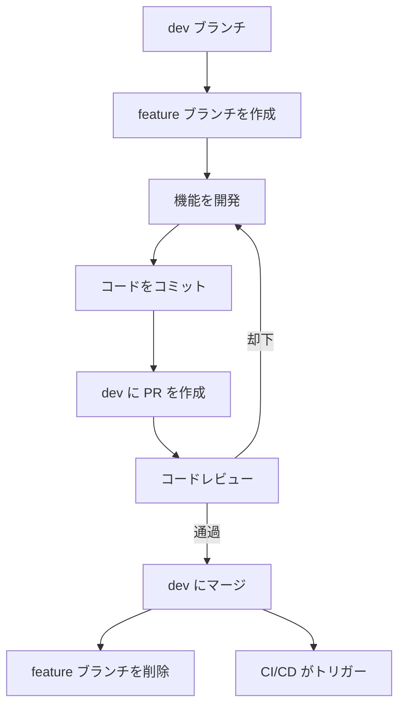
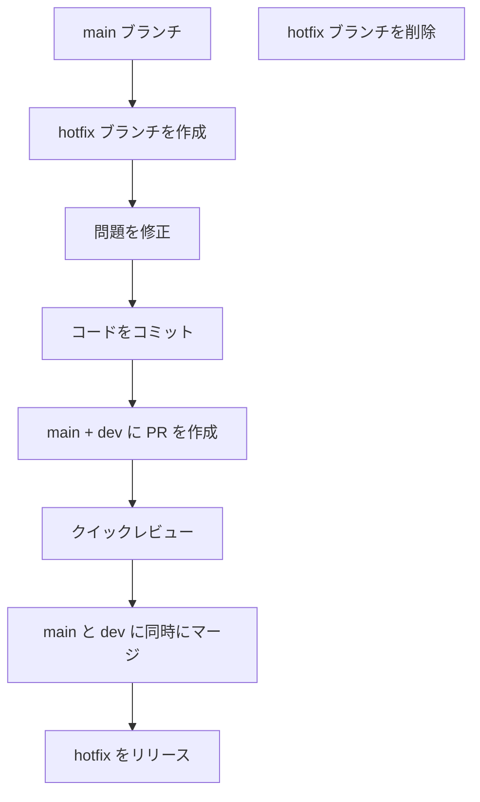
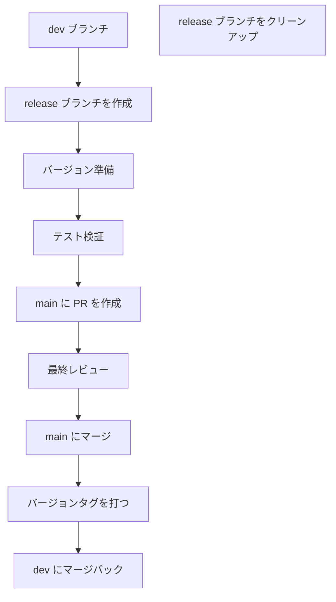

# Git ブランチメンテナンスマニュアル

> 本手册定义了 YaoXiang 项目的 Git 分支管理策略，旨在确保代码库的有序开发和高效协作。

本マニュアルは YaoXiang プロジェクトの Git ブランチ管理戦略を定義し、コードベースの秩序ある開発と効率的なコラボレーションを確保することを目的としています。

---

## 📋 目次

- [ブランチタイプ仕様](#ブランチタイプ仕様)
- [命名規則](#命名規則)
- [ブランチライフサイクル](#ブランチライフサイクル)
- [ワークフロー](#ワークフロー)
- [ブランチ保護ポリシー](#ブランチ保護ポリシー)
- [ベストプラクティス](#ベストプラクティス)
- [よくある質問](#よくある質問)

---

## 🏷️ ブランチタイプ仕様

### コアブランチ（Core Branches）

| ブランチ名 | 用途 | ライフサイクル | 保護レベル |
|------------|------|----------------|------------|
| `main` | 本番環境コード | 永久 | 厳格保護 |
| `dev` | メイン開発ブランチ | 永久 | 中程度保護 |
| `master` | メインブランチ（互換性） | 永久 | 厳格保護 |

### 機能ブランチ（Feature Branches）

| プレフィックス | 用途 | 命名例 | マージ先 |
|----------------|------|--------|----------|
| `feature/` | 新機能開発 | `feature/type-inference`<br>`feature/ownership-model` | `dev` |
| `bugfix/` | 既知の欠陥修正 | `bugfix/memory-leak`<br>`bugfix/parser-error` | `dev` |
| `hotfix/` | 緊急の本番環境問題修正 | `hotfix/security-patch`<br>`hotfix/crash-bug` | `main` + `dev` |
| `release/` | リリース準備ブランチ | `release/v0.8.0`<br>`release/v1.0.0` | `main` |

### 補助ブランチ（Auxiliary Branches）

| プレフィックス | 用途 | 命名例 | マージ先 |
|----------------|------|--------|----------|
| `docs/` | ドキュメント更新 | `docs/api-reference`<br>`docs/tutorial-update` | `dev` |
| `ci/` | CI/CD 設定変更 | `ci/add-deploy-script`<br>`ci/optimize-build` | `dev` |
| `refactor/` | コードリファクタリング | `refactor/lexer-optimization`<br>`refactor/memory-manager` | `dev` |
| `test/` | テスト関連変更 | `test/add-integration`<br>`test/performance-bench` | `dev` |

---

## 📝 命名規則

### 基本命名フォーマット

```bash
# 機能ブランチ
<type>/<short-description>

# 例
feature/add-type-inference
bugfix/fix-parser-crash
hotfix/security-vulnerability
```

### 命名規範

1. **小文字を使用**：すべてのブランチ名は小文字を使用
2. **ハイフンで区切る**：単語の区切りには `-` を使用し、アンダースコアは使用しない
3. **説明的な命名**：ブランチ名は用途を明確に表現すること
4. **特殊文字を避ける**：スペース、ピリオド、その他の特殊文字を使用しない
5. **文字数制限**：ブランチ名は50文字を超えないこと

### 詳細な例

```bash
# ✅ 良い命名
feature/user-authentication-system
bugfix/fix-compilation-error-on-windows
hotfix/memory-leak-in-vm
docs/update-api-documentation
refactor/optimize-lexer-performance
test/add-e2e-test-cases

# ❌ 悪い命名
Feature/NewFeature  # 大文字を使用
bug_fix            # アンダースコアを使用
hotfix/fix        # 説明が不十分
feature/ADD_NEW_FEATURE_WITH_LOTS_OF_DETAILS_THAT_IS_TOO_LONG  # 長すぎる
```

---

## 🔄 ブランチライフサイクル

### ブランチ作成

```bash
# 1. 最新 dev ブランチから作成
git checkout dev
git pull origin dev
git checkout -b feature/your-feature-name

# 2. リモートブランチにプッシュ
git push -u origin feature/your-feature-name
```

### ブランチ開発

```bash
# 最新コードを定期的に同期
git checkout dev
git pull origin dev
git checkout feature/your-feature-name
git rebase dev  # または git merge dev

# コードをコミット
git add .
git commit -m ":sparkles: feat(frontend): タイプ推論機能を追加"
git push origin feature/your-feature-name
```

### ブランチマージ

```bash
# 1. Pull Request を作成
# 2. コードレビュー通過後
git checkout dev
git pull origin dev
git merge --no-ff feature/your-feature-name
git push origin dev

# 3. ブランチをクリーンアップ
git branch -d feature/your-feature-name  # ローカル削除
git push origin --delete feature/your-feature-name  # リモート削除
```

### ブランチ削除

```bash
# マージ済みの機能ブランチを削除
git branch -d feature/completed-feature
git push origin --delete feature/completed-feature

# マージ済みブランチの一括クリーンアップ
git branch --merged dev | grep feature | xargs -n 1 git branch -d
```

---

## 🚀 ワークフロー

### 機能開発フロー



### 緊急修正フロー



### リリースフロー



---

## 🛡️ ブランチ保護ポリシー

### 主要ブランチの保護

**main ブランチ**
- 直接プッシュを禁止
- PR 経由でのみマージ可能
- フォースプッシュを禁止
- コードレビューを必須化
- ステータチェック通過を必須化

**dev ブランチ**
- 直接プッシュを禁止（開発メンバー）
- PR 経由でのマージを必須化
- ステータチェック通過を必須化
- 管理者は直接プッシュを許可

### ブランチ権限設定

| ブランチタイプ | 開発者 | メンテナー | 管理者 |
|----------------|--------|------------|--------|
| `main` | PR のみ | PR のみ | PR 承認 |
| `dev` | PR マージ | PR マージ | 直接プッシュ |
| `feature/*` | フル権限 | フル権限 | フル権限 |
| `hotfix/*` | フル権限 | フル権限 | フル権限 |

---

## ✅ ベストプラクティス

### 1. ブランチ管理

- **頻繁な同期**：`dev` ブランチから最新コードを定期的に取得
- **アトミックコミット**：各コミットは関連する変更のみを含む
- **タイムリーなクリーンアップ**：マージ後は速やかに完了した機能ブランチを削除
- **明確な説明**：ブランチ名とコミットメッセージは意図を明確に表現すること

### 2. コミット規範

[コミット規範](./commit-convention.md)に従う：

```bash
# フォーマット
:emoji: type(scope): テーマ

# 例
:sparkles: feat(frontend): タイプ推論機能を追加
:bug: fix(parser): パーサークラッシュ問題を修正
:recycle: refactor(vm): VM メモリ管理をリファクタリング
```

### 3. Pull Request

- **明確な説明**：変更内容和び理由を詳細に説明
- **イシュー関連**：`Closes #123` を使用して関連イシューを紐付け
- **タイムリーな対応**：レビューの意見には速やかに返信
- **十分なテスト**：すべてのテストが通過することを確認

### 4. コードレビュー

- **機能の正しさ**：コードの機能が正しいか確認
- **コード品質**：コードが規範に適合しているか確認
- **テストカバレッジ**：適切なテストがあるか確認
- **ドキュメント更新**：ドキュメントの更新が必要か確認

---

## ❓ よくある質問

### Q1: ブランチタイプはどのように選択すればよいですか？

**回答：**
- 新機能 → `feature/`
- 既知の欠陥修正 → `bugfix/`
- 緊急の本番環境修正 → `hotfix/`
- ドキュメント更新 → `docs/`
- コードリファクタリング → `refactor/`
- テスト関連 → `test/`

### Q2: feature ブランチはどのブランチから作成すべきですか？

**回答：**
常に `dev` ブランチから作成し、最新の開発コードに基づいて機能を実現します：

```bash
git checkout dev
git pull origin dev
git checkout -b feature/new-feature
```

### Q3: release ブランチはいつ作成すべきですか？

**回答：**
- 新バージョンのリリース準備時
- 新機能の追加を凍結する必要がある時
- 安定バージョンの专门的なテストが必要な時

### Q4: ブランチの競合（コンフリクト）はどのように処理しますか？

**回答：**
1. 対象ブランチを更新：`git checkout dev && git pull origin dev`
2. 機能ブランチに切り替え：`git checkout feature/your-branch`
3. マージして競合を解決：`git rebase dev` または `git merge dev`
4. 競合解決後に開発を継続

### Q5: hotfix ブランチはどのように処理しますか？

**回答：**
1. `main` ブランチから作成：`git checkout main && git checkout -b hotfix/urgent-fix`
2. 問題を修正してテスト
3. `main` と `dev` に同時に PR を作成
4. マージ後に即座にデプロイ

### Q6: ブランチ名の文字数制限はありますか？

**回答：**
50文字を超えないことを推奨し、簡潔で明了であることを保ちます。Git 自体はより長い名前を поддерживаетが、過長い名前は可読性に影響を与えます。

---

## 📚 関連ドキュメント

- [コミット規範](./commit-convention.md)
- [コードレビュガイドライン](./code-review.md)
- [リリース流程](./release-guide.md)
- [CI/CD 設定](../../.github/workflows/)

---

## 🔧 ツールとスクリプト

### マージ済みブランチの一括クリーンアップ

```bash
# dev にマージ済みのローカルブランチを削除
git checkout dev
git pull origin dev
git branch --merged dev | grep -E "^(feature|bugfix|docs|refactor|test)/" | xargs -n 1 git branch -d

# マージ済みのリモートブランチを削除
git remote prune origin
```

### ブランチ作成テンプレート

```bash
#!/bin/bash
# 機能ブランチ作成のヘルパースクリプト

BRANCH_TYPE=$1
BRANCH_NAME=$2

if [ -z "$BRANCH_TYPE" ] || [ -z "$BRANCH_NAME" ]; then
    echo "使用法: $0 <タイプ> <ブランチ名>"
    echo "タイプ: feature, bugfix, hotfix, docs, refactor, test"
    exit 1
fi

git checkout dev
git pull origin dev
git checkout -b "$BRANCH_TYPE/$BRANCH_NAME"
git push -u origin "$BRANCH_TYPE/$BRANCH_NAME"

echo "ブランチを作成してプッシュしました: $BRANCH_TYPE/$BRANCH_NAME"
```

---

> 💡 **ヒント**：ブランチの原子性と集中性を保ち、各ブランチで1つのことだけを実行することで、コード管理をより明確かつ効率的に行うことができます！

> 📞 **サポート**：質問がある場合は、GitHub Discussions で議論してください。