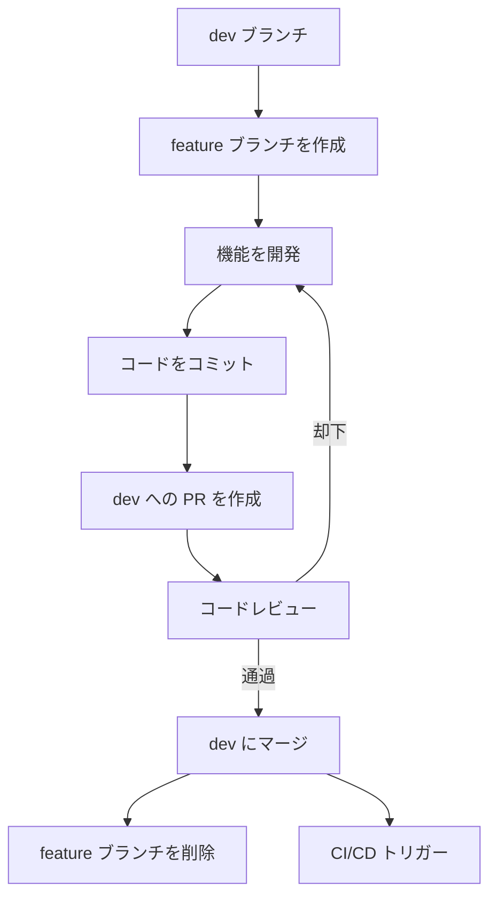
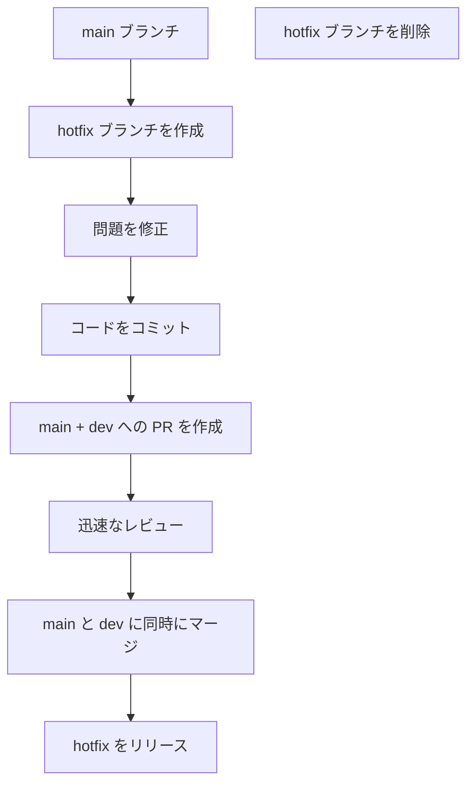
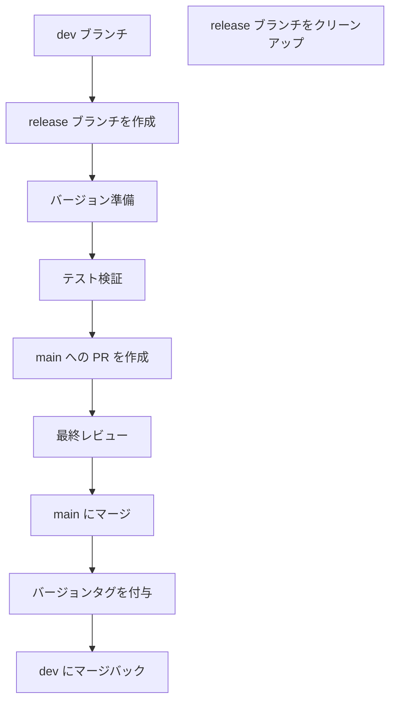

# Git ブランチメンテナンスマニュアル

> 本マニュアルは YaoXiang プロジェクトの Git ブランチ管理戦略を定義し、コードベースの秩序ある開発と効率的な協業を確保することを目的としています。

---

## 📋 目次

- [ブランチタイプの仕様](#ブランチタイプの仕様)
- [命名規則](#命名規則)
- [ブランチのライフサイクル](#ブランチのライフサイクル)
- [ワークフロー](#ワークフロー)
- [ブランチ保護ポリシー](#ブランチ保護ポリシー)
- [ベストプラクティス](#ベストプラクティス)
- [よくある質問](#よくある質問)

---

## 🏷️ ブランチタイプの仕様

### コアブランチ（Core Branches）

| ブランチ名 | 用途               | ライフサイクル | 保護レベル   |
| ---------- | ------------------ | -------------- | ------------ |
| `main`     | 本番環境コード     | 恒久           | 厳格に保護   |
| `dev`      | メイン開発ブランチ | 恒久           | 中程度に保護 |
| `master`   | 幹ブランチ（互換） | 恒久           | 厳格に保護   |

### 機能ブランチ（Feature Branches）

| プレフィックス | 用途                 | 命名例                                                | マージ先       |
| -------------- | -------------------- | ----------------------------------------------------- | -------------- |
| `feature/`     | 新機能開発           | `feature/type-inference`<br>`feature/ownership-model` | `dev`          |
| `bugfix/`      | 既知の欠陥修正       | `bugfix/memory-leak`<br>`bugfix/parser-error`         | `dev`          |
| `hotfix/`      | 緊急のオンライン修正 | `hotfix/security-patch`<br>`hotfix/crash-bug`         | `main` + `dev` |
| `release/`     | リリース準備ブランチ | `release/v0.8.0`<br>`release/v1.0.0`                  | `main`         |

### 補助ブランチ（Auxiliary Branches）

| プレフィックス | 用途                   | 命名例                                                     | マージ先 |
| -------------- | ---------------------- | ---------------------------------------------------------- | -------- |
| `docs/`        | ドキュメント更新       | `docs/api-reference`<br>`docs/tutorial-update`             | `dev`    |
| `ci/`          | CI/CD 設定変更         | `ci/add-deploy-script`<br>`ci/optimize-build`              | `dev`    |
| `refactor/`    | コードリファクタリング | `refactor/lexer-optimization`<br>`refactor/memory-manager` | `dev`    |
| `test/`        | テスト関連の変更       | `test/add-integration`<br>`test/performance-bench`         | `dev`    |

---

## 📝 命名規則

### 基本命名フォーマット

```bash
# 機能ブランチ
<type>/<short-description>

# 例
feature/add-type-inference
bugfix/fix-parser-crash
hotfix/security-vulnerability
```

### 命名規範

1. **小文字を使用**：すべてのブランチ名は小文字を使用
2. **ハイフンで区切る**：単語の区切りには `-` を使用し、アンダースコアは使用しない
3. **説明的な命名**：ブランチ名は用途を明確に表現する
4. **特殊文字を避ける**：スペース、ピリオド、その他の特殊文字は使用しない
5. **長さ制限**：ブランチ名は 50 文字を超えない

### 詳細な例

```bash
# ✅ 良い命名
feature/user-authentication-system
bugfix/fix-compilation-error-on-windows
hotfix/memory-leak-in-vm
docs/update-api-documentation
refactor/optimize-lexer-performance
test/add-e2e-test-cases

# ❌ 悪い命名
Feature/NewFeature  # 大文字を使用
bug_fix            # アンダースコアを使用
hotfix/fix        # 説明が不十分
feature/ADD_NEW_FEATURE_WITH_LOTS_OF_DETAILS_THAT_IS_TOO_LONG  # 長すぎる
```

---

## 🔄 ブランチのライフサイクル

### ブランチの作成

```bash
# 1. 最新の dev ブランチから作成
git checkout dev
git pull origin dev
git checkout -b feature/your-feature-name

# 2. リモートブランチにプッシュ
git push -u origin feature/your-feature-name
```

### ブランチの開発

```bash
# 定期的に最新コードを同期
git checkout dev
git pull origin dev
git checkout feature/your-feature-name
git rebase dev  # または git merge dev

# コードをコミット
git add .
git commit -m ":sparkles: feat(frontend): 添加类型推断功能"
git push origin feature/your-feature-name
```

### ブランチのマージ

```bash
# 1. Pull Request を作成
# 2. コードレビュー通過後
git checkout dev
git pull origin dev
git merge --no-ff feature/your-feature-name
git push origin dev

# 3. ブランチをクリーンアップ
git branch -d feature/your-feature-name  # ローカル削除
git push origin --delete feature/your-feature-name  # リモート削除
```

### ブランチの削除

```bash
# マージ済みの機能ブランチを削除
git branch -d feature/completed-feature
git push origin --delete feature/completed-feature

# マージ済みブランチを一括クリーンアップ
git branch --merged dev | grep feature | xargs -n 1 git branch -d
```

---

## 🚀 ワークフロー

### 機能開発フロー


```mermaid
graph TD
    A[dev ブランチ] --> B[feature ブランチを作成]
    B --> C[機能を開発]
    C --> D[コードをコミット]
    D --> E[dev への PR を作成]
    E --> F[コードレビュー]
    F -->|通過| G[dev にマージ]
    F -->|却下| C
    G --> H[feature ブランチを削除]
    G --> I[CI/CD トリガー]
```

### 緊急修正フロー


```mermaid
graph TD
    A[main ブランチ] --> B[hotfix ブランチを作成]
    B --> C[問題を修正]
    C --> D[コードをコミット]
    D --> E[main + dev への PR を作成]
    E --> F[迅速なレビュー]
    F --> G[main と dev に同時にマージ]
    G --> H[hotfix をリリース]
    I[hotfix ブランチを削除]
```

### リリースフロー


```mermaid
graph TD
    A[dev ブランチ] --> B[release ブランチを作成]
    B --> C[バージョン準備]
    C --> D[テスト検証]
    D --> E[main への PR を作成]
    E --> F[最終レビュー]
    F --> G[main にマージ]
    G --> H[バージョンタグを付与]
    H --> I[dev にマージバック]
    J[release ブランチをクリーンアップ]
```

---

## 🛡️ ブランチ保護ポリシー

### 主要ブランチの保護

**main ブランチ**

- 直接プッシュ禁止
- 必ず PR 経由でマージ
- 強制プッシュ禁止
- コードレビュー必須
- ステータスチェックの通過必須

**dev ブランチ**

- 直接プッシュ禁止（開発メンバー）
- PR 経由でのマージ必須
- ステータスチェックの通過必須
- 管理者の直接プッシュは許可

### ブランチ権限設定

| ブランチタイプ | 開発者    | メンテナー | 管理者       |
| -------------- | --------- | ---------- | ------------ |
| `main`         | PR のみ   | PR のみ    | PR を承認    |
| `dev`          | PR マージ | PR マージ  | 直接プッシュ |
| `feature/*`    | 全権限    | 全権限     | 全権限       |
| `hotfix/*`     | 全権限    | 全権限     | 全権限       |

---

## ✅ ベストプラクティス

### 1. ブランチ管理

- **頻繁な同期**：`dev` ブランチから定期的に最新コードを取得
- **アトミックコミット**：各コミットには関連する変更のみを含める
- **迅速なクリーンアップ**：マージ後、完成した機能ブランチは速やかに削除
- **明確な説明**：ブランチ名とコミットメッセージは意図を明確に表現する

### 2. コミット規範

[提交规范](./commit-convention.md) に従ってください：

```bash
# フォーマット
:emoji: type(scope): 主题（中文）

# 例
:sparkles: feat(frontend): 添加类型推断功能
:bug: fix(parser): 修复解析器崩溃问题
:recycle: refactor(vm): 重构虚拟机内存管理
```

### 3. Pull Request

- **明確な説明**：変更内容と理由を詳細に記述
- **問題の関連付け**：`Closes #123` を使用して関連する Issue を関連付け
- **迅速な対応**：レビュー意見には速やかに返信
- **十分なテスト**：すべてのテストが通過することを確認

### 4. コードレビュー

- **機能の正確性**：コードの機能が正しいかを検証
- **コード品質**：コードが規範に準拠しているかを確認
- **テストカバレッジ**：適切なテストがあることを確認
- **ドキュメント更新**：ドキュメントの更新が必要かを確認

---

## ❓ よくある質問

### Q1: ブランチタイプをどのように選択すればよいですか？

**回答：**

- 新機能 → `feature/`
- 既知の欠陥修正 → `bugfix/`
- 緊急のオンライン修正 → `hotfix/`
- ドキュメント更新 → `docs/`
- コードリファクタリング → `refactor/`
- テスト関連 → `test/`

### Q2: feature ブランチはどのブランチから作成すべきですか？

**回答：** 常に `dev` ブランチから作成し、最新の開発コードに基づいていることを確認してください：

```bash
git checkout dev
git pull origin dev
git checkout -b feature/new-feature
```

### Q3: いつ release ブランチを作成しますか？

**回答：**

- 新バージョンのリリースを準備するとき
- 新機能の追加を凍結する必要があるとき
- 安定バージョンを特別にテストする必要があるとき

### Q4: ブランチの競合をどのように処理しますか？

**回答：**

1. 対象ブランチを更新：`git checkout dev && git pull origin dev`
2. 機能ブランチに切り替え：`git checkout feature/your-branch`
3. マージして競合を解決：`git rebase dev` または `git merge dev`
4. 競合解決後に開発を続行

### Q5: hotfix ブランチはどのように処理しますか？

**回答：**

1. `main` ブランチから作成：`git checkout main && git checkout -b hotfix/urgent-fix`
2. 問題を修正してテスト
3. `main` と `dev` の両方に PR を同時に作成
4. マージ後すぐにデプロイ

### Q6: ブランチ名に長さ制限はありますか？

**回答：**
50 文字を超えないことを推奨し、簡潔で明確に保つことが望ましいです。Git 自体はより長い名称をサポートしますが、長すぎる名称は可読性に影響します。

---

## 📚 関連ドキュメント

- [提交规范](./commit-convention.md)
- [测试规范](./test-specification.md)

---

## 🔧 ツールとスクリプト

### マージ済みブランチの一括クリーンアップ

```bash
# dev にマージ済みのローカルブランチを削除
git checkout dev
git pull origin dev
git branch --merged dev | grep -E "^(feature|bugfix|docs|refactor|test)/" | xargs -n 1 git branch -d

# リモートのマージ済みブランチを削除
git remote prune origin
```

### ブランチ作成テンプレート

```bash
#!/bin/bash
# 機能ブランチ作成のヘルパースクリプト

BRANCH_TYPE=$1
BRANCH_NAME=$2

if [ -z "$BRANCH_TYPE" ] || [ -z "$BRANCH_NAME" ]; then
    echo "使用方法: $0 <タイプ> <ブランチ名>"
    echo "タイプ: feature, bugfix, hotfix, docs, refactor, test"
    exit 1
fi

git checkout dev
git pull origin dev
git checkout -b "$BRANCH_TYPE/$BRANCH_NAME"
git push -u origin "$BRANCH_TYPE/$BRANCH_NAME"

echo "ブランチを作成してプッシュしました: $BRANCH_TYPE/$BRANCH_NAME"
```

---

> 💡
> **ヒント**：ブランチのアトミック性と専念性を保ち、各ブランチでは一つのことだけを行うようにすると、コード管理がより明確かつ効率的になります！

> 📞 **サポート**：質問がある場合は、GitHub Discussions にて議論してください。
