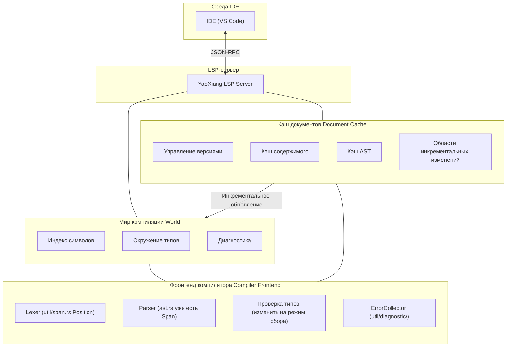

```markdown
---
title: "RFC-017: Дизайн поддержки Language Server Protocol (LSP)"
status: "Реализовано"
author: "Чэньсюй (晨煦)"
created: "2026-02-15"
updated: "2026-07-05"

issue: "#11"
---

# RFC-017: Дизайн поддержки Language Server Protocol (LSP)

>

>

>

> **Справка**: См. [полный пример](EXAMPLE_full_feature_proposal.md) о том, как писать RFC.

## ⚠️ Предусловия реализации (важно)

Перед реализацией LSP необходимо решить следующие две ключевые проблемы:

### Проблема 1: Сбор диагностических ошибок

**Текущее состояние**: Текущий модуль проверки типов завершает работу при первой обнаруженной ошибке (используя оператор `?`), и не может собирать все ошибки.

**Требования LSP**: IDE должна отображать **все** ошибки, а не только первую.

**Решение**:

#### 1.1 Режим сбора ошибок
- Изменить модуль `src/frontend/typecheck/inference/`, чтобы он возвращал `Result<Type, Vec<Error>>`
- Не возвращаться сразу при обнаружении ошибки, а продолжать проверку
- Возвращать все ошибки после завершения проверки

#### 1.2 Уровни ошибок
Разделение ошибок по степени серьёзности:

```rust
enum ErrorKind {
    Error,      // Серьёзная ошибка, может вызвать каскадные ошибки
    Warning,    // Предупреждение, проверка продолжается, но не блокирует
    Note,       // Дополнительная информация
}
```

- При наличии `Error`: `publishDiagnostics` отображает ошибку
- При наличии только `Warning`: продолжить компиляцию, отобразить предупреждение

#### 1.3 Восстановление после ошибок парсера
- При ошибке разбора вставлять **узлы-placeholder** (например, `MissingExpression`) вместо отказа
- Избегать паники проверки типов из-за неполного AST
- Пример: `let x = ;` → `let x = MissingExpression`

#### 1.4 Отложенный вывод (Delayed Emission)
- Некоторые ошибки могут быть «каскадными» (вызванными предыдущими ошибками)
- Можно сначала собрать их, а после разбора AST отфильтровать очевидные каскадные ошибки
- Либо простое решение: сообщать обо всех, позволяя пользователю исправлять их по очереди

### Проблема 2: Кэширование разбора на уровне файлов

**Текущее состояние**: Каждый запрос LSP повторно разбирает весь файл, без механизма кэширования.

**Требования LSP**: Каждое редактирование должно быстро откликаться, без повторного разбора неизменённых файлов.

**Решение**:

#### 2.1 Структура кэша документа
```rust
struct DocumentCache {
    version: u32,           // Номер версии документа LSP
    content: String,        // Текущее содержимое
    content_hash: u64,      // Хеш содержимого (для быстрого сравнения)
    ast: Option<Ast>,       // Кэшированный AST (опционально)
}
```

#### 2.2 Обнаружение изменений
- При получении нового содержимого через `textDocument/didChange`
- Вычислить хеш нового содержимого и сравнить с кэшированным `content_hash`
- **Если изменилось: повторно разобрать весь файл**
- **Если не изменилось: сразу вернуть кэшированный результат**

#### 2.3 Стратегия повторного разбора
- **На уровне файла**: повторно разбирать только текущий файл, а не весь проект
- Это упрощённый дизайн, без инкрементального разбора на уровне функций
- Современные компьютеры разбирают отдельный файл в несколько тысяч строк за несколько миллисекунд

#### 2.4 Отличие от cargo check
| | cargo check | YaoXiang LSP |
|---|---|---|
| Область | Весь проект | Отдельный файл |
| Частота | Запускается вручную | При каждом редактировании |
| Цель | Полная проверка компиляции | Быстрый инкрементальный отклик |

### Интеграция с существующими модулями

| Существующий модуль | Способ интеграции с LSP |
|----------|-------------|
| `util/span.rs` | ✅ Уже есть `Position`/`Span`, напрямую отображаются в LSP `Position` |
| `util/diagnostic/collect.rs` | ⚠️ Требуется изменить на «режим сбора» с непрерывным накоплением ошибок |
| `frontend/core/lexer/symbols.rs` | ⚠️ Требуется расширение, добавление информации о местоположении `uri` + `span` |
| `frontend/typecheck/mod.rs` | ⚠️ Требуется изменить `TypeResult` для возврата всех ошибок |
| `frontend/core/parser/ast.rs` | ✅ У каждого узла уже есть `Span`, изменения не требуются |

---

## Резюме

Добавление поддержки Language Server Protocol (LSP) в YaoXiang, реализация полноценного языкового сервера, чтобы популярные IDE (VS Code, Neovim, Emacs и т.д.) могли предоставлять возможности инструментов разработки: автодополнение кода, переход к определению, диагностику, поиск ссылок и т.д.

## Мотивация

### Зачем нужна эта возможность?

В настоящее время язык YaoXiang не имеет официальной поддержки интеграции с IDE, разработчики могут использовать только базовые текстовые редакторы для написания кода, и им не хватает:

1. **Автодополнение кода** — невозможно интеллектуально дополнять идентификаторы, ключевые слова и типы с учётом контекста
2. **Переход к определению** — невозможно быстро перейти к определению функции, типа или переменной
3. **Диагностика в реальном времени** — невозможно мгновенно отображать синтаксические и типовые ошибки при редактировании
4. **Поиск ссылок** — невозможно найти все места использования символа
5. **Подсказки при наведении** — невозможно отображать информацию о типе и документацию при наведении мыши

LSP — это стандарт для современных языков программирования, основные языки (Rust, Python, TypeScript, Go и т.д.) имеют зрелые реализации LSP. Реализация поддержки LSP значительно улучшит опыт разработки на YaoXiang.

### Текущие проблемы

1. **Низкая эффективность разработки** — отсутствие автодополнения и интеллектуальных подсказок
2. **Сложность отладки** — невозможно быстро найти определения символов
3. **Крутая кривая обучения** — отсутствие вспомогательных функций IDE
4. **Неполная экосистема** — невозможно привлечь разработчиков, привыкших к современным IDE

## Предложение

### Основной дизайн

Реализация независимого процесса LSP-сервера, взаимодействующего с IDE через JSON-RPC:



### Архитектура LSP-сервера

```
src/lsp/
├── main.rs              # Точка входа LSP-сервера
├── server.rs           # Основная логика сервера
├── session.rs          # Управление сессиями
├── capabilities.rs     # Объявление возможностей сервера
├── handlers/
│   ├── mod.rs
│   ├── initialize.rs   # Обработка инициализации
│   ├── text_document.rs # Обработка операций с документами
│   ├── completion.rs   # Обработка автодополнения
│   ├── definition.rs   # Обработка перехода к определению
│   ├── references.rs   # Обработка поиска ссылок
│   ├── hover.rs        # Обработка подсказок при наведении
│   └── diagnostics.rs  # Обработка диагностики
├── world.rs            # Мир компиляции (таблица символов, кэш AST)
├── scroller.rs         # Построение индекса символов
├── protocol.rs         # Определения типов протокола LSP
└── cache/              # Модуль инкрементального кэширования (новый)
    ├── mod.rs
    ├── document.rs     # Кэш документа (версия, AST, таблица символов)
    └── incremental.rs  # Стратегия инкрементального разбора
```

### Дизайн мира компиляции (World)

Управление глобальным состоянием компиляции:
- Кэш документа (версия, AST, таблица символов)
- Глобальный индекс символов
- Сборщик ошибок
- Кэш окружения типов

Основные методы:
- `on_document_change`: обработка инкрементальных изменений
- `incremental_reparse`: инкрементальный повторный разбор
- `collect_diagnostics`: сбор всех ошибок (без блокировки)

### Поддержка основных методов LSP

| Категория | Метод | Описание |
|------|------|------|
| **Жизненный цикл** | `initialize` / `initialized` / `shutdown` / `exit` | Жизненный цикл сервера |
| **Синхронизация документов** | `didOpen` / `didChange` / `didClose` | Управление документами |
| **Диагностика** | `publishDiagnostics` | Публикация диагностики |
| **Автодополнение** | `completion` | Автодополнение кода |
| **Переход** | `definition` | Переход к определению |
| **Ссылки** | `references` | Поиск ссылок |
| **Наведение** | `hover` | Подсказки при наведении |
| **Символы** | `workspace/symbol` | Поиск символов в рабочей области |

### Механизм синхронизации текстовых документов

Использование стратегии инкрементальной синхронизации:
- Сохранение номера версии документа
- Применение инкрементальных изменений (range + text)
- При больших изменениях — откат к полной замене

### Построение индекса символов

Использование существующей системы таблиц символов для построения обратного индекса:
- Требуется расширить `SymbolEntry`, добавив поле `location`
- Индекс: имя → список позиций, файл → список символов

### Реализация автодополнения кода

Источники автодополнения: ключевые слова, переменные, функции, типы, поля структур, модули

### Реализация перехода к определению

Символьный разбор на основе AST: поиск позиции определения, соответствующей идентификатору/вызову функции

## Детальный дизайн

### Влияние на систему типов

1. **Расширение информации о символах** — добавление информации о местоположении (файл, строка, столбец) в таблицу символов
2. **Предоставление информации о типах** — предоставление интерфейса запросов типов для LSP
3. **Интеграция с документацией** — поддержка генерации строк документации из комментариев

### Поведение во время выполнения

- LSP-сервер работает как отдельный процесс
- Для связи JSON-RPC используется stdin/stdout
- Поддержка параллельной обработки нескольких сессий

### Изменения в компиляторе

| Компонент | Изменения |
|------|------|
| `frontend/events` | Расширение системы событий, поддержка уведомлений LSP |
| `frontend/core/lexer/symbols` | Усиление таблицы символов, добавление информации о местоположении |
| Новый `src/lsp/` | Реализация LSP-сервера |

### Обратная совместимость

- ✅ Полная обратная совместимость
- LSP-сервер является отдельным компонентом, не влияющим на существующий процесс компиляции
- Существующие инструменты CLI не затрагиваются

### Интеграция с существующими системами

1. **Система событий** — использование механизма подписки на события из `frontend/events/`
2. **Система диагностики** — повторное использование диагностического вывода из `util/diagnostic/`
   - Повторное использование `ErrorCollector<E>` для сбора всех ошибок
   - Преобразование `Diagnostic` в формат LSP `Diagnostic`
3. **Таблица символов** — расширение возможностей позиционирования символов в `symbols.rs`
   - Расширение `SymbolEntry`, добавление поля `location: Location`
   - Построение обратного индекса `SymbolIndex` (имя -> список позиций)
4. **Фронтенд компилятора** — прямой вызов Lexer, Parser, проверки типов
   - **Ключевое изменение**: проверщик типов должен быть переведён в «режим сбора», не блокирующий выполнение

#### Преобразование формата диагностики

```rust
/// Преобразование YaoXiang Diagnostic в LSP Diagnostic
fn to_lsp_diagnostic(diag: &Diagnostic) -> lsp_types::Diagnostic {
    let severity = match diag.severity() {
        Severity::Error => lsp_types::DiagnosticSeverity::ERROR,
        Severity::Warning => lsp_types::DiagnosticSeverity::WARNING,
        Severity::Info => lsp_types::DiagnosticSeverity::INFORMATION,
    };

    lsp_types::Diagnostic {
        range: to_lsp_range(diag.span()),
        severity: Some(severity),
        message: diag.message().to_string(),
        code: diag.code().map(|c| lsp_types::NumberOrString::String(c.as_string())),
        ..Default::default()
    }
}

/// Преобразование YaoXiang Span в LSP Range
fn to_lsp_range(span: &Span) -> lsp_types::Range {
    lsp_types::Range {
        start: lsp_types::Position {
            line: span.start.line.saturating_sub(1), // LSP использует 0-индексацию
            character: span.start.column.saturating_sub(1),
        },
        end: lsp_types::Position {
            line: span.end.line.saturating_sub(1),
            character: span.end.column.saturating_sub(1),
        },
    }
}
```

## Уникальные продвинутые возможности YaoXiang

Использование мощной системы вычислений на этапе компиляции (compile-time) и системы ownership языка YaoXiang для обеспечения уникального опыта разработки, недоступного в других языках:

### 1. Встроенные подсказки (Inlay Hints)

- **Подсказки значений констант**: отображение значений, вычисленных на этапе компиляции (например, рядом с `const MAX = 100 + 200` отображается `300`)
- **Подсказки изменяемости**: отображение, является ли переменная изменяемой (например, `mut x`, `x` с заметным подчёркиванием)
- **Подсказки потребления ownership**: отображение, потребляется ли аргумент функции (например, `consumed` / `borrowed`)
- **Подсказки семантики пустого ownership**: отображение подсказки о том, что переменной можно присвоить новое значение после move, через затемнение цвета переменной
- **Подсказки вывода типов (type inference)**: отображение конкретного выведенного типа (например, рядом с `x = vec![]` отображается `Vec<i32>`)

### 2. Визуализация семантики ownership

- Отображение пути move переменной (от позиции определения до всех мест использования)
- Визуализация времени жизни заимствований

### 3. Превью вычислений на этапе компиляции

- При наведении отображение результата вычисления выражений-констант на этапе компиляции

### Приоритеты реализации

| Возможность | Приоритет |
|------|--------|
| Встроенные подсказки значений констант | P0 |
| Подсказки изменяемости | P0 |
| Подсказки потребления ownership | P1 |
| Визуализация ownership | P2 |

---

## Коммуникация и удалённая поддержка

### Режимы связи

Поддержка трёх режимов:

| Режим | Назначение |
|------|------|
| stdio | Локальная разработка (по умолчанию) |
| TCP-сокет | Удалённая разработка/отладка |
| Unix Domain Socket | Высокопроизводительная локальная связь |

### Удалённая отладка

Реализация на основе DAP (Debug Adapter Protocol):
- Поддержка строковых, функциональных и условных точек останова
- Уникальные точки останова YaoXiang: срабатывание при move переменной

### Параметры запуска

```bash
# Локальный режим
yaoxiang-lsp

# TCP-сервер
yaoxiang-lsp --tcp --port 8765

# Одновременное включение отладки
yaoxiang-lsp --tcp --port 8765 --enable-debug
```

---

## Модель параллелизма

**Проектное решение: однопоточность + асинхронный цикл событий**

Обоснование:
- Компилятор не является потокобезопасным, переработка требует больших затрат
- Запросы LSP по своей природе последовательны, параллелизм не требуется
- Однопоточность проще и легче отлаживается
- Производительность асинхронного I/O в одном потоке достаточна

Для фоновых задач используется `spawn_blocking` для использования нескольких ядер.

---

## Встроенный инструмент тестирования LSP (опционально)

> Эта функция не является обязательной для MVP и может быть добавлена в последующих версиях.

Предоставление формата тестовых случаев в JSON:

```bash
# Запуск тестов
yaoxiang-lsp --test
```

---

## Компромиссы

### Преимущества

1. **Улучшение опыта разработки** — поддержка IDE, близкая к основным языкам
2. **Совершенствование экосистемы** — привлечение большего числа разработчиков к использованию YaoXiang
3. **Повышение качества кода** — диагностика в реальном времени снижает количество ошибок во время выполнения
4. **Вклад сообщества** — разработчики могут участвовать в разработке инструментов LSP

### Недостатки

1. **Высокая сложность реализации** — необходимость обработки большого количества граничных случаев LSP
2. **Стоимость поддержки** — необходимость отслеживания обновлений версий протокола LSP
3. **Соображения производительности** — производительность индексации и запросов в крупных проектах
4. **Сложность тестирования** — необходимость моделирования поведения IDE для тестирования

## Альтернативы

| Вариант | Почему не выбран |
|------|--------------|
| Только подсветка синтаксиса | Не отвечает потребностям современной разработки |
| Использование Tree-sitter | Требует дополнительных затрат на обучение и имеет ограниченную функциональность |

## Стратегия реализации

### Этапы

1. **Этап 0 (предварительный)**: Адаптация компилятора ⚠️ **Критически важно**
   - Изменение проверщика типов на «режим сбора», возврат `Result<Type, Vec<Error>>`
   - Реализация уровней ошибок (Error / Warning / Note)
   - Восстановление после ошибок парсера: вставка узлов-placeholder
   - Расширение таблицы символов `SymbolEntry`, добавление поля `location`
   - Реализация системы кэширования DocumentCache (версия + содержимое + хеш)
   - **Этот этап является предпосылкой для реализации LSP и должен быть завершён первым**

2. **Этап 1 (v0.7)**: Базовый каркас
   - Каркас LSP-сервера
   - Методы жизненного цикла (initialize/shutdown/exit)
   - Базовое логирование и обработка ошибок

3. **Этап 2 (v0.7)**: Поддержка диагностики
   - Синхронизация текстовых документов
   - Интеграция диагностики компиляции
   - `textDocument/publishDiagnostics`

4. **Этап 3 (v0.8)**: Поддержка автодополнения
   - Построение индекса символов
   - Автодополнение ключевых слов
   - Автодополнение идентификаторов

5. **Этап 4 (v0.8)**: Поддержка переходов
   - Переход к определению
   - Поиск ссылок
   - Подсказки при наведении

6. **Этап 5 (v0.9)**: Продвинутые функции
   - Поиск символов в рабочей области
   - Форматирование кода
   - Поддержка рефакторинга (опционально)

### Зависимости

- Без внешних зависимостей от библиотек LSP (используется crate `lsp-types`)
- Зависимость от существующих модулей фронтенда компилятора
- Зависимость от `serde_json` для сериализации JSON-RPC

### Риски

1. **Проблемы производительности** — разбор больших файлов может вызвать задержки
   - Решение: инкрементальный разбор, обработка в фоновом потоке
2. **Потребление памяти** — индекс символов занимает память
   - Решение: ленивая загрузка, LRU-кэш
3. **Совместимость протоколов** — различия версий LSP
   - Решение: объявление поддерживаемой версии протокола

## Открытые вопросы

- [x] Механизм сбора ошибок (см. раздел «Предусловия реализации»)
- [x] Система инкрементального кэширования (см. раздел «Предусловия реализации»)
- [x] Версия протокола LSP: используется 3.18 (поддержка Inlay Hints, Inline Values и других новых функций)
- [x] Поддержка удалённой связи (через TCP, совмещая LSP + отладку)
- [x] Поддержка удалённой отладки (на основе протокола DAP)
- [x] Модель параллелизма: однопоточность + асинхронный цикл событий
- [x] Встроенный инструмент тестирования LSP (опционально): использование тестовых случаев в формате JSON

---

## Приложения (опционально)

### Приложение A: Записи обсуждения дизайна

> Используется для записи подробных обсуждений в процессе принятия проектных решений.

### Приложение B: Записи проектных решений

| Решение | Определение | Дата | Автор записи |
|------|------|------|--------|
| Архитектура LSP-сервера | Отдельный процесс, связь через stdio | 2026-02-15 | Чэньсюй (晨煦) |
| Версия протокола | Поддержка LSP 3.18 (требуются Inlay Hints и другие новые функции) | 2026-02-22 | Чэньсюй (晨煦) |
| Режим сбора ошибок | Возврат `Result<Type, Vec<Error>>`, поддержка уровней ошибок и восстановления после ошибок | 2026-02-22 | Чэньсюй (晨煦) |
| Стратегия кэширования | Кэширование на уровне файлов: версия + содержимое + хеш, повторный разбор всего файла | 2026-02-22 | Чэньсюй (晨煦) |
| Режимы связи | Поддержка stdio + TCP + UnixSocket | 2026-02-22 | Чэньсюй (晨煦) |
| Удалённая отладка | На основе протокола DAP, общий транспортный уровень с LSP | 2026-02-22 | Чэньсюй (晨煦) |
| Модель параллелизма | Однопоточность + асинхронный цикл событий | 2026-02-22 | Чэньсюй (晨煦) |
| Инструмент тестирования (опционально) | Тестовые случаи в формате JSON + встроенный тестовый раннер | 2026-02-22 | Чэньсюй (晨煦) |

### Приложение C: Глоссарий

| Термин | Определение |
|------|------|
| LSP | Language Server Protocol, протокол языкового сервера |
| JSON-RPC | JSON-Remote Procedure Call, удалённый вызов процедур в формате JSON |
| DAP | Debug Adapter Protocol, протокол адаптера отладки |
| Индекс символов | Таблица отображения позиций символов, построенная во время компиляции |
| Мир компиляции | Контекст, содержащий всю информацию о компиляции |
| Встроенные подсказки | Inlay Hints, встроенные подсказки, отображаемые в строке |
| Трассировка ownership | Ownership Trace, визуализация потока владения переменной |

---

## Ссылки

- [Спецификация Language Server Protocol](https://microsoft.github.io/language-server-protocol/)
- [Спецификация LSP 3.18](https://github.com/microsoft/language-server-protocol/blob/main/specifications/specification-3-18.md)
- [Спецификация Debug Adapter Protocol](https://microsoft.github.io/debug-adapter-protocol/)
- [Rust Analyzer](https://rust-analyzer.github.io/) — референсная реализация
- [crate lsp-types](https://crates.io/crates/lsp-types) — определения типов LSP
- [Спецификация JSON-RPC 2.0](https://www.jsonrpc.org/specification)

---

## Жизненный цикл и судьба

RFC проходит следующие состояния:

```
┌─────────────┐
│   Черновик  │  ← Автор создаёт
└──────┬──────┘
       │
       ▼
┌─────────────┐
│  На рецензии │  ← Обсуждение сообществом
└──────┬──────┘
       │
       ├──────────────────┐
       ▼                  ▼
┌─────────────┐    ┌─────────────┐
│  Принят     │    │   Отклонён  │
└──────┬──────┘    └──────┬──────┘
       │                  │
       ▼                  ▼
┌─────────────┐    ┌─────────────┐
│   accepted/ │    │  rejected/  │
│ (Официальный дизайн) │ (Отклонён) │
└─────────────┘    └─────────────┘
```

### Описание состояний

| Состояние | Расположение | Описание |
|------|------|------|
| **Черновик** | `docs/design/rfc/draft/` | Черновик автора, ожидает отправки на рецензию |
| **На рецензии** | `docs/design/rfc/review/` | Открыт для обсуждения и обратной связи сообщества |
| **Принят** | `docs/design/accepted/` | Становится официальным проектным документом, переходит в фазу реализации |
| **Отклонён** | `docs/design/rfc/` | Сохраняется в каталоге RFC, статус обновляется |

### Действия после принятия

1. Переместить RFC в каталог `docs/design/accepted/`
2. Обновить имя файла на описательное (например, `lsp-support.md`)
3. Обновить статус на «Официальный»
4. Обновить статус на «Принят», добавить дату принятия

### Действия после отклонения

1. Сохранить в каталоге `docs/design/rfc/draft/`
2. Добавить причину отклонения и дату в начало файла
3. Обновить статус на «Отклонён»

### Действия после определения результата обсуждения

Когда по открытому вопросу достигнут консенсус:

1. **Обновить Приложение A**: Заполнить «Решение» в теме обсуждения
2. **Обновить основной текст**: Синхронизировать решение с основным текстом документа
3. **Записать решение**: Добавить в «Приложение B: Записи проектных решений»
4. **Отметить вопрос**: Отметить `[x]` в списке «Открытые вопросы»

---

> **Примечание**: Номер RFC используется только на этапе обсуждения. После принятия номер удаляется и используется описательное имя файла.
```