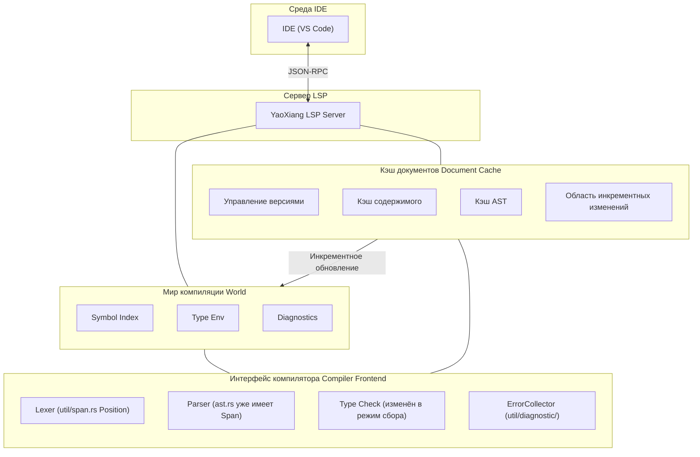

# RFC-017: Проектирование поддержки протокола языкового сервера (LSP)

>

>

>

> **Справка**: Смотрите [полный пример](EXAMPLE_full_feature_proposal.md), чтобы узнать, как писать RFC.

## ⚠️ Предварительные условия реализации (важно)

Перед реализацией LSP необходимо решить следующие две ключевые проблемы:

### Проблема 1: Сбор диагностических ошибок

**Текущее состояние**: Текущий проверщик типов при обнаружении первой ошибки сразу возвращает результат (используя оператор `?`), не собирая все ошибки.

**Требование LSP**: IDE необходимо отображать **все** ошибки, а не только первую.

**Решение**:

#### 1.1 Паттерн сбора ошибок
- Изменить модуль `src/frontend/typecheck/inference/`, чтобы он возвращал `Result<Type, Vec<Error>>`
- Не возвращаться сразу при обнаружении ошибки, а продолжать проверку
- После завершения проверки вернуть все ошибки вместе

#### 1.2 Уровни ошибок
Различать ошибки разной степени серьёзности:

```rust
enum ErrorKind {
    Error,      // Серьёзная ошибка, которая может вызвать каскадные ошибки
    Warning,    // Предупреждение, продолжать проверку без остановки
    Note,       // Дополнительная информация
}
```

- Если есть `Error`: `publishDiagnostics` отображает ошибку
- Если только `Warning`: продолжить компиляцию, отобразить предупреждение

#### 1.3 Восстановление после ошибок Parser
- При ошибках парсинга вставлять **placeholder-узлы** (например, `MissingExpression`) вместо отказа
- Избегать паники при проверке типов из-за неполного AST
- Пример: `let x = ;` → `let x = MissingExpression`

#### 1.4 Отложенная отправка (Delayed Emission)
- Некоторые ошибки могут быть «каскадными» (вызваны предыдущими ошибками)
- Можно сначала собрать их, затем после разбора AST отфильтровать очевидные каскадные ошибки
- Или простое решение: сообщать обо всех, чтобы пользователь исправлял их по очереди

### Проблема 2: Кэширование парсинга на уровне файлов

**Текущее состояние**: При каждом LSP-запросе весь файл переразбирается заново, без механизма кэширования.

**Требование LSP**: Каждое редактирование должно быстро отвечать, без необходимости повторного разбора неизменённых файлов.

**Решение**:

#### 2.1 Структура кэша документов
```rust
struct DocumentCache {
    version: u32,           // Версия документа LSP
    content: String,        // Текущее содержимое
    content_hash: u64,      // Хеш содержимого (для быстрого сравнения)
    ast: Option<Ast>,       // Кэшированный AST (опционально)
}
```

#### 2.2 Обнаружение изменений
- При каждом `textDocument/didChange` получаем новое содержимое
- Вычисляем хеш нового содержимого и сравниваем с кэшированным `content_hash`
- **Если изменилось: переразбираем весь файл**
- **Если не изменилось: возвращаем кэшированный результат**

#### 2.3 Стратегия переразбора
- **На уровне файла**: переразбираем только текущий файл, а не весь проект
- Это упрощённый дизайн, без построчного инкрементного разбора
- Современные компьютеры разбирают отдельный файл в несколько тысяч строк за миллисекунды

#### 2.4 Отличие от cargo check
| | cargo check | YaoXiang LSP |
|---|---|---|
| Область | Весь проект | Один файл |
| Частота | Ручной запуск | Каждое редактирование |
| Цель | Полная проверка компиляции | Быстрый инкрементный отклик |

### Интеграция с существующими модулями

| Существующий модуль | Способ интеграции LSP |
|----------|-------------|
| `util/span.rs` | ✅ Уже есть `Position`/`Span`, напрямую маппится в LSP `Position` |
| `util/diagnostic/collect.rs` | ⚠️ Нужно изменить в «режим сбора», непрерывно накапливать ошибки |
| `frontend/core/lexer/symbols.rs` | ⚠️ Расширить, добавить информацию о позиции `uri` + `span` |
| `frontend/typecheck/mod.rs` | ⚠️ Изменить `TypeResult`, возвращать все ошибки |
| `frontend/core/parser/ast.rs` | ✅ У каждого узла уже есть `Span`, изменений не требуется |

---

## Краткое описание

Добавить поддержку Language Server Protocol (LSP) для YaoXiang, реализовать полноценный языковой сервер, чтобы основные IDE (VS Code, Neovim, Emacs и др.) могли предоставлять такие инструменты разработки, как автодополнение кода, переход к определению, диагностика, поиск ссылок и другие.

## Мотивация

### Зачем нужна эта функция?

В настоящее время язык YaoXiang не имеет официальной поддержки интеграции с IDE, разработчики могут использовать только базовые текстовые редакторы, что приводит к отсутствию:

1. **Автодополнение кода** — невозможность интеллектуального дополнения идентификаторов, ключевых слов, типов на основе контекста
2. **Переход к определению** — невозможность быстрого перехода к месту определения функций, типов, переменных
3. **Диагностика в реальном времени** — невозможность мгновенного отображения синтаксических и типовых ошибок при редактировании
4. **Поиск ссылок** — невозможность найти все места использования символа
5. **Всплывающие подсказки** — невозможность отображения информации о типах и документации при наведении курсора

LSP является стандартом для современных языков программирования, основные языки (Rust, Python, TypeScript, Go и др.) предоставляют зрелые реализации LSP. Поддержка LSP значительно улучшит опыт разработки на YaoXiang.

### Текущие проблемы

1. **Низкая эффективность разработки** — отсутствие автодополнения и интеллектуальных подсказок
2. **Сложность отладки** — невозможность быстро найти определение символа
3. **Крутая кривая обучения** — отсутствие вспомогательных функций IDE
4. **Незрелая экосистема** — невозможность привлечь разработчиков, привыкших к современным IDE

## Предложение

### Основной дизайн

Реализовать отдельный процесс сервера LSP, который общается с IDE через JSON-RPC:



### Архитектура сервера LSP

```
src/lsp/
├── main.rs              # Входная точка сервера LSP
├── server.rs           # Основная логика сервера
├── session.rs          # Управление сессиями
├── capabilities.rs     # Объявление возможностей сервера
├── handlers/
│   ├── mod.rs
│   ├── initialize.rs   # Обработка инициализации
│   ├── text_document.rs # Обработка операций с документами
│   ├── completion.rs   # Обработка автодополнения
│   ├── definition.rs   # Обработка перехода к определению
│   ├── references.rs   # Обработка поиска ссылок
│   ├── hover.rs        # Обработка всплывающих подсказок
│   └── diagnostics.rs  # Обработка диагностики
├── world.rs            # Мир компиляции (таблица символов, кэш AST)
├── scroller.rs         # Построение индекса символов
├── protocol.rs         # Определения типов протокола LSP
└── cache/              # Модуль инкрементного кэша (новый)
    ├── mod.rs
    ├── document.rs     # Кэш документов (версия, AST, таблица символов)
    └── incremental.rs  # Стратегия инкрементного разбора
```

### Дизайн «мира компиляции» (World)

Управление глобальным состоянием компиляции:
- Кэш документов (версия, AST, таблица символов)
- Глобальный индекс символов
- Коллектор ошибок
- Кэш окружения типов

Основные методы:
- `on_document_change`: обработка инкрементных изменений
- `incremental_reparse`: инкрементный переразбор
- `collect_diagnostics`: сбор всех ошибок (без остановки)

### Поддержка основных методов LSP

| Категория | Метод | Описание |
|------|------|------|
| **Жизненный цикл** | `initialize` / `initialized` / `shutdown` / `exit` | Жизненный цикл сервера |
| **Синхронизация документов** | `didOpen` / `didChange` / `didClose` | Управление документами |
| **Диагностика** | `publishDiagnostics` | Публикация диагностики |
| **Автодополнение** | `completion` | Автодополнение кода |
| **Переход** | `definition` | Переход к определению |
| **Ссылки** | `references` | Поиск ссылок |
| **Hover** | `hover` | Всплывающие подсказки |
| **Символы** | `workspace/symbol` | Поиск символов в рабочей области |

### Механизм синхронизации текстовых документов

Используется стратегия инкрементной синхронизации:
- Сохранение номера версии документа
- Применение инкрементных изменений (range + text)
- При больших изменениях переход на полную замену

### Построение индекса символов

Используется существующая система таблицы символов для построения обратного индекса:
- Необходимо расширить `SymbolEntry`, добавить поле `location`
- Индекс: имя → список позиций, файл → список символов

### Реализация автодополнения

Источники дополнений: ключевые слова, переменные, функции, типы, поля структур, модули

### Реализация перехода к определению

Разбор символов на основе AST: поиск позиции определения, соответствующей идентификатору/вызову функции

## Детальный дизайн

### Влияние на систему типов

1. **Расширение информации о символах** — добавление позиционной информации в таблицу символов (файл, номер строки, номер столбца)
2. **Раскрытие информации о типах** — предоставление интерфейса запроса типов для LSP
3. **Интеграция документации из комментариев** — поддержка генерации документационных строк из комментариев

### Поведение во время выполнения

- Сервер LSP работает как отдельный процесс
- Использует stdin/stdout для JSON-RPC коммуникации
- Поддержка параллельной обработки нескольких сессий

### Изменения в компиляторе

| Компонент | Изменения |
|------|------|
| `frontend/events` | Расширение системы событий, поддержка уведомлений LSP |
| `frontend/core/lexer/symbols` | Улучшение таблицы символов, добавление позиционной информации |
| Новый `src/lsp/` | Реализация сервера LSP |

### Обратная совместимость

- ✅ Полная обратная совместимость
- Сервер LSP — независимый компонент, не влияет на существующий процесс компиляции
- Существующие CLI-инструменты не затрагиваются

### Интеграция с существующими системами

1. **Система событий** — использование механизма подписки на события из `frontend/events/`
2. **Система диагностики** — повторное использование диагностического вывода из `util/diagnostic/`
   - Повторное использование `ErrorCollector<E>` для сбора всех ошибок
   - Преобразование `Diagnostic` в формат LSP `Diagnostic`
3. **Таблица символов** — расширение возможностей позиционирования символов в `symbols.rs`
   - Расширение `SymbolEntry`, добавление поля `location: Location`
   - Построение обратного индекса `SymbolIndex` (имя -> список позиций)
4. **Интерфейс компилятора** — прямой вызов лексера, парсера, проверки типов
   - **Ключевое изменение**: проверщик типов должен работать в «режиме сбора», без остановки при ошибках

#### Преобразование формата диагностики

```rust
/// Преобразование YaoXiang Diagnostic в LSP Diagnostic
fn to_lsp_diagnostic(diag: &Diagnostic) -> lsp_types::Diagnostic {
    let severity = match diag.severity() {
        Severity::Error => lsp_types::DiagnosticSeverity::ERROR,
        Severity::Warning => lsp_types::DiagnosticSeverity::WARNING,
        Severity::Info => lsp_types::DiagnosticSeverity::INFORMATION,
    };

    lsp_types::Diagnostic {
        range: to_lsp_range(diag.span()),
        severity: Some(severity),
        message: diag.message().to_string(),
        code: diag.code().map(|c| lsp_types::NumberOrString::String(c.as_string())),
        ..Default::default()
    }
}

/// Преобразование YaoXiang Span в LSP Range
fn to_lsp_range(span: &Span) -> lsp_types::Range {
    lsp_types::Range {
        start: lsp_types::Position {
            line: span.start.line.saturating_sub(1), // LSP использует 0-indexed
            character: span.start.column.saturating_sub(1),
        },
        end: lsp_types::Position {
            line: span.end.line.saturating_sub(1),
            character: span.end.column.saturating_sub(1),
        },
    }
}
```

## Продвинутые функции, специфичные для YaoXiang

Использование мощной системы компиляционного вычисления и владения YaoXiang для предоставления уникального опыта разработки, недоступного в других языках:

### 1. Встроенные подсказки (Inlay Hints)

- **Подсказки значений констант**: отображение вычисленных на этапе компиляции значений констант (например, рядом с `const MAX = 100 + 200` показывать `300`)
- **Подсказки изменяемости**: отображение того, является ли переменная изменяемой (например, `mut x`, `x` имеют чёткое подчёркивание)
- **Подсказки потребления владения**: отображение того, потребляется ли параметр функции (например, `consumed` / `borrowed`)
- **Подсказки пустого владения**: отображение подсказок о том, что переменной можно присвоить новое значение после перемещения, путём затемнения цвета переменной
- **Подсказки выведенных типов**: отображение выведенных конкретных типов (например, рядом с `x = vec![]` показывать `Vec<i32>`)

### 2. Визуализация семантики владения

- Отображение пути перемещения переменной (от позиции определения до всех позиций использования)
- Визуализация времени жизни заимствования

### 3. Предпросмотр компиляционных вычислений

- Hover отображает результат вычисления константного выражения на этапе компиляции

### Приоритеты реализации

| Функция | Приоритет |
|------|--------|
| Встроенные подсказки значений констант | P0 |
| Подсказки изменяемости | P0 |
| Подсказки потребления владения | P1 |
| Визуализация владения | P2 |

---

## Коммуникация и удалённая поддержка

### Режимы коммуникации

Поддерживаются три режима:

| Режим | Назначение |
|------|------|
| stdio | Локальная разработка (по умолчанию)|
| TCP Socket | Удалённая разработка/отладка |
| Unix Domain Socket | Высокопроизводительная локальная коммуникация |

### Удалённая отладка

На основе DAP (Debug Adapter Protocol):
- Поддержка строчных breakpoints, breakpoints функций, условных breakpoints
- YaoXiang-специфичный breakpoint: срабатывает при перемещении переменной

### Параметры запуска

```bash
# Локальный режим
yaoxiang-lsp

# TCP сервер
yaoxiang-lsp --tcp --port 8765

# С включением отладки одновременно
yaoxiang-lsp --tcp --port 8765 --enable-debug
```

---

## Модель параллелизма

**Проектное решение: однопоточный + асинхронный цикл событий**

Обоснование:
- Компилятор не является потокобезопасным, высокая стоимость переделки
- LSP-запросы по природе последовательны, не требуют параллелизма
- Однопоточность проще и легче в отладке
- Производительности async I/O в одном потоке достаточно

Фоновые задачи используют `spawn_blocking` для использования многоядерности.

---

## Встроенный инструмент тестирования LSP (опционально)

> Эта функция не является обязательной для MVP, может быть добавлена в последующих версиях.

Предоставляется формат JSON тестовых случаев:

```bash
# Запуск тестов
yaoxiang-lsp --test
```

---

## Компромиссы

### Преимущества

1. **Улучшение опыта разработки** — поддержка IDE, приближенная к основным языкам
2. **Улучшение экосистемы** — привлечение большего числа разработчиков, использующих YaoXiang
3. **Повышение качества кода** — диагностика в реальном времени снижает количество ошибок времени выполнения
4. **Вклад сообщества** — разработчики могут участвовать в разработке инструментария LSP

### Недостатки

1. **Высокая сложность реализации** — необходимость обработки большого количества edge-cases LSP
2. **Стоимость поддержки** — необходимость следовать обновлениям версий протокола LSP
3. **Вопросы производительности** — производительность индексации и запросов в крупных проектах
4. **Сложность тестирования** — необходимость моделирования поведения IDE для тестирования

## Альтернативные решения

| Решение | Почему не выбрано |
|------|--------------|
| Только подсветка синтаксиса | Не соответствует современным требованиям разработки |
| Использование Tree-sitter | Требует дополнительных затрат на изучение, функциональность ограничена |

## Стратегия реализации

### Разделение на этапы

1. **Этап 0 (предварительный)**: Адаптация компилятора ⚠️ **Критически важно**
   - Изменить проверщик типов в «режим сбора», возвращать `Result<Type, Vec<Error>>`
   - Реализовать уровни ошибок (Error / Warning / Note)
   - Восстановление после ошибок Parser: вставка placeholder-узлов
   - Расширить таблицу символов `SymbolEntry`, добавить поле `location`
   - Реализовать систему кэширования DocumentCache (версия + содержимое + хеш)
   - **Этот этап является предпосылкой реализации LSP, должен быть выполнен первым**

2. **Этап 1 (v0.7)**: Базовая структура
   - Каркас сервера LSP
   - Методы жизненного цикла (initialize/shutdown/exit)
   - Базовое логирование и обработка ошибок

3. **Этап 2 (v0.7)**: Поддержка диагностики
   - Синхронизация текстовых документов
   - Интеграция компиляционной диагностики
   - `textDocument/publishDiagnostics`

4. **Этап 3 (v0.8)**: Поддержка автодополнения
   - Построение индекса символов
   - Автодополнение ключевых слов
   - Автодополнение идентификаторов

5. **Этап 4 (v0.8)**: Поддержка перехода
   - Переход к определению
   - Поиск ссылок
   - Всплывающие подсказки

6. **Этап 5 (v0.9)**: Продвинутые функции
   - Поиск символов в рабочей области
   - Форматирование кода
   - Поддержка рефакторинга (опционально)

### Зависимости

- Нет внешних зависимостей от библиотек LSP (используется crate `lsp-types`)
- Зависимости от существующих модулей интерфейса компилятора
- Зависимости от `serde_json` для сериализации JSON-RPC

### Риски

1. **Проблемы производительности** — разбор больших файлов может вызвать зависание
   - Решение: инкрементный разбор, обработка в фоновом потоке
2. **Использование памяти** — индекс символов занимает память
   - Решение: отложенная загрузка, LRU-кэш
3. **Совместимость протокола** — различия версий LSP
   - Решение: объявление поддерживаемой версии протокола

## Открытые вопросы

- [x] Механизм сбора ошибок (см. раздел «Предварительные условия реализации»)
- [x] Система инкрементного кэширования (см. раздел «Предварительные условия реализации»)
- [x] Версия протокола LSP: использовать 3.18 (поддержка Inlay Hints, Inline Values и других новых функций)
- [x] Удалённая коммуникационная поддержка (через TCP, с учётом LSP + отладка)
- [x] Удалённая отладочная поддержка (на основе протокола DAP)
- [x] Модель параллелизма: однопоточный + асинхронный цикл событий
- [x] Встроенный инструмент тестирования LSP (опционально): использование JSON тестовых случаев

---

## Приложения (опционально)

### Приложение A: Записи обсуждения дизайна

> Используется для записи подробного обсуждения в процессе принятия проектных решений.

### Приложение B: Запись проектных решений

| Решение | Результат | Дата | Записал |
|------|------|------|--------|
| Архитектура сервера LSP | Отдельный процесс, коммуникация через stdio | 2026-02-15 | 晨煦 |
| Версия протокола | Поддержка LSP 3.18 (требуются Inlay Hints и другие новые функции) | 2026-02-22 | 晨煦 |
| Режим сбора ошибок | Возврат `Result<Type, Vec<Error>>`, поддержка уровней ошибок и восстановления после ошибок | 2026-02-22 | 晨煦 |
| Стратегия кэширования | Кэширование на уровне файлов: версия + содержимое + хеш, переразбор всего файла | 2026-02-22 | 晨煦 |
| Режим коммуникации | Поддержка stdio + TCP + UnixSocket | 2026-02-22 | 晨煦 |
| Удалённая отладка | На основе протокола DAP, общий транспортный слой с LSP | 2026-02-22 | 晨煦 |
| Модель параллелизма | Однопоточный + асинхронный цикл событий | 2026-02-22 | 晨煦 |
| Инструмент тестирования (опционально) | JSON тестовые случаи + встроенный тестовый раннер | 2026-02-22 | 晨煦 |

### Приложение C: Глоссарий

| Термин | Определение |
|------|------|
| LSP | Language Server Protocol, протокол языкового сервера |
| JSON-RCP | JSON-Remote Procedure Call, удалённый вызов процедур JSON |
| DAP | Debug Adapter Protocol, протокол адаптера отладки |
| Индекс символов | Таблица отображения позиций символов, построенная во время компиляции |
| Мир компиляции | Контекст, содержащий всю информацию компиляции |
| Встроенные подсказки | Inlay Hints, информационные подсказки, отображаемые в строке |
| Трассировка владения | Ownership Trace, визуализация потока владения переменной |

---

## Список литературы

- [Спецификация Language Server Protocol](https://microsoft.github.io/language-server-protocol/)
- [Спецификация LSP 3.18](https://github.com/microsoft/language-server-protocol/blob/main/specifications/specification-3-18.md)
- [Спецификация Debug Adapter Protocol](https://microsoft.github.io/debug-adapter-protocol/)
- [Rust Analyzer](https://rust-analyzer.github.io/) - эталонная реализация
- [lsp-types crate](https://crates.io/crates/lsp-types) - определения типов LSP
- [Спецификация JSON-RPC 2.0](https://www.jsonrpc.org/specification)

---

## Жизненный цикл и судьба

RFC имеет следующие статусы перехода:

```
┌─────────────┐
│   Черновик   │  ← Автор создал
└──────┬──────┘
       │
       ▼
┌─────────────┐
│ На проверке  │  ← Обсуждение сообщества
└──────┬──────┘
       │
       ├──────────────────┐
       ▼                  ▼
┌─────────────┐    ┌─────────────┐
│  Принято     │    │   Отклонено  │
└──────┬──────┘    └──────┬──────┘
       │                  │
       ▼                  ▼
┌─────────────┐    ┌─────────────┐
│   accepted/ │    │  rejected/  │
│(формальный) │    │ (отклонение)│
└─────────────┘    └─────────────┘
```

### Описание статусов

| Статус | Расположение | Описание |
|------|------|------|
| **Черновик** | `docs/design/rfc/draft/` | Черновик автора, ожидает отправки на проверку |
| **На проверке** | `docs/design/rfc/review/` | Открыто обсуждение и обратная связь сообщества |
| **Принято** | `docs/design/accepted/` | Становится официальным проектным документом, переходит в фазу реализации |
| **Отклонено** | `docs/design/rfc/` | Сохраняется в каталоге RFC, статус обновлён |

### Действия после принятия

1. Переместить RFC в каталог `docs/design/accepted/`
2. Обновить имя файла на описательное (например, `lsp-support.md`)
3. Обновить статус на «Официальный»
4. Обновить статус на «Принято», добавить дату принятия

### Действия после отклонения

1. Сохранить в каталоге `docs/design/rfc/draft/`
2. Добавить причину отклонения и дату в верхней части файла
3. Обновить статус на «Отклонено»

### Действия после определения обсуждения

Когда по открытому вопросу достигнут консенсус:

1. **Обновить Приложение A**: заполнить «Резолюция» в теме обсуждения
2. **Обновить основной текст**: синхронизировать решение с основным текстом документа
3. **Записать решение**: добавить в «Приложение B: Запись проектных решений»
4. **Отметить вопрос**: отметить галочкой `[x]` в списке «Открытые вопросы»

---

> **Примечание**: Номер RFC используется только на этапе обсуждения. После принятия номер удаляется, используется описательное имя файла.