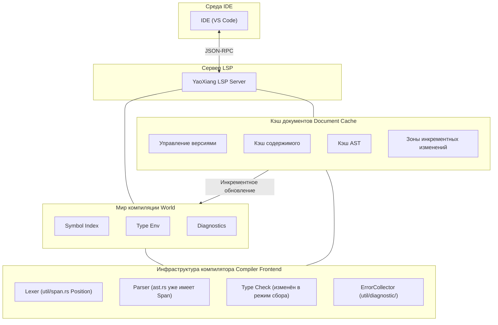

# RFC-017: Дизайн поддержки протокола языкового сервера (LSP)

>

>

>

> **Справка**: Ознакомьтесь с [полным примером](EXAMPLE_full_feature_proposal.md), чтобы узнать, как писать RFC.

## ⚠️ Предварительные условия реализации (важно)

Перед реализацией LSP необходимо решить две следующие ключевые проблемы:

### Проблема 1: Сбор диагностических ошибок

**Текущее состояние**: Проверяющий типы в настоящее время возвращает результат сразу при обнаружении первой ошибки (с помощью оператора `?`), не собирая все ошибки.

**Требования LSP**: IDE необходимо отображать **все** ошибки, а не только первую.

**Решение**:

#### 1.1 Паттерн сбора ошибок
- Изменить модуль `src/frontend/typecheck/inference/`, чтобы он возвращал `Result<Type, Vec<Error>>`
- Не возвращаться сразу при обнаружении ошибки, а продолжить проверку
- После завершения проверки вернуть все ошибки вместе

#### 1.2 Уровни ошибок
Разграничение ошибок различной степени серьёзности:

```rust
enum ErrorKind {
    Error,      // Серьёзная ошибка, которая может вызвать каскадные ошибки
    Warning,    // Предупреждение, проверка продолжается без остановки
    Note,       // Дополнительная информация
}
```

- Если есть `Error`: `publishDiagnostics` отображает ошибку
- Если только `Warning`: компиляция продолжается, выводятся предупреждения

#### 1.3 Восстановление после ошибок Parser
- При ошибке парсинга вставлять **placeholder-узлы** (например, `MissingExpression`) вместо отказа
- Избегать паники при проверке типов из-за неполного AST
- Пример: `let x = ;` → `let x = MissingExpression`

#### 1.4 Отложенная отправка (Delayed Emission)
- Некоторые ошибки могут быть «каскадными» (вызванными предыдущими ошибками)
- Можно сначала собрать их, отфильтровать очевидные каскадные ошибки после разбора AST
- Или простое решение: сообщать обо всех, чтобы пользователь исправлял их по очереди

### Проблема 2: Кэширование парсинга на уровне файлов

**Текущее состояние**: Каждый запрос LSP заново разбирает весь файл, без механизма кэширования.

**Требования LSP**: Каждое редактирование должно обрабатываться быстро, без повторного парсинга неизменённых файлов.

**Решение**:

#### 2.1 Структура кэша файлов
```rust
struct DocumentCache {
    version: u32,           // Версия документа LSP
    content: String,        // Текущее содержимое
    content_hash: u64,      // Хэш содержимого (для быстрого сравнения)
    ast: Option<Ast>,       // Кэшированный AST (необязательно)
}
```

#### 2.2 Обнаружение изменений
- При каждом `textDocument/didChange` получение нового содержимого
- Вычисление хэша нового содержимого и сравнение с кэшированным `content_hash`
- **Если изменилось: полный повторный парсинг файла**
- **Если не изменилось: возврат кэшированного результата**

#### 2.3 Стратегия повторного парсинга
- **На уровне файлов**: повторный парсинг только текущего файла, а не всего проекта
- Это упрощённый дизайн, без построчного инкрементного парсинга
- Современные компьютеры могут разобрать файл в несколько тысяч строк за несколько миллисекунд

#### 2.4 Отличие от cargo check
| | cargo check | YaoXiang LSP |
|---|---|---|
| Область действия | Весь проект | Один файл |
| Частота | Ручной запуск | Каждое редактирование |
| Цель | Полная проверка компиляции | Быстрый инкрементный ответ |

### Интеграция с существующими модулями

| Существующий модуль | Способ интеграции LSP |
|----------|-------------|
| `util/span.rs` | ✅ Уже есть `Position`/`Span`, напрямую маппится в LSP `Position` |
| `util/diagnostic/collect.rs` | ⚠️ Нужно изменить в «режим сбора», непрерывно накапливать ошибки |
| `frontend/core/lexer/symbols.rs` | ⚠️ Требуется расширение, добавление `uri` + информация о позиции `span` |
| `frontend/typecheck/mod.rs` | ⚠️ Нужно изменить `TypeResult`, возвращать все ошибки |
| `frontend/core/parser/ast.rs` | ✅ У каждого узла уже есть `Span`, изменений не требуется |

---

## Резюме

Добавление поддержки Language Server Protocol (LSP) в YaoXiang, реализация полноценного языкового сервера для предоставления основным IDE (VS Code, Neovim, Emacs и другим) таких возможностей разработки, как автодополнение кода, переход к определению, диагностика, поиск ссылок и других.

## Мотивация

### Почему эта функция необходима?

В настоящее время язык YaoXiang не имеет официальной поддержки интеграции с IDE, разработчики могут использовать только базовые текстовые редакторы для написания кода, что лишает их:

1. **Автодополнение кода** — невозможность интеллектуального дополнения идентификаторов, ключевых слов, типов в зависимости от контекста
2. **Переход к определению** — невозможность быстрого перехода к месту определения функций, типов, переменных
3. **Диагностика в реальном времени** — невозможность мгновенного отображения синтаксических и типовых ошибок при редактировании
4. **Поиск ссылок** — невозможность найти все места использования символа
5. **Всплывающие подсказки** — невозможность отображения информации о типах и документации при наведении курсора

LSP является стандартом для современных языков программирования, основные языки (Rust, Python, TypeScript, Go и др.) имеют成熟ные реализации LSP. Поддержка LSP значительно улучшит опыт разработки на YaoXiang.

### Текущие проблемы

1. **Низкая эффективность разработки** — отсутствие автодополнения и интеллектуальных подсказок
2. **Затруднённая отладка** — невозможность быстро найти определение символа
3. **Крутая кривая обучения** — отсутствие вспомогательных функций IDE
4. **Неполная экосистема** — невозможность привлечь разработчиков, привыкших к современным IDE

## Предложение

### Основной дизайн

Реализация отдельного серверного процесса LSP, взаимодействующего с IDE через JSON-RPC:



### Архитектура сервера LSP

```
src/lsp/
├── main.rs              # Точка входа сервера LSP
├── server.rs           # Основная логика сервера
├── session.rs          # Управление сессиями
├── capabilities.rs     # Объявление возможностей сервера
├── handlers/
│   ├── mod.rs
│   ├── initialize.rs   # Обработка инициализации
│   ├── text_document.rs # Обработка операций с документами
│   ├── completion.rs   # Обработка дополнения
│   ├── definition.rs   # Обработка перехода к определению
│   ├── references.rs   # Обработка поиска ссылок
│   ├── hover.rs        # Обработка всплывающих подсказок
│   └── diagnostics.rs  # Обработка диагностики
├── world.rs            # Мир компиляции (таблица символов, кэш AST)
├── scroller.rs         # Построение индекса символов
├── protocol.rs         # Определения типов протокола LSP
└── cache/              # Модуль инкрементного кэша (новый)
    ├── mod.rs
    ├── document.rs     # Кэш документов (версия, AST, таблица символов)
    └── incremental.rs  # Стратегия инкрементного парсинга
```

### Дизайн мира компиляции (World)

Управление глобальным состоянием компиляции:
- Кэш документов (версия, AST, таблица символов)
- Глобальный индекс символов
- Коллектор ошибок
- Кэш окружения типов

Основные методы:
- `on_document_change`: обработка инкрементных изменений
- `incremental_reparse`: инкрементный повторный парсинг
- `collect_diagnostics`: сбор всех ошибок (без остановки)

### Поддержка основных методов LSP

| Категория | Метод | Описание |
|------|------|------|
| **Жизненный цикл** | `initialize` / `initialized` / `shutdown` / `exit` | Жизненный цикл сервера |
| **Синхронизация документов** | `didOpen` / `didChange` / `didClose` | Управление документами |
| **Диагностика** | `publishDiagnostics` | Публикация диагностики |
| **Дополнение** | `completion` | Автодополнение кода |
| **Переход** | `definition` | Переход к определению |
| **Ссылки** | `references` | Поиск ссылок |
| **Всплывающие подсказки** | `hover` | Всплывающие подсказки |
| **Символы** | `workspace/symbol` | Поиск символов в рабочей области |

### Механизм синхронизации текстовых документов

Использование стратегии инкрементной синхронизации:
- Сохранение номера версии документа
- Применение инкрементных изменений (range + text)
- При больших изменениях переход к полной замене

### Построение индекса символов

Использование существующей системы таблицы символов для построения обратного индекса:
- Необходимо расширить `SymbolEntry`, добавить поле `location`
- Индекс: имя → список позиций, файл → список символов

### Реализация автодополнения

Источники дополнений: ключевые слова, переменные, функции, типы, поля структур, модули

### Реализация перехода к определению

Символьный анализ на основе AST: поиск позиции определения, соответствующей идентификатору/вызову функции

## Детальный дизайн

### Влияние на систему типов

1. **Расширение информации о символах** — добавление позиционной информации в таблицу символов (файл, номер строки, номер столбца)
2. **Раскрытие информации о типах** — предоставление интерфейса запроса типов для LSP
3. **Интеграция документационных комментариев** — поддержка генерации документационных строк из комментариев

### Поведение во время выполнения

- Сервер LSP работает как отдельный процесс
- Используется stdin/stdout для коммуникации JSON-RPC
- Поддержка параллельной обработки нескольких сессий

### Изменения в компиляторе

| Компонент | Изменение |
|------|------|
| `frontend/events` | Расширение системы событий, поддержка уведомлений LSP |
| `frontend/core/lexer/symbols` | Улучшение таблицы символов, добавление позиционной информации |
| Новый `src/lsp/` | Реализация сервера LSP |

### Обратная совместимость

- ✅ Полная обратная совместимость
- Сервер LSP является независимым компонентом, не влияет на существующий процесс компиляции
- Существующие инструменты CLI не затрагиваются

### Интеграция с существующими системами

1. **Система событий** — использование механизма подписки на события `frontend/events/`
2. **Система диагностики** — повторное использование диагностического вывода `util/diagnostic/`
   - Повторное использование `ErrorCollector<E>` для сбора всех ошибок
   - Преобразование `Diagnostic` в формат LSP `Diagnostic`
3. **Таблица символов** — расширение возможностей позиционирования символов `symbols.rs`
   - Расширение `SymbolEntry`, добавление поля `location: Location`
   - Построение `SymbolIndex` обратного индекса (имя -> список позиций)
4. **Инфраструктура компилятора** — прямой вызов Lexer, Parser, проверки типов
   - **Ключевое изменение**: проверяющий типы должен быть переведён в «режим сбора», без остановки при ошибках

#### Преобразование формата диагностики

```rust
/// Преобразование Diagnostic YaoXiang в LSP Diagnostic
fn to_lsp_diagnostic(diag: &Diagnostic) -> lsp_types::Diagnostic {
    let severity = match diag.severity() {
        Severity::Error => lsp_types::DiagnosticSeverity::ERROR,
        Severity::Warning => lsp_types::DiagnosticSeverity::WARNING,
        Severity::Info => lsp_types::DiagnosticSeverity::INFORMATION,
    };

    lsp_types::Diagnostic {
        range: to_lsp_range(diag.span()),
        severity: Some(severity),
        message: diag.message().to_string(),
        code: diag.code().map(|c| lsp_types::NumberOrString::String(c.as_string())),
        ..Default::default()
    }
}

/// Преобразование Span YaoXiang в LSP Range
fn to_lsp_range(span: &Span) -> lsp_types::Range {
    lsp_types::Range {
        start: lsp_types::Position {
            line: span.start.line.saturating_sub(1), // LSP использует 0-indexed
            character: span.start.column.saturating_sub(1),
        },
        end: lsp_types::Position {
            line: span.end.line.saturating_sub(1),
            character: span.end.column.saturating_sub(1),
        },
    }
}
```

## Продвинутые функции YaoXiang

Использование мощных возможностей YaoXiang в области вычислений на этапе компиляции и системы владения для предоставления уникального опыта разработки, недоступного в других языках:

### 1. Встроенные подсказки (Inlay Hints)

- **Подсказки значений констант**: отображение вычисленных на этапе компиляции значений констант (например, рядом с `const MAX = 100 + 200` отображается `300`)
- **Подсказки изменяемости**: отображение, является ли переменная изменяемой (например, `mut x`,`x` имеют чёткое подчёркивание)
- **Подсказки потребления владения**: отображение, потребляется ли параметр функции (например, `consumed` / `borrowed`)
- **Подсказки семантики пустого владения**: отображение подсказок о переменных, которые могут быть переприсвоены после перемещения, путём приглушения цвета переменной
- **Подсказки вывода типов**: отображение выведенных конкретных типов (например, рядом с `x = vec![]` отображается `Vec<i32>`)

### 2. Визуализация семантики владения

- Отображение пути перемещения переменной (от позиции определения до всех позиций использования)
- Визуализация времени жизни заимствования

### 3. Предварительный просмотр вычислений на этапе компиляции

- При наведении отображение результата вычисления константных выражений на этапе компиляции

### Приоритеты реализации

| Функция | Приоритет |
|------|--------|
| Подсказки значений констант | P0 |
| Подсказки изменяемости | P0 |
| Подсказки потребления владения | P1 |
| Визуализация владения | P2 |

---

## Коммуникация и удалённая поддержка

### Режимы коммуникации

Поддержка трёх режимов:

| Режим | Назначение |
|------|------|
| stdio | Локальная разработка (по умолчанию)|
| TCP Socket | Удалённая разработка/отладка |
| Unix Domain Socket | Высокопроизводительная локальная коммуникация |

### Удалённая отладка

Реализация на основе DAP (Debug Adapter Protocol):
- Поддержка строчных точек останова, точек останова функций, условных точек останова
- Особые точки останова YaoXiang: срабатывание при перемещении переменной

### Параметры запуска

```bash
# Локальный режим
yaoxiang-lsp

# TCP сервер
yaoxiang-lsp --tcp --port 8765

# С одновременным включением отладки
yaoxiang-lsp --tcp --port 8765 --enable-debug
```

---

## Модель параллелизма

**Проектное решение: однопоточный + асинхронный цикл событий**

Обоснование:
- Компилятор не является потокобезопасным, стоимость переделки высока
- Запросы LSP по своей природе сериализуемы, не требуется параллелизм
- Однопоточность проще и легче в отладке
- Производительности async I/O в одном потоке достаточно

Фоновые задачи используют `spawn_blocking` для использования преимуществ многоядерных систем.

---

## Встроенный инструмент тестирования LSP (опционально)

> Эта функция не является обязательной для MVP, может быть добавлена в последующих версиях.

Предоставление формата JSON для тестовых случаев:

```bash
# Запуск тестов
yaoxiang-lsp --test
```

---

## Компромиссы

### Преимущества

1. **Улучшение опыта разработки** — поддержка IDE, близкая к основным языкам
2. **Развитие экосистемы** — привлечение большего числа разработчиков на YaoXiang
3. **Повышение качества кода** — диагностика в реальном времени сокращает ошибки времени выполнения
4. **Вклад сообщества** — разработчики могут участвовать в разработке инструментария LSP

### Недостатки

1. **Высокая сложность реализации** — требуется обработка большого количества граничных случаев LSP
2. **Стоимость поддержки** — необходимо следовать обновлениям версий протокола LSP
3. **Вопросы производительности** — производительность индексации и запросов для крупных проектов
4. **Сложность тестирования** — требуется моделирование поведения IDE для тестирования

## Альтернативные решения

| Решение | Почему не выбрано |
|------|--------------|
| Только подсветка синтаксиса | Не соответствует современным потребностям разработки |
| Использование Tree-sitter | Требует дополнительных затрат на изучение, функциональность ограничена |

## Стратегия реализации

### Разделение на этапы

1. **Этап 0 (предварительный)**: Адаптация компилятора ⚠️ **Критически важно**
   - Изменение проверяющего типы в «режим сбора», возврат `Result<Type, Vec<Error>>`
   - Реализация уровней ошибок (Error / Warning / Note)
   - Восстановление после ошибок Parser: вставка placeholder-узлов
   - Расширение таблицы символов `SymbolEntry`, добавление поля `location`
   - Реализация системы кэширования `DocumentCache` (версия + содержимое + хэш)
   - **Этот этап является предпосылкой реализации LSP, должен быть выполнен первым**

2. **Этап 1 (v0.7)**: Базовая инфраструктура
   - Каркас сервера LSP
   - Методы жизненного цикла (initialize/shutdown/exit)
   - Базовая система логирования и обработки ошибок

3. **Этап 2 (v0.7)**: Поддержка диагностики
   - Синхронизация текстовых документов
   - Интеграция диагностики компиляции
   - `textDocument/publishDiagnostics`

4. **Этап 3 (v0.8)**: Поддержка дополнения
   - Построение индекса символов
   - Дополнение ключевых слов
   - Дополнение идентификаторов

5. **Этап 4 (v0.8)**: Поддержка перехода
   - Переход к определению
   - Поиск ссылок
   - Всплывающие подсказки

6. **Этап 5 (v0.9)**: Продвинутые функции
   - Поиск символов в рабочей области
   - Форматирование кода
   - Поддержка рефакторинга (опционально)

### Зависимости

- Нет зависимости от внешних библиотек LSP (используется crate `lsp-types`)
- Зависимость от существующих модулей инфраструктуры компилятора
- Зависимость от `serde_json` для сериализации JSON-RPC

### Риски

1. **Проблемы производительности** — парсинг больших файлов может вызвать зависание
   - Решение: инкрементный парсинг, обработка в фоновых потоках
2. **Использование памяти** — индекс символов занимает память
   - Решение: отложенная загрузка, LRU-кэш
3. **Совместимость протокола** — различия версий LSP
   - Решение: объявление поддерживаемой версии протокола

## Открытые вопросы

- [x] Механизм сбора ошибок (см. раздел «Предварительные условия реализации»)
- [x] Система инкрементного кэширования (см. раздел «Предварительные условия реализации»)
- [x] Версия протокола LSP: использование 3.18 (поддержка Inlay Hints, Inline Values и других новых функций)
- [x] Поддержка удалённой коммуникации (через TCP, совмещение LSP + отладка)
- [x] Поддержка удалённой отладки (на основе протокола DAP)
- [x] Модель параллелизма: однопоточный + async цикл событий
- [x] Встроенный инструмент тестирования LSP (опционально): использование JSON тестовых случаев

---

## Приложения (опционально)

### Приложение A: Записи обсуждения дизайна

> Используется для записи подробных обсуждений в процессе принятия проектных решений.

### Приложение B: Журнал проектных решений

| Решение | Результат | Дата | Записал |
|------|------|------|--------|
| Архитектура сервера LSP | Отдельный процесс, коммуникация через stdio | 2026-02-15 | 晨煦 |
| Версия протокола | Поддержка LSP 3.18 (требуется для Inlay Hints и других новых функций) | 2026-02-22 | 晨煦 |
| Режим сбора ошибок | Возврат `Result<Type, Vec<Error>>`, поддержка уровней ошибок и восстановления после ошибок | 2026-02-22 | 晨煦 |
| Стратегия кэширования | Файловое кэширование: версия + содержимое + хэш, полный повторный парсинг файла | 2026-02-22 | 晨煦 |
| Режимы коммуникации | Поддержка stdio + TCP + UnixSocket | 2026-02-22 | 晨煦 |
| Удалённая отладка | На основе протокола DAP, общий транспортный уровень с LSP | 2026-02-22 | 晨煦 |
| Модель параллелизма | Однопоточный + async цикл событий | 2026-02-22 | 晨煦 |
| Инструмент тестирования (опционально) | JSON тестовые случаи + встроенный тестовый раннер | 2026-02-22 | 晨煦 |

### Приложение C: Глоссарий терминов

| Термин | Определение |
|------|------|
| LSP | Language Server Protocol, протокол языкового сервера |
| JSON-RPC | JSON-Remote Procedure Call, удалённый вызов процедур JSON |
| DAP | Debug Adapter Protocol, протокол адаптера отладки |
| Индекс символов | Таблица сопоставления позиций символов, построенная на этапе компиляции |
| Мир компиляции | Контекст, содержащий всю информацию для компиляции |
| Встроенные подсказки | Inlay Hints, информация, отображаемая в строке |
| Трекинг владения | Ownership Trace, визуализация потока владения переменных |

---

## Список литературы

- [Спецификация Language Server Protocol](https://microsoft.github.io/language-server-protocol/)
- [Спецификация LSP 3.18](https://github.com/microsoft/language-server-protocol/blob/main/specifications/specification-3-18.md)
- [Спецификация Debug Adapter Protocol](https://microsoft.github.io/debug-adapter-protocol/)
- [Rust Analyzer](https://rust-analyzer.github.io/) — эталонная реализация
- [crate lsp-types](https://crates.io/crates/lsp-types) — определения типов LSP
- [Спецификация JSON-RPC 2.0](https://www.jsonrpc.org/specification)

---

## Жизненный цикл и судьба

RFC имеет следующие статусы:

```
┌─────────────┐
│   Черновик  │  ← Создаётся автором
└──────┬──────┘
       │
       ▼
┌─────────────┐
│ На рассмотрении │  ← Обсуждение сообществом
└──────┬──────┘
       │
       ├──────────────────┐
       ▼                  ▼
┌─────────────┐    ┌─────────────┐
│  Принят    │    │  Отклонён   │
└──────┬──────┘    └──────┬──────┘
       │                  │
       ▼                  ▼
┌─────────────┐    ┌─────────────┐
│   accepted/ │    │  rejected/  │
│ (окончательный дизайн)  │     │ (отклонение)     │
└─────────────┘    └─────────────┘
```

### Описание статусов

| Статус | Расположение | Описание |
|------|------|------|
| **Черновик** | `docs/design/rfc/draft/` | Черновик автора, ожидает подачи на рассмотрение |
| **На рассмотрении** | `docs/design/rfc/review/` | Открыто обсуждение и обратная связь сообщества |
| **Принят** | `docs/design/accepted/` | Становится официальным документом дизайна, переходит в фазу реализации |
| **Отклонён** | `docs/design/rfc/` | Сохраняется в каталоге RFC, статус обновляется |

### Действия после принятия

1. Переместить RFC в каталог `docs/design/accepted/`
2. Обновить имя файла на описательное (например, `lsp-support.md`)
3. Обновить статус на «Официальный»
4. Обновить статус на «Принят», добавить дату принятия

### Действия после отклонения

1. Сохранить в каталоге `docs/design/rfc/draft/`
2. Добавить причину отклонения и дату в верхней части файла
3. Обновить статус на «Отклонён»

### Действия после определения в ходе обсуждения

Когда по какому-либо открытому вопросу достигнут консенсус:

1. **Обновить Приложение A**: записать «Резолюцию» в теме обсуждения
2. **Обновить основной текст**: синхронизировать решение с основным текстом документа
3. **Записать решение**: добавить в «Приложение B: Журнал проектных решений»
4. **Отметить вопрос**: отметить галочкой `[x]` в списке «Открытые вопросы»

---

> **Примечание**: Номер RFC используется только на этапе обсуждения. После принятия номер удаляется, используется описательное имя файла.