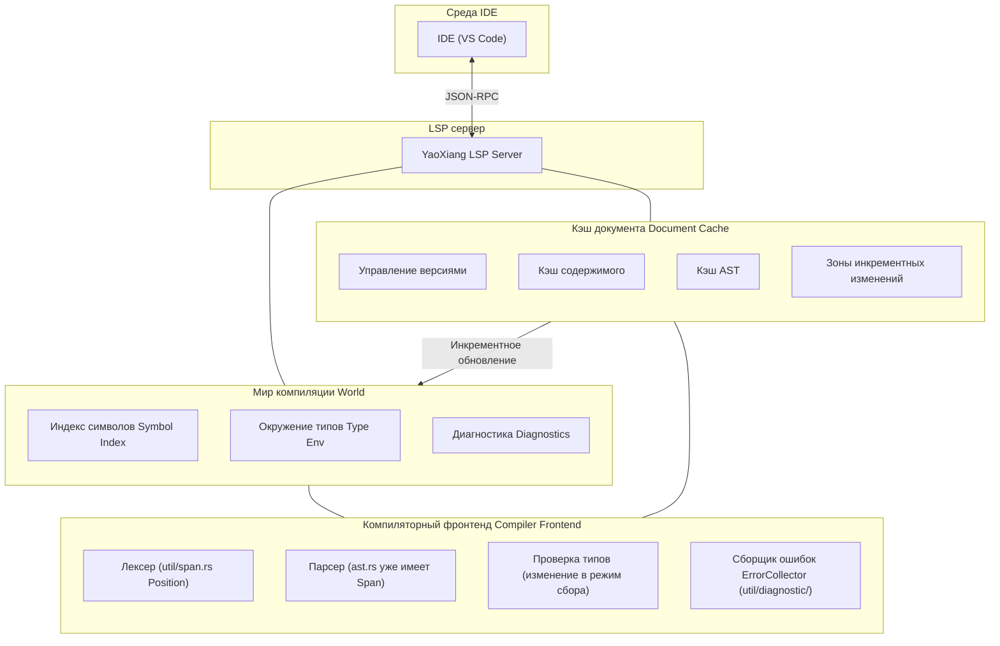

```md
---
title: 'RFC-017: Дизайн поддержки протокола языкового сервера (LSP)'
---

# RFC-017: Дизайн поддержки протокола языкового сервера (LSP)

> **Статус**: На рассмотрении
>
> **Автор**: Чэнь Сюй
>
> **Дата создания**: 2026-02-15
>
> **Последнее обновление**: 2026-02-22

> **Справка**: Смотрите [полный пример](EXAMPLE_full_feature_proposal.md), чтобы узнать, как писать RFC.

## ⚠️ Предварительные условия реализации (Важно)

Перед реализацией LSP необходимо решить следующие две ключевые проблемы:

### Проблема 1: Сбор диагностических ошибок

**Текущее состояние**: Типовой проверяющий в настоящее время возвращает результат сразу при обнаружении первой ошибки (с использованием оператора `?`), без сбора всех ошибок.

**Требование LSP**: IDE необходимо отображать **все** ошибки, а не только первую.

**Решение**:

#### 1.1 Паттерн сбора ошибок
- Изменить модуль `src/frontend/typecheck/inference/` для возврата `Result<Type, Vec<Error>>`
- Не возвращаться сразу при обнаружении ошибки, а продолжить проверку
- После завершения проверки вернуть все ошибки вместе

#### 1.2 Уровни ошибок
Различать ошибки разной степени серьёзности:

```rust
enum ErrorKind {
    Error,      // Серьёзная ошибка, может вызвать каскадные ошибки
    Warning,    // Предупреждение, продолжить проверку без остановки
    Note,       // Дополнительная информация
}
```

- Если есть `Error`: `publishDiagnostics` отображает ошибку
- Если только `Warning`: продолжить компиляцию, отобразить предупреждение

#### 1.3 Восстановление после ошибок парсера
- При ошибках парсинга вставлять **placeholder-узлы** (например, `MissingExpression`) вместо отказа
- Избегать паники при проверке типов из-за неполного AST
- Пример: `let x = ;` → `let x = MissingExpression`

#### 1.4 Отложенная отправка (Delayed Emission)
- Некоторые ошибки могут быть «каскадными» (вызваны предыдущими ошибками)
- Можно сначала собрать их, отфильтровать очевидные каскадные ошибки после разбора AST
- Или простое решение: сообщать обо всех, чтобы пользователь исправлял по порядку

### Проблема 2: Кэширование парсинга на уровне файлов

**Текущее состояние**: Каждый запрос LSP заново парсит весь файл, без механизма кэширования.

**Требование LSP**: Каждое редактирование должно быстро отвечать, без повторного парсинга неизменённых файлов.

**Решение**:

#### 2.1 Структура кэша документа
```rust
struct DocumentCache {
    version: u32,           // Версия документа LSP
    content: String,        // Текущее содержимое
    content_hash: u64,      // Хэш содержимого (быстрое сравнение)
    ast: Option<Ast>,       // Кэшированный AST (опционально)
}
```

#### 2.2 Обнаружение изменений
- При каждом `textDocument/didChange` получение нового содержимого
- Вычисление хэша нового содержимого и сравнение с кэшированным `content_hash`
- **При изменении: перепарсить весь файл**
- **При отсутствии изменений: напрямую вернуть кэшированный результат**

#### 2.3 Стратегия перепарсинга
- **На уровне файла**: перепарсить только текущий файл, а не весь проект
- Это упрощённый дизайн, без построчного инкрементного парсинга
- Современные компьютеры парсят один файл в несколько тысяч строк за миллисекунды

#### 2.4 Отличие от cargo check
| | cargo check | YaoXiang LSP |
|---|---|---|
| Область действия | Весь проект | Один файл |
| Частота | Ручной запуск | Каждое редактирование |
| Цель | Полная проверка компиляции | Быстрый инкрементный отклик |

### Интеграция с существующими модулями

| Существующий модуль | Способ интеграции LSP | |
|----------|-------------|
| `util/span.rs` | ✅ Уже есть `Position`/`Span`, напрямую маппится в LSP `Position` |
| `util/diagnostic/collect.rs` | ⚠️ Нужно изменить в режим «сбора», непрерывно накапливать ошибки |
| `frontend/core/lexer/symbols.rs` | ⚠️ Нужно расширить, добавить информацию о позиции `uri` + `span` |
| `frontend/typecheck/mod.rs` | ⚠️ Нужно изменить `TypeResult`, возвращать все ошибки |
| `frontend/core/parser/ast.rs` | ✅ У каждого узла уже есть `Span`, изменений не требуется |

---

## Резюме

Добавить поддержку Language Server Protocol (LSP) в YaoXiang для реализации полнофункционального языкового сервера, позволяющего основным IDE (VS Code, Neovim, Emacs и др.) предоставлять такие инструменты разработки, как дополнение кода, переход к определению, диагностика, поиск ссылок и другие.

## Мотивация

### Зачем нужна эта функция?

В настоящее время языку YaoXiang не хватает официальной поддержки интеграции с IDE. Разработчики могут использовать только базовые текстовые редакторы для написания кода, что лишает их:

1. **Дополнение кода** — невозможность интеллектуального дополнения идентификаторов, ключевых слов, типов на основе контекста
2. **Переход к определению** — невозможность быстрого перехода к позиции определения функций, типов, переменных
3. **Реальное время диагностики** — невозможность мгновенного отображения синтаксических и типовых ошибок при редактировании
4. **Поиск ссылок** — невозможность найти все позиции использования символа
5. **Всплывающие подсказки** — невозможность отображения информации о типах и документационных комментариях при наведении курсора

LSP является стандартной функцией современных языков программирования. Основные языки (Rust, Python, TypeScript, Go и др.) имеют成熟的 реализации LSP. Поддержка LSP значительно улучшит опыт разработки на YaoXiang.

### Текущие проблемы

1. **Низкая эффективность разработки** — отсутствие дополнения кода и интеллектуальных подсказок
2. **Сложности при отладке** — невозможность быстро найти определение символа
3. **Крутая кривая обучения** — отсутствие вспомогательных функций IDE
4. **Незрелая экосистема** — невозможность привлечь разработчиков, привыкших к современным IDE

## Предложение

### Основной дизайн

Реализация отдельного серверного процесса LSP, взаимодействующего с IDE через JSON-RPC:



### Архитектура LSP сервера

```
src/lsp/
├── main.rs              # Входная точка LSP сервера
├── server.rs           # Основная логика сервера
├── session.rs          # Управление сессиями
├── capabilities.rs     # Объявление возможностей сервера
├── handlers/
│   ├── mod.rs
│   ├── initialize.rs   # Обработка инициализации
│   ├── text_document.rs # Обработка операций с документами
│   ├── completion.rs   # Обработка дополнения
│   ├── definition.rs   # Обработка перехода к определению
│   ├── references.rs   # Обработка поиска ссылок
│   ├── hover.rs        # Обработка всплывающих подсказок
│   └── diagnostics.rs  # Обработка диагностики
├── world.rs            # Мир компиляции (таблица символов, кэш AST)
├── scroller.rs         # Построение индекса символов
├── protocol.rs         # Определения типов протокола LSP
└── cache/              # Модуль инкрементного кэширования (новый)
    ├── mod.rs
    ├── document.rs     # Кэш документа (версия, AST, таблица символов)
    └── incremental.rs  # Стратегия инкрементного парсинга
```

### Дизайн мира компиляции (World)

Управление глобальным состоянием компиляции:
- Кэш документа (версия, AST, таблица символов)
- Глобальный индекс символов
- Сборщик ошибок
- Кэш окружения типов

Основные методы:
- `on_document_change`: обработка инкрементных изменений
- `incremental_reparse`: инкрементный перепарсинг
- `collect_diagnostics`: сбор всех ошибок (без остановки)

### Поддержка основных методов LSP

| Категория | Метод | Описание |
|------|------|------|
| **Жизненный цикл** | `initialize` / `initialized` / `shutdown` / `exit` | Жизненный цикл сервера |
| **Синхронизация документа** | `didOpen` / `didChange` / `didClose` | Управление документами |
| **Диагностика** | `publishDiagnostics` | Публикация диагностики |
| **Дополнение** | `completion` | Дополнение кода |
| **Переход** | `definition` | Переход к определению |
| **Ссылки** | `references` | Поиск ссылок |
| **Всплывающие подсказки** | `hover` | Всплывающие подсказки |
| **Символы** | `workspace/symbol` | Поиск символов в рабочей области |

### Механизм синхронизации текстовых документов

Использование стратегии инкрементной синхронизации:
- Сохранение номера версии документа
- Применение инкрементных изменений (range + text)
- При больших изменениях — переход на полную замену

### Построение индекса символов

Использование существующей системы таблицы символов для построения обратного индекса:
- Необходимо расширить `SymbolEntry`, добавить поле `location`
- Индекс: имя → список позиций, файл → список символов

### Реализация дополнения кода

Источники дополнения: ключевые слова, переменные, функции, типы, поля структур, модули

### Реализация перехода к определению

Символьный анализ на основе AST: поиск позиции определения соответствующего идентификатору/вызову функции

## Детальный дизайн

### Влияние на систему типов

1. **Расширение информации о символах** — добавление позиционной информации в таблицу символов (файл, номер строки, номер столбца)
2. **Раскрытие информации о типах** — предоставление интерфейса запроса типов для LSP
3. **Интеграция документационных комментариев** — поддержка генерации документационных строк из комментариев

### Поведение во время выполнения

- LSP сервер работает как отдельный процесс
- Используется stdin/stdout для JSON-RPC коммуникации
- Поддержка многопоточной обработки сессий

### Изменения в компиляторе

| Компонент | Изменение | |
|------|------|
| `frontend/events` | Расширение системы событий, поддержка LSP уведомлений |
| `frontend/core/lexer/symbols` | Улучшение таблицы символов, добавление позиционной информации |
| Новый `src/lsp/` | Реализация LSP сервера |

### Обратная совместимость

- ✅ Полная обратная совместимость
- LSP сервер является независимым компонентом, не влияет на существующий процесс компиляции
- Существующие инструменты CLI не затрагиваются

### Интеграция с существующими системами

1. **Система событий** — использование механизма подписки на события из `frontend/events/`
2. **Система диагностики** — повторное использование диагностического вывода из `util/diagnostic/`
   - Повторное использование `ErrorCollector<E>` для сбора всех ошибок
   - Преобразование `Diagnostic` в формат LSP `Diagnostic`
3. **Таблица символов** — расширение возможностей позиционирования символов в `symbols.rs`
   - Расширение `SymbolEntry`, добавление поля `location: Location`
   - Построение обратного индекса `SymbolIndex` (имя -> список позиций)
4. **Компиляторный фронтенд** — прямой вызов Лексера, Парсера, проверки типов
   - **Ключевое изменение**: проверщик типов должен работать в «режиме сбора», без остановки

#### Преобразование формата диагностики

```rust
/// Преобразование YaoXiang Diagnostic в LSP Diagnostic
fn to_lsp_diagnostic(diag: &Diagnostic) -> lsp_types::Diagnostic {
    let severity = match diag.severity() {
        Severity::Error => lsp_types::DiagnosticSeverity::ERROR,
        Severity::Warning => lsp_types::DiagnosticSeverity::WARNING,
        Severity::Info => lsp_types::DiagnosticSeverity::INFORMATION,
    };

    lsp_types::Diagnostic {
        range: to_lsp_range(diag.span()),
        severity: Some(severity),
        message: diag.message().to_string(),
        code: diag.code().map(|c| lsp_types::NumberOrString::String(c.as_string())),
        ..Default::default()
    }
}

/// Преобразование YaoXiang Span в LSP Range
fn to_lsp_range(span: &Span) -> lsp_types::Range {
    lsp_types::Range {
        start: lsp_types::Position {
            line: span.start.line.saturating_sub(1), // LSP использует 0-индексацию
            character: span.start.column.saturating_sub(1),
        },
        end: lsp_types::Position {
            line: span.end.line.saturating_sub(1),
            character: span.end.column.saturating_sub(1),
        },
    }
}
```

## Продвинутые функции, специфичные для YaoXiang

Использование мощной системы компиляционного вычисления и ownership YaoXiang для предоставления уникального опыта разработки, недоступного в других языках:

### 1. Встроенные подсказки (Inlay Hints)

- **Подсказки значений констант**: отображение уже вычисленных на этапе компиляции значений констант (например, рядом с `const MAX = 100 + 200` отображается `300`)
- **Подсказки изменчивости**: отображение того, является ли переменная изменяемой (например, `mut x`, к `x` добавляется заметное подчёркивание)
- **Подсказки потребления ownership**: отображение того, потребляется ли параметр функции (например, `consumed` / `borrowed`)
- **Подсказки семантики пустого ownership**: отображение подсказок о возможности повторного присваивания после перемещения переменной путём затемнения цвета переменной
- **Подсказки вывода типов**: отображение выведенных конкретных типов (например, рядом с `x = vec![]` отображается `Vec<i32>`)

### 2. Визуализация семантики ownership

- Отображение пути перемещения переменной (от позиции определения до всех позиций использования)
- Визуализация времени жизни заимствования

### 3. Предпросмотр компиляционного вычисления

- При наведении отображение результата компиляционного вычисления константных выражений

### Приоритеты реализации

| Функция | Приоритет |
|------|--------|
| Встроенные подсказки значений констант | P0 |
| Подсказки изменчивости | P0 |
| Подсказки потребления ownership | P1 |
| Визуализация ownership | P2 |

---

## Коммуникация и удалённая поддержка

### Режимы коммуникации

Поддержка трёх режимов:

| Режим | Назначение |
|------|------|
| stdio | Локальная разработка (по умолчанию) |
| TCP Socket | Удалённая разработка/отладка |
| Unix Domain Socket | Высокопроизводительная локальная коммуникация |

### Удалённая отладка

На основе DAP (Debug Adapter Protocol):
- Поддержка строчных точек останова, точек останова функций, условных точек останова
- Специфичные для YaoXiang точки останова: срабатывание при перемещении переменной

### Параметры запуска

```bash
# Локальный режим
yaoxiang-lsp

# TCP сервер
yaoxiang-lsp --tcp --port 8765

# С одновременным включением отладки
yaoxiang-lsp --tcp --port 8765 --enable-debug
```

---

## Модель конкурентности

**Проектное решение: однопоточный + асинхронный цикл событий**

Обоснование:
- Компилятор не является потокобезопасным, стоимость переработки высока
- LSP запросы по своей природе последовательны, конкурентность не требуется
- Однопоточная модель проще и легче для отладки
- Производительность async I/O в одном потоке достаточна

Фоновые задачи используют `spawn_blocking` для использования многоядерности.

---

## Встроенный тестовый инструмент LSP (опционально)

> Эта функция не является обязательной для MVP, может быть добавлена в последующих версиях.

Предоставление формата JSON тестовых случаев:

```bash
# Запуск тестов
yaoxiang-lsp --test
```

---

## Компромиссы

### Преимущества

1. **Улучшение опыта разработки** — поддержка IDE, близкая к основным языкам
2. **Совершенствование экосистемы** — привлечение большего числа разработчиков на YaoXiang
3. **Повышение качества кода** — реальное время диагностики уменьшает ошибки времени выполнения
4. **Вклад сообщества** — разработчики могут участвовать в разработке инструментария LSP

### Недостатки

1. **Высокая сложность реализации** — необходимо обрабатывать большое количество краевых случаев LSP
2. **Стоимость поддержки** — необходимо следовать обновлениям версий протокола LSP
3. **Вопросы производительности** — производительность индексации и запросов в крупных проектах
4. **Сложность тестирования** — необходимо симулировать поведение IDE для тестирования

## Альтернативные решения

| Решение | Почему не выбрано |
|------|--------------|
| Только подсветка синтаксиса | Не может удовлетворить потребности современной разработки |
| Использование Tree-sitter | Требует дополнительных затрат на изучение, а возможности ограничены |

## Стратегия реализации

### Разделение на этапы

1. **Этап 0 (подготовительный)**: Адаптация компилятора ⚠️ **Ключевой**
   - Изменение проверщика типов в «режим сбора», возврат `Result<Type, Vec<Error>>`
   - Реализация уровней ошибок (Error / Warning / Note)
   - Восстановление после ошибок парсера: вставка placeholder-узлов
   - Расширение таблицы символов `SymbolEntry`, добавление поля `location`
   - Реализация системы кэширования DocumentCache (версия + содержимое + хэш)
   - **Этот этап является предпосылкой реализации LSP, должен быть выполнен первым**

2. **Этап 1 (v0.7)**: Базовая структура
   - Каркас LSP сервера
   - Методы жизненного цикла (initialize/shutdown/exit)
   - Базовая система логирования и обработки ошибок

3. **Этап 2 (v0.7)**: Поддержка диагностики
   - Синхронизация текстовых документов
   - Интеграция компиляционной диагностики
   - `textDocument/publishDiagnostics`

4. **Этап 3 (v0.8)**: Поддержка дополнения
   - Построение индекса символов
   - Дополнение ключевых слов
   - Дополнение идентификаторов

5. **Этап 4 (v0.8)**: Поддержка перехода
   - Переход к определению
   - Поиск ссылок
   - Всплывающие подсказки

6. **Этап 5 (v0.9)**: Продвинутые функции
   - Поиск символов в рабочей области
   - Форматирование кода
   - Поддержка рефакторинга (опционально)

### Зависимости

- Нет внешних зависимостей от библиотек LSP (используется crate `lsp-types`)
- Зависимость от существующих модулей компиляторного фронтенда
- Зависимость от `serde_json` для JSON-RPC сериализации

### Риски

1. **Проблемы производительности** — парсинг больших файлов может вызвать зависание
   - Решение: инкрементный парсинг, обработка в фоновых потоках
2. **Использование памяти** — индекс символов занимает память
   - Решение: ленивая загрузка, LRU кэширование
3. **Совместимость протокола** — различия версий LSP
   - Решение: объявление поддерживаемой версии протокола

## Открытые вопросы

- [x] Механизм сбора ошибок (см. главу «Предварительные условия реализации»)
- [x] Система инкрементного кэширования (см. главу «Предварительные условия реализации»)
- [x] Версия протокола LSP: использовать 3.18 (поддержка Inlay Hints, Inline Values и других новых функций)
- [x] Удалённая коммуникация (через TCP, с поддержкой LSP + отладка)
- [x] Удалённая отладка (на основе протокола DAP)
- [x] Модель конкурентности: однопоточный + async цикл событий
- [x] Встроенный тестовый инструмент LSP (опционально): использование JSON тестовых случаев

---

## Приложения (опционально)

### Приложение A: Записи обсуждения дизайна

> Используется для записи подробного обсуждения в процессе принятия проектных решений.

### Приложение B: Запись проектных решений

| Решение | Решение | Дата | Записал |
|------|------|------|--------|
| Архитектура LSP сервера | Независимый процесс, коммуникация через stdio | 2026-02-15 | Чэнь Сюй |
| Версия протокола | Поддержка LSP 3.18 (необходимы новые функции как Inlay Hints) | 2026-02-22 | Чэнь Сюй |
| Режим сбора ошибок | Возврат `Result<Type, Vec<Error>>`, поддержка уровней ошибок и восстановления | 2026-02-22 | Чэнь Сюй |
| Стратегия кэширования | Кэширование на уровне файлов: версия + содержимое + хэш, перепарсинг всего файла | 2026-02-22 | Чэнь Сюй |
| Режим коммуникации | Поддержка stdio + TCP + UnixSocket | 2026-02-22 | Чэнь Сюй |
| Удалённая отладка | На основе протокола DAP, общий транспортный уровень с LSP | 2026-02-22 | Чэнь Сюй |
| Модель конкурентности | Однопоточный + async цикл событий | 2026-02-22 | Чэнь Сюй |
| Тестовый инструмент (опционально)| JSON тестовые случаи + встроенный тестовый раннер | 2026-02-22 | Чэнь Сюй |

### Приложение C: Глоссарий

| Термин | Определение |
|------|------|
| LSP | Language Server Protocol, протокол языкового сервера |
| JSON-RCP | JSON-Remote Procedure Call, удалённый вызов процедур JSON |
| DAP | Debug Adapter Protocol, протокол адаптера отладки |
| Индекс символов | Таблица сопоставления позиций символов, построенная во время компиляции |
| Мир компиляции | Контекст, содержащий всю компиляционную информацию |
| Встроенные подсказки | Inlay Hints, информационные подсказки, отображаемые внутри строки |
| Отслеживание ownership | Ownership Trace, визуализация потока владения переменной |

---

## Список литературы

- [Спецификация Language Server Protocol](https://microsoft.github.io/language-server-protocol/)
- [Спецификация LSP 3.18](https://github.com/microsoft/language-server-protocol/blob/main/specifications/specification-3-18.md)
- [Спецификация Debug Adapter Protocol](https://microsoft.github.io/debug-adapter-protocol/)
- [Rust Analyzer](https://rust-analyzer.github.io/) — эталонная реализация
- [crate lsp-types](https://crates.io/crates/lsp-types) — определения типов LSP
- [Спецификация JSON-RPC 2.0](https://www.jsonrpc.org/specification)

---

## Жизненный цикл и судьба

RFC имеет следующие статусы перехода:

```
┌─────────────┐
│   Черновик  │  ← Создаётся автором
└──────┬──────┘
       │
       ▼
┌─────────────┐
│  На рассмотрении │  ← Обсуждение сообщества
└──────┬──────┘
       │
       ├──────────────────┐
       ▼                  ▼
┌─────────────┐    ┌─────────────┐
│   Принят    │    │   Отклонён  │
└──────┬──────┘    └──────┬──────┘
       │                  │
       ▼                  ▼
┌─────────────┐    ┌─────────────┐
│   accepted/ │    │  rejected/  │
│ (официальный дизайн) │     │ (отклонение)  │
└─────────────┘    └─────────────┘
```

### Описание статусов

| Статус | Расположение | Описание |
|------|------|------|
| **Черновик** | `docs/design/rfc/draft/` | Черновик автора, ожидает подачи на рассмотрение |
| **На рассмотрении** | `docs/design/rfc/review/` | Открыто обсуждение и обратная связь сообщества |
| **Принят** | `docs/design/accepted/` | Становится официальным документом дизайна, переходит в фазу реализации |
| **Отклонён** | `docs/design/rfc/` | Сохраняется в каталоге RFC, статус обновляется |

### Действия после принятия

1. Переместить RFC в каталог `docs/design/accepted/`
2. Обновить имя файла на описательное (например, `lsp-support.md`)
3. Обновить статус на «Официальный»
4. Обновить статус на «Принят», добавить дату принятия

### Действия после отклонения

1. Сохранить в каталоге `docs/design/rfc/draft/`
2. Добавить в начало файла причину и дату отклонения
3. Обновить статус на «Отклонён»

### Действия после определения обсуждения

Когда по какому-либо открытому вопросу достигнут консенсус:

1. **Обновить Приложение A**: Заполнить «Резолюция» в теме обсуждения
2. **Обновить основной текст**: Синхронизировать решение с основным текстом документа
3. **Записать решение**: Добавить в «Приложение B: Запись проектных решений»
4. **Отметить вопрос**: Установить галочку `[x]` в списке «Открытые вопросы»

---

> **Примечание**: Номер RFC используется только на этапе обсуждения. После принятия номер удаляется, используется описательное имя файла.
```