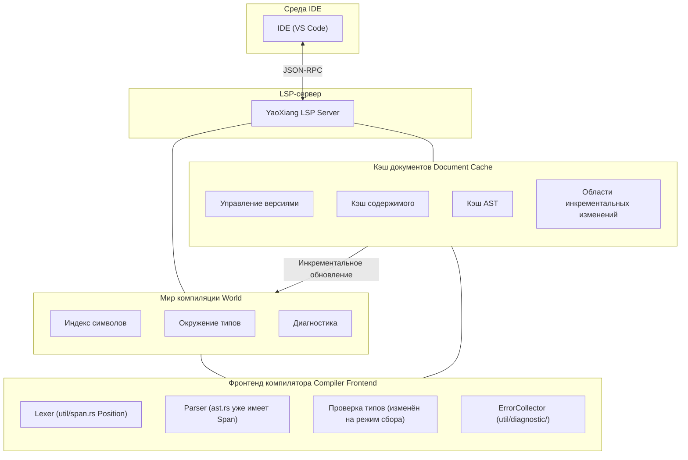

# RFC-017: Дизайн поддержки Language Server Protocol (LSP)

>

>

>

> **Справка**: См. [полный пример](../EXAMPLE_full_feature_proposal.md), чтобы узнать, как писать
> RFC.

## ⚠️ Предусловия реализации (важно)

Перед реализацией LSP необходимо решить следующие две ключевые проблемы:

### Проблема 1: Сбор диагностических ошибок

**Текущее состояние**: текущий проверщик типов возвращается сразу при обнаружении первой ошибки
(используя оператор `?`), не позволяя собирать все ошибки.

**Требование LSP**: IDE должна отображать **все** ошибки, а не только первую.

**Решение**:

#### 1.1 Режим сбора ошибок

- Изменить модуль `src/frontend/typecheck/inference/`, чтобы он возвращал `Result<Type, Vec<Error>>`
- Не возвращаться сразу при обнаружении ошибки, а продолжать проверку
- После завершения проверки вернуть все ошибки разом

#### 1.2 Уровни ошибок

Различать ошибки по степени серьёзности:

```rust
enum ErrorKind {
    Error,      // Серьёзная ошибка, может вызвать каскадные ошибки
    Warning,    // Предупреждение, проверка продолжается, но не блокируется
    Note,       // Дополнительная информация
}
```

- При наличии `Error`: `publishDiagnostics` отображает ошибку
- При наличии только `Warning`: компиляция продолжается, отображается предупреждение

#### 1.3 Восстановление после ошибок парсера

- При ошибке разбора вставлять **узел-заглушку** (например, `MissingExpression`) вместо отказа
- Избегать паники проверки типов из-за неполного AST
- Пример: `let x = ;` → `let x = MissingExpression`

#### 1.4 Отложенный вывод (Delayed Emission)

- Некоторые ошибки могут быть «каскадными» (вызванными предыдущими ошибками)
- Можно сначала собрать их, а после разбора AST отфильтровать очевидные каскадные ошибки
- Либо упрощённый вариант: сообщать обо всех, позволяя пользователю исправлять их по очереди

### Проблема 2: Кэширование разбора на уровне файлов

**Текущее состояние**: каждый запрос LSP заново разбирает весь файл, механизм кэширования
отсутствует.

**Требование LSP**: каждое редактирование должно получать быстрый отклик без повторного разбора
неизменённых файлов.

**Решение**:

#### 2.1 Структура кэша документов

```rust
struct DocumentCache {
    version: u32,           // Номер версии документа LSP
    content: String,        // Текущее содержимое
    content_hash: u64,      // Хеш содержимого (для быстрого сравнения)
    ast: Option<Ast>,       // Кэшированный AST (опционально)
}
```

#### 2.2 Обнаружение изменений

- При каждом `textDocument/didChange` получать новое содержимое
- Вычислять хеш нового содержимого и сравнивать с кэшированным `content_hash`
- **Если изменилось: повторно разобрать весь файл**
- **Если не изменилось: вернуть кэшированный результат**

#### 2.3 Стратегия повторного разбора

- **Файловый уровень**: повторно разбирать только текущий файл, а не весь проект
- Это упрощённый дизайн, без инкрементального разбора на уровне функций
- Современный компьютер разбирает отдельный файл в несколько тысяч строк за несколько миллисекунд

#### 2.4 Отличие от cargo check

|         | cargo check                | YaoXiang LSP                   |
| ------- | -------------------------- | ------------------------------ |
| Область | Весь проект                | Один файл                      |
| Частота | Запускается вручную        | При каждом редактировании      |
| Цель    | Полная проверка компиляции | Быстрый инкрементальный отклик |

### Интеграция с существующими модулями

| Существующий модуль              | Способ интеграции с LSP                                                     |
| -------------------------------- | --------------------------------------------------------------------------- |
| `util/span.rs`                   | ✅ Уже есть `Position`/`Span`, напрямую отображаются на LSP `Position`      |
| `util/diagnostic/collect.rs`     | ⚠️ Необходимо изменить на «режим сбора» с непрерывным накоплением ошибок    |
| `frontend/core/lexer/symbols.rs` | ⚠️ Необходимо расширить, добавив информацию о местоположении `uri` + `span` |
| `frontend/typecheck/mod.rs`      | ⚠️ Необходимо изменить `TypeResult`, чтобы возвращать все ошибки            |
| `frontend/core/parser/ast.rs`    | ✅ Каждый узел уже имеет `Span`, изменения не требуются                     |

---

## Резюме

Добавить поддержку Language Server Protocol (LSP) в YaoXiang, реализовав полноценный языковой
сервер, чтобы популярные IDE (VS Code, Neovim, Emacs и др.) могли предоставлять возможности
инструментов разработки, такие как автодополнение кода, переход к определению, диагностика, поиск
ссылок и т. д.

## Мотивация

### Зачем нужна эта возможность?

В настоящее время язык YaoXiang не имеет официальной поддержки интеграции с IDE, и разработчики
могут использовать лишь базовые текстовые редакторы для написания кода, испытывая нехватку:

1. **Автодополнение кода** — невозможность интеллектуального дополнения идентификаторов, ключевых
   слов и типов в зависимости от контекста
2. **Переход к определению** — невозможность быстрого перехода к определению функции, типа или
   переменной
3. **Диагностика в реальном времени** — невозможность мгновенного отображения синтаксических и
   типовых ошибок при редактировании
4. **Поиск ссылок** — невозможность найти все места использования символа
5. **Подсказки при наведении** — невозможность отображения информации о типе и документирующих
   комментариев при наведении мыши

LSP — стандарт для современных языков программирования, и основные языки (Rust, Python, TypeScript,
Go и др.) имеют зрелые реализации LSP. Реализация поддержки LSP значительно повысит удобство
разработки на YaoXiang.

### Текущие проблемы

1. **Низкая эффективность разработки** — отсутствие автодополнения и интеллектуальных подсказок
2. **Сложность отладки** — невозможность быстро найти определение символа
3. **Крутая кривая обучения** — отсутствие вспомогательных функций IDE
4. **Недостаточная экосистема** — невозможность привлечь разработчиков, привыкших к современным IDE

## Предложение

### Основной дизайн

Реализовать отдельный процесс LSP-сервера, взаимодействующий с IDE через JSON-RPC:


```mermaid
flowchart TD
    subgraph IDE_Environment [Среда IDE]
        IDE["IDE (VS Code)"]
    end

    subgraph LSP_Server [LSP-сервер]
        LSP["YaoXiang LSP Server"]
    end

    subgraph World_Compile [Мир компиляции World]
        direction TB
        W_Symbol["Индекс символов"]
        W_Type["Окружение типов"]
        W_Diag["Диагностика"]
    end

    subgraph Cache [Кэш документов Document Cache]
        direction TB
        C_Version["Управление версиями"]
        C_Content["Кэш содержимого"]
        C_AST["Кэш AST"]
        C_Delta["Области инкрементальных изменений"]
    end

    subgraph Frontend [Фронтенд компилятора Compiler Frontend]
        direction TB
        F_Lexer["Lexer (util/span.rs Position)"]
        F_Parser["Parser (ast.rs уже имеет Span)"]
        F_TypeCheck["Проверка типов (изменён на режим сбора)"]
        F_ErrorCollector["ErrorCollector (util/diagnostic/)"]
    end

    IDE <-->|JSON-RPC| LSP

    LSP --- World_Compile
    LSP --- Cache

    Cache -- "Инкрементальное обновление" --> World_Compile

    World_Compile --- Frontend
    Cache --- Frontend
```

### Архитектура LSP-сервера

```
src/lsp/
├── main.rs              # Точка входа LSP-сервера
├── server.rs           # Основная логика сервера
├── session.rs          # Управление сессиями
├── capabilities.rs     # Объявление возможностей сервера
├── handlers/
│   ├── mod.rs
│   ├── initialize.rs   # Обработка инициализации
│   ├── text_document.rs # Обработка операций с документами
│   ├── completion.rs   # Обработка дополнения
│   ├── definition.rs   # Обработка перехода к определению
│   ├── references.rs   # Обработка поиска ссылок
│   ├── hover.rs        # Обработка подсказок при наведении
│   └── diagnostics.rs  # Обработка диагностики
├── world.rs            # Мир компиляции (таблица символов, кэш AST)
├── scroller.rs         # Построение индекса символов
├── protocol.rs         # Определения типов протокола LSP
└── cache/              # Модуль инкрементального кэша (новый)
    ├── mod.rs
    ├── document.rs     # Кэш документа (версия, AST, таблица символов)
    └── incremental.rs  # Стратегия инкрементального разбора
```

### Дизайн мира компиляции (World)

Управление глобальным состоянием компиляции:

- Кэш документов (версия, AST, таблица символов)
- Глобальный индекс символов
- Сборщик ошибок
- Кэш окружения типов

Ключевые методы:

- `on_document_change`: обработка инкрементальных изменений
- `incremental_reparse`: инкрементальный повторный разбор
- `collect_diagnostics`: сбор всех ошибок (без блокировки)

### Поддержка базовых методов LSP

| Категория                    | Метод                                              | Описание                         |
| ---------------------------- | -------------------------------------------------- | -------------------------------- |
| **Жизненный цикл**           | `initialize` / `initialized` / `shutdown` / `exit` | Жизненный цикл сервера           |
| **Синхронизация документов** | `didOpen` / `didChange` / `didClose`               | Управление документами           |
| **Диагностика**              | `publishDiagnostics`                               | Публикация диагностики           |
| **Дополнение**               | `completion`                                       | Автодополнение кода              |
| **Переход**                  | `definition`                                       | Переход к определению            |
| **Ссылки**                   | `references`                                       | Поиск ссылок                     |
| **Наведение**                | `hover`                                            | Подсказки при наведении          |
| **Символы**                  | `workspace/symbol`                                 | Поиск символов в рабочей области |

### Механизм синхронизации текстовых документов

Используется стратегия инкрементальной синхронизации:

- Хранить номер версии документа
- Применять инкрементальные изменения (range + text)
- При больших изменениях откатываться к полной замене

### Построение индекса символов

Используя существующую систему таблиц символов, построить обратный индекс:

- Необходимо расширить `SymbolEntry`, добавив поле `location`
- Индекс: имя → список местоположений, файл → список символов

### Реализация автодополнения кода

Источники дополнения: ключевые слова, переменные, функции, типы, поля структур, модули

### Реализация перехода к определению

Разрешение символов на основе AST: поиск местоположения определения, соответствующего
идентификатору/вызову функции

## Детальный дизайн

### Влияние на систему типов

1. **Расширение информации о символах** — добавление информации о местоположении (файл, строка,
   столбец) в таблицу символов
2. **Предоставление информации о типах** — предоставление LSP интерфейса запросов типов
3. **Интеграция документирующих комментариев** — поддержка генерации строк документации из
   комментариев

### Поведение во время выполнения

- LSP-сервер работает как отдельный процесс
- Для JSON-RPC коммуникации используются stdin/stdout
- Поддержка параллельной обработки нескольких сессий

### Изменения в компиляторе

| Компонент                     | Изменения                                                         |
| ----------------------------- | ----------------------------------------------------------------- |
| `frontend/events`             | Расширение системы событий, поддержка уведомлений LSP             |
| `frontend/core/lexer/symbols` | Усиление таблицы символов, добавление информации о местоположении |
| Новый `src/lsp/`              | Реализация LSP-сервера                                            |

### Обратная совместимость

- ✅ Полностью обратно совместимо
- LSP-сервер является отдельным компонентом и не влияет на существующий процесс компиляции
- Существующие инструменты CLI не затрагиваются

### Интеграция с существующими системами

1. **Система событий** — использование механизма подписки на события `frontend/events/`
2. **Система диагностики** — повторное использование вывода диагностики `util/diagnostic/`
   - Повторное использование `ErrorCollector<E>` для сбора всех ошибок
   - Преобразование `Diagnostic` в формат LSP `Diagnostic`
3. **Таблица символов** — расширение возможностей позиционирования символов в `symbols.rs`
   - Расширение `SymbolEntry`, добавление поля `location: Location`
   - Построение обратного индекса `SymbolIndex` (имя -> список местоположений)
4. **Фронтенд компилятора** — прямой вызов Lexer, Parser, проверки типов
   - **Ключевое изменение**: проверщик типов должен быть переведён в «режим сбора» без блокировки
     выполнения

#### Преобразование формата диагностики

```rust
/// Преобразование YaoXiang Diagnostic в LSP Diagnostic
fn to_lsp_diagnostic(diag: &Diagnostic) -> lsp_types::Diagnostic {
    let severity = match diag.severity() {
        Severity::Error => lsp_types::DiagnosticSeverity::ERROR,
        Severity::Warning => lsp_types::DiagnosticSeverity::WARNING,
        Severity::Info => lsp_types::DiagnosticSeverity::INFORMATION,
    };

    lsp_types::Diagnostic {
        range: to_lsp_range(diag.span()),
        severity: Some(severity),
        message: diag.message().to_string(),
        code: diag.code().map(|c| lsp_types::NumberOrString::String(c.as_string())),
        ..Default::default()
    }
}

/// Преобразование YaoXiang Span в LSP Range
fn to_lsp_range(span: &Span) -> lsp_types::Range {
    lsp_types::Range {
        start: lsp_types::Position {
            line: span.start.line.saturating_sub(1), // LSP использует 0-индексацию
            character: span.start.column.saturating_sub(1),
        },
        end: lsp_types::Position {
            line: span.end.line.saturating_sub(1),
            character: span.end.column.saturating_sub(1),
        },
    }
}
```

## Уникальные расширенные возможности YaoXiang

Используя мощные системы вычислений на этапе компиляции и ownership в YaoXiang, предоставить
уникальный опыт разработки, недоступный другим языкам:

### 1. Inlay-подсказки (Inlay Hints)

- **Подсказки значений констант**: отображение вычисленных на этапе компиляции значений констант
  (например, рядом с `const MAX = 100 + 200` показывать `300`)
- **Подсказки изменяемости**: отображение того, является ли переменная изменяемой (например,
  `mut x`, `x` с заметным подчёркиванием)
- **Подсказки потребления ownership**: отображение того, потребляется ли аргумент функции (например,
  `consumed` / `borrowed`)
- **Подсказки пустой семантики ownership**: затемнение цвета переменной для подсказки, что
  переменная может быть переприсвоена после move.
- **Подсказки вывода типов**: отображение выведенного конкретного типа (например, рядом с
  `x = vec![]` показывать `Vec<i32>`)

### 2. Визуализация семантики ownership

- Отображение пути move переменной (от места определения ко всем местам использования)
- Визуализация времени жизни заимствований

### 3. Предпросмотр вычислений на этапе компиляции

- При наведении отображать результат вычисления константных выражений на этапе компиляции

### Приоритеты реализации

| Возможность                       | Приоритет |
| --------------------------------- | --------- |
| Inlay-подсказки значений констант | P0        |
| Подсказки изменяемости            | P0        |
| Подсказки потребления ownership   | P1        |
| Визуализация ownership            | P2        |

---

## Коммуникация и удалённая поддержка

### Режимы коммуникации

Поддерживаются три режима:

| Режим              | Назначение                                    |
| ------------------ | --------------------------------------------- |
| stdio              | Локальная разработка (по умолчанию)           |
| TCP Socket         | Удалённая разработка/отладка                  |
| Unix Domain Socket | Высокопроизводительная локальная коммуникация |

### Удалённая отладка

Реализация на основе DAP (Debug Adapter Protocol):

- Поддержка точек останова на строке, в функции, условных точек останова
- Уникальные точки останова YaoXiang: срабатывание при move переменной

### Параметры запуска

```bash
# Локальный режим
yaoxiang-lsp

# TCP-сервер
yaoxiang-lsp --tcp --port 8765

# Одновременное включение отладки
yaoxiang-lsp --tcp --port 8765 --enable-debug
```

---

## Модель конкурентности

**Проектное решение: однопоточная + асинхронный цикл событий**

Обоснование:

- Компилятор не потокобезопасен, стоимость переработки высока
- Запросы LSP по своей природе последовательны, конкурентность не требуется
- Однопоточная модель проще и легче в отладке
- Производительности однопоточного async I/O достаточно

Для фоновых задач используется `spawn_blocking` для использования нескольких ядер.

---

## Встроенный инструмент тестирования LSP (опционально)

> Эта функция не обязательна для MVP, может быть добавлена в последующих версиях.

Предоставление формата тестовых случаев в JSON:

```bash
# Запуск тестов
yaoxiang-lsp --test
```

---

## Компромиссы

### Преимущества

1. **Улучшение опыта разработки** — поддержка IDE, близкая к mainstream-языкам
2. **Улучшение экосистемы** — привлечение большего числа разработчиков к использованию YaoXiang
3. **Повышение качества кода** — диагностика в реальном времени снижает количество ошибок во время
   выполнения
4. **Вклад сообщества** — разработчики могут участвовать в развитии инструментария LSP

### Недостатки

1. **Высокая сложность реализации** — необходимость обработки большого количества граничных случаев
   LSP
2. **Стоимость сопровождения** — необходимость следовать обновлениям версий протокола LSP
3. **Соображения производительности** — производительность индексации и запросов в крупных проектах
4. **Сложность тестирования** — необходимость имитации поведения IDE для тестирования

## Альтернативы

| Решение                     | Почему не выбрано                                                          |
| --------------------------- | -------------------------------------------------------------------------- |
| Только подсветка синтаксиса | Не отвечает потребностям современной разработки                            |
| Использование Tree-sitter   | Требует дополнительных затрат на обучение и имеет ограниченные возможности |

## Стратегия реализации

### Разбивка на этапы

1. **Этап 0 (предварительный)**: Адаптация компилятора ⚠️ **Критический**
   - Изменение проверщика типов на «режим сбора», возвращающий `Result<Type, Vec<Error>>`
   - Реализация уровней ошибок (Error / Warning / Note)
   - Восстановление после ошибок парсера: вставка узлов-заглушек
   - Расширение таблицы символов `SymbolEntry`, добавление поля `location`
   - Реализация системы кэширования DocumentCache (версия + содержимое + хеш)
   - **Этот этап является предпосылкой для реализации LSP и должен быть завершён первым**

2. **Этап 1 (v0.7)**: Базовая структура
   - Скелет LSP-сервера
   - Методы жизненного цикла (initialize/shutdown/exit)
   - Базовое логирование и обработка ошибок

3. **Этап 2 (v0.7)**: Поддержка диагностики
   - Синхронизация текстовых документов
   - Интеграция диагностики компиляции
   - `textDocument/publishDiagnostics`

4. **Этап 3 (v0.8)**: Поддержка дополнения
   - Построение индекса символов
   - Дополнение ключевых слов
   - Дополнение идентификаторов

5. **Этап 4 (v0.8)**: Поддержка перехода
   - Переход к определению
   - Поиск ссылок
   - Подсказки при наведении

6. **Этап 5 (v0.9)**: Расширенные возможности
   - Поиск символов в рабочей области
   - Форматирование кода
   - Поддержка рефакторинга (опционально)

### Зависимости

- Отсутствие внешних зависимостей от LSP-библиотек (используется крейт `lsp-types`)
- Зависимость от существующих модулей фронтенда компилятора
- Зависимость от `serde_json` для сериализации JSON-RPC

### Риски

1. **Проблемы с производительностью** — разбор больших файлов может вызвать задержки
   - Решение: инкрементальный разбор, обработка в фоновых потоках
2. **Потребление памяти** — индекс символов занимает память
   - Решение: ленивая загрузка, LRU-кэш
3. **Совместимость протокола** — различия версий LSP
   - Решение: объявление поддерживаемой версии протокола

## Открытые вопросы

- [x] Механизм сбора ошибок (см. раздел «Предусловия реализации»)
- [x] Система инкрементального кэширования (см. раздел «Предусловия реализации»)
- [x] Версия протокола LSP: используется 3.18 (поддержка Inlay Hints, Inline Values и других новых
      возможностей)
- [x] Поддержка удалённой коммуникации (через TCP, совмещая LSP + отладку)
- [x] Поддержка удалённой отладки (на основе протокола DAP)
- [x] Модель конкурентности: однопоточная + асинхронный цикл событий
- [x] Встроенный инструмент тестирования LSP (опционально): использование тестовых случаев в формате
      JSON

---

## Приложения (опционально)

### Приложение A: Записи обсуждения дизайна

> Используется для записи подробных обсуждений в процессе принятия проектных решений.

### Приложение B: Записи проектных решений

| Решение                               | Определение                                                                                | Дата       | Записал |
| ------------------------------------- | ------------------------------------------------------------------------------------------ | ---------- | ------- |
| Архитектура LSP-сервера               | Отдельный процесс, коммуникация через stdio                                                | 2026-02-15 | 晨煦    |
| Версия протокола                      | Поддержка LSP 3.18 (требуются Inlay Hints и другие новые возможности)                      | 2026-02-22 | 晨煦    |
| Режим сбора ошибок                    | Возврат `Result<Type, Vec<Error>>`, поддержка уровней ошибок и восстановления после ошибок | 2026-02-22 | 晨煦    |
| Стратегия кэширования                 | Кэш на уровне файлов: версия + содержимое + хеш, повторный разбор всего файла              | 2026-02-22 | 晨煦    |
| Режим коммуникации                    | Поддержка stdio + TCP + UnixSocket                                                         | 2026-02-22 | 晨煦    |
| Удалённая отладка                     | На основе протокола DAP, общий транспортный уровень с LSP                                  | 2026-02-22 | 晨煦    |
| Модель конкурентности                 | Однопоточная + асинхронный цикл событий                                                    | 2026-02-22 | 晨煦    |
| Инструмент тестирования (опционально) | Тестовые случаи в формате JSON + встроенный тестовый runner                                | 2026-02-22 | 晨煦    |

### Приложение C: Глоссарий

| Термин                | Определение                                                                  |
| --------------------- | ---------------------------------------------------------------------------- |
| LSP                   | Language Server Protocol, протокол языкового сервера                         |
| JSON-RCP              | JSON-Remote Procedure Call, удалённый вызов процедур через JSON              |
| DAP                   | Debug Adapter Protocol, протокол адаптера отладки                            |
| Индекс символов       | Таблица отображений местоположений символов, построенная во время компиляции |
| Мир компиляции        | Контекст, содержащий всю информацию о компиляции                             |
| Inlay-подсказки       | Inlay Hints, встроенная отображаемая подсказка                               |
| Трассировка ownership | Ownership Trace, визуализация потока ownership переменных                    |

---

## Ссылки

- [Спецификация Language Server Protocol](https://microsoft.github.io/language-server-protocol/)
- [Спецификация LSP 3.18](https://github.com/microsoft/language-server-protocol/blob/main/specifications/specification-3-18.md)
- [Спецификация Debug Adapter Protocol](https://microsoft.github.io/debug-adapter-protocol/)
- [Rust Analyzer](https://rust-analyzer.github.io/) — референсная реализация
- [крейт lsp-types](https://crates.io/crates/lsp-types) — определения типов LSP
- [Спецификация JSON-RPC 2.0](https://www.jsonrpc.org/specification)

---

## Жизненный цикл и судьба

RFC имеет следующие переходы состояний:

```
┌─────────────┐
│   Черновик      │  ← Создано автором
└──────┬──────┘
       │
       ▼
┌─────────────┐
│  На рассмотрении     │  ← Обсуждение сообществом
└──────┬──────┘
       │
       ├──────────────────┐
       ▼                  ▼
┌─────────────┐    ┌─────────────┐
│  Принято     │    │   Отклонено     │
└──────┬──────┘    └──────┬──────┘
       │                  │
       ▼                  ▼
┌─────────────┐    ┌─────────────┐
│   accepted/ │    │  rejected/  │
│ (Официальный дизайн)  │     │ (Отклонено)     │
└─────────────┘    └─────────────┘
```

### Описание состояний

| Состояние           | Расположение              | Описание                                                                   |
| ------------------- | ------------------------- | -------------------------------------------------------------------------- |
| **Черновик**        | `docs/design/rfc/draft/`  | Черновик автора, ожидает представления на рассмотрение                     |
| **На рассмотрении** | `docs/design/rfc/review/` | Открыто для обсуждения и обратной связи сообщества                         |
| **Принято**         | `docs/design/accepted/`   | Становится официальным проектным документом, переходит в стадию реализации |
| **Отклонено**       | `docs/design/rfc/`        | Сохраняется в каталоге RFC, статус обновляется                             |

### Действия после принятия

1. Переместить RFC в каталог `docs/design/accepted/`
2. Обновить имя файла на описательное (например, `lsp-support.md`)
3. Обновить статус на «Официальный»
4. Обновить статус на «Принято», добавить дату принятия

### Действия после отклонения

1. Сохранить в каталоге `docs/design/rfc/draft/`
2. Добавить причину и дату отклонения в верхней части файла
3. Обновить статус на «Отклонено»

### Действия после достижения консенсуса по обсуждению

Когда по какому-либо открытому вопросу достигнут консенсус:

1. **Обновить Приложение A**: под темой обсуждения заполнить «Решение»
2. **Обновить основной текст**: синхронизировать решение с основным текстом документа
3. **Записать решение**: добавить в «Приложение B: Записи проектных решений»
4. **Отметить вопрос**: в списке «Открытые вопросы» отметить как `[x]`

---

> **Примечание**: Номер RFC используется только на этапе обсуждения. После принятия номер удаляется
> и используется описательное имя файла.
