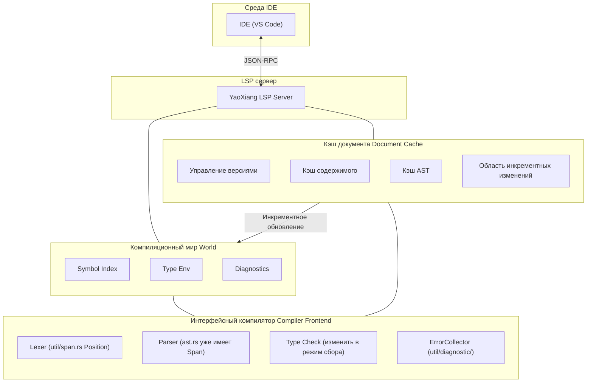

# RFC-017: Дизайн поддержки Language Server Protocol (LSP)

>

>

>

> **Справка**: Смотрите [полный пример](EXAMPLE_full_feature_proposal.md) о том, как писать RFC.

## ⚠️ Предварительные условия реализации (важно)

Перед реализацией LSP необходимо решить следующие две основные проблемы:

### Проблема 1: Сбор диагностических ошибок

**Текущее состояние**: Типоизводитель в настоящее время возвращает результат при обнаружении первой
ошибки (с помощью оператора `?`), что не позволяет собирать все ошибки.

**Требование LSP**: IDE должна отображать **все** ошибки, а не только первую.

**Решение**:

#### 1.1 Режим сбора ошибок

- Изменить модуль `src/frontend/typecheck/inference/` для возврата `Result<Type, Vec<Error>>`
- Не возвращаться сразу при обнаружении ошибки, а продолжить проверку
- После завершения проверки вернуть все ошибки вместе

#### 1.2 Уровни ошибок

Различать ошибки разной степени серьёзности:

```rust
enum ErrorKind {
    Error,      // Серьёзная ошибка, может вызвать каскадные ошибки
    Warning,    // Предупреждение, продолжить проверку без остановки
    Note,       // Дополнительная информация
}
```

- Если есть `Error`: `publishDiagnostics` отображает ошибки
- Если только `Warning`: продолжить компиляцию, показать предупреждения

#### 1.3 Восстановление ошибок парсера

- При ошибках парсинга вставлять **placeholder-узлы** (например, `MissingExpression`) вместо отказа
  от разбора
- Избегать паники типоизводителя из-за неполного AST
- Пример: `let x = ;` → `let x = MissingExpression`

#### 1.4 Отложенный отчёт (Delayed Emission)

- Некоторые ошибки могут быть «каскадными» (вызваны предыдущими ошибками)
- Можно сначала собрать их, а после разбора AST отфильтровать очевидные каскадные ошибки
- Или простое решение: сообщать обо всех, чтобы пользователь исправлял по порядку

### Проблема 2: Кэширование разбора на уровне файлов

**Текущее состояние**: При каждом LSP-запросе весь файл разбирается заново, без механизма
кэширования.

**Требование LSP**: Каждое редактирование должно обрабатываться быстро, без повторного разбора
неизменённых файлов.

**Решение**:

#### 2.1 Структура кэша документа

```rust
struct DocumentCache {
    version: u32,           // Версия документа LSP
    content: String,        // Текущее содержимое
    content_hash: u64,      // Хэш содержимого (быстрое сравнение)
    ast: Option<Ast>,       // Кэшированный AST (опционально)
}
```

#### 2.2 Обнаружение изменений

- При каждом получении `textDocument/didChange` нового содержимого
- Вычислить хэш нового содержимого и сравнить с кэшированным `content_hash`
- **Если изменилось: переразобрать весь файл**
- **Если не изменилось: вернуть кэшированный результат**

#### 2.3 Стратегия переразбора

- **На уровне файла**: переразбирать только текущий файл, а не весь проект
- Это упрощённый дизайн, без инкрементного разбора на уровне функций
- Современные компьютеры могут разобрать файл в несколько тысяч строк за миллисекунды

#### 2.4 Отличие от cargo check

|         | cargo check                | YaoXiang LSP               |
| ------- | -------------------------- | -------------------------- |
| Область | Весь проект                | Один файл                  |
| Частота | Вручную                    | При каждом редактировании  |
| Цель    | Полная проверка компиляции | Быстрый инкрементный ответ |

### Интеграция с существующими модулями

| Существующий модуль              | Способ интеграции LSP                                             |
| -------------------------------- | ----------------------------------------------------------------- |
| `util/span.rs`                   | ✅ Уже есть `Position`/`Span`, напрямую маппится в LSP `Position` |
| `util/diagnostic/collect.rs`     | ⚠️ Изменить в «режим сбора», непрерывно накапливать ошибки        |
| `frontend/core/lexer/symbols.rs` | ⚠️ Расширить, добавить информацию о позиции `uri` + `span`        |
| `frontend/typecheck/mod.rs`      | ⚠️ Изменить `TypeResult`, возвращать все ошибки                   |
| `frontend/core/parser/ast.rs`    | ✅ У каждого узла уже есть `Span`, изменения не нужны             |

---

## Резюме

Добавить поддержку Language Server Protocol (LSP) в YaoXiang, реализовать полноценный языковой
сервер, чтобы основные IDE (VS Code, Neovim, Emacs и другие) могли предоставлять функции разработки:
дополнение кода, переход к определению, диагностику, поиск ссылок и другие.

## Мотивация

### Зачем нужна эта функция?

В настоящее время язык YaoXiang не имеет официальной поддержки интеграции с IDE, разработчики могут
использовать только базовые текстовые редакторы для написания кода, что лишает их:

1. **Дополнение кода** — невозможность интеллектуально дополнять идентификаторы, ключевые слова,
   типы на основе контекста
2. **Переход к определению** — невозможность быстро перейти к месту определения функции, типа,
   переменной
3. **Оперативная диагностика** — невозможность мгновенно отображать синтаксические и типовые ошибки
   при редактировании
4. **Поиск ссылок** — невозможность найти все места использования символа
5. **Всплывающие подсказки** — невозможность отображать информацию о типах и документацию при
   наведении курсора

LSP — это стандарт современных языков программирования, основные языки (Rust, Python, TypeScript, Go
и другие) имеют成熟的 реализации LSP. Поддержка LSP значительно улучшит опыт разработки на YaoXiang.

### Текущие проблемы

1. **Низкая эффективность разработки** — отсутствие дополнения кода и интеллектуальных подсказок
2. **Сложность отладки** — невозможность быстро найти определение символа
3. **Крутая кривая обучения** — отсутствие вспомогательных функций IDE
4. **Несовершенная экосистема** — невозможность привлечь разработчиков, привыкших к современным IDE

## Предложение

### Основной дизайн

Реализовать отдельный процесс LSP-сервера, который общается с IDE через JSON-RPC:


```mermaid
flowchart TD
    subgraph IDE_Environment [Среда IDE]
        IDE["IDE (VS Code)"]
    end

    subgraph LSP_Server [LSP сервер]
        LSP["YaoXiang LSP Server"]
    end

    subgraph World_Compile [Компиляционный мир World]
        direction TB
        W_Symbol["Symbol Index"]
        W_Type["Type Env"]
        W_Diag["Diagnostics"]
    end

    subgraph Cache [Кэш документа Document Cache]
        direction TB
        C_Version["Управление версиями"]
        C_Content["Кэш содержимого"]
        C_AST["Кэш AST"]
        C_Delta["Область инкрементных изменений"]
    end

    subgraph Frontend [Интерфейсный компилятор Compiler Frontend]
        direction TB
        F_Lexer["Lexer (util/span.rs Position)"]
        F_Parser["Parser (ast.rs уже имеет Span)"]
        F_TypeCheck["Type Check (изменить в режим сбора)"]
        F_ErrorCollector["ErrorCollector (util/diagnostic/)"]
    end

    IDE <-->|JSON-RPC| LSP

    LSP --- World_Compile
    LSP --- Cache

    Cache -- "Инкрементное обновление" --> World_Compile

    World_Compile --- Frontend
    Cache --- Frontend
```

### Архитектура LSP-сервера

```
src/lsp/
├── main.rs              # Точка входа LSP сервера
├── server.rs           # Основная логика сервера
├── session.rs          # Управление сессиями
├── capabilities.rs     # Объявление возможностей сервера
├── handlers/
│   ├── mod.rs
│   ├── initialize.rs   # Обработка инициализации
│   ├── text_document.rs # Обработка операций с документами
│   ├── completion.rs   # Обработка дополнения
│   ├── definition.rs   # Обработка перехода к определению
│   ├── references.rs   # Обработка поиска ссылок
│   ├── hover.rs        # Обработка всплывающих подсказок
│   └── diagnostics.rs  # Обработка диагностики
├── world.rs            # Компиляционный мир (таблица символов, кэш AST)
├── scroller.rs         # Построение индекса символов
├── protocol.rs         # Определения типов протокола LSP
└── cache/              # Модуль инкрементного кэша (новый)
    ├── mod.rs
    ├── document.rs     # Кэш документа (версия, AST, таблица символов)
    └── incremental.rs  # Стратегия инкрементного разбора
```

### Дизайн компиляционного мира (World)

Управление глобальным состоянием компиляции:

- Кэш документа (версия, AST, таблица символов)
- Глобальный индекс символов
- Сборщик ошибок
- Кэш окружения типов

Основные методы:

- `on_document_change`: обработка инкрементных изменений
- `incremental_reparse`: инкрементный переразбор
- `collect_diagnostics`: сбор всех ошибок (без остановки)

### Поддержка основных методов LSP

| Категория                    | Метод                                              | Описание                         |
| ---------------------------- | -------------------------------------------------- | -------------------------------- |
| **Жизненный цикл**           | `initialize` / `initialized` / `shutdown` / `exit` | Жизненный цикл сервера           |
| **Синхронизация документов** | `didOpen` / `didChange` / `didClose`               | Управление документами           |
| **Диагностика**              | `publishDiagnostics`                               | Публикация диагностики           |
| **Дополнение**               | `completion`                                       | Дополнение кода                  |
| **Переход**                  | `definition`                                       | Переход к определению            |
| **Ссылки**                   | `references`                                       | Поиск ссылок                     |
| **Hover**                    | `hover`                                            | Всплывающие подсказки            |
| **Символы**                  | `workspace/symbol`                                 | Поиск символов в рабочей области |

### Механизм синхронизации текстовых документов

Используется стратегия инкрементной синхронизации:

- Сохранение номера версии документа
- Применение инкрементных изменений (range + text)
- При больших изменениях — переход на полную замену

### Построение индекса символов

Используя существующую систему таблицы символов, построить обратный индекс:

- Нужно расширить `SymbolEntry`, добавить поле `location`
- Индекс: имя → список позиций, файл → список символов

### Реализация дополнения кода

Источники дополнения: ключевые слова, переменные, функции, типы, поля структур, модули

### Реализация перехода к определению

Символьное разрешение на основе AST: поиск позиции определения, соответствующей
идентификатору/вызову функции

## Детальный дизайн

### Влияние на систему типов

1. **Расширение символьной информации** — добавление позиционной информации (файл, строка, столбец)
   в таблицу символов
2. **Раскрытие информации о типах** — предоставление интерфейса запросов типов для LSP
3. **Интеграция документации** — поддержка генерации документации из комментариев

### Поведение во время выполнения

- LSP-сервер работает как отдельный процесс
- Использует stdin/stdout для JSON-RPC коммуникации
- Поддержка параллельной обработки нескольких сессий

### Изменения в компиляторе

| Компонент                     | Изменения                                                 |
| ----------------------------- | --------------------------------------------------------- |
| `frontend/events`             | Расширить систему событий, добавить уведомления LSP       |
| `frontend/core/lexer/symbols` | Усилить таблицу символов, добавить позиционную информацию |
| Новый `src/lsp/`              | Реализация LSP сервера                                    |

### Обратная совместимость

- ✅ Полная обратная совместимость
- LSP-сервер — независимый компонент, не влияет на существующий процесс компиляции
- Существующие инструменты CLI не затрагиваются

### Интеграция с существующими системами

1. **Система событий** — использовать механизм подписки на события `frontend/events/`
2. **Диагностическая система** — переиспользовать диагностический вывод `util/diagnostic/`
   - Переиспользовать `ErrorCollector<E>` для сбора всех ошибок
   - Преобразовать `Diagnostic` в формат LSP `Diagnostic`
3. **Таблица символов** — расширить возможности позиционирования символов в `symbols.rs`
   - Расширить `SymbolEntry`, добавить поле `location: Location`
   - Построить обратный индекс `SymbolIndex` (имя -> список позиций)
4. **Интерфейсный компилятор** — напрямую вызывать Lexer, Parser, типоизводитель
   - **Ключевое изменение**: типоизводитель должен работать в «режиме сбора», без остановки

#### Преобразование формата диагностики

```rust
/// Преобразование YaoXiang Diagnostic в LSP Diagnostic
fn to_lsp_diagnostic(diag: &Diagnostic) -> lsp_types::Diagnostic {
    let severity = match diag.severity() {
        Severity::Error => lsp_types::DiagnosticSeverity::ERROR,
        Severity::Warning => lsp_types::DiagnosticSeverity::WARNING,
        Severity::Info => lsp_types::DiagnosticSeverity::INFORMATION,
    };

    lsp_types::Diagnostic {
        range: to_lsp_range(diag.span()),
        severity: Some(severity),
        message: diag.message().to_string(),
        code: diag.code().map(|c| lsp_types::NumberOrString::String(c.as_string())),
        ..Default::default()
    }
}

/// Преобразование YaoXiang Span в LSP Range
fn to_lsp_range(span: &Span) -> lsp_types::Range {
    lsp_types::Range {
        start: lsp_types::Position {
            line: span.start.line.saturating_sub(1), // LSP использует 0-indexed
            character: span.start.column.saturating_sub(1),
        },
        end: lsp_types::Position {
            line: span.end.line.saturating_sub(1),
            character: span.end.column.saturating_sub(1),
        },
    }
}
```

## Уникальные расширенные функции YaoXiang

Используя мощную систему вычислений во время компиляции и владения YaoXiang, предоставить уникальный
опыт разработки, недоступный в других языках:

### 1. Встроенные подсказки (Inlay Hints)

- **Подсказки значений констант**: отображение вычисленных во время компиляции значений (например,
  рядом с `const MAX = 100 + 200` показывать `300`)
- **Подсказки изменяемости**: отображение, является ли переменная изменяемой (например, `mut x`, `x`
  с очевидным подчёркиванием)
- **Подсказки потребления владения**: отображение, потребляется ли параметр функции (например,
  `consumed` / `borrowed`)
- **Подсказки семантики пустого владения**: затемнение цвета переменной для подсказки о возможности
  переприсваивания после перемещения
- **Подсказки выведенного типа**: отображение конкретного выведенного типа (например, рядом с
  `x = vec![]` показывать `Vec<i32>`)

### 2. Визуализация семантики владения

- Отображение пути перемещения переменной (от позиции определения до всех позиций использования)
- Визуализация времени жизни заимствования

### 3. Предпросмотр вычислений во время компиляции

- Hover отображает результат вычисления константных выражений во время компиляции

### Приоритеты реализации

| Функция                        | Приоритет |
| ------------------------------ | --------- |
| Подсказки значений констант    | P0        |
| Подсказки изменяемости         | P0        |
| Подсказки потребления владения | P1        |
| Визуализация владения          | P2        |

---

## Коммуникация и удалённая поддержка

### Режимы коммуникации

Поддержка трёх режимов:

| Режим              | Использование                                 |
| ------------------ | --------------------------------------------- |
| stdio              | Локальная разработка (по умолчанию)           |
| TCP Socket         | Удалённая разработка/отладка                  |
| Unix Domain Socket | Высокопроизводительная локальная коммуникация |

### Удалённая отладка

На основе DAP (Debug Adapter Protocol):

- Поддержка точек останова на строках, функциях, условных точек останова
- Уникальные точки останова YaoXiang: срабатывание при перемещении переменной

### Параметры запуска

```bash
# Локальный режим
yaoxiang-lsp

# TCP сервер
yaoxiang-lsp --tcp --port 8765

# С включением отладки
yaoxiang-lsp --tcp --port 8765 --enable-debug
```

---

## Модель параллелизма

**Дизайнерское решение: однопоточный + асинхронный цикл событий**

Обоснование:

- Компилятор не является потокобезопасным, стоимость переделки высока
- LSP-запросы по своей природе последовательны, не требуют параллелизма
- Однопоточность проще и легче для отладки
- Производительности async I/O в одном потоке достаточно

Фоновые задачи используют `spawn_blocking` для задействования нескольких ядер.

---

## Встроенный инструмент тестирования LSP (опционально)

> Эта функция не является обязательной для MVP, может быть добавлена в последующих версиях.

Формат JSON тестовых случаев:

```bash
# Запуск тестов
yaoxiang-lsp --test
```

---

## Компромиссы

### Преимущества

1. **Улучшение опыта разработки** — поддержка IDE, близкая к основным языкам
2. **Совершенствование экосистемы** — привлечение большего числа разработчиков для YaoXiang
3. **Повышение качества кода** — оперативная диагностика уменьшает ошибки времени выполнения
4. **Вклад сообщества** — разработчики могут участвовать в разработке инструментария LSP

### Недостатки

1. **Высокая сложность реализации** — необходимо обрабатывать большое количество граничных случаев
   LSP
2. **Стоимость поддержки** — необходимо следовать обновлениям версий протокола LSP
3. **Вопросы производительности** — производительность индексации и запросов для крупных проектов
4. **Сложность тестирования** — требуется моделирование поведения IDE для тестирования

## Альтернативные решения

| Решение                     | Почему не выбрано                                                 |
| --------------------------- | ----------------------------------------------------------------- |
| Только подсветка синтаксиса | Не соответствует современным потребностям разработки              |
| Использование Tree-sitter   | Требует дополнительных затрат на изучение, возможности ограничены |

## Стратегия реализации

### Фазы разделения

1. **Фаза 0 (предварительная)**: Адаптация компилятора ⚠️ **Критически важно**
   - Изменить типоизводитель в «режим сбора», вернуть `Result<Type, Vec<Error>>`
   - Реализовать уровни ошибок (Error / Warning / Note)
   - Восстановление ошибок парсера: вставлять placeholder-узлы
   - Расширить таблицу символов `SymbolEntry`, добавить поле `location`
   - Реализовать систему кэширования DocumentCache (версия + содержимое + хэш)
   - **Эта фаза является предпосылкой реализации LSP, должна быть выполнена в первую очередь**

2. **Фаза 1 (v0.7)**: Базовая структура
   - Скелет LSP-сервера
   - Методы жизненного цикла (initialize/shutdown/exit)
   - Базовая логирование и обработка ошибок

3. **Фаза 2 (v0.7)**: Поддержка диагностики
   - Синхронизация текстовых документов
   - Интеграция диагностики компилятора
   - `textDocument/publishDiagnostics`

4. **Фаза 3 (v0.8)**: Поддержка дополнения
   - Построение индекса символов
   - Дополнение ключевых слов
   - Дополнение идентификаторов

5. **Фаза 4 (v0.8)**: Поддержка перехода
   - Переход к определению
   - Поиск ссылок
   - Всплывающие подсказки

6. **Фаза 5 (v0.9)**: Расширенные функции
   - Поиск символов в рабочей области
   - Форматирование кода
   - Поддержка рефакторинга (опционально)

### Зависимости

- Нет внешних зависимостей от библиотек LSP (используется crate `lsp-types`)
- Зависимость от существующих модулей интерфейсного компилятора
- Зависимость от `serde_json` для сериализации JSON-RPC

### Риски

1. **Проблемы производительности** — разбор больших файлов может вызвать зависание
   - Решение: инкрементный разбор, обработка в фоновом потоке
2. **Использование памяти** — индекс символов занимает память
   - Решение: ленивая загрузка, LRU-кэш
3. **Совместимость протокола** — различия версий LSP
   - Решение: объявить поддерживаемую версию протокола

## Открытые вопросы

- [x] Механизм сбора ошибок (см. раздел «Предварительные условия реализации»)
- [x] Система инкрементного кэширования (см. раздел «Предварительные условия реализации»)
- [x] Версия протокола LSP: использовать 3.18 (поддержка Inlay Hints, Inline Values и других новых
      функций)
- [x] Удалённая коммуникация (через TCP, с учётом LSP + отладка)
- [x] Удалённая отладка (на основе протокола DAP)
- [x] Модель параллелизма: однопоточный + async цикл событий
- [x] Встроенный инструмент тестирования LSP (опционально): использование JSON тестовых случаев

---

## Приложения (опционально)

### Приложение A: Записи обсуждения дизайна

> Используется для записи детального обсуждения в процессе принятия дизайнерских решений.

### Приложение B: Записи дизайнерских решений

| Решение                               | Решение                                                                         | Дата       | Автор |
| ------------------------------------- | ------------------------------------------------------------------------------- | ---------- | ----- |
| Архитектура LSP сервера               | Независимый процесс, коммуникация через stdio                                   | 2026-02-15 | 晨煦  |
| Версия протокола                      | Поддержка LSP 3.18 (нужны Inlay Hints и другие новые функции)                   | 2026-02-22 | 晨煦  |
| Режим сбора ошибок                    | Возврат `Result<Type, Vec<Error>>`, поддержка уровней ошибок и восстановления   | 2026-02-22 | 晨煦  |
| Стратегия кэширования                 | Кэширование на уровне файлов: версия + содержимое + хэш, переразбор всего файла | 2026-02-22 | 晨煦  |
| Режим коммуникации                    | Поддержка stdio + TCP + UnixSocket                                              | 2026-02-22 | 晨煦  |
| Удалённая отладка                     | На основе протокола DAP, общий транспортный слой с LSP                          | 2026-02-22 | 晨煦  |
| Модель параллелизма                   | Однопоточный + async цикл событий                                               | 2026-02-22 | 晨煦  |
| Инструмент тестирования (опционально) | JSON тестовые случаи + встроенный тестовый раннер                               | 2026-02-22 | 晨煦  |

### Приложение C: Глоссарий

| Термин                | Определение                                                           |
| --------------------- | --------------------------------------------------------------------- |
| LSP                   | Language Server Protocol, протокол языкового сервера                  |
| JSON-RPC              | JSON-Remote Procedure Call, удалённый вызов процедур JSON             |
| DAP                   | Debug Adapter Protocol, протокол адаптера отладки                     |
| Индекс символов       | Таблица отображения позиций символов, построенная во время компиляции |
| Компиляционный мир    | Контекст, содержащий всю информацию о компиляции                      |
| Встроенные подсказки  | Inlay Hints, информационные подсказки, отображаемые в строке          |
| Отслеживание владения | Ownership Trace, визуализация потока владения переменной              |

---

## Список литературы

- [Спецификация Language Server Protocol](https://microsoft.github.io/language-server-protocol/)
- [Спецификация LSP 3.18](https://github.com/microsoft/language-server-protocol/blob/main/specifications/specification-3-18.md)
- [Спецификация Debug Adapter Protocol](https://microsoft.github.io/debug-adapter-protocol/)
- [Rust Analyzer](https://rust-analyzer.github.io/) — эталонная реализация
- [crate lsp-types](https://crates.io/crates/lsp-types) — определения типов LSP
- [Спецификация JSON-RPC 2.0](https://www.jsonrpc.org/specification)

---

## Жизненный цикл и судьба

RFC имеет следующие состояния:

```
┌─────────────┐
│   Черновик  │  ← Создаётся автором
└──────┬──────┘
       │
       ▼
┌─────────────┐
│  Наreview   │  ← Обсуждение сообщества
└──────┬──────┘
       │
       ├──────────────────┐
       ▼                  ▼
┌─────────────┐    ┌─────────────┐
│   Принят    │    │   Отклонён  │
└──────┬──────┘    └──────┬──────┘
       │                  │
       ▼                  ▼
┌─────────────┐    ┌─────────────┐
│   accepted/ │    │  rejected/  │
│ (утверждён) │    │ (отклонён)  │
└─────────────┘    └─────────────┘
```

### Описание состояний

| Состояние    | Расположение              | Описание                                                               |
| ------------ | ------------------------- | ---------------------------------------------------------------------- |
| **Черновик** | `docs/design/rfc/draft/`  | Черновик автора, ожидает отправки на review                            |
| **Наreview** | `docs/design/rfc/review/` | Открыто обсуждение и обратная связь сообщества                         |
| **Принят**   | `docs/design/accepted/`   | Становится официальным документом дизайна, переходит в фазу реализации |
| **Отклонён** | `docs/design/rfc/`        | Остаётся в каталоге RFC, обновляется состояние                         |

### Действия после принятия

1. Переместить RFC в каталог `docs/design/accepted/`
2. Обновить имя файла на описательное (например, `lsp-support.md`)
3. Обновить статус на «Официальный»
4. Обновить статус на «Принято», добавить дату принятия

### Действия после отклонения

1. Оставить в каталоге `docs/design/rfc/draft/`
2. Добавить причину отклонения и дату в верхнюю часть файла
3. Обновить статус на «Отклонён»

### Действия после определения обсуждения

Когда по某个 открытому вопросу достигнут консенсус:

1. **Обновить приложение A**: заполнить «Решение» под темой обсуждения
2. **Обновить основной текст**: синхронизировать решение в тексте документа
3. **Записать решение**: добавить в «Приложение B: Записи дизайнерских решений»
4. **Отметить вопрос**: поставить галочку `[x]` в списке «Открытые вопросы»

---

> **Примечание**: Номер RFC используется только на этапе обсуждения. После принятия номер удаляется,
> используется описательное имя файла.
