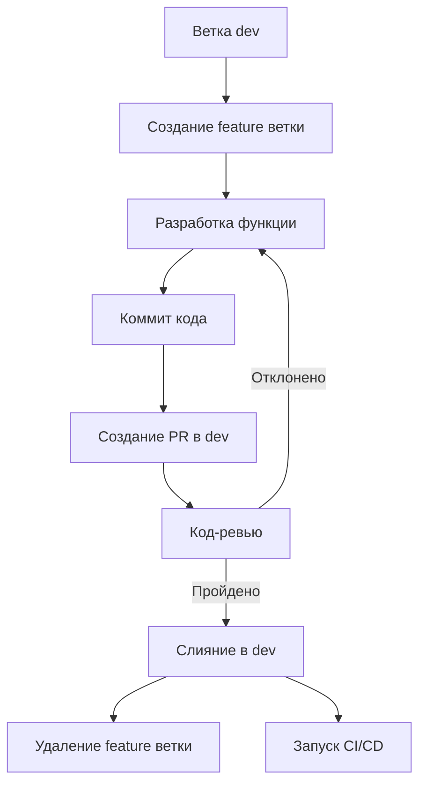
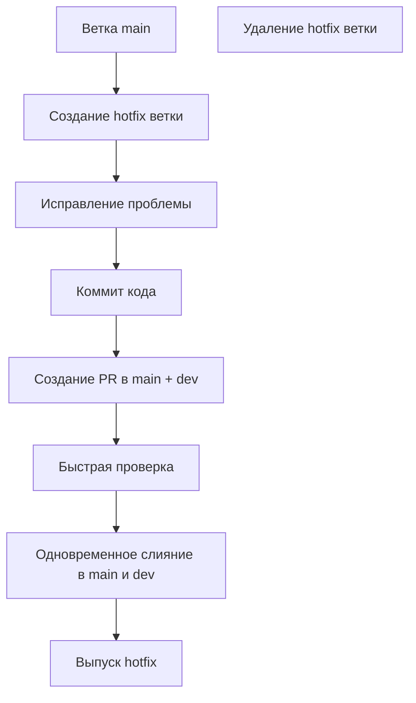
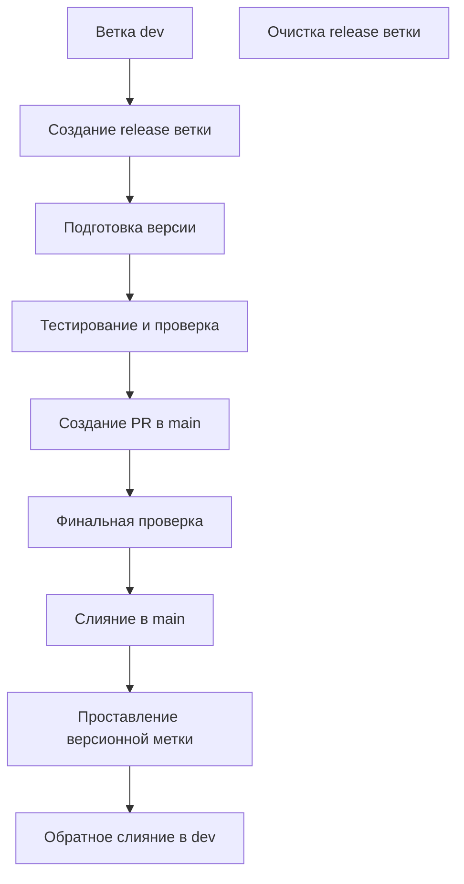

# Руководство по обслуживанию веток Git

> Настоящее руководство определяет стратегию управления ветками Git для проекта YaoXiang, направленную на обеспечение упорядоченной разработки и эффективного сотрудничества.

---

## 📋 Содержание

- [Типы веток](#типы-веток)
- [Правила именования](#правила-именования)
- [Жизненный цикл веток](#жизненный-цикл-веток)
- [Рабочий процесс](#рабочий-процесс)
- [Стратегия защиты веток](#стратегия-защиты-веток)
- [Рекомендации](#рекомендации)
- [Часто задаваемые вопросы](#часто-задаваемые-вопросы)

---

## 🏷️ Типы веток

### Основные ветки (Core Branches)

| Имя ветки | Назначение | Жизненный цикл | Уровень защиты |
|-----------|------------|----------------|----------------|
| `main` | Код для production-среды | Постоянный | Строгая защита |
| `dev` | Основная ветка разработки | Постоянный | Средняя защита |
| `master` | Основная ветка (для совместимости) | Постоянный | Строгая защита |

### Функциональные ветки (Feature Branches)

| Префикс | Назначение | Примеры именования | Цель слияния |
|---------|------------|---------------------|--------------|
| `feature/` | Разработка новых функций | `feature/type-inference`<br>`feature/ownership-model` | `dev` |
| `bugfix/` | Исправление известных дефектов | `bugfix/memory-leak`<br>`bugfix/parser-error` | `dev` |
| `hotfix/` | Срочное исправление критических проблем | `hotfix/security-patch`<br>`hotfix/crash-bug` | `main` + `dev` |
| `release/` | Подготовка к релизу | `release/v0.8.0`<br>`release/v1.0.0` | `main` |

### Вспомогательные ветки (Auxiliary Branches)

| Префикс | Назначение | Примеры именования | Цель слияния |
|---------|------------|---------------------|--------------|
| `docs/` | Обновление документации | `docs/api-reference`<br>`docs/tutorial-update` | `dev` |
| `ci/` | Изменения в CI/CD конфигурации | `ci/add-deploy-script`<br>`ci/optimize-build` | `dev` |
| `refactor/` | Рефакторинг кода | `refactor/lexer-optimization`<br>`refactor/memory-manager` | `dev` |
| `test/` | Изменения, связанные с тестированием | `test/add-integration`<br>`test/performance-bench` | `dev` |

---

## 📝 Правила именования

### Базовая форма именования

```bash
# Функциональные ветки
<type>/<short-description>

# Примеры
feature/add-type-inference
bugfix/fix-parser-crash
hotfix/security-vulnerability
```

### Правила именования

1. **Используйте строчные буквы**: все имена веток используют нижний регистр
2. **Используйте дефисы для разделения**: используйте `-` для разделения слов, не используйте символы подчёркивания
3. **Описательные имена**: имена веток должны чётко выражать их назначение
4. **Избегайте специальных символов**: не используйте пробелы, точки или другие специальные символы
5. **Ограничение длины**: имя ветки не должно превышать 50 символов

### Подробные примеры

```bash
# ✅ Хорошие имена
feature/user-authentication-system
bugfix/fix-compilation-error-on-windows
hotfix/memory-leak-in-vm
docs/update-api-documentation
refactor/optimize-lexer-performance
test/add-e2e-test-cases

# ❌ Плохие имена
Feature/NewFeature  # Использование верхнего регистра
bug_fix            # Использование символа подчёркивания
hotfix/fix        # Неясное описание
feature/ADD_NEW_FEATURE_WITH_LOTS_OF_DETAILS_THAT_IS_TOO_LONG  # Слишком длинное
```

---

## 🔄 Жизненный цикл веток

### Создание ветки

```bash
# 1. Создание из последней ветки dev
git checkout dev
git pull origin dev
git checkout -b feature/your-feature-name

# 2. Отправка удалённой ветки
git push -u origin feature/your-feature-name
```

### Разработка в ветке

```bash
# Регулярная синхронизация с последним кодом
git checkout dev
git pull origin dev
git checkout feature/your-feature-name
git rebase dev  # или git merge dev

# Коммит кода
git add .
git commit -m ":sparkles: feat(frontend): добавить функцию вывода типов"
git push origin feature/your-feature-name
```

### Слияние ветки

```bash
# 1. Создание Pull Request
# 2. После прохождения код-ревью
git checkout dev
git pull origin dev
git merge --no-ff feature/your-feature-name
git push origin dev

# 3. Очистка ветки
git branch -d feature/your-feature-name  # Локальное удаление
git push origin --delete feature/your-feature-name  # Удаление удалённой ветки
```

### Удаление ветки

```bash
# Удаление объединённой функциональной ветки
git branch -d feature/completed-feature
git push origin --delete feature/completed-feature

# Пакетная очистка объединённых веток
git branch --merged dev | grep feature | xargs -n 1 git branch -d
```

---

## 🚀 Рабочий процесс

### Процесс разработки функций



### Процесс срочного исправления



### Процесс релиза



---

## 🛡️ Стратегия защиты веток

### Защита основных веток

**Ветка main**
- Запрещена прямая отправка
- Обязательно через PR
- Запрещён форсированный push
- Требуется код-ревью
- Проверки статуса должны проходить

**Ветка dev**
- Запрещена прямая отправка (для разработчиков)
- Требуется PR
- Проверки статуса должны проходить
- Администраторы могут отправлять напрямую

### Настройка прав доступа к веткам

| Тип ветки | Разработчик | Мейнтейнер | Администратор |
|-----------|-------------|------------|---------------|
| `main` | Только PR | Только PR | Утверждение PR |
| `dev` | Слияние через PR | Слияние через PR | Прямая отправка |
| `feature/*` | Полные права | Полные права | Полные права |
| `hotfix/*` | Полные права | Полные права | Полные права |

---

## ✅ Рекомендации

### 1. Управление ветками

- **Частая синхронизация**: регулярно получайте последний код из ветки `dev`
- **Атомарные коммиты**: каждый коммит содержит только связанные изменения
- **Своевременная очистка**: удаляйте завершённые функциональные ветки после слияния
- **Чёткое описание**: имена веток и сообщения коммитов должны чётко выражать намерение

### 2. Правила коммитов

Следуйте [соглашению о коммитах](./commit-convention.md):

```bash
# Формат
:emoji: type(scope): Тема (на русском)

# Примеры
:sparkles: feat(frontend): добавить функцию вывода типов
:bug: fix(parser): исправить сбой парсера
:recycle: refactor(vm): рефакторинг управления памятью виртуальной машины
```

### 3. Pull Request

- **Чёткое описание**: подробно объясните, что и почему изменено
- **Связь с задачами**: используйте `Closes #123` для привязки к соответствующему Issue
- **Своевременный ответ**: отвечайте на замечания ревьюера вовремя
- **Достаточное тестирование**: убедитесь, что все тесты проходят

### 4. Код-ревью

- **Функциональная корректность**: проверьте, работает ли код правильно
- **Качество кода**: убедитесь, что код соответствует стандартам
- **Покрытие тестами**: убедитесь в наличии достаточного количества тестов
- **Обновление документации**: проверьте, нужно ли обновить документацию

---

## ❓ Часто задаваемые вопросы

### Q1: Как выбрать тип ветки?

**Ответ:**
- Новая функция → `feature/`
- Исправление известного дефекта → `bugfix/`
- Срочное исправление для production → `hotfix/`
- Обновление документации → `docs/`
- Рефакторинг кода → `refactor/`
- Изменения, связанные с тестированием → `test/`

### Q2: Из какой ветки создавать feature ветку?

**Ответ:**
Всегда создавайте из ветки `dev`, чтобы функция была основана на последнем коде разработки:

```bash
git checkout dev
git pull origin dev
git checkout -b feature/new-feature
```

### Q3: Когда создавать release ветку?

**Ответ:**
- При подготовке к выпуску новой версии
- Когда необходимо заморозить добавление новых функций
- Когда требуется целенаправленное тестирование стабильной версии

### Q4: Как разрешать конфликты веток?

**Ответ:**
1. Обновите целевую ветку: `git checkout dev && git pull origin dev`
2. Переключитесь на функциональную ветку: `git checkout feature/your-branch`
3. Слейте и разрешите конфликты: `git rebase dev` или `git merge dev`
4. После разрешения конфликтов продолжите разработку

### Q5: Как обрабатывать hotfix ветки?

**Ответ:**
1. Создайте из ветки `main`: `git checkout main && git checkout -b hotfix/urgent-fix`
2. Исправьте проблему и протестируйте
3. Одновременно создайте PR в `main` и `dev`
4. После слияния немедленно выполните деплой

### Q6: Есть ли ограничение на длину имени ветки?

**Ответ:**
Рекомендуется не превышать 50 символов, сохраняя краткость и понятность. Git поддерживает более длинные имена, но слишком длинные названия ухудшают читаемость.

---

## 📚 Связанные документы

- [Соглашение о коммитах](./commit-convention.md)
- [Руководство по код-ревью](./code-review.md)
- [Процесс релиза](./release-guide.md)
- [Конфигурация CI/CD](../../.github/workflows/)

---

## 🔧 Инструменты и скрипты

### Пакетная очистка объединённых веток

```bash
# Удаление локальных веток, объединённых в dev
git checkout dev
git pull origin dev
git branch --merged dev | grep -E "^(feature|bugfix|docs|refactor|test)/" | xargs -n 1 git branch -d

# Удаление объединённых удалённых веток
git remote prune origin
```

### Шаблон создания ветки

```bash
#!/bin/bash
# Вспомогательный скрипт для создания функциональных веток

BRANCH_TYPE=$1
BRANCH_NAME=$2

if [ -z "$BRANCH_TYPE" ] || [ -z "$BRANCH_NAME" ]; then
    echo "Использование: $0 <тип> <имя-ветки>"
    echo "Типы: feature, bugfix, hotfix, docs, refactor, test"
    exit 1
fi

git checkout dev
git pull origin dev
git checkout -b "$BRANCH_TYPE/$BRANCH_NAME"
git push -u origin "$BRANCH_TYPE/$BRANCH_NAME"

echo "Ветка создана и отправлена: $BRANCH_TYPE/$BRANCH_NAME"
```

---

> 💡 **Совет**: Сохраняйте атомарность и сосредоточенность веток — каждая ветка должна делать только одно дело. Это делает управление кодом более понятным и эффективным!

> 📞 **Поддержка**: При возникновении вопросов обсуждайте их в GitHub Discussions.