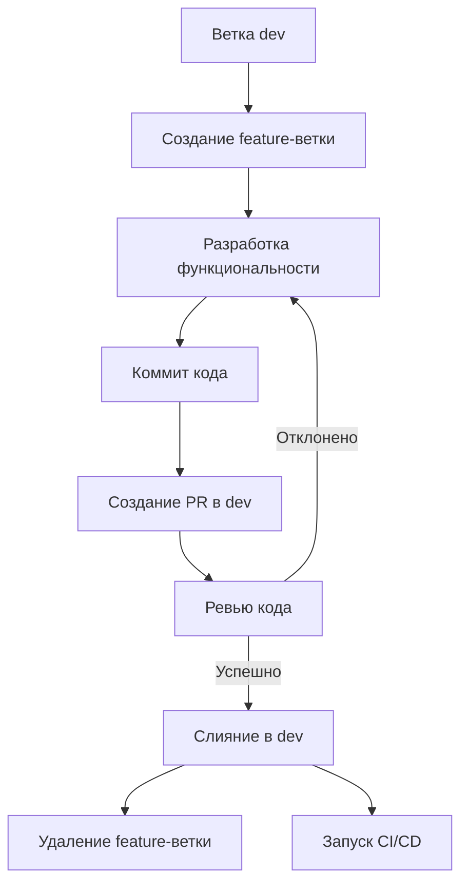
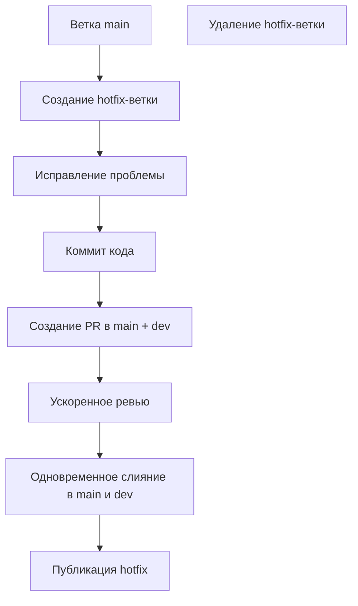
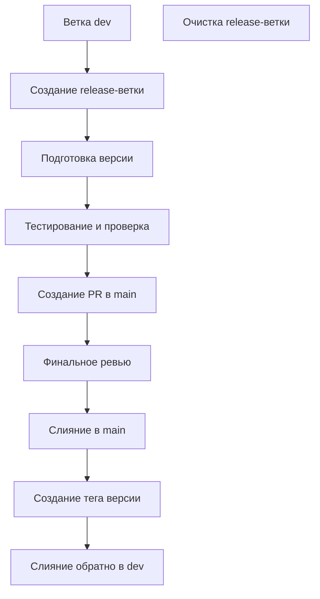

# Руководство по сопровождению Git-веток

> В данном руководстве определена стратегия управления Git-ветками проекта YaoXiang, направленная на
> обеспечение упорядоченной разработки кодовой базы и эффективного взаимодействия.

---

## 📋 Содержание

- [Типы веток](#типы-веток)
- [Правила именования](#правила-именования)
- [Жизненный цикл ветки](#жизненный-цикл-ветки)
- [Рабочий процесс](#рабочий-процесс)
- [Стратегия защиты веток](#стратегия-защиты-веток)
- [Рекомендации](#рекомендации)
- [Часто задаваемые вопросы](#часто-задаваемые-вопросы)

---

## 🏷️ Типы веток

### Основные ветки (Core Branches)

| Имя ветки | Назначение                    | Жизненный цикл | Уровень защиты |
| --------- | ----------------------------- | -------------- | -------------- |
| `main`    | Код продакшн-среды            | Постоянно      | Строгая защита |
| `dev`     | Основная ветка разработки     | Постоянно      | Средняя защита |
| `master`  | Главная ветка (совместимость) | Постоянно      | Строгая защита |

### Функциональные ветки (Feature Branches)

| Префикс    | Назначение                        | Примеры имён                                          | Целевая ветка  |
| ---------- | --------------------------------- | ----------------------------------------------------- | -------------- |
| `feature/` | Разработка новой функциональности | `feature/type-inference`<br>`feature/ownership-model` | `dev`          |
| `bugfix/`  | Исправление известных дефектов    | `bugfix/memory-leak`<br>`bugfix/parser-error`         | `dev`          |
| `hotfix/`  | Срочные исправления на продакшне  | `hotfix/security-patch`<br>`hotfix/crash-bug`         | `main` + `dev` |
| `release/` | Ветка подготовки релиза           | `release/v0.8.0`<br>`release/v1.0.0`                  | `main`         |

### Вспомогательные ветки (Auxiliary Branches)

| Префикс     | Назначение                     | Примеры имён                                               | Целевая ветка |
| ----------- | ------------------------------ | ---------------------------------------------------------- | ------------- |
| `docs/`     | Обновление документации        | `docs/api-reference`<br>`docs/tutorial-update`             | `dev`         |
| `ci/`       | Изменения CI/CD                | `ci/add-deploy-script`<br>`ci/optimize-build`              | `dev`         |
| `refactor/` | Рефакторинг кода               | `refactor/lexer-optimization`<br>`refactor/memory-manager` | `dev`         |
| `test/`     | Изменения, связанные с тестами | `test/add-integration`<br>`test/performance-bench`         | `dev`         |

---

## 📝 Правила именования

### Базовый формат имени

```bash
# Функциональная ветка
<type>/<short-description>

# Примеры
feature/add-type-inference
bugfix/fix-parser-crash
hotfix/security-vulnerability
```

### Соглашения по именованию

1. **Используйте строчные буквы**: все имена веток — в нижнем регистре
2. **Разделяйте дефисами**: используйте `-` для разделения слов, не используйте подчёркивания
3. **Описательные имена**: имя ветки должно чётко отражать её назначение
4. **Избегайте спецсимволов**: не используйте пробелы, точки и другие спецсимволы
5. **Ограничение длины**: длина имени ветки не должна превышать 50 символов

### Подробные примеры

```bash
# ✅ Хорошие имена
feature/user-authentication-system
bugfix/fix-compilation-error-on-windows
hotfix/memory-leak-in-vm
docs/update-api-documentation
refactor/optimize-lexer-performance
test/add-e2e-test-cases

# ❌ Плохие имена
Feature/NewFeature  # Используется заглавная буква
bug_fix            # Используется подчёркивание
hotfix/fix        # Неясное описание
feature/ADD_NEW_FEATURE_WITH_LOTS_OF_DETAILS_THAT_IS_TOO_LONG  # Слишком длинное
```

---

## 🔄 Жизненный цикл ветки

### Создание ветки

```bash
# 1. Создание из актуальной ветки dev
git checkout dev
git pull origin dev
git checkout -b feature/your-feature-name

# 2. Отправка удалённой ветки
git push -u origin feature/your-feature-name
```

### Разработка в ветке

```bash
# Регулярная синхронизация с актуальным кодом
git checkout dev
git pull origin dev
git checkout feature/your-feature-name
git rebase dev  # или git merge dev

# Коммит изменений
git add .
git commit -m ":sparkles: feat(frontend): 添加类型推断功能"
git push origin feature/your-feature-name
```

### Слияние ветки

```bash
# 1. Создание Pull Request
# 2. После прохождения ревью кода
git checkout dev
git pull origin dev
git merge --no-ff feature/your-feature-name
git push origin dev

# 3. Очистка ветки
git branch -d feature/your-feature-name  # локальное удаление
git push origin --delete feature/your-feature-name  # удалённое удаление
```

### Удаление ветки

```bash
# Удаление уже слитой функциональной ветки
git branch -d feature/completed-feature
git push origin --delete feature/completed-feature

# Массовая очистка слитых веток
git branch --merged dev | grep feature | xargs -n 1 git branch -d
```

---

## 🚀 Рабочий процесс

### Процесс разработки функциональности


```mermaid
graph TD
    A[Ветка dev] --> B[Создание feature-ветки]
    B --> C[Разработка функциональности]
    C --> D[Коммит кода]
    D --> E[Создание PR в dev]
    E --> F[Ревью кода]
    F -->|Успешно| G[Слияние в dev]
    F -->|Отклонено| C
    G --> H[Удаление feature-ветки]
    G --> I[Запуск CI/CD]
```

### Процесс срочного исправления


```mermaid
graph TD
    A[Ветка main] --> B[Создание hotfix-ветки]
    B --> C[Исправление проблемы]
    C --> D[Коммит кода]
    D --> E[Создание PR в main + dev]
    E --> F[Ускоренное ревью]
    F --> G[Одновременное слияние в main и dev]
    G --> H[Публикация hotfix]
    I[Удаление hotfix-ветки]
```

### Процесс релиза


```mermaid
graph TD
    A[Ветка dev] --> B[Создание release-ветки]
    B --> C[Подготовка версии]
    C --> D[Тестирование и проверка]
    D --> E[Создание PR в main]
    E --> F[Финальное ревью]
    F --> G[Слияние в main]
    G --> H[Создание тега версии]
    H --> I[Слияние обратно в dev]
    J[Очистка release-ветки]
```

---

## 🛡️ Стратегия защиты веток

### Защита основных веток

**Ветка main**

- Прямой push запрещён
- Слияние только через PR
- Force-push запрещён
- Требуется ревью кода
- Все статус-проверки должны проходить успешно

**Ветка dev**

- Прямой push запрещён (для разработчиков)
- Требуется слияние через PR
- Все статус-проверки должны проходить успешно
- Администраторам разрешён прямой push

### Настройка прав доступа к веткам

| Тип ветки   | Разработчик   | Сопровождающий | Администратор |
| ----------- | ------------- | -------------- | ------------- |
| `main`      | Только PR     | Только PR      | Одобрение PR  |
| `dev`       | Слияние PR    | Слияние PR     | Прямой push   |
| `feature/*` | Полный доступ | Полный доступ  | Полный доступ |
| `hotfix/*`  | Полный доступ | Полный доступ  | Полный доступ |

---

## ✅ Рекомендации

### 1. Управление ветками

- **Частая синхронизация**: регулярно подтягивайте актуальный код из ветки `dev`
- **Атомарные коммиты**: каждый коммит должен содержать только связанные изменения
- **Своевременная очистка**: после слияния сразу удаляйте завершённые функциональные ветки
- **Ясные описания**: имена веток и сообщения коммитов должны чётко отражать намерения

### 2. Соглашения по коммитам

Следуйте [соглашениям по коммитам](./commit-convention.md):

```bash
# Формат
:emoji: type(scope): Тема (на китайском)

# Примеры
:sparkles: feat(frontend): 添加类型推断功能
:bug: fix(parser): 修复解析器崩溃问题
:recycle: refactor(vm): 重构虚拟机内存管理
```

### 3. Pull Request

- **Ясное описание**: подробно опишите содержание и причину изменений
- **Привязка к задачам**: используйте `Closes #123` для связи с соответствующими Issue
- **Своевременный отклик**: быстро отвечайте на замечания по ревью
- **Достаточное тестирование**: убедитесь, что все тесты проходят

### 4. Ревью кода

- **Корректность функциональности**: проверка правильности работы кода
- **Качество кода**: проверка соответствия кода соглашениям
- **Покрытие тестами**: убедитесь в наличии достаточного покрытия тестами
- **Обновление документации**: проверьте, требуется ли обновление документации

---

## ❓ Часто задаваемые вопросы

### В1: Как выбрать тип ветки?

**Ответ:**

- Новая функциональность → `feature/`
- Исправление известного дефекта → `bugfix/`
- Срочное исправление на продакшне → `hotfix/`
- Обновление документации → `docs/`
- Рефакторинг кода → `refactor/`
- Изменения, связанные с тестами → `test/`

### В2: Из какой ветки следует создавать feature-ветку?

**Ответ:** Всегда из ветки `dev`, чтобы функциональность базировалась на актуальном коде разработки:

```bash
git checkout dev
git pull origin dev
git checkout -b feature/new-feature
```

### В3: Когда создавать release-ветку?

**Ответ:**

- При подготовке нового релиза
- Когда необходимо заморозить добавление новой функциональности
- Когда требуется отдельное тестирование стабильной версии

### В4: Как разрешать конфликты веток?

**Ответ:**

1. Обновите целевую ветку: `git checkout dev && git pull origin dev`
2. Переключитесь на функциональную ветку: `git checkout feature/your-branch`
3. Выполните слияние и разрешите конфликты: `git rebase dev` или `git merge dev`
4. После разрешения конфликтов продолжите разработку

### В5: Как обрабатывать hotfix-ветку?

**Ответ:**

1. Создайте из ветки `main`: `git checkout main && git checkout -b hotfix/urgent-fix`
2. Исправьте проблему и проведите тестирование
3. Одновременно создайте PR в `main` и в `dev`
4. Сразу после слияния выполните развёртывание

### В6: Есть ли ограничение на длину имени ветки?

**Ответ:** Рекомендуется не более 50 символов, чтобы сохранять краткость и ясность. Git сам по себе
поддерживает более длинные имена, но слишком длинные ухудшают читаемость.

---

## 📚 Связанные документы

- [Соглашения по коммитам](./commit-convention.md)
- [Спецификация тестирования](./test-specification.md)

---

## 🔧 Инструменты и скрипты

### Массовая очистка слитых веток

```bash
# Удаление локальных веток, слитых в dev
git checkout dev
git pull origin dev
git branch --merged dev | grep -E "^(feature|bugfix|docs|refactor|test)/" | xargs -n 1 git branch -d

# Удаление слитых удалённых веток
git remote prune origin
```

### Шаблон создания ветки

```bash
#!/bin/bash
# Вспомогательный скрипт для создания функциональной ветки

BRANCH_TYPE=$1
BRANCH_NAME=$2

if [ -z "$BRANCH_TYPE" ] || [ -z "$BRANCH_NAME" ]; then
    echo "Использование: $0 <тип> <имя_ветки>"
    echo "Тип: feature, bugfix, hotfix, docs, refactor, test"
    exit 1
fi

git checkout dev
git pull origin dev
git checkout -b "$BRANCH_TYPE/$BRANCH_NAME"
git push -u origin "$BRANCH_TYPE/$BRANCH_NAME"

echo "Создана и отправлена ветка: $BRANCH_TYPE/$BRANCH_NAME"
```

---

> 💡 **Совет**: Поддерживайте атомарность и сфокусированность веток — каждая ветка должна решать
> только одну задачу. Это сделает управление кодом более чётким и эффективным!

> 📞 **Поддержка**: при возникновении вопросов обсуждайте их в GitHub Discussions.
