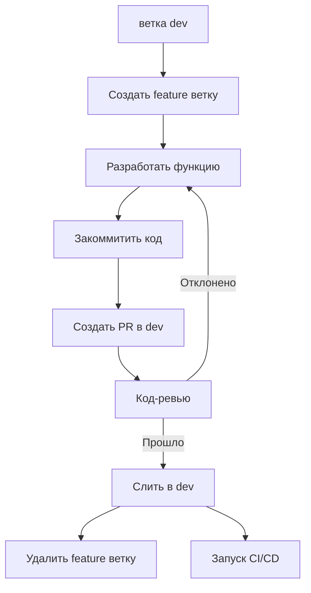
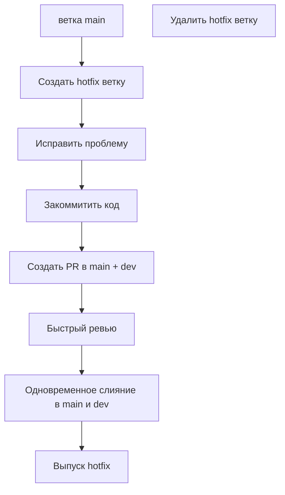
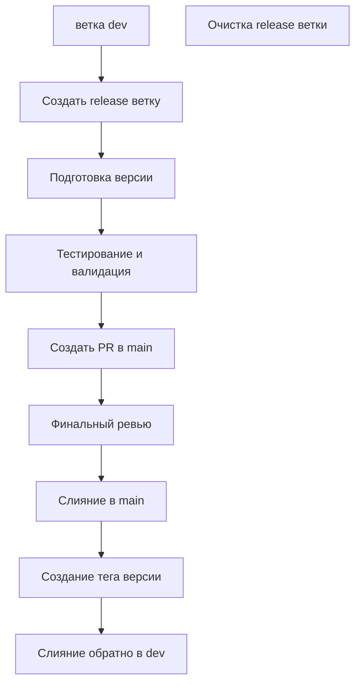

# Руководство по управлению ветками Git

> В данном руководстве определена стратегия управления ветками Git для проекта YaoXiang, направленная на обеспечение упорядоченной разработки и эффективного сотрудничества.

---

## 📋 Содержание

- [Типы веток и их спецификация](#типы-веток-и-их-спецификация)
- [Правила именования](#правила-именования)
- [Жизненный цикл веток](#жизненный-цикл-веток)
- [Рабочие процессы](#рабочие-процессы)
- [Стратегия защиты веток](#стратегия-защиты-веток)
- [Лучшие практики](#лучшие-практики)
- [Часто задаваемые вопросы](#часто-задаваемые-вопросы)

---

## 🏷️ Типы веток и их спецификация

### Основные ветки (Core Branches)

| Имя ветки | Назначение             | Жизненный цикл | Уровень защиты |
| --------- | ---------------------- | --------------- | --------------- |
| `main`    | Код для продакшена     | Постоянная      | Строгая защита  |
| `dev`     | Основная ветка разработки | Постоянная  | Средняя защита  |
| `master`  | Основная ветка (совместимость) | Постоянная | Строгая защита |

### Функциональные ветки (Feature Branches)

| Префикс      | Назначение              | Примеры именования                                   | Цель слияния   |
| ----------- | ---------------------- | ----------------------------------------------------- | --------------- |
| `feature/` | Разработка новых функций | `feature/type-inference`<br>`feature/ownership-model` | `dev`           |
| `bugfix/`  | Исправление известных дефектов | `bugfix/memory-leak`<br>`bugfix/parser-error` | `dev`           |
| `hotfix/`  | Срочное исправление продакшен-проблем | `hotfix/security-patch`<br>`hotfix/crash-bug` | `main` + `dev` |
| `release/` | Ветка подготовки к релизу | `release/v0.8.0`<br>`release/v1.0.0`                  | `main`          |

### Вспомогательные ветки (Auxiliary Branches)

| Префикс        | Назначение               | Примеры именования                                             | Цель слияния |
| -------------- | ------------------------ | -------------------------------------------------------------- | ------------- |
| `docs/`        | Обновление документации  | `docs/api-reference`<br>`docs/tutorial-update`                 | `dev`         |
| `ci/`          | Изменения в CI/CD        | `ci/add-deploy-script`<br>`ci/optimize-build`                  | `dev`         |
| `refactor/`    | Рефакторинг кода         | `refactor/lexer-optimization`<br>`refactor/memory-manager`     | `dev`         |
| `test/`        | Изменения в тестах       | `test/add-integration`<br>`test/performance-bench`             | `dev`         |

---

## 📝 Правила именования

### Базовая формат именования

```bash
# Функциональные ветки
<type>/<short-description>

# Примеры
feature/add-type-inference
bugfix/fix-parser-crash
hotfix/security-vulnerability
```

### Правила именования

1. **Используйте строчные буквы**: все имена веток должны быть в нижнем регистре
2. **Используйте дефис для разделения слов**: используйте `-` вместо подчёркивания
3. **Описательные имена**: имя ветки должно чётко выражать её назначение
4. **Избегайте специальных символов**: не используйте пробелы, точки или другие специальные символы
5. **Ограничение длины**: имя ветки не должно превышать 50 символов

### Подробные примеры

```bash
# ✅ Хорошие имена
feature/user-authentication-system
bugfix/fix-compilation-error-on-windows
hotfix/memory-leak-in-vm
docs/update-api-documentation
refactor/optimize-lexer-performance
test/add-e2e-test-cases

# ❌ Плохие имена
Feature/NewFeature  # Использование верхнего регистра
bug_fix            # Использование подчёркивания
hotfix/fix        # Неясное описание
feature/ADD_NEW_FEATURE_WITH_LOTS_OF_DETAILS_THAT_IS_TOO_LONG  # Слишком длинное
```

---

## 🔄 Жизненный цикл веток

### Создание ветки

```bash
# 1. Создать ветку от последней dev ветки
git checkout dev
git pull origin dev
git checkout -b feature/your-feature-name

# 2. Отправить удалённую ветку
git push -u origin feature/your-feature-name
```

### Разработка в ветке

```bash
# Регулярная синхронизация с последним кодом
git checkout dev
git pull origin dev
git checkout feature/your-feature-name
git rebase dev  # или git merge dev

# Коммит кода
git add .
git commit -m ":sparkles: feat(frontend): добавить функцию вывода типов"
git push origin feature/your-feature-name
```

### Слияние ветки

```bash
# 1. Создать Pull Request
# 2. После прохождения код-ревью
git checkout dev
git pull origin dev
git merge --no-ff feature/your-feature-name
git push origin dev

# 3. Очистка ветки
git branch -d feature/your-feature-name  # Удаление локальной ветки
git push origin --delete feature/your-feature-name  # Удаление удалённой ветки
```

### Удаление ветки

```bash
# Удаление слитых функциональных веток
git branch -d feature/completed-feature
git push origin --delete feature/completed-feature

# Пакетная очистка слитых веток
git branch --merged dev | grep feature | xargs -n 1 git branch -d
```

---

## 🚀 Рабочие процессы

### Процесс разработки функций


```mermaid
graph TD
    A[ветка dev] --> B[Создать feature ветку]
    B --> C[Разработать функцию]
    C --> D[Закоммитить код]
    D --> E[Создать PR в dev]
    E --> F[Код-ревью]
    F -->|Прошло| G[Слить в dev]
    F -->|Отклонено| C
    G --> H[Удалить feature ветку]
    G --> I[Запуск CI/CD]
```

### Процесс срочного исправления


```mermaid
graph TD
    A[ветка main] --> B[Создать hotfix ветку]
    B --> C[Исправить проблему]
    C --> D[Закоммитить код]
    D --> E[Создать PR в main + dev]
    E --> F[Быстрый ревью]
    F --> G[Одновременное слияние в main и dev]
    G --> H[Выпуск hotfix]
    I[Удалить hotfix ветку]
```

### Процесс релиза


```mermaid
graph TD
    A[ветка dev] --> B[Создать release ветку]
    B --> C[Подготовка версии]
    C --> D[Тестирование и валидация]
    D --> E[Создать PR в main]
    E --> F[Финальный ревью]
    F --> G[Слияние в main]
    G --> H[Создание тега версии]
    H --> I[Слияние обратно в dev]
    J[Очистка release ветки]
```

---

## 🛡️ Стратегия защиты веток

### Защита основных веток

**Ветка main**

- Прямой push запрещён
- Обязательное слияние через PR
- Принудительный push запрещён
- Требуется код-ревью
- Статусные проверки должны пройти

**Ветка dev**

- Прямой push запрещён (для разработчиков)
- Обязательное слияние через PR
- Статусные проверки должны пройти
- Администраторы могут пушить напрямую

### Настройки прав доступа к веткам

| Тип ветки    | Разработчик | Мейнтейнер  | Администратор |
| ------------ | ----------- | ----------- | ------------- |
| `main`       | Только PR   | Только PR   | Одобрение PR  |
| `dev`        | Слияние PR  | Слияние PR  | Прямой push   |
| `feature/*`  | Полные права | Полные права | Полные права |
| `hotfix/*`   | Полные права | Полные права | Полные права |

---

## ✅ Лучшие практики

### 1. Управление ветками

- **Частая синхронизация**: регулярно получайте последний код из ветки `dev`
- **Атомарные коммиты**: каждый коммит должен содержать только связанные изменения
- **Своевременная очистка**: сразу удаляйте завершённые функциональные ветки после слияния
- **Чёткие описания**: имена веток и сообщения коммитов должны чётко выражать намерение

### 2. Правила коммитов

Следуйте [соглашению о коммитах](./commit-convention.md):

```bash
# Формат
:emoji: type(scope): Тема (на русском)

# Примеры
:sparkles: feat(frontend): добавить функцию вывода типов
:bug: fix(parser): исправить краш парсера
:recycle: refactor(vm): рефакторинг управления памятью ВМ
```

### 3. Pull Request

- **Чёткое описание**: подробно объясните, что изменилось и почему
- **Связь с задачами**: используйте `Closes #123` для привязки к соответствующему Issue
- **Своевременный ответ**: оперативно отвечайте на комментарии ревьюера
- **Достаточное тестирование**: убедитесь, что все тесты проходят

### 4. Код-ревью

- **Функциональная корректность**: проверьте, что код работает правильно
- **Качество кода**: убедитесь, что код соответствует стандартам
- **Покрытие тестами**: проверьте наличие адекватного тестового покрытия
- **Обновление документации**: убедитесь, что документация актуальна

---

## ❓ Часто задаваемые вопросы

### Q1: Как выбрать тип ветки?

**Ответ:**

- Новая функция → `feature/`
- Исправление известного дефекта → `bugfix/`
- Срочное исправление продакшена → `hotfix/`
- Обновление документации → `docs/`
- Рефакторинг кода → `refactor/`
- Изменения в тестах → `test/`

### Q2: С какой ветки создавать feature ветку?

**Ответ:** Всегда создавайте от ветки `dev`, чтобы функция была основана на последнем коде разработки:

```bash
git checkout dev
git pull origin dev
git checkout -b feature/new-feature
```

### Q3: Когда создавать release ветку?

**Ответ:**

- При подготовке к выпуску новой версии
- Когда нужно заморозить добавление новых функций
- Когда требуется специальное тестирование стабильной версии

### Q4: Как разрешать конфликты веток?

**Ответ:**

1. Обновите целевую ветку: `git checkout dev && git pull origin dev`
2. Переключитесь на функциональную ветку: `git checkout feature/your-branch`
3. Выполните слияние и разрешите конфликты: `git rebase dev` или `git merge dev`
4. После разрешения конфликтов продолжите разработку

### Q5: Как обрабатывать hotfix ветки?

**Ответ:**

1. Создайте от ветки `main`: `git checkout main && git checkout -b hotfix/urgent-fix`
2. Исправьте проблему и протестируйте
3. Одновременно создайте PR в `main` и `dev`
4. Сразу после слияния выполните деплой

### Q6: Есть ли ограничение на длину имени ветки?

**Ответ:** Рекомендуется не превышать 50 символов, сохраняя краткость и понятность. Git поддерживает более длинные имена, но слишком длинные названия ухудшают читаемость.

---

## 📚 Связанные документы

- [Соглашение о коммитах](./commit-convention.md)
- [Руководство по код-ревью](./code-review.md)
- [Процесс релиза](./release-guide.md)
- [Настройка CI/CD](../../.github/workflows/)

---

## 🔧 Инструменты и скрипты

### Пакетная очистка слитых веток

```bash
# Удаление локальных веток, слитых в dev
git checkout dev
git pull origin dev
git branch --merged dev | grep -E "^(feature|bugfix|docs|refactor|test)/" | xargs -n 1 git branch -d

# Удаление удалённых слитых веток
git remote prune origin
```

### Шаблон создания ветки

```bash
#!/bin/bash
# Вспомогательный скрипт для создания функциональных веток

BRANCH_TYPE=$1
BRANCH_NAME=$2

if [ -z "$BRANCH_TYPE" ] || [ -z "$BRANCH_NAME" ]; then
    echo "Использование: $0 <тип> <имя-ветки>"
    echo "Типы: feature, bugfix, hotfix, docs, refactor, test"
    exit 1
fi

git checkout dev
git pull origin dev
git checkout -b "$BRANCH_TYPE/$BRANCH_NAME"
git push -u origin "$BRANCH_TYPE/$BRANCH_NAME"

echo "Ветка создана и отправлена: $BRANCH_TYPE/$BRANCH_NAME"
```

---

> 💡 **Совет**: Сохраняйте атомарность и сфокусированность веток — каждая ветка должна делать только одно дело. Это сделает управление кодом более понятным и эффективным!

> 📞 **Поддержка**: При возникновении вопросов обсуждайте их в GitHub Discussions.
